AttractioNet
============

[TOC]

​

概述
====

AttractioNet 全名是(Att)end (R)efine Repeat: (Act)ive Box Proposal Generation via
(I)n-(O)ut Localization
(Net)work，论文地址为<https://arxiv.org/pdf/1606.04446.pdf>。该网络可以在object类别未知的情况下，以**迭代**的方式准确且稳定地生成proposal。对于COCO数据集，**AttractioNet生成的proposal的recall比selective
search大30%左右**，同时，**对于没有出现过的类别，AttractioNet也可以在recall上力压selective
search算法。AttractioNet缺点是生成proposal速度慢，每张图片要1.63秒。**

贡献总结
========

1）基于改进的类别无关的对象位置细分模块，作者提出了a box proposal
system（*AttractioNet*），以及一种active box proposal
generation的方法，它的思想类似于注意力机制条件下专注于有前景的图像区域，来生成目标选框并识别对象。

2）在PASCOL和COCO数据集上作者对提出的system做了详细的评估，并取得了显著的检测效果改进。此外，作者有强有力的证据表明：对象位置细分模块在Imagenet和NYU-Depth数据集上对不可见的新的数据类别识别有一定的proposal生成能力。

 3）最后，作者通过VGG-16 net 的目标检测任务，来对active box proposal
generation方法做评估，在COCO test-dev
数据集上做检测取得了平均的精确度性能，并能够与Resnet-101的检测系统性能相媲美。

AttractioNet
============

和Faster RCNN类似，该AttractioNet 也是基于CNN的feature
map生成proposal。下图为AttractioNet workflow，具体步骤包括：

-   图片I通过VGG网络生成feature map F1；

-   在F1上随机生成seed boxes，并通过ARN算法迭代计算并更新boxes和objectiveness
    score；

-   对迭代完成后的boxes进行NMS，生成最终proposals。

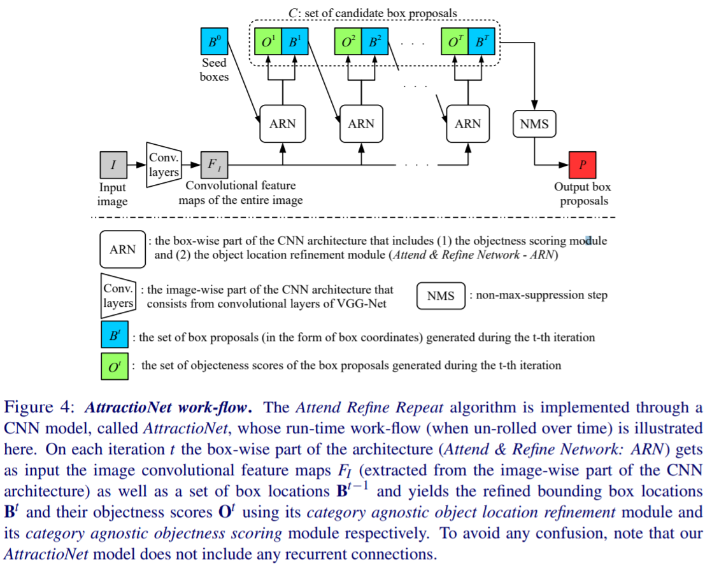

主动生成bounding Box方法
------------------------

本文提出一种主动生成bounding box 的算法 Attend Refine Repeat，伪代码如下：

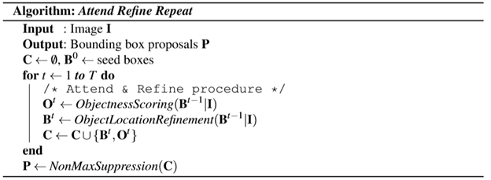

图注：

-   C：候选box，初始为空集；

  $B^0$：初始bounding boxes，单一size，均匀分布在图片上；

 $ObjectnessScoring(B^{t-1}|I)$

    ：在t时刻时，计算t-1时刻bounding boxes的得分，assign给t时刻的bounding box；

$ObjectLocationRefinement(B^{t-1}|I)$

    ：在t时刻时，优化t-1时刻bounding boxes的坐标，assign给t时刻的bounding
    box，t时刻的bb比t-1时刻的bb更接近于GT。

该算法优势：

1、attention机制：在每次迭代过程中，算法会趋向于在目标物体附近检测，避免没有object的地方。

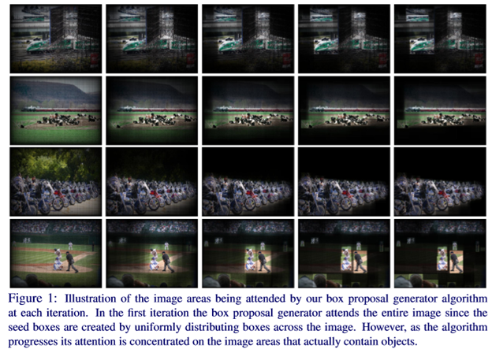

2、初始boxes微调：算法在一次次迭代的过程中可以将初始box更新至覆盖oject，该更新过程比较robust。

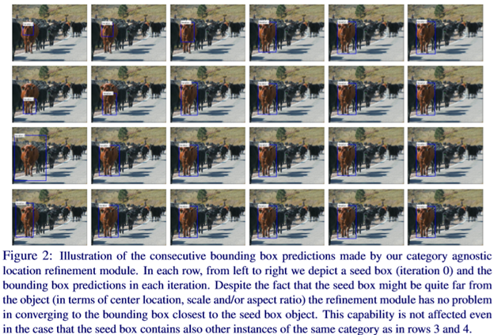

ARN：Attend & Refine Network
----------------------------

 传统的bbox回归尝试直接通过回归的方式直接得到bbox的坐标，很难得到很准确的bbox。本文参考LocNet，把**边框回归问题看作一个dense
classification
task**，通过**基于行列的概率模型**提高bbox定位准确率。下图展示了ARN的具体结构。

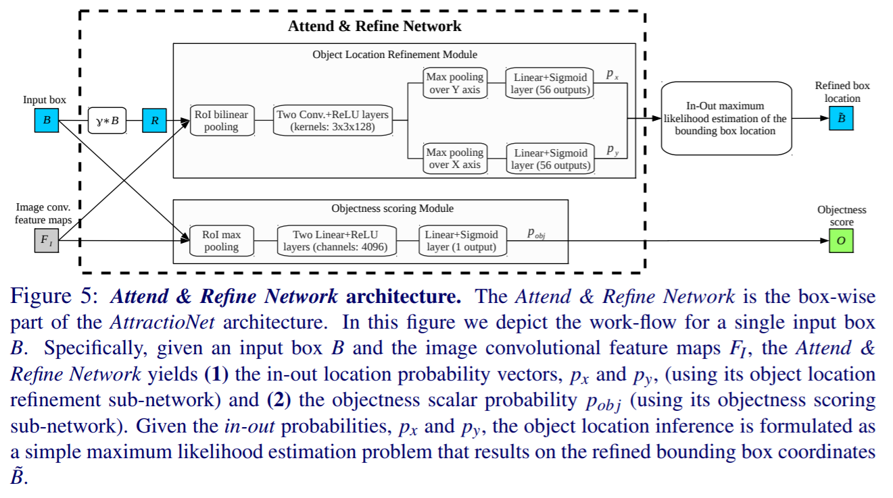

 

ARN包含两个路线：bbox位置优化路线和有无物体预测路线。

**bbox位置优化路线（上）**：

-   input box乘以常数γ，得到搜索区域R；

-   在conv layer 生成的feature map上对R进行ROI双线性插值pooling；

-   接2个1\*1卷积层代替全连接层；

-   对**每一行**进行max
    pooling，加权后接sigmoid函数输出包含56个值Py向量，**Py可以看作是将R分割成56行，每行存在GT的概率**；

-   对**每一列**进行max
    pooling，加权后接sigmoid函数输出包含56个值Px向量，**Px可以看作是将R分割成56列，每行存在GT的概率**；

-   使用极大似然原理定义损失函数，梯度下降求解最优的Px，Py**，Px和Py又称‘in-out’probability**，得到优化后的bbox。

下图中，图片搜索区域R，红框是初始bb，蓝框是优化后的bb，可见优化后的bb的‘in-out’probability都很高，最理想的情况下，优化后的bb的‘in-out’probability全为1。

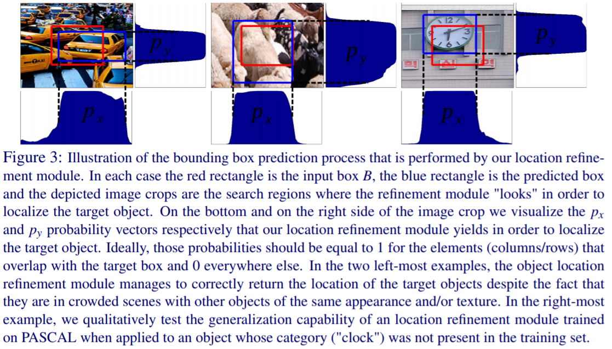

**有无物体预测路线（下）**：

-   在conv layer 生成的feature map上对input box进行ROI max pooling；

-   接2个全连接层；

-   加权后接sigmoid函数输出一个数值Pobj，表示该input box有无物体的score。

**ARN整体损失函数**如下：

$$
\underbrace {\frac 1 {N^L} \sum^{N^L}_{k=1} L_{loc}(\theta|B_k, T_k,I_k)}_{localization\ task\ loss} +
\underbrace {\frac 1 {N^O} \sum^{N^O}_{k=1} L_{obj}(\theta|B_k, y_k,I_k)}_{objectness\ scoring\  task\ loss}
$$

注释：

-   B：bounding box

-   T={Tx，Ty}：in-out probability

-   I：image

-   y=0/1：bounding box是否包含object的真实值

$N^L$

    ：localization task 训练box样本个数

$N^O$

    ：objectiveness scoring task 训练box样本个数

T={Tx，Ty}，对于像素点i，Tx，i满足下式。B\*表示Ground
Truth，下标l、r、t、b分布表示left、right、top、bottom。只要像素点i在ground truth
box里Tx=Ty=1，否则Tx=Ty=0.

$$
T_{x,i}=\begin{cases}1,\quad if \ B^*_l \le i \le B^*_r  \\
0, \quad otherwise \end{cases}  and T_{y,i} = \begin{cases}1,\quad if \ B^*_t \le i \le B^*_b  \\
0, \quad otherwise \end{cases} , \forall i \in \{1,...,M\}
$$

根据极大似然原理，**单个box的localization loss**定义如下：

$$
L_{loc}(\theta|B,T,I) = \frac 1 {2M} \sum_{a \in \{x,y\}} \sum^M_{i=1} T_{a,i}log(p_{a,i}) + (1 - T_{a,i})log(1 - p_{a,i})
$$

类似地，**单个box的有无物体得分的loss**定义如下：

$$
L_{obj}(\theta|B,y,I) = ylog(p_{obj}) + (1 - p)log(1-p_{obj})
$$

训练细节
--------

-   对每个minibatch，sample 4个图片，每个图片随机取32个bb用于localization
    task，64个bb用于objectiveness scoring task（50% positive，50%negtive);

-   localization task中，选择与ground Truth IOU \>=0.5的box进行训练；

-   objectiveness scoring task中，正样本：bb 与ground Truth IOU
    \>=0.5；负样本：bb 与ground Truth IOU \< 0.3;

-   数据增广：

    1.  每张图片短边resize到{300：50：1000}中的随机值，长边不超过1000

    2.  每张图片有50%的几率进行长宽‘抖动’，从W\*H抖动为（αW)\*H或W\*（αH），α是$2^{0.2:0.2:1.0}$

-   优化方式：momentum，β=0.9；

-   隐藏层dropout=0.5

-   学习率：前320k迭代为0.001，后260k迭代为0.0001；

-   训练时间7天（第5天就可以停止训练，后面两天准确率提升不大）

实验结果
========

数据源
------

**Training set**：MS coco dataset

properties：

1）80k张图片，80个不同的类别标签，且不同的对象类别其样本数量呈下降趋势（不均衡）；

2）它包含了从复杂的现实场景中捕捉到的图像，这些场景包含了在自然环境中常见的一些目标对象。

**necessity：**

**1）**在困难测试样本上有良好的性能表现；** **

**2）**训练的对象数据类别对 ”不可见“
的标签类别泛化能力较好（测试集中的对象类别不出现在训练集中）。

实施细节
--------

Seed boxes数量：10k

Seed boxes产生：3 aspect ratios {1 : 2, 2 : 1 and 1 : 1}，and 9 different sizes
of the smallest seed box dimension {16, 32, 50, 72, 96, 128, 192*,* 256, 384}

经过一系列完整的ARN网络迭代过程

首先 我们取NMS IoU 阈值：0.95 

期望box-proposals数量：top 2000（Top *K*）

然后 如果需要精细到Top
K（K小于2000），在这2000个proposals基础上采用多IoU阈值的NMS对其进行排序，得到更精确的样本。

（1）Object location performance
--------------------------------

### 实验结果

   **评价指标：**average recall (AR) for a fixed number of box proposals

  （*AR\@10*,*AR\@100* and *AR\@1000——10,100,1000 box proposals AND*

*    AR\@100-Small, AR\@100-Medium and AR\@100-Large——small (a \< 32\^2), medium
    (32\^2 ≤ a ≤ 96\^2) and large (a \> 96\^2) sized objects* ） 

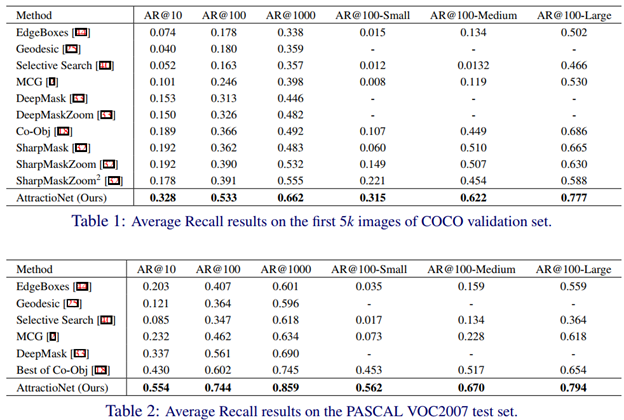

（表注：Method一栏都是proposal
generation的方法，只有最后一行（AttractioNet）的结果才是Ours，两张表分别在COCO
validation set 和 PASCAL VOC2007 test set 数据集上做的测试。）

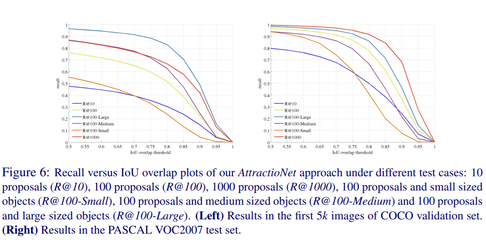

**结论：**

1）AttractioNet目标框定位的AR指标表现优于之前所有的proposal
generation的方法（RPN除外），在*AR\@X*这几个细化指标上起码有10个百分点的效果提升；

2）AttractioNet方法在各细化指标上的recall与IoU阈值之间是负相关关系，且IoU在[0.5,0.75]区间上增加时，recall下降得相对较慢，但IoU增加到超过0.85时，recall下降得就比较快了。

 

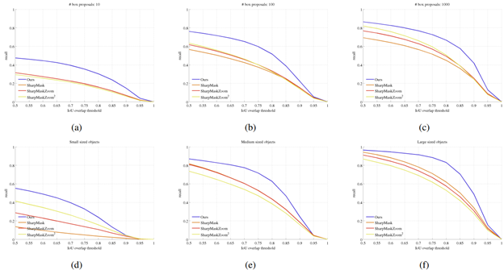

（图注：上面6副图分别是*AR\@X*各细化指标下，4种proposal
generation方法基于recall与IoU阈值关系之间的变化曲线）

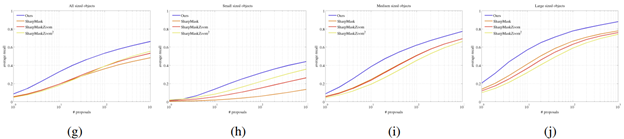

（图注：上面4副图分别为All sized、Small sized、Medium sized、Large sized
的检测对象条件下，4种proposal generation方法基于average recall与box
proposal数量关系之间的变化曲线）

   **结论：**

   1）AttractioNet（蓝色曲线）在各测试条件和细化指标下，proposal 的
location效果都要比之前最优的SharpMask方法要好（RPN除外）；

###  模块提升细节

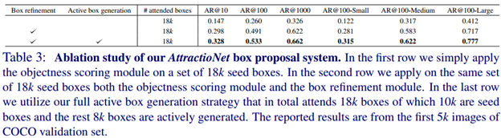

（表注：Box refinement 和 Active box
generation是AttractioNet网络中的两个模块，作者的目的主要是强调这两个模块对*AR\@X*指标数据提升的重要性。其中，attened
boxes是重点，第三行与第二行的18k相比，引入了Active box
generation模块，是说在原10k Seed boxes
基础上，接下来4个迭代的ARN网络中分别主动生成2k个
boxes，而不比第二行的直接初始化18k个 Seed boxes）

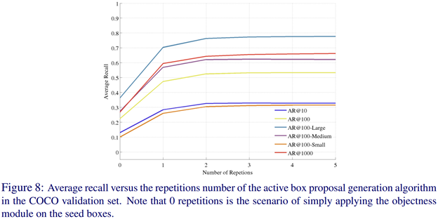

（图注：上图中的repetitions number表示 Seed
boxes之后，需要主动生成额外boxes的迭代项的数量）

**结论：**

1）没有 Box refinement 和 Active box generation
这两个模块的系统，目标定位的AR指标表现非常的差；

2）引入了 object location refinement module 之后，尽管不使用 active box
generation strategy，取得的效果依然比Table 1的proposal generation方法要更好；

 3）AttractioNet方法中，使用了 active box generation strategy
之后，目标定位准确率有了进一步的提升，且AR指标与repetitions
number是正相关关系，也就是说，主动生成额外boxes的迭代项数量超过4时，AR曲线收敛。

### 运行时间细节

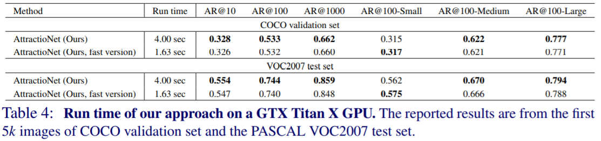

（表注：fast
version是基本没有精确度损失的AttractioNet计算效率改进的版本，每个proposal的处理时间由4.00s降低到了1.63s，具体改进细节见结论部分）

**结论：（或者说**是optimized implementations**）**

1）在 objectness module 的全连接层使用SVD（奇异值分解）

2）对已经converge（IOU\>0.9)的localization task提前终止训练

（2）Generalization to unseen categories 
-----------------------------------------

### 实验结果_1

   模型：AttractioNet box proposal model（fast version）and EdgeBoxes、Selective
Search、MCG

   训练集：COCO

   测试集：ImageNet ILSVRC2013 detection task validation set 

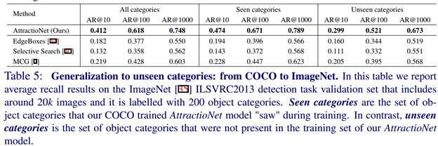

（图注：作者把ImageNet数据集上的200个对象类别划分为了Seen和Unseen两组，Seen代表测试集中在训练集里出现过的categories，Unseen代表测试集中在训练集未出现过的categories）

**结论：**

1）首先Seen和Unseen组里的categories目标定位的AR指标肯定是有差异的，Seen categories
的定位效果普遍要比 Unseen categories 的要好；（机器学习算法不可避免）

2） AttractioNet 对于 Unseen categories 的位置定位效果明显要优于其他3个 box
proposal 方法，也是接近10%的AR提升；

 3）EdgeBoxes、Selective Search 这两种 non-learning based
approaches，本该对Seen和Unseen的区别不敏感，但是实验结果显示，在 Unseen
categories 组里，两者性能依然有drop，猜测原因为：Unseen categories 中的 objects
本质上更难以区分或者这几个类别在自然界中本就不太常见。

### 实验结果_2 

   模型：AttractioNet box proposal model（fast version）and EdgeBoxes、Selective
Search、MCG 

   训练集：COCO

   测试集：NYU Depth V2 dataset （所有categories都未出现在训练集中）

（图注： NYU Depth V2 数据集中的864个不同于训练集的 categories
里面有一些是“stuff”类别，个人理解为容易混淆或者难以确定框边界的类别，定义为
non-object pixel segmentation
annotations，需要被剔除。如墙壁、地板、天花板、楼梯等）

**结论：**

1） 同样，AttractioNet 对于 Unseen categories 的位置定位效果明显要优于其他3个
box proposal 方法；

2）在（Small）小目标和（Medium）中等大小目标的边框定位检测上，我们的
AttractioNet 与其他方法相比，AR\@100优势显著！（猜测这点可能优于RPN）

（3）Object detection performance
---------------------------------

   上述几个实验主要是针对图片中的检测对象，比较忽视目标类别的边框定位效果（AR or
mAP）。接下来，需要结合具体的目标检测系统，来评估作者提出的 AttractioNet box
proposal model 在目标检测（位置检测和类别检测）中的实际应用效果。

### 检测系统

FastRCNN类别识别模块结合LocNet类别特定的边界框优化模块，共享同样的图像卷积层(conv1_1
till conv5_3 layers of VGG16-Net) ，简单来说也就是： Fast-RCNN & LocNet Combined
ML &  AttractioNet ，AttractioNet 生成proposal，Fast-RCNN对proposal分类， LocNet
Combined ML对proposal进行边框微调。

### 检测评估设置

**检测评估指标**：average precision (AP) for AP\@0.50 or AP\@0.75 and the COCO
style of average precision (AP\@0*.*50 : 0*.*95)

**细化指标**：考虑 sized objects 的 AP\@Small、AP\@Medium 、AP\@Large

**正负样本确定**：Positive-IoU overlap ≥0.5 **AND** Negative-IoU overlap≤0.5

**评估数据集**：evaluation on 5k images of  COCO 2014 validation set **AND**
test on the COCO 2015 test-dev set

**训练过程的mini-batch**：4 images with 64 box proposals each (256 boxes per
mini-batch in total)

**训练过程的正负样本比率**：Positive：Negative=1：3

SGD iterations ：500k

Learning rate ：0.001 dropped to 0.0001 after 320k iterations

**测试时的样本scale**：1）single scale of 600 pixels ；2）two scales of 500 and
1000 pixels

### 检测结果

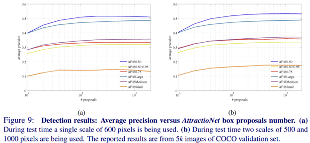

（图注：a、b两图表示测试时的两种样本scale条件下，AP指标与 AttractioNet
生成的proposal数量之间的关系，采用的COCO validation 数据集）

 

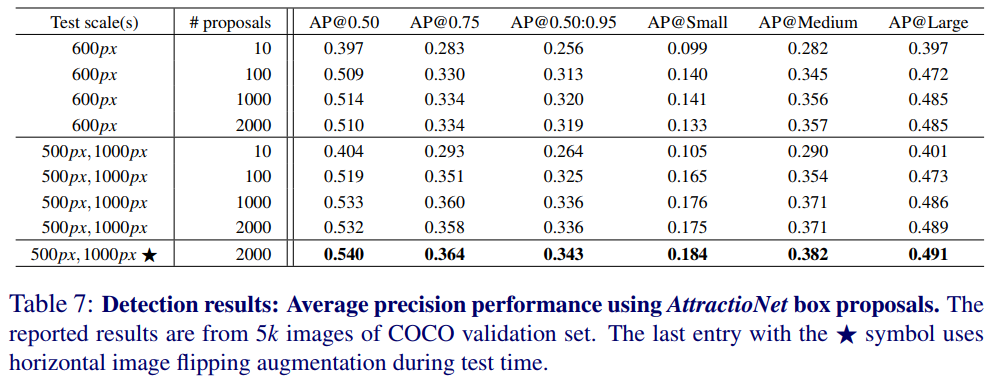

（图注：上表为两种Test scale，分别10、100、1000、2000个 AttractioNet box
proposals，以及6种*AP\@X*细化指标下的检测结果。带⭐号表示的是：做了水平图像翻转的数据增广）

**结论：**

1）首先，在 AttractioNet 生成的200个 box proposals
附近，各细化AP指标（*AP\@X*）关于proposal数量的关系就接近收敛了，再增加proposal的数量，效果提升不明显，只会带来更高的计算复杂度；

2）600px scale
下的最佳AP\@0.50：0.95（0.32）不及500px，1000px下的最佳AP\@0.50：0.95（0.336）；

 3）做了水平图像翻转的数据增广之后，500px，1000px下的最佳AP\@0.50：0.95
能提升一点点到 0.343。

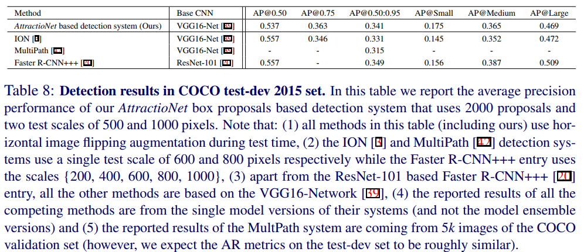

（表注：上表为其他组合检测系统和我们 Fast-RCNN & LocNet Combined ML
&  AttractioNet 检测系统的比较）

| **AttractioNet based detection system** | **ION** | **MultiPath** | **FasterR-CNN+++** |
| --------------------------------------- | ------- | ------------- | ------------------ |
|                                         |         |               |                    |

结论：

1）*AttractioNet* box proposals方法 和 LocNet category specific object location
refinement 思路借鉴的结合，替代了传统的边框回归，相比于其他VGG16-Net based
object detection systems（ION和MultiPath），取得了最好的 AP\@0.50：0.95；

2）我们的检测系统在AP\@0.5这个指标上的表现可能不及ION（图上都是0.537），是因为*AttractioNet*方法专注于提升检测过程中目标边框定位的准确率，而ION则专注于框中目标的分类与识别，AP\@0.5这个指标阈值确定得比较低，囊括了大部分精确度不是很高的
boxes proposal，所以*AttractioNet* box proposals方法对于AP\@0.5的提升不明显；

3）我们的检测系统基于VGG-16，其AP表现甚至接近于*ResNet-101 based* Faster
R-CNN+++ 检测系统，作者觉得Based CNN
换成深度残差网络的话，AP效果能更好，但并未给出实验；

4）最后，我们的检测系统在小目标检测上的AP\@Small是最高的，甚至超过了ResNet-101
based Faster R-CNN+++ detection system，这要归功于*AttractioNet* box
proposals方法生成的检测框与目标极高的吻合度。

 

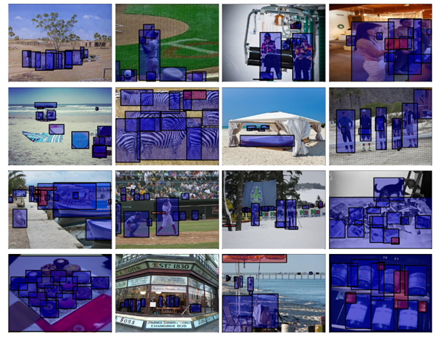

疑问点
======

为什么ARN整体损失函数中localization和分类的样本数量不一样？

$$
\underbrace {\frac 1 {N^L} \sum^{N^L}_{k=1} L_{loc}(\theta|B_k, T_k,I_k)}_{localization\ task\ loss} +
\underbrace {\frac 1 {N^O} \sum^{N^O}_{k=1} L_{obj}(\theta|B_k, y_k,I_k)}_{objectness\ scoring\  task\ loss}
$$

