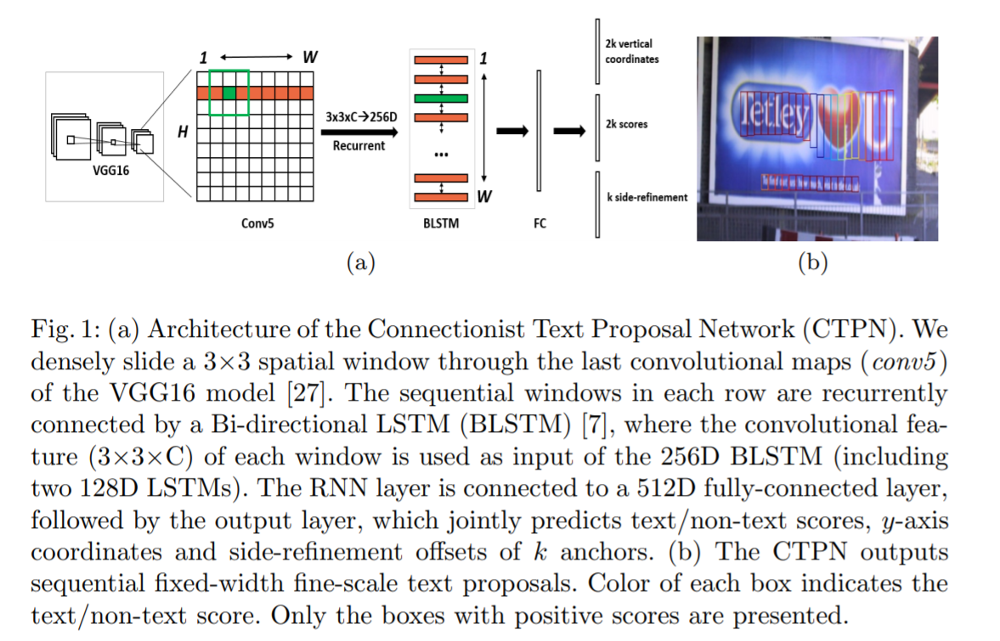
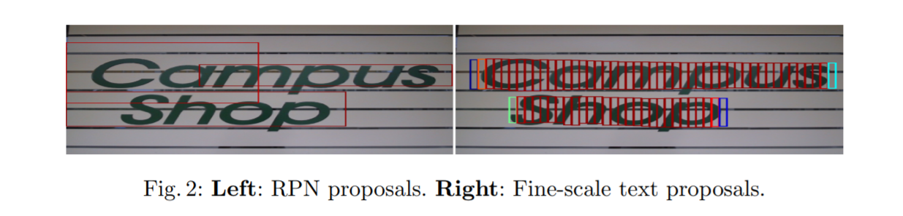
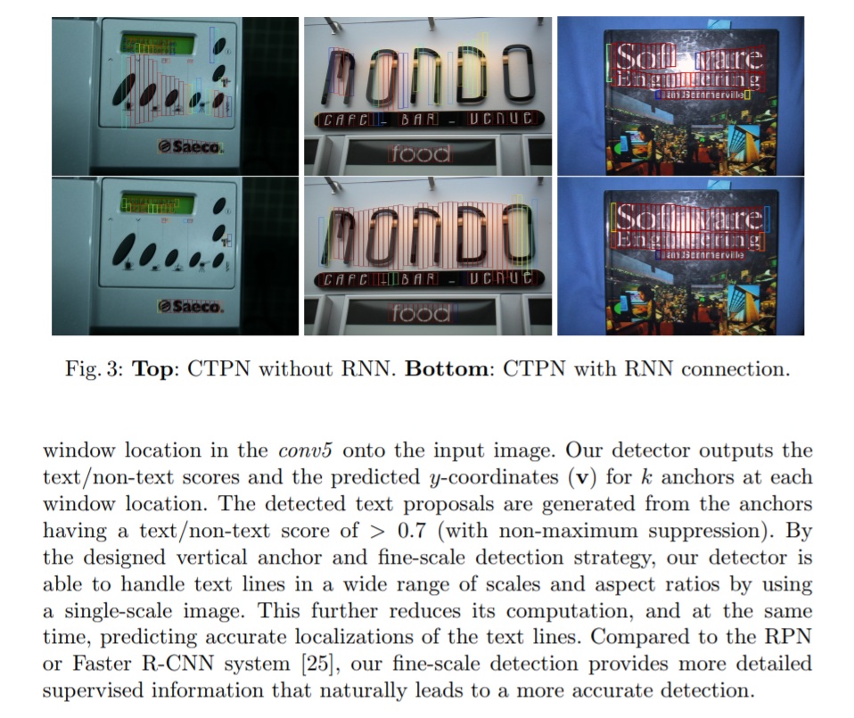
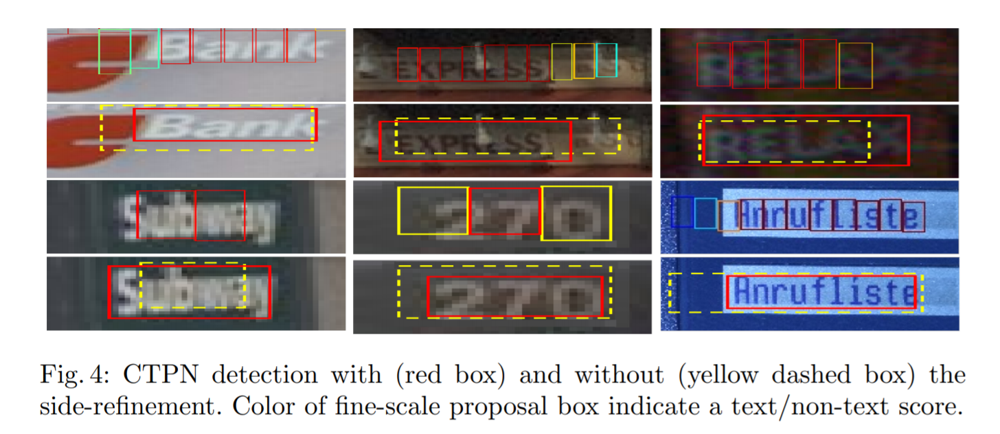
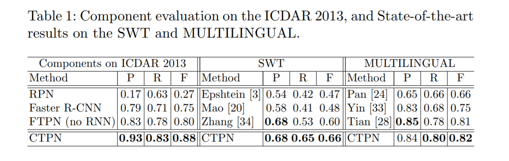
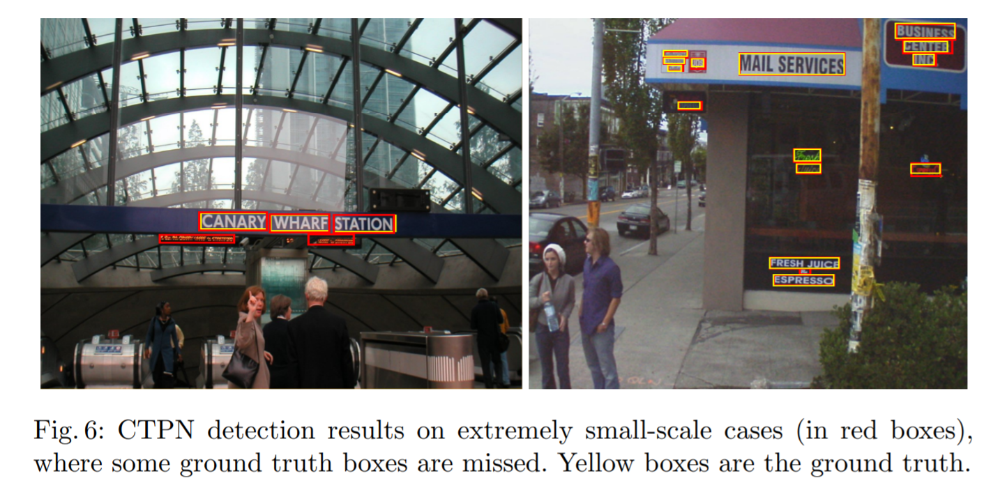
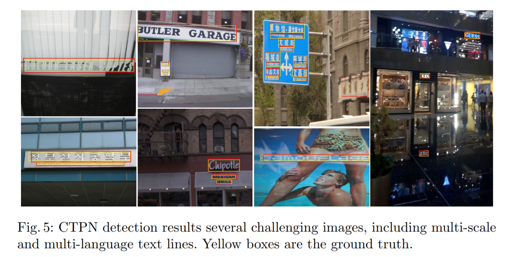
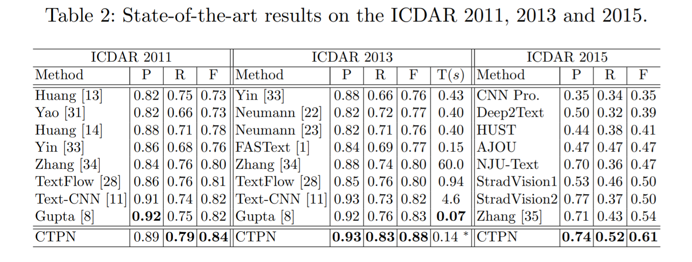

# CPTN: Detecting Text in Natural Image with Connectionist Text Proposal Network

[TOC]

## 摘要

​        我们提出了一种新颖的**联结文本提议网络(CTPN)**，它能够**精准定位**自然图像中的文本行。CTPN直接在卷积特征图中的**一系列细粒度文本提议**中**检测文本行**。我们开发了一个**垂直锚点机制**(vertical anchor mechanism)，联合预测每个**固定宽度提议**的**位置**和文本/非文本**评分**，大大提高了定位精度。**序列的提议**通过**循环神经网络**自然地连接起来，该网络**无缝地纳入到卷积网络**中，从而形成**端到端**的可训练模型。这使得CTPN可以探索丰富的图像上下文信息，使其**能够检测极其模糊**的文本。CTPN在**多尺寸**和**多语言**文本上可靠地工作，而不需要进一步的后处理，脱离了以前的自底向上需要**多步后过滤**的方法。它在ICDAR 2013和2015的基准数据集上达到了0.88和0.61的F-measure，大大超过了最近的结果[8，35]。通过使用非常深的VGG16模型[27]，CTPN的计算效率为**0.14s每张图像**。在线演示获取地址：<http://textdet.com/>。

论文地址：https://arxiv.org/abs/1609.03605

Keras实现：https://github.com/yizt/keras-ctpn

## 关键词

场景文本检测；卷积网络；循环神经网络；锚点机制

## 1. 引言

​       **阅读自然图像中的文本**最近在计算机视觉中引起越来越多的关注[8，14，15，10，35，11，9，1，28，32]。这是由于它的许多实际应用，如**图像OCR**，**多语言翻译**，**图像检索**等。它包括两个子任务：**文本检测**和**识别**。这项工作的聚焦于检测任务[14，1，28，32]，这是**比**在一个良好的裁剪字图像[15，9]进行的**识别任务** **更具有挑战性**。文本模式的大变化和**高度杂乱的背景**构成了精确定位文本的主要挑战。

​       目前的文本检测方法大多采用自底向上的流程[28，1，14，32，33]。它们通常从低级别**字符**或**笔画**检测开始，后面通常会跟随一些后续步骤：非文本组件过滤，文本行构建和文本行验证。这些**自底向上的多步方法**通常**较复杂**，且**鲁棒性和可靠性较差**。它们的性能很大程度上**依赖**于**字符检测**的结果，已经提出了**连接组件方法**或**滑动窗口方法**。这些方法通常探索**低级特征**(例如，基于SWT[3，13]，MSER[14，33，23]或HoG[28])来**区分候选文本和背景**。但是，如果**没有上下文信息**，他们**不能鲁棒的单独识别各个笔划或字符**。例如，相比单个字符人们更确信一个字符序列，特别是当一个字符非常模糊时。这些限制在字符检测中通常会导致**检测出大量非文本组件**，在后续步骤中的主要困难是处理它们。此外，正如[28]所指出的，这些**误检**很容易在自底向上的过程中**连续累积**。为了解决这些问题，我们利用强大的深度特征直接在卷积映射中检测文本信息。我们开发的**文本锚点机制**能在细粒度上精确预测文本位置。然后，我们提出了一种**网内循环架构**，用于按顺序连接这些细粒度的文本提议，从而允许它们**编码丰富的上下文信息**。

​       深度卷积神经网络(CNN)最近已经基本实现了一般物体检测[25，5，6]。最先进的方法是Faster Region-CNN(R-CNN)系统[25]，其中提出了**区域提议网络(RPN)**直接从卷积特征图中生成**高质量类别无关的目标提议**。然后将RPN提议输入Faster R-CNN[5]模型进行进一步的分类和精调，从而实现通用目标检测的state-of-the-art性能。然而，很难将这些通用目标检测系统直接应用于场景文本检测，这通常需要更高的定位精度。在通用目标检测中，每个目标都有一个明确的**封闭边界**[2]，而在文本中可能不存在这样一个明确定义的边界，因为文本行或单词是由许多单独的字符或笔划组成的。对于目标检测，典型的正确检测是**宽松定义的**，例如，检测到的边框与其ground truth边框(例如，PASCAL标准[4])之间的**重叠>0.5**，因为人们可以容易地从目标的主要部分识别它。相比之下，**综合阅读文本**是一个**细粒度的识别任务**，需要正确的检测，**覆盖文本行或字的整个区域**。因此，文本检测通常**需要更准确的定义**，导致不同的评估标准，例如文本基准中常用的Wolf标准[19，21]。

​        在这项工作中，我们通过将**RPN架构**[25]扩展到**精准的文本行定位**来填补这个空白。我们提出了几个技术发展，可以**优雅地调整**通用目标检测模型 来解决我们的问题。我们提出一种**网内循环机制**争取更进一步，使我们的模型能够**直接在卷积特征**中**检测文本序列**，**避免**通过额外昂贵的CNN检测模型进行进一步的**后处理**。

### 1.1 贡献

​        我们提出了一种新颖的**连接文本提议网络**(CTPN)，它可以**直接定位**卷积层中的**文本序列**。这克服了以前的建立在字符检测基础上的自底向上方法带来的一些主要限制。我们利用强大的**深度卷积特征**和**共享计算**机制的优点，提出了如图Figure 1所示的CTPN架构。主要贡献如下：

首先，我们将文本检测的问题转化为**定位一系列细粒度的文本提议框**。我们开发了一个锚点回归机制，可以**联合预测**每个文本提议的**垂直位置**和**文本/非文本分数**，从而获得出色的定位精度。这与**RPN预测整个目标** 不同，RPN预测难以提供令人满意的定位精度。

其次，我们提出了一种在卷积特征图中优雅连接序列文本提议框的**网内循环机制**。通过这种连接，我们的检测器可以**探索**文本行有意义的**上下文信息**，使其能够**可靠地检测极具挑战性的文本**。

第三，两种方法无缝集成，以符合文本序列的性质，从而形成统一的**端到端可训练模型**。我们的方法能够在**单个过程中**处理**多尺寸**和**多语言**的文本，**避免**进一步的**后过滤或提纯**。

第四，我们的方法在许多基准数据集上达到了新的state-of-the-art结果，显著改善了最近的结果(例如，0.88的F-measure超过了2013年ICDAR的[8]中的0.83，而0.64的F-measure超过了ICDAR2015上[35]中的0.54 )。此外，通过使用非常深的VGG16模型[27]，这在计算上是高效的，导致了**每张图像0.14s**的运行时间(在ICDAR 2013上)。

## 2. 相关工作

**文本检测**

​        过去在场景文本检测中的工作一直以自底向上的方法为主，一般建立在**笔画或字符检测**上。它们可以粗略地分为两类，基于**连接组件connected-components(CCs)**的方法和基于**滑动窗口**的方法。基于CC的方法通过使用**快速滤波器**来**区分文本和非文本像素**，然后通过使用**低级属性**(例如强度，颜色，梯度等[33，14，32，13，3])将文本像素贪婪地分为**笔划**或**字符候选**。基于滑动窗口的方法通过在图像中**密集地滑动多尺寸窗口**来**检测候选字符**。字符或非字符窗口**通过预先训练的分类器判别**，使用的是**手动设计的特征**[28，29]或最近的**CNN特征**[16]。然而，这两种方法通常都会**受** **较差**的**字符检测性能的影响**，导致在接下来的组件过滤和文本行构建步骤中出现**错误累积**。此外，鲁棒地**过滤非字符部分**或者自信地验**证检测到的文本行**本身就更加困难[1，33，14]。另一个限制是通过在大量的滑动窗口上运行分类器，**滑动窗口方法**在**计算代价高**。

**目标检测**

​        卷积神经网络(CNN)近来在通用目标检测[25，5，6]上已经取得了实质的进步。一个常见的策略是通过使用**廉价的低级特征**来生成许多**目标提议**，然后使用强大的**CNN分类器**来进一步对生成的提议进行**分类和改善**。生成**类别无关目标提议**的**选择性搜索**(SS)[4]是目前领先的目标检测系统中**应用最广泛的方法之一**，如CNN(R-CNN)[6]及其扩展[5]。最近，Ren et al[25]提出了Faster R-CNN目标检测系统。他们提出了一个**区域提议网络**(RPN)，可以**直接从卷积特征图**中生成高质量的类别无关的目标提议。通过共享卷积计算，RPN非常快。然而，**RPN提议不具有判别性**，需要通过**额外的CNN模型**(如Fast R-CNN模型[5])**进一步改善定位和分类**。更重要的是，文本与一般目标有很大的不同，因此**很难直接将通用目标检测系统应用到**这个**高度领域化**的任务中。

## 3. 连接文本提议网络

​       本节介绍连接文本提议网络(CTPN)的细节。它包括三个关键的贡献，使文本定位可靠和准确：**检测细粒度提议中的文本**，**循环连接文本提议**和**侧边精调**。

### 3.1 在细粒度提议中检测文本

​       类似于区域提议网络(RPN)[25]，**CTPN本质上是一个全卷积网络**，**允许任意大小的输入图像**。它通过在**卷积特征图上** **密集地滑动小窗口**来**检测文本行**，并且输出一系列**细粒度的**(例如，宽度为固定的16个像素)**文本提议**，如图1(b)所示。

我们以非常深的16层vggNet(VGG16)[27]为例来描述我们的方法，该方法很容易应用于其他深度模型。CTPN的架构如图1(a)所示。我们使用一个小的**空间窗口3×3**来滑动最后的卷积层特征图(例如，VGG16的conv5)。**conv5特征图的大小**由输入图像的大小决定，而**总步长**和**感受野**分别固定为**16**个和**228个像素**。网络架构决定总步长和感受野。在卷积层中使用滑动窗口允许它**共享卷积计算**，这是**减少**昂贵的基于滑动窗口的方法的**计算量**的**关键**。

​        通常，滑动窗口方法采用多尺寸窗口来检测不同尺寸的目标，其中**窗口尺寸**被固定到**与目标的尺寸相似**。在[25]中，Ren等人提出了一种有效的**锚点回归机制**，允许RPN使用**单尺寸窗口** **检测多尺寸目标**。关键的洞察力是**单个窗口**能够通过**使用多个灵活的锚点**来预测**各种尺寸**和**长宽比**的目标。我们希望将这种有效的**锚点机制** **扩展到我们的文本任务**。然而，实质上文本与普通目标不同，它们通常具有**明确的** **封闭边界和中心**，可以**从它的一部分推断整个目标**[2]。文本是一个没有明显封闭边界的序列。它可能包含**多层级成分**，如**笔划**，**字符**，**单词**，**文本行**和**文本区域**等，这些组成部分之间**没有明确区分**。**文本检测**是在**单词**或**文本行级别**中**定义的**，因此通过将其定义为单个目标(例如检测单词的一部分)可能很容易进行错误的检测。因此，**直接预测文本行或单词的位置**可能**很难**或**不可**靠，因此很难获得令人满意的准确性。一个例子如图2所示，其中RPN直接被训练用于定位图像中的文本行。

​       我们寻找文本的独特属性，能够很好地概括各个层次的文本组件。我们观察到由**RPN**进行的单词检测**很难准确预测** 单词的**水平边界**，因为单词中的每个字符都是孤立的或分隔的，这使得**查找单词的开始和结束位置**很困惑。显然，**文本行是一个序列**，**它是文本**和**通用目标**之间的**主要区别**。将文本行视为**一系列细粒度**的**文本提议**是很自然的，其中每个提议通常**代表文本行的一小部分**，例如**宽度为16个像素的文本块**。每个提议可能包含**单个或多个笔划**，**字符的一部分**，**单个或多个字符**等。我们认为，通过固定每个提议的水平位置，**仅仅预测其垂直位置会更准确**，水平位置更难预测。与预测目标4个坐标的RPN相比，这减少了搜索空间。我们开发了**垂直锚点机制**，可以**同时预测**每个细粒度提议的**文本/非文本分数**和**y轴的位置**。检测**通用的固定宽度的文本提议**比识别孤立的字符**更可靠**，**孤立的字符容易与字符或多个字符的一部分混淆**。此外，**检测**一系列固定宽度文本提议中的**文本行**也可以在**多个尺寸**和**多个长宽比**的**文本上可靠地工作**。

​        为此，我们设计如下的**细粒度文本提议**。我们的检测器**密集地**侦查*conv5*中的每个空间位置。文本提议被定义为具有**16个像素的固定宽度**(在输入图像中)。这相当于在*conv5*的特征图上密集地移动检测器，其中**总步长恰好为16个像素**。然后，我们设计**k个垂直锚点**来**预测**每个提议的**y坐标**。k个锚点具有**相同的水平位置**，固定宽度为16个像素，但其**垂直位置**有**k个不同的高度**。在我们的实验中，我们对**每个提议使用十个锚点**，k=10，其高度在输入图像中从**11个像素**变化到**273个像素**(每次÷0.7)。明确的垂直坐标是通过提议边框的**高度**和**y轴中心**来度量的。我们计算**相对于锚点的边框位置**,预测的垂直坐标(v)，如下所示：

$$
v_c=(c_y−c_y^a)/h^a, \ \ \ v_h=log(h/h^a) \tag 1
$$

$$
v^*_c=(c^*_y−c_y^a)/h^a, \ \ \ \ v^*_h=log(h^*/h^a)  \tag 2
$$

其中$v=\{v_c,v_h\}$ 和 $v^*=\{v^*_c,v^*_h\}$ 分别是**相对的**预测坐标和ground truth坐标。$c_y^a$和$h^a$ 是锚盒的中心(y轴)和高度，可以从输入图像预先计算。$c_y$和$h$是输入图像中预测的y轴坐标，而$c^*_y$和$h^*$是ground truth坐标。因此，如图Figure 1(b)和图Figure 2(右)所示，每个预测文本提议都有一个**大小为$h×16$的边框**(在输入图像中)。一般来说，**文本提议**在很大程度上要**比它的有效感受野$228×228$要小**。

​         检测处理总结如下。给定输入图像，我们有W×H×C大小的 *conv5* 特征图(通过使用VGG16模型)，其中C是特征图或通道的数目，W×H是空间排列。当我们的检测器通过conv5**密集地滑动3×3窗口**时，每个滑动窗口使用3×3×C的卷积特征来产生预测。对于每个预测，**水平位置**(x轴坐标)和**k个锚点位置**是**固定**的，可以通过将*conv5*中的空间窗口位置映射到输入图像上来预先计算。我们的检测器在**每个窗口**位置**输出k个锚点**的**文本/非文本分数**和**预测的y轴坐标(v)**。检测到的**文本提议**是从**文本/非文本分数>0.7**的锚点(带非极大值抑制)生成的。通过设计的**垂直锚点**和**细粒度的检测策略**，我们的检测器能够通过使用单尺寸图像**处理各种尺寸和长宽比的文本行**。这进一步减少了计算量，同时预测了文本行的精确位置。与RPN或Faster R-CNN系统[25]相比，我们的细粒度检测**提供更详细的监督信息**，自然会导致更精确的检测。

### 3.2 循环连接文本提议

​        为了提高定位精度，我们将文本行分成一系列细粒度的文本提议，并分别预测每个文本提议。显然，**将每个孤立的提议独立考虑并不鲁棒**。这可能会**导致**对与文本模式类似的非文本目标的**误检**，如**窗口**，**砖块**，**树叶**等(在文献[13]中称为类文本异常值)。还可以**丢弃**一些含有**弱文本信息**的**模糊模式**。图Figure 3给出了几个例子(上)。**文本具有很强的序列特征**，序列**上下文信息**对做出可靠决策至关重要。最近的工作已经证实了这一点[9]，其中应用**递归神经网络**(RNN)来**编码**用于文本识别的**上下文信息**。他们的结果表明，序列上下文信息极大地促进了对裁剪的单词图像的**识别任务**。

​        受到这项工作的启发，我们认为这种**上下文信息** **对**于我们的**检测任务也很重要**。我们的检测器应该能够探索这些重要的上下文信息，以便在每个单独的提议中都可以做出更可靠的决策。此外，我们的目标是**直接在卷积层中编码这些信息**，从而实现细粒度文本提议优雅无缝的**网内连接**。RNN提供了一种自然选择，使用其隐藏层对这些信息进行循环编码。为此，我们提出在conv5上设计一个RNN层，它将**每个窗口的卷积特征**作为**序列输入**，并在隐藏层中循环更新其内部状态：$H_t$，

$$
H_t=φ(H_{t−1},X_t),t=1,2,...,W \tag 3
$$
其中$X_t\in R^{3×3×C}$是来自第t个滑动窗口(3×3)的输入**conv5特征图**。滑动窗口**从左向右**密集移动，导致每行的t=1,2,...,W序列特征。W是conv5的宽度。**$H_t$是循环内部状态**,从当前输入($X_t$)和编码在$H_{t−1}$先前状态联合计算的。递归是通过使用**非线性函数φ**来计算的，它定义了循环模型的确切形式。我们利用**长短期记忆(LSTM)架构**[12]作为我们的RNN层。通过引入三个附加的门：输入门，遗忘门和输出门，专门提出了LSTM以解决梯度消失问题。细节可以在[12]中找到。因此，RNN隐藏层中的**内部状态** **可以访问所有**先前窗口通过循环连接扫描的**序列上下文信息**。我们通过使用**双向LSTM**来进一步扩展RNN层，这使得它能够**在两个方向上对递归上下文进行编码**，以便连接**感受野能够覆盖整个图像宽度**，例如228×width。我们对每个LSTM使用一个128维的隐藏层，从而产生256维的RNN隐藏层$H_t \in R^{256}$。

​        $H_t$中的内部状态被映射到后面的FC层，并且输出层用于计算第t个提议的预测。因此，我们**与RNN层的集成非常优雅**，从而形成了一种高效的模型，可以在无需额外成本的情况下进行**端到端的训练**。RNN连接的功效如图Figure 3所示。显然，它**大大减少了错误检测**，同时还能够**恢复**很多包含非常弱的文本信息的**遗漏文本提议**。

### 3.3 侧边改善

​         我们的CTPN能够准确可靠地检测细粒度的文本提议。通过连接其文本/非文本分数>0.7的连续文本提议，文本行的构建非常简单。文本行构建如下。首先，我们为**提议$B_i$定义一个配对邻居($B_j$)** 记做$B_j−>B_i$，当(i)$B_j$是**水平距离最接近**$B_i$的，(ii)**该距离小于50像素**，并且(iii)它们的**垂直重叠>0.7**时。其次，如果$B_j−>B_i$且$B_i−>B_j$，则将**两个提议分组为一对**。然后通过**顺序连接** **含有一个相同提议的对**来**构建文本行**。

​       **细粒度的检测**和**RNN连接**可以**预测垂直方向**的**精确位置**。在水平方向上，图像被分成一系列相等的宽度为16个像素的提议。如图Figure 4所示，当两个水平边的文本提议**没有完全被ground truth文本行区域覆盖**，或者**某些边的提议被丢弃**(例如文本得分较低)时，这可能会导致不准确的定位。这种不准确性在通用目标检测中可能并不重要，但在**文本检测中不应忽视**，特别是对于那些小型文本行或文字。为了解决这个问题，我们提出了一种**侧边改善**的方法，可以**精确地估计左右两侧水平方向上**的每个锚点/提议的**偏移量**(称为侧边锚点或侧边提议)。与y坐标预测类似，我们计算相对偏移为：

$$
o=(x_{side}−c_x^a)/w^a, \ \ \ o^*=(x^*_{side}−c_x^a)/w^a \tag 4
$$
，其中$x_{side}$是最接近水平边(例如，左边或右边)到当前锚点的预测的x坐标，$x^*_{side}$是

ground truth侧边的x轴坐标，它是从GT边框和锚点位置预先计算的。$c_x^a$是锚点的x轴的中心。$w^a$是固定的锚点宽度，$w^a=16$。当我们将一系列检测到的细粒度文本提议连接到文本行中时，**侧边提议**定义为**开始和结束提议**。我们**只使用侧边提议**的**偏移量**来**优化最终的文本行边框**。通过侧边改善改进的几个检测示例如图Figure 4所示。**侧边改善**进一步**提高了定位精度**，从而使SWT和Multi-Lingual数据集上的性能提高了约2%。请注意，我们的模型对**侧边改善的偏移量**是**同时预测的**，如图Figure 1所示。**它不是通过额外的后处理步骤计算的**。

### 3.4 模型输出与损失函数

​       提出的CTPN有**三个输出共同连接**到最后的**FC层**，如图Figure 1(a)所示。这三个输出同时预测公式(2)中的**文本/非文本分数**(s)，**垂直坐标**($v=\{v_c,v_h\}$)和**侧边改善偏移量**(o)。我们将探索**k个锚点**在*conv5*中的**每个空间位置**预测它们，从而在输出层分别得到2k，2k和k个参数。

​       我们采用多任务学习来联合优化模型参数。我们引入了三种损失函数：$L^{cl}_s，L^{re}_v和l^{re}_o$，其分别计算**文本/非文本分数**，**垂直坐标**和**侧边改善偏移量**。考虑到这些因素，我们遵循[5，25]中应用的多任务损失，并最小化图像的总体目标函数($L$)最小化：

$$
L(s_i,v_j,o_k)=\frac 1 {N_s}∑_iL^{cl}_s(s_i,s_i^*)+\frac {λ_1} {N_v} ∑_jL^{re}_v(v_j,v_j*)+ \frac {λ_2} {N_o}∑_kL^{re}_o(o_k,o_k^*) \ \tag 5
$$
￥其中每个锚点都是一个训练样本，i是一个mini-batch数据中一个锚点的索引。$s_i$是预测的锚点i为真实文本的预测概率。$s_i^*={0,1}$是ground truth值。j是y坐标回归中有效锚点集合中锚点的索引，定义如下。**有效的锚点是**定义的**正锚点**($s_j^*=1$，如下所述)，或者与ground truth文本提议重叠的**交并比(IoU)>0.5**。$v_j$和$v_j^*$是与第j个锚点关联的**预测的y坐标**和**ground truth的y坐标**。k是侧边锚点的索引，其被定义为在ground truth文本行边框的**左侧或右侧水平距离**(例如32个像素)内的**一组锚点**。$o_k$和$o_k^*$是与第k个锚点关联的x轴的预测偏移量和实际偏移量。$L^{cl}_s$是我们使**用Softmax损失**区分文本和非文本的分类损失。$L^{re}_v$和$L^{re}_o$是回归损失。我们遵循以前的工作，使用**平滑$L_1$函数**来计算它们[5，25]。**$λ_1$和$λ_2$是损失权重**，用来平衡不同的任务，将它们经验地设置为1.0和2.0。$N_s,N_v和N_o$是标准化参数，表示$L^{cl}_s，L^{re}_v，L^{re}_o$分别使用的锚点总数。

### 3.5 训练和实现细节

通过使用标准的反向传播和随机梯度下降(SGD)，可以对CTPN进行端对端训练。与RPN[25]类似，**训练样本是锚点**，其位置可以在输入图像中预先计算，以便可以从相应的实际边框中计算每个锚点的训练标签。

**训练标签**。对于文本/非文本分类，二值标签分配给每个正(文本)锚点或负(非文本)锚点。它通过计算与实际边框的**IoU重叠**(除以锚点位置)来定义。**正锚点**被定义为：(i)**与任意ground truth边框具有>0.7的IoU重叠**；或者(ii)与ground truth边框具有最高IoU重叠。*通过条件(ii)，即使是**非常小的文本模式也可以分配正锚点**。这对于检测**小规模文本模式**至关重要，这是CTPN的主要优势之一。*这不同于通用目标检测，通用目标检测中条件(ii)的影响可能不显著。**负锚点**定义为**与所有ground truth边框具有<0.5的IoU重叠**。y坐标回归(v\*)和偏移回归(o\*)的训练标签分别按公式(2)和(4)计算。

**训练数据**。在训练过程中，每个mini-batch样本从**单张图像中随机收集**。每个mini-batch数据的锚点数量固定为$N_s=128$，**正负样本的比例为1：1**。如果**正样本的数量少于64**，则会用小图像块的负样本填充。我们的模型在**3000张自然图像**上训练，其中包括来自ICDAR 2013训练集的229张图像。我们自己收集了其他图像，并用文本行边框进行了手工标注。在所有基准测试集中，所有**自己收集**的训练**图像**都**不与任何测试图像重叠**。为了训练，将输入图像的**短边设置为600**来调整输入图像的大小，同时**保持其原始长宽比**。

**实现细节。**我们遵循标准实践，并在ImageNet数据[26]上探索预先训练的非常深的VGG16模型[27]。我们通过使用具有0均值和0.01标准差的**高斯分布**的**随机权重**来初始化新层(例如，RNN和输出层)。该模型通过固定前两个卷积层中的参数进行端对端的训练。我们使用0.9的动量和0.0005的重量衰减。在前16K次迭代中，学习率被设置为0.001，随后以0.0001的学习率再进行4K次迭代。我们的模型在Caffe框架[17]中实现。

## 4. 实验结果和讨论

我们在五个文本检测基准数据集上评估CTPN，即ICDAR 2011[21]，ICDAR 2013[19]，ICDAR 2015[18]，SWT[3]和Multilingual[24]数据集。在我们的实验中，我们首先**单独验证每个提议组件的效率**，例如细粒度文本提议检测或网内循环连接。ICDAR 2013用于该组件的评估。

### 4.1 基准数据集和评估标准

ICDAR 2011数据集[21]由**229张训练图像**和**255张测试图像**组成，图像以**字级别标记**。ICDAR 2013[19]与ICDAR 2011类似，共有462张图像，其中包括**229张训练图像**和**233张测试图像**。ICDAR 2015年(Incidental Scene Text —— Challenge 4)[18]包括使用Google Glass收集的1500张图像。**训练集有1000张图像**，剩余的**500张图像用于测试**。这个数据集比以前的数据集**更具挑战性**，包括**任意方向**，**非常小的尺寸**和**低分辨率**的文本。Multilingual场景文本数据集由[24]收集。它包含**248张训练图像**和**239张测试图像**。图像包含多种语言的文字，并且ground truth值以**文本行级别标注**。Epshtein等[3]引入了包含**307张图像**的**SWT数据集**，其中包含许多极小尺寸的文本。

我们遵循以前的工作，使用由数据集创建者或竞赛组织者提供的**标准评估协议**。对于ICDAR 2011，我们使用[30]提出的标准协议，对ICDAR 2013的评估遵循[19]中的标准。对于ICDAR 2015，我们使用了由组织者提供的在线评估系统[18]。SWT和Multilingual数据集的评估分别遵循[3]和[24]中定义的协议。

### 4.2 Faster R-CNN的细粒度文本提议网络

我们首先讨论我们关于**RPN和Faster R-CNN**系统[25]的**细粒度检测策略**。如表Table 1(左)所示，通过产生大量的**错误检测**(低精度)，单独的RPN难以执行准确的文本定位。通过使用Fast R-CNN检测模型[5]完善RPN提议，**Faster R-CNN系统显著提高了定位精度**，其**F-measure为0.75**。一个观察结果是Faster R-CNN也**增加**了原始RPN的**召回率**。这可能受益于Fast R-CNN的联合边框回归机制，其提高了预测边框的准确性。**RPN提议**可以**粗略定位文本行**或**文字的主要部分**，但根据ICDAR 2013的标准这不够准确。显然，所提出的**细粒度文本提议网络(FTPN)**在**精度**和**召回率**方面都显著改进了Faster R-CNN，表明通过**预测一系列细粒度文本提议** **而不是整体文本行**，FTPN更精确可靠。

### 4.3 循环连接文本提议

​        我们讨论循环连接对CTPN的影响。如图Figure 3所示，**上下文信息对于减少误检非常有用**，例如类似文本的异常值。对于**恢复高度模糊的文本**(例如极小的文本)来说，这非常重要，这是我们CTPN的主要优势之一，如图Figure 6所示。这些吸引人的属性可显著提升性能。如表Table 1(左)所示，使用我们的循环连接，**CTPN大幅度改善了FTPN**，**将F-measure从0.80的提高到0.88**。

**运行时间**。通过使用单个GPU，我们的CTPN(用于整个检测处理)的执行时间为每张图像大约**0.14s**，固定短边为600。没有RNN连接的CTPN每张图像GPU时间大约需要0.13s。因此，所提出的**网内循环机制稍微增加了模型的计算量**，并**获得了相当大的性能增益**。

### 4.4 与state-of-the-art结果的比较

​       我们在几个具有挑战性的图像上的检测结果如图Figure 5所示。可以发现，CTPN在这些具有挑战性的情况上可以完美的工作，其中一些对于许多以前的方法来说是困难的。它能够**有效地处理** **多尺寸**和**多语言**(例如中文和韩文)。

​        全面评估是在五个基准数据集上进行的。图像分辨率在不同的数据集中显著不同。我们为**SWT和ICDAR 2015**设置**图像短边为2000**，其他**三个的短边为600**。我们将我们的性能与最近公布的结果[1,28,34]进行了比较。如表Table 1和表Table 2所示，我们的CTPN在所有的**五个数据集上**都实现了**最佳性能**。在SWT上，我们的改进对于召回和F-measure都非常重要，并在精确度上取得了很小的收益。我们的检测器在Multilingual上比TextFlow表现更好，表明我们的方法能**很好地泛化到各种语言**。在ICDAR 2013上，它的性能优于最近的TextFlow[28]和FASText[1]，将F-measure从0.80提高到了0.88。精确度和召回率都有显著提高，改进分别超过+5%和+7%。此外，我们进一步与[8,11,35]比较了我们的方法，**它们是在我们的首次提交后发布的**。它持续在**F-measure**和**召回率**方面取得重大进展。这可能是由于**CTPN在非常具有挑战性的文本上**具**有很强的检测能力**，例如**非常小的文本**，其中一些甚至对人来说都很难。如图6Figure所示，我们的检测器可以正确地检测到那些具有挑战性的图像，但**有些甚至会被GT标签遗漏**，这可能会降低我们的评估精度。

​        我们进一步调查了各种方法的运行时间，在表Table 2中进行了比较。**FASText[1]**达到**0.15s每张图像**的**CPU时间**。我们的方法比它快一点，取得了0.14s每张图像，但是在**GPU时间**上。尽管直接比较它们是不公平的，但GPU计算已经成为主流，最近在目标检测方面的深度学习方法[25,5,6]上取得了很大成功。无论运行时间如何，我们的方法都大大优于FASText，F-measure的性能提高了11%。我们的时间可以通过使用较小的图像尺寸来缩短。在ICDAR 2013中，**使用450的尺寸**，**时间降低到0.09s**每张图像，同时获得**0.92/0.77/0.84的P/R/F**，与Gupta等人的**方法[8]相比**，**GPU时间为0.07s**每张图像，我们的方法是具有竞争力的。

## 5. 结论

​        我们提出了**连接文本提议网络(CTPN)**—— 一种可**端到端训练**的**高效文本检测器**。CTPN**直接**在**卷积特征中检测**一系列细粒度文本提议的**文本行**。我们开发了**垂直锚点机制**，**联合预测**每个提议的**精确位置**和**文本/非文本分数**，这是实现文本准确定位的关键。我们提出了一个**网内RNN**层，可以优雅地连接顺序文本提议，使其能够**探索有意义的上下文信息**。这些关键技术的发展，导致检测极具挑战性的文本的强大能力，同时减少了误检。通过在**五个基准数据集**测试中实现了新的state-of-the-art性能，每张图像运行时间为**0.14s**，**CTPN是有效的**。

## 引用

1. Busta, M., Neumann, L., Matas, J.: Fastext: Efficient unconstrained scene text detector (2015), in IEEE International Conference on Computer Vision (ICCV)
2. Cheng, M., Zhang, Z., Lin, W., Torr, P.: Bing: Binarized normed gradients for objectness estimation at 300fps (2014), in IEEE Computer Vision and Pattern Recognition (CVPR)
3. Epshtein, B., Ofek, E., Wexler, Y.: Detecting text in natural scenes with stroke width transform (2010), in IEEE Computer Vision and Pattern Recognition (CVPR)
4. Everingham, M., Gool, L.V., Williams, C.K.I., Winn, J., Zisserman, A.: The pascal visual object classes (voc) challenge. International Journal of Computer Vision (IJCV) 88(2), 303–338 (2010)
5. Girshick, R.: Fast r-cnn (2015), in IEEE International Conference on Computer Vision (ICCV)
6. Girshick, R., Donahue, J., Darrell, T., Malik, J.: Rich feature hierarchies for accurate object detection and semantic segmentation (2014), in IEEE Computer Vision and Pattern Recognition (CVPR)
7. Graves, A., Schmidhuber, J.: Framewise phoneme classification with bidirectional lstm and other neural network architectures. Neural Networks 18(5), 602–610 (2005)
8. Gupta, A., Vedaldi, A., Zisserman, A.: Synthetic data for text localisation in natural images (2016), in IEEE Conference on Computer Vision and Pattern Recognition (CVPR)
9. He,P.,Huang,W.,Qiao,Y.,Loy,C.C.,Tang,X.:Reading scene text in deep convolutional sequences (2016), in The 30th AAAI Conference on Artificial Intelligence (AAAI-16)
10. He, T., Huang, W., Qiao, Y., Yao, J.: Accurate text localization in natural image with cascaded convolutional text network (2016), arXiv:1603.09423
11. He, T., Huang, W., Qiao, Y., Yao, J.: Text-attentional convolutional neural net- works for scene text detection. IEEE Trans. Image Processing (TIP) 25, 2529–2541 (2016)
12. Hochreiter, S., Schmidhuber, J.: Long short-term memory. Neural Networks 9(8), 1735–1780 (1997)
13. Huang, W., Lin, Z., Yang, J., Wang, J.: Text localization in natural images using stroke feature transform and text covariance descriptors (2013), in IEEE International Conference on Computer Vision (ICCV)
14. Huang, W., Qiao, Y., Tang, X.: Robust scene text detection with convolutional neural networks induced mser trees (2014), in European Conference on Computer Vision (ECCV)
15. Jaderberg, M., Simonyan, K., Vedaldi, A., Zisserman, A.: Reading text in the wild with convolutional neural networks. International Journal of Computer Vision (IJCV) (2016)
16. Jaderberg, M., Vedaldi, A., Zisserman, A.: Deep features for text spotting (2014), in European Conference on Computer Vision (ECCV)
17. Jia, Y., Shelhamer, E., Donahue, J., Karayev, S., Long, J., Girshick, R., Guadarrama, S., Darrell, T.: Caffe: Convolutional architecture for fast feature embedding (2014), in ACM International Conference on Multimedia (ACM MM)
18. Karatzas,D.,Gomez-Bigorda,L.,Nicolaou,A.,Ghosh,S.,Bagdanov,A.,Iwamura, M., Matas, J., Neumann, L., Chandrasekhar, V.R., Lu, S., Shafait, F., Uchida, S.,Valveny, E.: Icdar 2015 competition on robust reading (2015), in International Conference on Document Analysis and Recognition (ICDAR)
19. Karatzas, D., Shafait, F., Uchida, S., Iwamura, M., i Bigorda, L.G., Mestre, S.R., Mas, J., Mota, D.F., Almazan, J.A., de las Heras., L.P.: Icdar 2013 robust reading competition (2013), in International Conference on Document Analysis and Recognition (ICDAR)
20. Mao, J., Li, H., Zhou, W., Yan, S., Tian, Q.: Scale based region growing for scene text detection (2013), in ACM International Conference on Multimedia (ACM MM)
21. Minetto, R., Thome, N., Cord, M., Fabrizio, J., Marcotegui, B.: Snoopertext: A multiresolution system for text detection in complex visual scenes (2010), in IEEE International Conference on Pattern Recognition (ICIP)
22. Neumann, L., Matas, J.: Efficient scene text localization and recognition with local character refinement (2015), in International Conference on Document Analysis and Recognition (ICDAR)
23. Neumann, L., Matas, J.: Real-time lexicon-free scene text localization and recognition. In IEEE Trans. Pattern Analysis and Machine Intelligence (TPAMI) (2015)
24. Pan, Y., Hou, X., Liu, C.: Hybrid approach to detect and localize texts in natural scene images. IEEE Trans. Image Processing (TIP) 20, 800–813 (2011)
25. Ren, S., He, K., Girshick, R., Sun, J.: Faster R-CNN: Towards real-time object detection with region proposal networks (2015), in Neural Information Processing Systems (NIPS)
26. Russakovsky, O., Deng, J., Su, H., Krause, J., Satheesh, S., Ma, S., Huang, Z., Karpathy, A., Khosla, A., Bernstein, M., Berg, A.C., Li, F.: Imagenet large scale visual recognition challenge. International Journal of Computer Vision (IJCV) 115(3), 211–252 (2015)
27. Simonyan, K., Zisserman, A.: Very deep convolutional networks for large-scale image recognition (2015), in International Conference on Learning Representation (ICLR)
28. Tian, S., Pan, Y., Huang, C., Lu, S., Yu, K., Tan, C.L.: Text flow: A unified text detection system in natural scene images (2015), in IEEE International Conference on Computer Vision (ICCV)
29. Wang, K., Babenko, B., Belongie, S.: End-to-end scene text recognition (2011), in IEEE International Conference on Computer Vision (ICCV)
30. Wolf, C., Jolion, J.: Object count / area graphs for the evaluation of object detection and segmentation algorithms. International Journal of Document Analysis 8, 280–296 (2006)
31. Yao, C., Bai, X., Liu, W.: A unified framework for multioriented text detection and recognition. IEEE Trans. Image Processing (TIP) 23(11), 4737–4749 (2014)
32. Yin, X.C., Pei, W.Y., Zhang, J., Hao, H.W.: Multi-orientation scene text detection with adaptive clustering. IEEE Trans. Pattern Analysis and Machine Intelligence (TPAMI) 37, 1930–1937 (2015)
33. Yin, X.C., Yin, X., Huang, K., Hao, H.W.: Robust text detection in natural scene images. IEEE Trans. Pattern Analysis and Machine Intelligence (TPAMI) 36, 970–983 (2014)
34. Zhang, Z., Shen, W., Yao, C., Bai, X.: Symmetry-based text line detection in natural scenes (2015), in IEEE Computer Vision and Pattern Recognition (CVPR)
35. Zhang, Z., Zhang, C., Shen, W., Yao, C., Liu, W., Bai, X.: Multi-oriented text detection with fully convolutional networks (2016), in IEEE Conference on Computer Vision and Pattern Recognition (CVPR)

