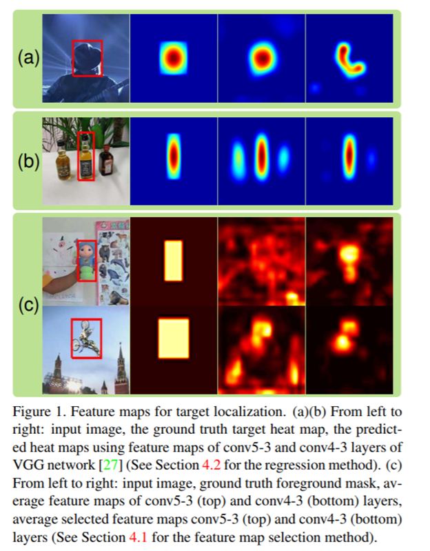
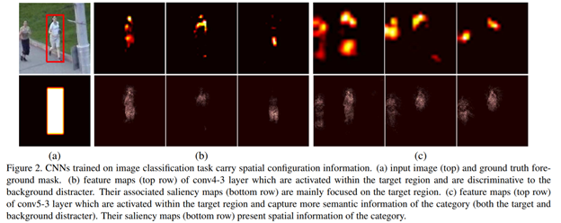
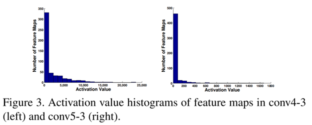
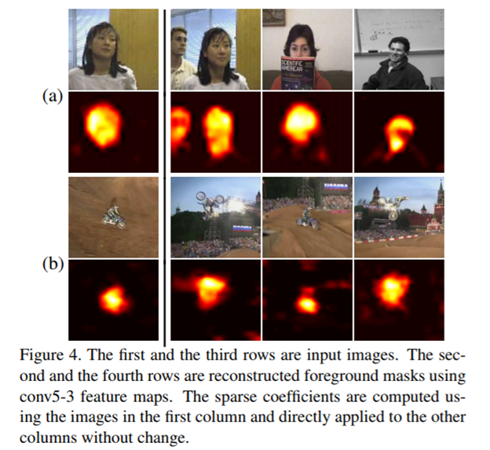
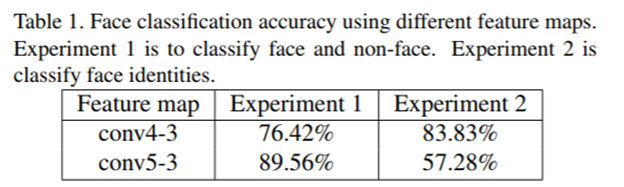
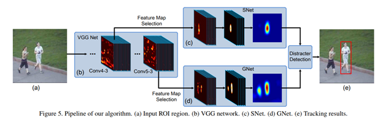

FCNT-Visual Tracking with Fully Convolutional Networks
======================================================

[TOC]

       
本文提出一个使用FCN网络来做通用对象跟踪。与将CNN当作一个**黑盒**特征提取器不同；我们对在ImageNet数据集上预训练的CNN的features的特性做深入研究。发现不同的卷积层描绘对象不同维度的特征。顶层编码语义特征，可以做类别检测；较低层有更多辨别信息，可以更好的将目标和目标类似的干扰对象区别。在我们的跟踪系统中通过**切换机制**两层信息都使用了。同时发现，对于特定的跟踪对象，只有**少量神经元**相关。feature
map选择方法剔除噪音和不相关的feature
maps;可以减少计算量并提升跟踪准确率。视觉跟踪的benchmark[[Online Object Tracking: A Benchmark](http://faculty.ucmerced.edu/mhyang/papers/cvpr13_benchmark.pdf)]表明我们提出的跟踪器显著优于state-of-the-art。

论文地址：<http://www.cvfoundation.org/openaccess/content_iccv_2015/papers/Wang_Visual_Tracking_With_ICCV_2015_paper.pdf>

 

依赖技术
--------

1）了解卷积神经网络及FCN

2)  了解泛函中变分概念及微积分中泰勒展开式

简介
----

       视觉跟踪作为计算机视觉的一个基本问题已经得到广泛的应用。
尽管在过去的十年中取得了很大的进步，但在设计一个能够很好地处理重大外观变化，姿态变化，严重遮挡和背景混乱的鲁棒追踪器方面仍然存在巨大挑战。

现有的appearance-based跟踪方法采用**生成式**或**判别式**模型来分离前景和背景并区别一起出现的对象。一个主要的劣势是，它们依赖低级的**手工特征**，**无法捕获**目标的**语义信息**，在外观显著变化时**不够鲁棒**，辨别能力有限。 
    

随着大规模视觉数据集的出现和计算能力的快速发展；深度神经网络DNN，特别时卷积神经网络CNN强大的特征表示学习能力，已经在计算机视觉任务中展现了创纪录的表现(如：**图像分类**，**对象检测**、**显著性检测**等）。不同于使用手工特征，CNN从大量标注的视觉数据和对象类别中学习高级的语义信息，擅长辨别不同类别的对象。这些特征在跨数据集时具有通用性。最近研究表明这些特征对于数据损坏也有鲁棒性。在对象识别时它们的神经元响应有**很强的选择性**；如：对于一个特定的对象，只有**一部分神经元响应**，对于**不同的对象**，对应**另外一部分神经元响应**。

 以上情况促使我们应用CNN来解决跟踪遇到的挑战。由于CNN依赖大规模训练；在线跟踪有限的训练样本及复杂的深度模型，直接使用CNN做跟踪效果不好。先前的方法尝试迁移离线学习好的DNN特征用于在线跟踪，取得了state-of-the-art的效果；但是DNN被当作一个**黑盒分类器**。相比之下，我们从在线视觉追踪的角度对CNN特征的属性进行了深入研究，以便更好地利用它们的速度和精度。发现了两种属性，受此激发设计了我们的跟踪系统。

 第一：CNN在不同层级/深度的特征具有适合跟踪问题的不同属性。**顶部**的卷积层捕获更加**抽象的**、**高级的语义特征**。它们擅长区别不同类别的对象，并且在变形和遮挡时表现非常鲁棒（如图：Figure
1 (a)）；但是**不擅长**区分**同类**的**不同对象实例**（如图：Figure 1
(b)）。**较低层**的特征有更多**定位细节**，可以将目标对象和外形相似的干扰项分离（如图：Figure
1 (b)）；但是它们对外形极具变化表现不鲁棒（如图：Figure 1
(a)）。基于此，我们提出在跟踪期间自动切换这两层的使用，具体取决于干扰项的发生。

       第二：ImageNet上预训练的CNN
特征是区分通用对象的。对于具体的目标，**不是所有的特征**都对跟踪有作用。某些特征的相应可能产生噪音。如图Figure
1
(c)所示，如果**所有的特征图**都使用，很难从背景中区分目标对象。相反，通过适当的特征选择，剔除跟目标表示不相关的干扰特征，保留那些可以根据精准突出目标对象和压制背景响应的特征。我们提出一种方法来选择有判别力的特征图，**剔除**与跟踪目标对象**干扰或不相关**的特征图。

       我们的方法有如下三点贡献：

       a)
**分析**了大规模图像分类任务中CNN模型的**特征**，**找出**对在线跟踪**重要属性**；促使进一步理解CNN的特征，并设计基于CNN的有效跟踪器。

       b)
我们提出了一种新的跟踪方法，**同时**考虑**两个不同层**的卷积层，以便它们在处理剧烈的外观变化，并能区分目标对象和与其相似的干扰项；这种设计有效的**减轻**了**漂移**

 c) 我们提出一种方法来选择有判别力的特征图，**剔除**与跟踪目标对象**干扰或不相关**的特征图；更进一步提升跟踪精确度。在视觉跟踪的benchmark[[Online
Object Tracking: A
Benchmark](http://faculty.ucmerced.edu/mhyang/papers/cvpr13_benchmark.pdf)]评估表明我们提出的方法很好的解决了视觉跟踪上很多挑战性问题并且优于state-of-the-art方法。

 

 

相关工作
--------

 

A tracker contains two components: an appearance model updated online and a
search strategy to find the most likely target locations. Most recent works [2,
41, 11, 20] focus on the design of appearance models. In generative models,
candidates are searched to minimize reconstruction errors. For example, Ross et
al. [25] learned subspace online to model target appearance. Recently, sparse
coding has been exploited for tracking [21, 3, 32, 31, 30], where the target is
reconstructed by a sparse linear combination of target templates. In
discriminative models, tracking is cast as a foreground and background
separation problem [24, 37, 34]. Online learning algorithms based on CRFs [24],
boosting [9], multiple instance learning [2] and structured SVM [10] were
applied in tracking and achieved good performance. In [40], the generative and
discriminative models were incorporated for more accurate online tracking. All
these methods used hand-crafted features.

 

The application of DNNs in online tracking is under fully explored. In [35], a
stacked denoising autoencoder (SDAE) was offline trained on an auxiliary tiny
image data set to learn generic features and then used for online tracking. In
[19], tracking was performed as foreground-background classification with CNN
trained online without offline pretraining. Fan et al. [6] used fully
convolutional network for human tracking. It took the whole frame as input and
predicted the foreground heat map by one-pass forward propagation. Redundant
computation was saved. Whereas [35] and [19] operated in a patch-by-by scanning
manner. Given N patches cropped from the frame, DNNs had to be evaluated for N
times. The overlap between patches leads to a lot of redundant computation. In
[12], pre-trained CNN features were used to construct target-specific saliency
maps for online tracking. Existing works treated DNNs as black-box feature
extractors. Our contributions summarized in Section 1 were not explored in these
works.

Feature深入分析
---------------

Analysis on deep representations is important to understand the mechanism of
deep learning. However, it is still very rare for the purpose of visual
tracking. In this section, we present some important properties of CNN features
which can better facilitate visual tracking. Our feature analysis is conducted
based on the 16-layer VGG network [27]

pre-trained on the ImageNet image classification task [4], which consists of 13
convolutional layers followed by 3 fully connected layers. We mainly focus on
the conv4-3 layer (the 10-th convolutional layer) and the conv5-3 layer (the
13-th convolutional layer), both of which generate 512 feature maps.

### 观察 1

       *虽然CNN
特征图的感受野很大，但是激活的特征图是稀疏和局部的。激活区域与语义对象的区域高度相关*。

       由于池化和卷积conv4-3和conv5-3的感受野非常大,分别是92×92 和
196×196。图Figure
2显示一些特征图在对象区域有最大的激活值；可以看到特征图只有**很小的区域**是**非零值**。非零值是局部的，并且主要与对象的区域相关。我们同样使用《Deep
inside convolutional networks: Visualising image classification models and
saliency maps》中的方法获取CNN 显著特征图。显著特征图(图Figure
2最后一行)导致所选特征图的增加最大的输入变化位于对象区域内；因此，特征图捕获的视觉表示与对象相关。这些证据表明从图像分类中学习的DNN特征是**局部**的并且与**对象**视觉线索相关；因此这些CNN特征可以用于目标定位。

Due to pooling and convolutional layers, the receptive fields of the conv4-3 and
conv5-3 layers are very large (92×92 and 196×196 pixels, respectively). Figure 2
shows some feature maps with the maximum activation values in the object region.
It can be seen that the feature maps have only small regions with nonzero
values. These nonzero values are localized and mainly correspond to the image
region of foreground objects. We also use the approach in [26] to obtain the
saliency maps of CNN features. The saliency maps in Figure 2 (bottom row) show
that the change of input that results in the largest increase of the selected
feature maps are located within the object regions. Therefore, the feature maps
are capturing the visual representation related to the objects. These evidences
indicate that DNN features learned from image classification are localized and
correlated to the object visual cues. Thus, these CNN features can be used for
target localization

### 观察 2

       *很多CNN特征图对于区分某个具体的目标和背景来说是干扰或不相关的*。

 在ImageNet上预训练的CNN特征可以表示大量的通用对象，因此推测出它使用大量神经元来检测丰富的视觉模式。但是，当跟踪某个具体的目标对象，需要**聚焦**到量**小得多**的**视觉模式**上来更好的区分目标和背景。如图Figure
1
(c)，所有特征图的均值于背景噪声混杂在一起。所以需要**丢弃**那些对于目标区域和背景区域**都有高响应**的特征图。图Figure
3显示了所有特征图在**目标对象区域**的**激活值**的直方图；一个特征图的激活值是目标对象区域所有激活值的和。如图Figure
3所示，在目标对象区域大部分特征图只有很小的值或者零值；因此很多特征图跟目标对象不相关。这个属性提供我们一种可能：只**选择少量特征图**，跟踪**性能**只有**很小的退化**。

### 观察 3

 *不能层编码不同类型的特征。较高层捕获对象类别的语义信息，较低层编码更多的辨别性特征来捕获类内变化。*

由于特征图过多，我们使用稀疏表示模式获取更好的视觉效果。将对象图片前向通过VGG获取卷积特征图$\bf {F \in R} ^{d \times n}$

(conv4-3层或conv5-3层)，每个特征图转成一个d-维向量，n代表特征图的个数。将图像和一个前景掩码$\bf \pi \in R^{d \times 1}$

关联，$\pi_i = 1$

如果**每个特征图**的**第i个神经元**都位于前景对象内，否则

$\pi_i = 0$

。根据如下公式，使用部分特征图来重构前景掩码

$$
\min\bf_c||\pi -Fc||^2_2 + \lambda||c||_1, \ \ \ \ \ \ \ \ \ \ (1)  \\
s.t.\  \bf {c} >=0,     
$$
$\bf {c \in R} ^{n \times 1}$是**稀疏系数**， λ是正则因子。

       图Figure 4显示使用conv5-3层特征图重构前景掩码。在图Figure
4中，仅使用第一列来**计算稀疏系数**；然后使用稀疏系数**重构**余下列的**前景掩码**。Figure
4
(a)展示人脸的语义信息捕获，且对于人脸外观变化，甚至不同实例都有很好的鲁棒性。Figure
4
(b)精准的将目标和噪杂的背景分离，对**姿态变化**和**旋转**保持**不变性**。虽然图像分类中，conv5-3层的高级语义表示可以做目标定位；但是对于属于**同一类别**的**不同对象辨别力不够**，所以无法直接应用到视觉跟踪。

       与conv5-3层特征相比，conv4-3层对**类内**的变化更加敏感。图Figure
2中conv4-3可以很好的区别**目标**person和**非目标**person；另外不同的特征图关注对象不同的部分。

 为进一步验证，进行两个定量分析实验。1800张包含**6个不同人**的人脸图和2000张不包含人脸的图；每张图关联一个前景掩码指示前景对象区域。

 第一个实验，分别使用conv4-3和conv5-3层评估区分人脸图和非人脸图的精确性。三张人脸图(分别是三个不同的人)作为正样本使用公式(1)计算稀疏系数 {c1,
c2,
c3}。测试阶段对给定图片的特征图F和前景掩码π，如下公式(2)计算的误差值e小于某个阈值，判断为人脸；否正，判断非非人脸。

$$
e=\min_i||\pi - Fc_i||^2_2 \ \ \ \ \ \ \ \ (2)
$$

 第二个实验，分类所有人脸图的属于不同的实例(是哪一个人的人脸)。对于每一个人，使用20张图片用公式(1)计算稀疏系数$c_i$

；i = 1, 2, . . . , 6。测试阶段使用如下公式，确定具体属于哪个人。

$$
id=arg\min_i||\pi - Fc_i||^2_2 \ \ \ \ \ \ \ \ (3)
$$

        Table
1是两个实验结果。conv5-3层特征图编码高级语义信息，可以更好的**区分** **人脸**和**非人脸**；但是在区分具体的**人脸实例**的时候**辨别力
不如**conv4-3层特征图。conv4-3层有更多中级信息，可以更准确的辨别属于同一个类的不同图片(人脸)；但是它们在区分人脸和非人脸是不如conv5-3。以上结果激发我们使用同时两层信息来更鲁棒的做跟踪。

 

 

提议算法
--------

 

 

1.  对于给定的目标，在VGG网络的conv4-3和conv5-3层进行feature
    map选择过程，选择相关的特征图，防止对噪声过拟合。

2.  通用网络(GNet)：一个在conv5-3层之上做feature
    map选择后构建的网络，捕获类别信息

3.  具体网络(SNet)：一个在conv4-3层之上做feature
    map选择后构建的网络，从外观相似的背景辨别目标。

4.  GNet和SNet都在**第一帧**使用前景热图回归**初始化**；并使用不同的在线更新策略

5.  对于新的一帧，位于前一个目标位置中心的ROI(包括目标和背景)通过FCN网络

6.  GNet和SNet**分别生成热图**；目标定位在两个热图中**独立进行**

7.  最终的目标定位使用Step6的哪个热图取决于**干扰检测模式**的结果

### Feature Map选择

       feature map选择方法基于目标热图回归模型，命名为sel-CNN，在VGG的conv4-3 和
conv5-3层独立进行。sel-CNN由一个drop和一个卷积层构成，没有非线性变换。输入是conv4-3或conv5-3，输出目标热图M，是一个位于GT中心的2-维的高斯分布，方差与目标的尺寸正比(如：Figure
1 (a)和(b))。模型的训练是最小化预测前景热图$\hat M$

和目标热图M的最平均方差：  

$$
L_{set} = ||\hat M - M||^2 \ \ \ \ \ \ \ (4)
$$

       通过反向传播收敛学习参数后，固定模型参数，选择对于**损失函数
影响最大**的 feature maps。对于特征图F，向量化表示维vec(F)，$f_i$

代表vec(F)的第i个元素。feature
map的变分δF引起损失函数的改变可以通过如下二阶泰勒展开式计算：

$$
\delta L_{set} = \sum_i g_i \delta f_i + \frac 1 2 \sum_i h_{ii}(\delta f_i)^2 + \frac 1 2 \sum_{i\ne j}h_{ij} \delta f_i \delta f_j \ \ \ \ \ \ \ \ (5)
$$
$g_i =\frac {\partial L_{sel}} {\partial f_i}$

和

$h_{ij} = \frac {\partial^2 L_{sel}} {\partial f_i \partial f_j}$

分别代表目标函数对于输入feature maps的一阶导数和二阶导数。feature
maps元素非常大(\>270,000)。二阶导的计算量是$O(270,000^2)$

，意味着耗时非常大。我们使用对角矩阵来近似Hessian矩阵，忽略公式(5)的第三项。一阶导数和二阶导数都可以通过反向传播有效计算。

      定义$f_i$

意义维将

$f_i$

变为0后目标函数的改变，如

$\delta f_i = 0 - f_i$

；根据公式(5)，$f_i$

的作用可以通过如下公式计算：

$$
s_i = - g_if_i + \frac 1 2 h_{ii}f^2_i \ \ \ \ \ \ \ (6)
$$

     第k个feature map的作用是其上所有元素的作用之和$S_k=\sum_{x,y}s(x,y,k)$

， s(x, y, k)代表位于k个feature map坐标(x, y)上的元素。所有的feature
maps根据它们的作用倒序，top K个feature maps。选中的feature
maps对目标函数由重要影响，因此与跟踪任务最相关。feature
map选择方法可以在线进行。实验中，仅仅在第一帧进行feature
map选择，就可以达到好的效果；部分归功于CNN特征的鲁棒性。

使用二次方程近似方法来删除网络中的一些连接可以追溯到1989年。目的是减少参数，提升速度；而我们的目标是**删除** **干扰feature
maps**并**提升**跟踪**精确度**。

 

### 目标定位

       图Figure 5 (c) 和 (d) 展示了目标定位的CNN设计。在第一帧feature
map选择完成后，使用conv4-3 和conv5-3层特征分别构建SNet
和GNet。两个网络使用相同结构；第一个卷积层的卷积核尺寸为9×9，输出36个feature
maps；第二个卷积层卷积核尺寸为5×5，输出**前景热图**；两个卷积层都使用ReLU做非线性变换。

       SNet 和GNet在第一帧使用如下损失函数初始化；U ∈ {S, G}，$\hat M_u$

代表网络预测的前景热图；M是目标热图；$W_u$

是卷积层权重参数。
$$
L =L_S + L_G, \ \ \ \ \ \ \ \ \ \ \\
L_U =||\hat M -M||^2_F + \beta||W_u||^2_F \ \ \ \ \ \  (7) 
$$
        sel-CNN和SNet、GNet的CNN结构不同；sel-CNN结构非常简单用于防止干扰feature
maps过拟合目标函数，而SNet、GNet更加复杂。干扰feature maps通用feature
map选择排除后，更复杂的模型获取更精确的跟踪效果。在补充资料中有模型差异的详细实验结果和分析。

在新的一帧中，截取位于前一帧中心的一个矩形ROI区域；前向通过网络；GNet和SNet都预测了一个前景热图。首先使用GNet的目标热图做目标定位；设$\hat X =(x, y, \sigma)$

代表目标位置，x,y,σ分别代表目标bbox的坐标和尺寸。$\hat X^{t-1}$

代表前一帧的目标位置，假设当前帧的目标定位候选服从高斯分布；

$$
p(\bf X^t|X^{t-1})=N(X^t;\hat X^{t-1},\Sigma)  \ \ \ \ \ \ \ \ \ \ (8)
$$

  Σ是协方差矩阵，代表定位参数的方差。第i个候选框置信度是热图上对应区域值之和

$conf_i = \sum{j \in R_i} \hat M_G(j)$，$\hat M_G$

代表GNet生成的热图；Ri是根据公式(8)的定位参数$X^t_i$得到的第i个定位候选框的区域；j是坐标索引；**置信度最高**的候选框就是GNet预测的定位。

        之前分析过，GNet构建在conv5-3层之上，捕获语义特征，有高度
**类内不变性**；因此，GNet生成的热图会突出**目标**和背景中**外观类似**目标的**干扰项**。

为防止跟踪漂移到背景上，我们使用一个**干扰检测模式**来确定最终目标定位。设

$\hat X_G$为GNet预测的目标定位，

$R_G$为对应在热图中的区域。背景中**干扰项**发生的**概率**就是目标**区域外**和**区域内**置信度之比。

$$
P_d = \frac {\sum_{j \in \hat M_G -R_G} \hat M_G(j)} {\sum_{k \in R_G} \hat M_G(k)}     \ \ \ \ \ \ (9)
$$

$\hat M_G -R_G$

代表热图$\hat M_G$

上背景区域，比值$P_d$

小于阈值(0.2)，判定为没有干扰项，使用GNet预测的定位为最终结果；否则，使用SNet预测的定位作为最终结果，SNet预测的定位的过程与GNet完全一样。

### 在线更新

为防止在线更新过程中引入背景噪音，在第一帧初始化后，固定GNet，仅仅更新SNet。SNet有两个不同的更新规则：**适应规则**和**判别规则**；作用分别是适应目标外观变化和提升前景背景辨别能力。适应规则**每20帧**使用**置信度最高**的跟踪结果来**精调SNet**。判别规则在公式(9)**检测到干扰项**后，使用**第一帧**信息和**当前帧**信息，最小化如下函数：

$$
\min \beta||W_S||^2_F + \sum_{x,y}\{[\hat M^l_S(x, y) - M^l(x,y)]^2 +
[1 - \Phi^t(x,y)][\hat M^t_S(x,y) - M^t(x, y)]^2 \} \ \ \ \ \ \ \ \ (10)
$$

$W_S$代表代表SNet卷积层的权重参数，(x, y) 是空间坐标；

$\hat M^t_S$和$M^t$分别代表**第t帧**SNet**预测的热图**和根据**预测目标定位 生成的热图**；前景掩码

$\Phi^t$代表预测的目标边框；如果(x, y)在目标区域内，则$\Phi^t(x, y) = 1$

，否则$\Phi^t(x, y) = 0$。

公式(10)第二项与第一帧定位损失相关，当干扰项发生或者目标被严重遮挡，估算目标区域不可靠。因此我们选择一个**保守模式**，使用第一帧来监督更新，因此模型可以捕获第一帧的外观。同时公式(10)第三项**剔除**了**不可靠目标定位的损失**，在当前帧，仅考虑背景；使得模型更加**倾向**将**共同出现**的**干扰项当作背景**。第二项和第三项组合能帮助SNet更好区分目标和背景；并**减轻**因**遮挡**和**干扰项**引起的**模型退化**。

实验
----

### 评估方法

### 结论

### 消除学习

总结
----

 

 

## 关于我们

我司正招聘文本挖掘、计算机视觉等相关人员，欢迎加入我们；也欢迎与我们在线沟通任何关于数据挖掘理论和应用的问题；

在长沙的朋友也可以线下交流, 坐标: 长沙市高新区麓谷新长海中心 B1栋8A楼09室

公司网址：http://www.embracesource.com/

Email: mick.yi@embracesource.com 或 csuyzt@163.com

