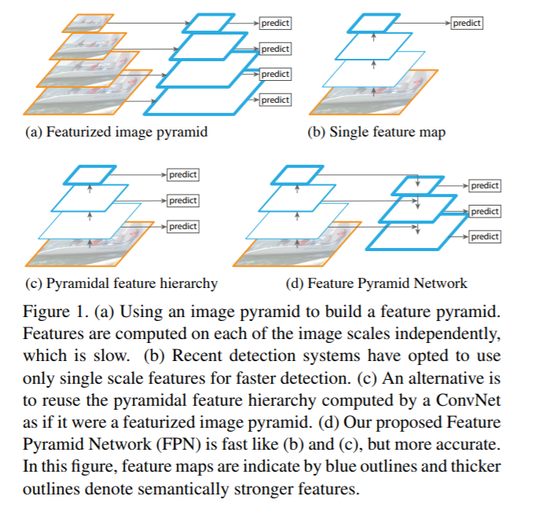
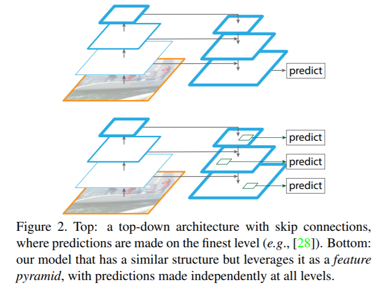
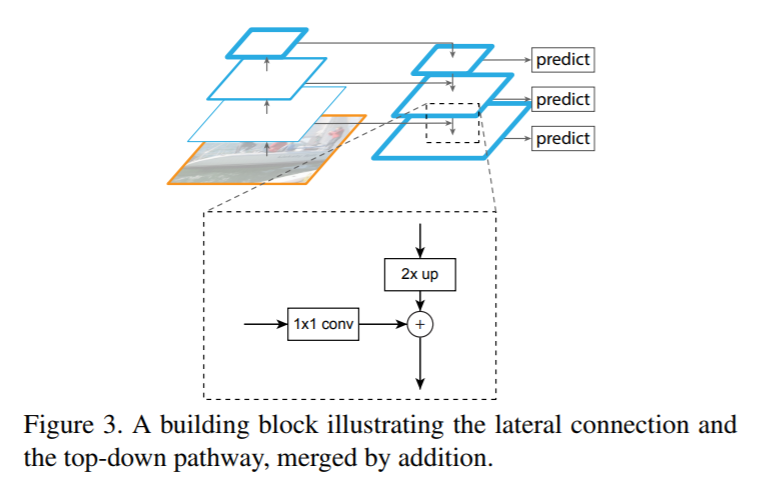

# Feature Pyramid Networks for Object Detection

[TOC]

## 摘要

​        **特征金字塔**是识别系统中用于检测**不同尺寸**目标的基本组件。但最近的深度学习目标检测器已经避免了金字塔表示，部分因为它们是**计算和内存** **密集型**的。在本文中，我们利用深度卷积网络**内在的多尺寸**、**金字塔分层**来构造具有很少额外成本的特征金字塔。开发了一种具有**侧向连接**的**自顶向下**(top-down)架构，用于在**所有尺寸**上构建**高级语义特征图**。这种架构,称为特征金字塔网络(FPN); 在几个应用程序中作为**通用特征提取器**表现出了显著的提升。在一个基本的Faster R-CNN系统中使用FPN，没有花里胡哨，我们的方法可以在COCO检测基准数据集上取得state-of-the-art单模型结果，**超过了所有现有的单模型记录**，包括COCO 2016挑战赛的获奖者。此外，我们的方法可以在**单GPU**上以**6FPS**运行，因此是**多尺寸目标检测**的实用和准确的解决方案。代码将公开发布。

论文地址： <https://arxiv.org/pdf/1612.03144.pdf>

## 1. 引言

​       识别不同尺寸的目标是计算机视觉中的一个基本挑战。建立在**图像金字塔**之上的特征金字塔(我们简称为**特征化图像金字塔**-featurized image pyramids)构成了标准解决方案的基础[1] (图Figure 1(a))。这些金字塔是尺寸不变的，因而**目标的尺寸变化**是通过**在金字塔中移动它的层级**来弥补的。直观地说，该属性使模型能够通过在**位置**和**金字塔层级**上扫描,来检测**很大范围尺寸**的目标。

​        特征化图像金字塔在手工设计的时代被大量使用[5，25]。它们非常关键，以至于像DPM[7]这样的目标检测器需要**密集的尺寸采样**才能获得好的结果(例如每组10个尺寸)。对于识别任务，工程特征大部分已经被深度卷积网络(ConvNets)[19，20]计算的特征所取代。除了能够表示更高级别的语义，ConvNets对于尺寸变化也更加鲁棒，从而有助于从**单一输入尺寸上计算的特征**进行识别[15,11,29] (图Figure 1(b))。但即使有这种鲁棒性，**获取最准确的结果**，仍**需要金字塔**。在ImageNet[33]和COCO[21]检测挑战中，最近的所有排名靠前的记录，都使用了**特征化图像金字塔** 上的 **多尺寸测试**(例如[16,35])。对图像金字塔的每个层次进行特征化的主要优势在于它产生了**多尺寸的特征表示**，其中**所有层上的语义都很强**，包括高分辨率层。

​       尽管如此，**特征化**图像金字塔的**每个层**有**明显的局限性**。**预测时间显著增加**(例如，四倍[11])，使得这种方法在实际应用中不可行。此外，在图像金字塔上端到端地训练深度网络在**内存**而言是**不可行的**，所以如果采用该方法，图像金字塔**仅在测试时使用**[15，11，16，35]，这造成了**训练/测试**时预测的**不一致性**。出于这些原因，Fast和Faster R-CNN[11，29]选择**默认不使用特征化图像金字塔**。

​        但是，图像金字塔并不是计算多尺寸特征表示的唯一方法。深层ConvNet逐层计算特征层级，**通过下采样层**，特征层级具有**内在的多尺寸** **金字塔形状**。这种网内特征层级产生不同空间分辨率的特征图，但引入了由不同深度引起的较大的**语义差异**。高分辨率特征图有**低级特征**，**影响了其目标识别表示能力**。

​       Single Shot Detector(SSD)[22]是首先尝试使用ConvNet的金字塔特征层级中的一个，就像它是一个特征化的图像金字塔(图Figure 1(c))。理想情况下，SSD类的金字塔将**重用**前向传播中计算的**不同层中的多尺寸特征图**，因此是**零成本**的。但为了避免使用低级特征，SSD放弃重用已经计算好的特征图，而从网络的**高层开始构建金字塔**(例如，VGG网络的conv4_3[36])，然后**添加几个新层**。因此它**错过了重用** 特征层级中**高分辨率特征图**的机会。我们证明这对于**检测小目标很重要**。

​        本文的目标是**自然地利用**ConvNet特征层级的金字塔形状，同时创建一个在**所有尺寸上**都具有**强大语义信息**的特征金字塔。为了实现这个目标，我们依赖于一种结构，它将**低分辨率、强语义**的特征 和 **高分辨率、弱语义**的特征 通过**自顶向下**的路径和**侧向连接** 组合在一起(图Figure 1(d))。其结果是一个特征金字塔，在**所有层级**都具**有丰富的语义信息**，并且可以从**单尺寸的输入图像**上进行快速构建。换句话说，我们展示了如何创建**网络内**(in-network)的**特征金字塔**，可以用来代替 **特征化图像金字塔**，而**不牺牲表示能力，速度或内存**。

​        最近的研究[28，17，8，26]中流行采用**自顶向下**和跳跃连接(skip connetion)的类似架构。他们的目标是生成**单个**有**高级特征**的**高分辨率特征图**，并在其上进行预测(图Figure 2顶部)。相反，我们的方法利用这个架构作为特征金字塔，其中预测(例如目标检测)在每个级别上独立进行(图2底部)。我们的模型反映了一个特征化的图像金字塔，这在这些研究中还没有探索过。

​        我们评估了我们的方法:称为特征金字塔网络(FPN)，其在各种用于检测和分割[11，29，27]系统中。没有任何花里胡哨，我们在具有挑战性的COCO检测基准数据集上报告了最新的单模型结果，仅仅基于FPN和基本的Faster R-CNN检测器[29]，就超过了所有现存的严重工程化的单模型的**竞赛获奖者的记录**。在消融实验中，我们发现对于**提议边框**，FPN将**平均召回率**(AR)显著的提升了**8个百分点**；对于目标检测，它将COCO类的**精度**(AP)提高了2.3个百分点，PASCAL类AP提高了3.8个百分点，超过了较强的**单尺寸模型**基线: 基于ResNet[16]的Faster R-CNN。我们的方法也很容易扩展到掩码提议框(mask proposals)，改进实例分隔AR, 并且速度超过 严重依赖图像金字塔的state-of-the-art方法。

另外，我们的金字塔结构可以通过所有尺寸进行端到端培训，并且在训练/测试时一致地使用，这在使用图像金字塔时是内存不可行的。因此，FPN能够比所有现有的state-of-the-art方法获得更高的准确度。此外，这种改进是在不增加单尺寸基准测试时间的情况下实现的。我们相信这些进展将有助于未来的研究和应用。我们的代码将公开发布。

## 2. 相关工作

### 手工设计特征和早期神经网络

​        SIFT特征[25]最初是从尺寸空间极值中提取的，用于特征点匹配。HOG特征[5]，以及后来的SIFT特征，都是在整个图像金字塔上密集计算的。这些HOG和SIFT金字塔已在许多工作中得到了应用，用于图像分类，目标检测，人体姿势估计等。这对快速计算特征化图像金字塔也很有意义。Dollar等人[6]通过先计算**一个稀疏采样(尺寸)金字塔**，然后插入缺失的层级，演示了快速金字塔计算。在HOG和SIFT之前，使用ConvNet[38，32]的早期人脸检测工作计算了**图像金字塔**上的**浅层网络**，以检测跨尺寸的人脸。

### Deep ConvNet目标检测器

​         随着现代深度卷积网络[19]的发展，像OverFeat[34]和R-CNN[12]这样的目标检测器在精度上显示出了显著的提高。OverFeat采用了一种类似于早期神经网络人脸检测器的策略，通过在图像金字塔上应用ConvNet作为滑动窗口检测器。R-CNN采用了基于区域提议的策略[37]，其中每个提议在用ConvNet进行分类之前都进行了尺寸归一化。SPPnet[15]表明，这种基于区域的检测器可以更有效地应用于在单个图像尺寸上提取的特征图。最近更准确的检测方法，如Fast R-CNN[11]和Faster R-CNN[29]提倡使用从单一尺寸计算出的特征，因为它提供了精确度和速度之间的良好折衷。然而，多尺寸检测性能仍然更好，特别是对于小型目标。

### 使用多层特征的方法

​        一些最近的方法通过使用ConvNet中的不同层来改进检测和分割。FCN[24]将多个尺寸上的每个类别的部分分数相加以计算语义分割。Hypercolumns[13]使用类似的方法进行目标实例分割。在计算预测之前，其他几种方法(HyperNet[18]，ParseNet[23]和ION[2])将多个层的特征连接起来，这相当于累加转换后的特征。SSD[22]和MS-CNN[3]可预测特征层级中多个层的目标，而不需要组合特征或评分。

​       最近有一些方法利用**横向/跳跃连接**将跨**分辨率**和**语义层次**的低级特征图关联起来，包括用于分割的U-Net[31]和SharpMask[28]，Recombinator网络[17]用于人脸检测以及Stacked Hourglass网络[26]用于关键点估计。Ghiasi等人[8]为FCN提出拉普拉斯金字塔表示，以逐步细化分割。尽管这些方法采用的是**金字塔形状**的架构，但它们**不同于** **特征化图像金字塔**[5，7，34]，其中所有层次上的预测都是独立进行的，参见图Figure 2。事实上，对于图Figure 2(顶部)中的金字塔结构，要识别**多个尺寸的目标**[28], **任需要图像金字塔**。

## 3. 特征金字塔网络

​       我们的目标是利用ConvNet的金字塔特征层级，该层次结构具有**从低到高**的**语义信息**，并在整个过程中构建**含有高级语义**的**特征金字塔**。由此产生的**特征金字塔网络是通用**的，在本文中，我们聚焦**滑动窗口提议**(Region Proposal Network，简称RPN)[29]和**基于区域的检测器**(Fast R-CNN)[11]。在第6节中我们还将FPN泛化到实例分割提议。

​        我们的方法以任意大小的**单尺寸图像**作为输入，并以全卷积的方式输出**多层比例大小**的**特征图**。这个过程独立于主干卷积结构(例如[19，36，16])，在本文中，我们呈现了使用ResNets[16]的结果。如下所述，我们的金字塔结构包括自底向上的路径，自上而下的路径和侧向连接。

### 自底向上的路径

​        自底向上的路径是主ConvNet的前馈计算，其计算**由缩放步长为2**的**多尺寸特征图**组成的**特征层级**。通常有很多层 产生**相同大小**的 **输出特征图**，并且我们认为这些层位于相同的网络**阶段**(stage)。对于我们的特征金字塔，我们为**每个阶段定义一个金字塔层**。我们选择每个阶段的最后一层的输出作为我们的特征图参考集合，我们将丰富它来创建我们的金字塔。这种选择是自然的，因为每个阶段的**最深层应具有最强的特征**。

​       具体而言，对于ResNets[16]，我们使用每个阶段的最后一个残差块激活输出的特征。对于conv2，conv3，conv4和conv5输出，我们将这些最后残差块的输出表示为{C2,C3,C4,C5}，注意它们相对于输入图像的步长为{4，8，16，32}个像素。由于其庞大的内存占用，我们**没有将conv1纳入金字塔。**

### 自顶向下的路径和侧向连接

​        自顶向下的路径通过**上采样** **空间上更粗糙**但在**语义上更强**的来自**较高金字塔层级的特征图**来幻化**更高分辨率的特征**。这些特征随后通过**侧向连接** **自底向上路径上的特征** 进行**增强**。每个侧向连接合并来自**自底向上**路径和**自顶向下**路径的具有**相同空间大小的特征图**。自底向上的特征图具有**较低级别的语义信息**，但其的激活可以**更精确地定位**，因为它被下**采样的次数更少**。

​        图Figure 3显示了建造我们的自顶向下特征图的构建块。对于较粗糙分辨率的特征图，我们**以因子2上采样**空间分辨率(为了简单起见，使用最近邻上采样)。然后通过逐个元素相加，将**上采样特征**与相应的**自底向上特征**(其经过1×1卷积层来减少通道维度)合并。迭代这个过程，直到生成**最佳分辨率特征图**。开始迭代时，我们只需在C5上添加一个**1×1卷积层**来生成最粗糙分辨率特征图。最后，我们在**每个合并后的特征**上添加一个3×3卷积来生成最终的特征图，这是为了**减少上采样的混叠效应**。这个最终的特征图集合称为{P2,P3,P4,P5}，对应于{C2,C3,C4,C5}，依次具有**相同的空间大小**。

​        由于**金字塔的所有层**都像传统的特征图像金字塔一样使用**共享分类器/回归器**，因此我们在所有特征图中**固定特征维度**(通道数记为dd)。我们在本文中设置d=256，因此所有额外的卷积层都有256个通道的输出。在这些额外的层中**没有非线性变化**，我们在实验中发现这影响很小。

​        简洁性是我们设计的核心，我们发现我们的模型对许多设计选择都**很鲁棒**。我们已经尝试了更复杂的块(例如，使用多层残差块[16]作为连接)并观察到稍好的结果。**设计更好的连接模块并不是本文的重点**，所以我们选择上述的简单设计。

## 4. 应用

​        我们的方法是在**深度ConvNets内部** **构建特征金字塔**的通用解决方案。接下来，我们采用我们的方法在**RPN**[29]中进行**提议边框生成**，并在**Fast R-CNN**[11]中进行**目标检测**。为了证明我们方法的**简洁性**和**有效性**，我们对[29,11]的原始系统进行最小修改，使其适应我们的特征金字塔。

### 4.1. RPN的特征金字塔网络

​        RPN[29]是一个**类别无关**的**滑动窗口目标检测器**。在原始的RPN设计中，在**单尺寸卷积特征图**上，使用一个小型子网络在密集的3×3滑动窗口上进行评估，执行**目标/非目标的二分类**和**边框回归**。这是通过**一个3×3的卷积层**实现的，后面跟着**两个**用于分类和回归的**1×1兄弟卷积**，我们称之为**网络头部**(network-head)。**目标/非目标标准**和**边框回归目标**的根据一组称为**锚点**(anchors)的参考框的[29]定义的。这些锚点具有**多个**预定义的**尺寸和长宽比**，以覆盖不同形状的目标。

​        我们通过用我们的FPN替换单尺寸特征图来适应RPN。我们在我们的特征金字塔的**每个层级上附加一个相同设计的** **头部**(3x3 conv和两个1x1兄弟convs)。由于头部在金字塔**所有层级**的**所有位置** 上密集滑动，所以**不需要**在特定层级上具有**多尺寸锚点**。相反，我们为**每个层级分配单尺寸的锚点**。在形式上，我们定义锚点{$P_2,P_3,P_4,P_5,P_6$}分别具有$\{32^2,64^2,128^2,256^2,512^2\}$像素的面积。正如在[29]中，我们在每个层级上也使用了**多个长宽比**{1:2,1:1,2:1}的锚点。所以在金字塔上总共有**15个锚点**。

​       如[29]，我们根据锚点和ground-truth边框的交并比(IoU)比例将训练标签分配给锚点。形式上，如果一个锚点对于一个给定的ground-truth边框具有**最高的IoU**或者与任何ground-truth边框的**IoU超过0.7**，则给其分配一个**正标签**，如果其**与所有ground-truth边框的IoU都低于0.3**，则为其分配一个**负标签**。请注意，**ground-truth边框的尺寸**并未**显式的用于分配**它们到金字塔的**哪个层级**；相反，**ground-truth边框**与已经分配给金字塔层级的**锚点相关联**。因此，除了[29]中的内容外，我们不引入额外的规则。

​        我们注意到**头部的参数**在所有特征金字塔层级上**共享**；我们也评估了替代方案，没有共享参数并且观察到类似的准确性。**共享参数的良好性能**表明我们的金字塔的所有层级**共享相似的语义级别**。这个优点类似于使用特征图像金字塔的优点，可以将**通用的头部分类器**应用于**任意图像尺寸计算的特征**。

​        通过上述调整，RPN可以自然地通过我们的FPN进行训练和测试，与[29]中的方式相同。我们在实验中详细说明实施细节。

### 4.2. Fast R-CNN的特征金字塔网络

​        Fast R-CNN[11]是一个基于区域的目标检测器，利用感兴趣区域(RoI)池化来提取特征。Fast R-CNN通常在单尺寸特征图上执行。要将其与我们的FPN一起使用，我们需要为金字塔层级**分配不同尺寸的RoI**。

​        我们将我们的特征金字塔看作是从图像金字塔生成的。因此，当它们在图像金字塔上运行时，我们可以适应基于区域的检测器的分配策略[15，11]。在形式上，我们通过以下公式将宽度为w和高度为h(在网络上的输入图像上)的RoI分配到特征金字塔的级别$P_k$上：
$$
k=⌊k0+log_2( \sqrt{wh}/224)⌋. \tag 1
$$
​        这里224是规范的ImageNet预训练大小，而$k_0$是大小为$w×h=224^2$的RoI应该映射到的目标级别。类似于基于ResNet的Faster R-CNN系统[16]使用$C_4$作为单尺寸特征图，我们将$k_0$ 设置为4。直觉上，公式(1)意味着如果RoI的尺寸变小了(比如224的1/2)，它应该被映射到一个更精细的分辨率级别(比如k=3)。

​        我们在所有级别的所有RoI中附加**预测器头部**(在Fast R-CNN中，预测器头部是**类别相关的分类器和边框回归器**)。再次，**预测器头部都共享参数**，不管他们在什么层级。在[16]中，ResNet的**conv5层**(9层深的子网络)被**用作conv4特征之上的头部**，但我们的方法已经利用了**conv5来构建特征金字塔**。因此，与[16]不同，我们只是采用RoI池化提取7×7特征，并在最终的分类层和边框回归层之前附加**两个隐藏单元为1024维的全连接(fc)层**(每层后都接ReLU层)。这些层是随机初始化的，因为ResNets中没有预先训练好的fc层。请注意，**与标准的conv5头部相比，我们的2-fc MLP头部更轻更快**。

​        基于这些改编，我们可以在特征金字塔之上训练和测试Fast R-CNN。实现细节在实验部分给出。

## 关于我们

我司正招聘文本挖掘、计算机视觉等相关人员，欢迎加入我们；也欢迎与我们在线沟通任何关于数据挖掘理论和应用的问题；

在长沙的朋友也可以线下交流, 坐标: 长沙市高新区麓谷新长海中心 B1栋8A楼09室

公司网址：http://www.embracesource.com/

Email: mick.yi@embracesource.com 或 csuyzt@163.com

