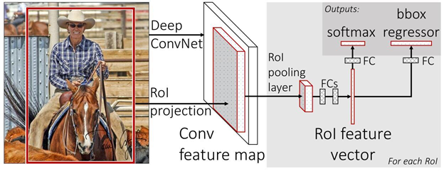

Fast R-CNN
=====

[TOC]

​        本文提出了一种快速的**基于Region**的卷积网络方法(Fast R-CNN)用于目标检测。Fast R-CNN建立在以前使用的深卷积网络**有效地分类目标proposals**的成果上。相比于之前的工作，Fast R-CNN使用了很多创新，**提升了训练和测试速度**，同时也**提高检测精度**。Fast R-CNN**训练**非常深的VGG16网络比R-CNN**快9倍**，**测试快213倍**，并在PASCAL VOC上得到更高的精度。与**SPPnet相比**，Fast R-CNN**训练**VGG16网络比它**快3倍**，**测试速度快10倍**，并且**更准确**。Fast R-CNN的Python和C ++(使用Caffe)实现,以MIT开源许可证发布在: https://github.com/rbgirshick/fast-rcnn。

Fast R-CNN论文地址：<https://arxiv.org/pdf/1504.08083.pdf>。

依赖知识
--------

    a） 已经熟悉R-CNN

    b )  了解预训练、迁移学习

知识点
------

###  ROI

 ROI（region of
interest），感兴趣区域。机器视觉、图像处理中，从被处理的图像以方框、圆、椭圆、不规则多边形等方式勾勒出需要处理的区域，称为感兴趣区域，ROI。

### end-to-end

  端到端指的是输入是原始数据，输出是最后的结果。细分有端到端训练和端到端模型。

参考：<https://www.zhihu.com/question/51435499/answer/129379006>

### Spatial Pyramid Pooling

     Spatial Pyramid Pooling
空间金字塔池化。传统CNN中的全连接层需要输入是固定大小。在图像处理中，原始图片大小不一；经过卷积后大小还是不同，这样没有办法直接接入全连接层。

这是一个传统的网络架构模型，5层卷积层，这里的卷积层叫做convolution和pooling层的联合体，统一叫做卷积层，后面跟随全连接层。我们这里需要处理的就是在网络的全连接层前面加一层金字塔pooling层解决输入图片大小不一的情况。我们可以看到这里的spatital
pyramid pooling layer就是把前一卷积层的feature
maps的每一个图片上进行了3个卷积操作。最右边的就是原图像，中间的是把图像分成大小是4的特征图，最右边的就是把图像分成大小是16的特征图。那么每一个feature
map就会变成16+4+1=21个feature maps。这不就解决了特征图大小不一的状况了吗？

详见：[空间金字塔池化阅读笔记](http://blog.csdn.net/liyaohhh/article/details/50614380)

论文：[Spatial Pyramid Pooling in Deep Convolutional Networks.pdf](https://arxiv.org/pdf/1406.4729.pdf)

## 1. 介绍

Recently, deep ConvNets [14, 16] have significantly improved
image classification [14] and object detection [9, 19]
accuracy. Compared to image classification, object detection
is a more challenging task that requires more complex
methods to solve. Due to this complexity, current approaches
(e.g., [9, 11, 19, 25]) train models in multi-stage
pipelines that are slow and inelegant.

​        最近，深度卷积网络[14,16]已经显著提高了图像分类[14]和目标检测[9,19]的准确性。与图像分类相比，目标检测是一个更具挑战性的任务，需要更复杂的方法来解决。由于这种复杂性，当前的方法(如，[9,11,19,25])采用多阶段pipeline的方式训练模型，又慢又不优雅。

Complexity arises because detection requires the accurate
localization of objects, creating two primary challenges.
First, numerous candidate object locations (often
called “proposals”) must be processed. Second, these candidates
provide only rough localization that must be refined
to achieve precise localization. Solutions to these problems
often compromise speed, accuracy, or simplicity.

​        复杂性的产生是因为检测需要目标的精确定位，这就导致两个主要的挑战。首先，必须处理大量候选目标定位(通常称为“proposals”)。 第二，这些候选框仅提供粗略定位，其必须提炼以实现精确定位。 这些问题的解决方案经常会影响速度，准确性或简单性。

In this paper, we streamline the training process for stateof-the-art
ConvNet-based object detectors [9, 11]. We propose
a single-stage training algorithm that jointly learns to
classify object proposals and refine their spatial locations.

​       在本文中，我们简化了最先进的基于卷积网络的目标检测器的训练过程[9,11]。我们提出一个单阶段训练算法，联合学习object proposals分类和改善他们的空间位置。

The resulting method can train a very deep detection
network (VGG16 [20]) 9× faster than R-CNN [9] and 3×
faster than SPPnet [11]. At runtime, the detection network
processes images in 0.3s (excluding object proposal time)

while achieving top accuracy on PASCAL VOC 2012 [7]
with a mAP of 66% (vs. 62% for R-CNN).1

​        由此产生的方法可以训练非常深的检测网络(VGG16[20]) , 比R-CNN[9]快9倍，比SPPnet[3]快3倍。在运行时，检测网络在PASCAL VOC 2012数据集上实现最高精度，其中mAP为66％(vs R-CNN的62％)，每张图像处理时间为0.3秒，不包括候选框的生成(所有的时间都是使用一个超频875MHz的Nvidia K40 GPU测试的)。

### 1.1. R-CNN和SPPnet

​         The Region-based Convolutional Network method (RCNN)
[9] achieves excellent object detection accuracy by
using a deep ConvNet to classify object proposals. R-CNN,
however, has notable drawbacks:

​       基于Region的卷积网络方法（RCNN）通过使用深度卷积网络来分类目标proposals，获得了非常好的目标检测精度。然而，R-CNN具有显着的缺点：

1. Training is a multi-stage pipeline. R-CNN first finetunes
     a ConvNet on object proposals using log loss.
       Then, it fits SVMs to ConvNet features. These SVMs
       act as object detectors, replacing the softmax classifier
       learnt by fine-tuning. In the third training stage,
       bounding-box regressors are learned.
2. Training is expensive in space and time. For SVM
     and bounding-box regressor training, features are extracted
       from each object proposal in each image and
       written to disk. With very deep networks, such as
       VGG16, this process takes 2.5 GPU-days for the 5k
       images of the VOC07 trainval set. These features require
       hundreds of gigabytes of storage.
3. Object detection is slow. At test-time, features are
     extracted from each object proposal in each test image.
       Detection with VGG16 takes 47s / image (on a GPU).
4. **训练过程是多阶段pipeline。**R-CNN首先在目标proposals上对卷积神经网络使用log损失进行精调。然后，它将卷积神经网络得到的特征送入SVM。 这些SVM作为目标检测器，替代通过精调学习的softmax分类器。 在第三个训练阶段，学习边框回归器。
5. **训练在时间和空间上是的开销很大。**对于SVM和边框回归训练，从每个图像中的每个目标proposal提取特征，并写入磁盘。对于非常深的网络，如VGG16，对于VOC07 trainval上的5k个图像，这个过程在单个GPU上需要2.5天。这些特征需要数百GB的存储空间。
6. **目标检测速度很慢。**在测试时，从每个测试图像中的每个目标候选框提取特征。用VGG16网络检测目标每个图像需要47秒(在单GPU上)。

R-CNN is slow because it performs a ConvNet forward
pass for each object proposal, without sharing computation.
Spatial pyramid pooling networks (SPPnets) [11] were proposed
to speed up R-CNN by sharing computation. The
SPPnet method computes a convolutional feature map for
the entire input image and then classifies each object proposal
using a feature vector extracted from the shared feature
map. Features are extracted for a proposal by maxpooling
the portion of the feature map inside the proposal
into a fixed-size output (e.g., 6 × 6). Multiple output sizes
are pooled and then concatenated as in spatial pyramid pooling
[15]. SPPnet accelerates R-CNN by 10 to 100× at test
time. Training time is also reduced by 3× due to faster proposal
feature extraction.

​        R-CNN很慢是因为它为每个目标proposal进行卷积神经网络正向传递，而没有共享计算。SPPnet[11]通过共享计算加速R-CNN。SPPnet[11]计算整个输入图像的卷积特征图，然后使用从共享特征图提取的特征向量来对每个候选框进行分类。通过最大池化将候选框内的特征图转化为固定大小的输出（例如，6X6）来提取针对候选框的特征。多个输出尺寸被池化，然后连接成空间金字塔池[15]。SPPnet在测试时将R-CNN加速10到100倍。由于更快的候选框特征提取，训练时间也减少3倍。          

SPPnet also has notable drawbacks. Like R-CNN, training
is a multi-stage pipeline that involves extracting features,
fine-tuning a network with log loss, training SVMs,
and finally fitting bounding-box regressors. Features are
also written to disk. But unlike R-CNN, the fine-tuning algorithm
proposed in [11] cannot update the convolutional
layers that precede the spatial pyramid pooling. Unsurprisingly,
this limitation (fixed convolutional layers) limits the
accuracy of very deep networks

​        SPP网络也有显著的缺点。像R-CNN一样，训练过程是一个多阶段pipeline，涉及提取特征，使用log损失对网络进行精调，训练SVM分类器，最后拟合边框回归。特征也写入磁盘。但与R-CNN不同，在[11]中提出的精调算法不能更新在空间金字塔池化层之前的卷积层。不出所料，这限制(固定的卷积层)限制了深层网络的精度。

### 1.2. 贡献

We propose a new training algorithm that fixes the disadvantages of R-CNN and SPPnet, while improving on their speed and accuracy. We call this method Fast R-CNN because it’s comparatively fast to train and test. The Fast RCNN method has several advantages: 

1. Higher detection quality (mAP) than R-CNN, SPPnet 

2. Training is single-stage, using a multi-task loss 

3. Training can update all network layers 

4. No disk storage is required for feature caching 

   

   Fast R-CNN is written in Python and C++ (Caffe [13]) and is available under the open-source MIT License at https://github.com/rbgirshick/ fast-rcnn.

​        我们提出一种新的训练算法，解决R-CNN和SPPnet的不足之处，同时提高它们速度和精度 。因为它能比较快地进行训练和测试，我们称之为Fast R-CNN。Fast RCNN方法有以下几个优点：

1. 比R-CNN和SPPnet具有更高的检测精度(mAP)。
2. 训练是使用多任务损失(multi-task)的单阶段过程。
3. 训练可以更新所有网络层参数。
4. 不需要磁盘空间缓存特征。

​       Fast R-CNN使用Python和C++(Caffe[13])语言编写，以MIT开源许可证发在：<https://github.com/rbgirshick/fast-rcnn>。

## 2.Fast R-CNN 架构和训练

fig1 illustrates the Fast R-CNN architecture. A Fast R-CNN network takes as input an entire image and a set of object proposals. The network first processes the whole image with several convolutional (conv) and max pooling layers to produce a conv feature map. Then, for each object proposal a region of interest (RoI) pooling layer extracts a fixed-length feature vector from the feature map. Each feature vector is fed into a sequence of fully connected (fc) layers that finally branch into two sibling output layers: one that produces softmax probability estimates over K object classes plus a catch-all “background” class and another layer that outputs four real-valued numbers for each of the K object classes. Each set of 4 values encodes refined bounding-box positions for one of the K classes.

​        图figure 1 展示了Fast R-CNN的结构。Fast R-CNN网络将整个图像和一组目标proposals作为输入。网络首先使用几个卷积层(conv)和最大池化层来处理整个图像，以产生卷积特征图。然后，对于每个目标proposal，RoI池化层从特征图中提取固定长度的特征向量。每个特征向量被送入一系列全连接（fc）层中，其最终分支成两个同级输出层 ：一个输出K个类别加上1个背景类别的Softmax概率估计，另一个为K个类别的每一个类别输出四个实数值。每个4值组编码了改善K个类别中一个类别的边框定位。

### 2.1.  RoI 池化层

The RoI pooling layer uses max pooling to convert the features inside any valid region of interest into a small feature map with a fixed spatial extent of H × W (e.g., 7 × 7), where H and W are layer hyper-parameters that are independent of any particular RoI. In this paper, an RoI is a rectangular window into a conv feature map. Each RoI is defined by a four-tuple (r, c, h, w) that specifies its top-left corner (r, c) and its height and width (h, w).

​        RoI池化层使用最大池化将**任何有效的RoI内**的**特征**转换成**H×W**(例如，7×7)的**固定空间范围**的小特征图，其中H和W是层的超参数，独立于任何特定的RoI。在本文中，RoI是卷积特征图中的一个**矩形窗口**。 每个RoI由指定其**左上角(r,c)**及其**高度**和**宽度**(h,w)的**四元组(r,c,h,w)**定义。

​        RoI max pooling works by dividing the h × w RoI window into an H × W grid of sub-windows of approximate size h/H × w/W and then max-pooling the values in each sub-window into the corresponding output grid cell. Pooling is applied independently to each feature map channel, as in standard max pooling. The RoI layer is simply the special-case of the spatial pyramid pooling layer used in SPPnets [11] in which there is only one pyramid level. We use the pooling sub-window calculation given in [11].

​       RoI最大池化通过将大小为h×w的RoI窗口分割成H×W个网格子窗口，子窗口大小约为h/H×w/W，然后对每个子窗口执行最大池化，并将最大值输出到相应的输出网格单元中。同标准的最大池化一样，池化操作独立应用于每个特征图通道。RoI层只是SPPnets[11]中使用的空间金字塔池层的特殊情况，其**只有一个金字塔层**。 我们使用[11]中给出的池化子窗口计算方法。

### 2.2. 从预训练网络初始化

We experiment with three pre-trained ImageNet [4] networks, each with five max pooling layers and between five and thirteen conv layers (see Section 4.1 for network details). When a pre-trained network initializes a Fast R-CNN network, it undergoes three transformations. 

​         

First, the last max pooling layer is replaced by a RoI pooling layer that is configured by setting H and W to be compatible with the net’s first fully connected layer (e.g., H = W = 7 for VGG16). 

Second, the network’s last fully connected layer and softmax (which were trained for 1000-way ImageNet classification) are replaced with the two sibling layers described earlier (a fully connected layer and softmax over K + 1 categories and category-specific bounding-box regressors). 

Third, the network is modified to take two data inputs: a list of images and a list of RoIs in those images.

​        我们实验了三个预训练的ImageNet[4]网络，每个网络有5个最大池化层和5~13个卷积层(网络详细信息，请参见4.1节)。当预训练网络初始化fast R-CNN网络时，其经历3个转换。

​       首先，最后的最大池化层由RoI层代替，其将H和W设置为与网络的第一个全连接层兼容的配置（例如，对于VGG16，H=W=7）。

​       然后，网络的最后1个全连接层和Softmax(被训练用于1000类ImageNet分类)被替换为前面描述的两个同级层(1个全连接层和K+1个类别的Softmax以及类别相关的边框回归器)。

​       最后，网络被修改为接收两个数据输入：图像列表和这些图像的RoI列表。

### 2.3. 检测精调

​       Training all network weights with back-propagation is an important capability of Fast R-CNN. First, let’s elucidate why SPPnet is unable to update weights below the spatial pyramid pooling layer

​      The root cause is that back-propagation through the SPP layer is highly inefficient when each training sample (i.e. RoI) comes from a different image, which is exactly how R-CNN and SPPnet networks are trained. The inefficiency stems from the fact that each RoI may have a very large receptive field, often spanning the entire input image. Since the forward pass must process the entire receptive field, the training inputs are large (often the entire image).

​       We propose a more efficient training method that takes advantage of feature sharing during training. In Fast RCNN training, stochastic gradient descent (SGD) minibatches are sampled hierarchically, first by sampling N images and then by sampling R/N RoIs from each image. Critically, RoIs from the same image share computation and memory in the forward and backward passes. Making N small decreases mini-batch computation. For example, when using N = 2 and R = 128, the proposed training scheme is roughly 64× faster than sampling one RoI from 128 different images (i.e., the R-CNN and SPPnet strategy).

​       One concern over this strategy is it may cause slow training convergence because RoIs from the same image are correlated. This concern does not appear to be a practical issue and we achieve good results with N = 2 and R = 128 using fewer SGD iterations than R-CNN.

​       In addition to hierarchical sampling, Fast R-CNN uses a streamlined training process with one fine-tuning stage that jointly optimizes a softmax classifier and bounding-box regressors, rather than training a softmax classifier, SVMs, and regressors in three separate stages [9, 11]. The components of this procedure (the loss, mini-batch sampling strategy, back-propagation through RoI pooling layers, and SGD hyper-parameters) are described below.

​        用反向传播训练**所有网络权重**是Fast R-CNN的重要能力。首先，让我们阐明为什么SPPnet**无法更新**低于空间金字塔池化层的权重。

​        根本原因是当每个训练样本(即RoI)来**自不同的图像时**，通过SPP层的反向传播是**非常低效**的，这正是训练R-CNN和SPPnet网络的方法。低效源于每个RoI可能具有**非常大的感受野**，通常跨越**整个输入图像**。由于正向传播必须处理整个感受野，训练输入很大(通常是整个图像)。

​        我们提出了一种更有效的训练方法，利用训练期间的**特征共享**。在Fast RCNN网络训练中，随机梯度下降（SGD）的小批量是被**分级采样**的，首先采样**N个图像**，然后从每个图像采样**R/N个 RoI**。关键的是，来自同一图像的RoI在向前和向后传播中**共享计算和内存**。减小N，就减少了mini-batch的计算。例如，当N=2和R=128时，我们提出的训练方式比从**128张不同的图像**采样一个RoI(即R-CNN和SPPnet的策略)**大概快64倍**。

​        这个策略的一个令人担心的问题是它可能**导致训练收敛变慢**，因为**来自相同图像的RoI是相关的**。这个问题似乎在**实际情况下并不存在**，当N=2和R=128时，我们使用**比R-CNN更少的SGD迭代**就获得了很好的效果。

​        除了分级采样，Fast R-CNN使用了一个简化的训练过程，在精调阶段**联合优化** S**oftmax分类器**和**边框回归器**，而不是分别在三个独立的阶段训练softmax分类器，SVM和回归器[9,11]。下面将详细描述该过程(损失，mini-batch采样策略，通过RoI池化层的反向传播和SGD超参数)。

#### 多任务损失

A Fast R-CNN network has two sibling output layers. The first outputs a discrete probability distribution (per RoI), p = (p0, . . . , pK), over K + 1 categories. As usual, p is computed by a softmax over the K+1 outputs of a fully connected layer. The second sibling layer outputs bounding-box regression offsets, t k = t k x , tk y , tk w, tk h  , for each of the K object classes, indexed by k. We use the parameterization for t k given in [9], in which t k specifies a scale-invariant translation and log-space height/width shift relative to an object proposal

​         Fast R-CNN网络具有两个同级输出层。 第一个输出在K+1个类别上的离散概率分布(每个RoI)，p=(p0,…,pK)。 通常，通过在全连接层的K+1个输出上使用Softmax来计算p。第二个输出层输出边框回归偏移，$t^k=(t_x^k,t_y^k,t_w^k,t_h^k)$ ， 对于K个类别中的任一个，由k索引。 我们使用[9]中给出的$t^k$的参数化，其中$t^k$指定相对于候选框的**尺寸不变平移**和**对数空间高度/宽度移位**。

 

Each training RoI is labeled with a ground-truth class u and a ground-truth bounding-box regression target v. We use a multi-task loss L on each labeled RoI to jointly train for classification and bounding-box regression:

​        每个训练的RoI用**groud-truth类别u**和**groud-truth边框回归目标v**标记。我们对每个标记的RoI使用多任务损失LL以联合训练分类和检测框回归： 
$$
L(p,u,t^u,v)=L_{cls}(p,u) + \lambda[u \ge 1]L_{loc}(t^u,v) ,\tag 1
$$

​      $L_{cls}(p,u)=-logp_u$ 是ground-truth类别u的对数损失函数。第二个损失$L_{loc}$是定义在ground-truth类别u上边框回归目标元组$v=(v_x,v_y,v_w,v_y)$和预测元组$t^u=(t_x^u,t_y^u,t_w^u,t_h^u)$上的损失。 艾佛森括号指示函数[u≥1]当u≥1的时候为值1，否则为0。按照惯例，背景类标记为u=0。对于背景RoI，没有ground-truth边框，因此$L_{loc}$被忽略。对于检测框回归，我们使用损失:
$$
L_{loc}=\sum_{i \in \{x,y,w,h\}} smooth_{L1}(t_i^u - vi) \tag 2
$$
 其中：
$$
smooth_{L1}(x)=\begin{cases}
0.5x^2 \ \ \ if |x|<1 \\
|x|-0.5 \ \ \  otherwise  \tag 3
\end{cases}
$$
是鲁棒的L1损失，对于噪声没有R-CNN和SPPnet中使用的L2损失那么敏感。当回归目标无界时，L2损失的训练可能需要仔细调整学习速率，以防止爆炸梯度。公式(3)消除了这种敏感度。

The second task loss, Lloc, is defined over a tuple of true bounding-box regression targets for class u, v = (vx, vy, vw, vh), and a predicted tuple t u = (t u x , tu y , tu w, tu h ), again for class u. The Iverson bracket indicator function [u ≥ 1] evaluates to 1 when u ≥ 1 and 0 otherwise. By convention the catch-all background class is labeled u = 0. For background RoIs there is no notion of a ground-trut

bounding box and hence Lloc is ignored. For bounding-box regression, we use the loss Lloc(t u , v) = X i∈{x,y,w,h} smoothL1 (t u i − vi), (2) in which smoothL1 (x) = ( 0.5x 2 if |x| < 1 |x| − 0.5 otherwise, (3		is a robust L1 loss that is less sensitive to outliers than the L2 loss used in R-CNN and SPPnet. When the regression targets are unbounded, training with L2 loss can require careful tuning of learning rates in order to prevent exploding gradients. Eq. 3 eliminates this sensitivity

The hyper-parameter λ in Eq. 1 controls the balance between the two task losses. We normalize the ground-truth regression targets vi to have zero mean and unit variance. All experiments use λ = 1

We note that [6] uses a related loss to train a classagnostic object proposal network. Different from our approach, [6] advocates for a two-network system that separates localization and classification. OverFeat [19], R-CNN [9], and SPPnet [11] also train classifiers and bounding-box localizers, however these methods use stage-wise training, which we show is suboptimal for Fast R-CNN (Section 5.1

​        公式(1)中的超参数λ控制两个任务损失之间的平衡。我们将ground-truch回归目标$v_i$归一化为具有零均值和单位方差。所有实验都使用λ=1。

​        我们注意到[6]使用相关损失来训练一个类别无关的目标proposal网络。 与我们的方法不同的是[6]倡导一个分离定位和分类的双网络系统。OverFeat[19]，R-CNN[9]和SPPnet[11]也训练分类器和边框定位器，但是这些方法使用分阶段训练，这对于Fast RCNN来说不是最好的选择(见5.1节)。

#### Mini-batch采样

During fine-tuning, each SGD mini-batch is constructed from N = 2 images, chosen uniformly at random (as is common practice, we actually iterate over permutations of the dataset). We use mini-batches of size R = 128, sampling 64 RoIs from each image. As in [9], we take 25% of the RoIs from object proposals that have intersection over union (IoU) overlap with a groundtruth bounding box of at least 0.5. These RoIs comprise the examples labeled with a foreground object class, i.e. u ≥ 1. The remaining RoIs are sampled from object proposals that have a maximum IoU with ground truth in the interval [0.1, 0.5), following [11]. These are the background examples and are labeled with u = 0. The lower threshold of 0.1 appears to act as a heuristic for hard example mining [8]. During training, images are horizontally flipped with probability 0.5. No other data augmentation is used.

​        在精调期间，每个SGD mini-batch由N=2个图像构成，均匀地随机选择(如通常的做法，我们实际上迭代数据集的排列)。 我们使用大小为R=128的mini-batch，从每个图像采样64个RoI。 如在[9]中，我们从目标proposals中获取25％的RoI，这些proposals与ground-truth的IoU至少为0.5。 这些RoI只包括用前景对象类标记的样本，即u≥1。 剩余的RoI从与ground-truth的最大IoU在区间[0.1,0.5)上的proposal 中采样; 这些是背景样本，并用u=0标记。0.1的阈值下限作为困难负样本挖掘的启发式采样[8]。 在训练期间，图像以概率0.5水平翻转。没有使用其他数据增强。

#### 通过RoI池化层的反向传播

Backpropagation routes derivatives through the RoI pooling layer. For clarity, we assume only one image per mini-batch (N = 1), though the extension to N > 1 is straightforward because the forward pass treats all images independently.

Let xi ∈ R be the i-th activation input into the RoI pooling layer and let yrj be the layer’s j-th output from the rth RoI. The RoI pooling layer computes yrj = xi ∗(r,j) , in which i ∗ (r, j) = argmaxi 0∈R(r,j) xi 0 . R(r, j) is the indeset of inputs in the sub-window over which the output unit yrj max pools. A single xi may be assigned to several different outputs yrj .

The RoI pooling layer’s backwards function computes partial derivative of the loss function with respect to each input variable xi by following the argmax switches: ∂L ∂xi = X r X j [i = i ∗ (r, j)] ∂L ∂yrj . (4) In words, for each mini-batch RoI r and for each pooling output unit yrj , the partial derivative ∂L/∂yrj is accumulated if i is the argmax selected for yrj by max pooling. In back-propagation, the partial derivatives ∂L/∂yrj are already computed by the backwards function of the layer on top of the RoI pooling layer.

#### SGD超参

### 2.4. 尺寸不变性

## 3. Fast R-CNN detection

### 3.1. Truncated SVD 来更快检测

## 4. 主要成果

### 4.1. 实验装置

### 4.2. VOC 2010 和 2012 上结果

### 4.3. VOC 2007 上结果

### 4.4. 训练和预测耗时

### 4.5. 精调哪些层

## 5. 设计评估

### 5.1 多任务训练有帮助吗？

### 5.2. 尺寸不变性：暴力破解还是使用技巧？

### 5.3. 需要更多数据吗？

### 5.4. SVMs比softmax好？

### 5.5. 更多proposals总是更好么？

### 5.6. MS COCO上初步效果

## 6. 总结

网络结构和训练
--------------

###  网络结构

           Fast R-CNN网络的输入时一整张图片和Selective
Searchcong方法从图片中的获取的Proposals。首先通过若干卷积和池化层产生一个卷积特征图。然后对于每一个Proposal,RoI池化层从特征图中抽取定长的特征向量。每个特征向量送入一系列的全连接层；最后分支为两个兄弟输出层：一个使用softmax预测K+1个类别，一个对K类别做bounding-box
回归。

### RoI池化层

     RoI时一种特殊的Max Pooling; 每个RoI有四元组定义(r, c, h, w) ，(r,
c)代表左上角， (h,
w)代表高度和宽度。RoI最大池化把h\*w的RoI窗口分成固定的H\*W的网格，每个网格的大小约
h/H \*
w/W；然后在每个网格上去最大值。跟标准的最大池化意义，RoI池化在每个通道独立进行。

### 初始化预训练网络

     将一个CNN转为Fast R-CNN有三个转换步骤

a)
最后一个最大池化层使用RoI最大池化替换。固定H，W来适应后面的全连接层(如：VGG16,H
= W =7)。

b) 最后一个全连接层和softmax层，替换为一个fc层和两个兄弟层；softmax和
类别专用bounding-box回归。

c) 将网络的输入数据改为两部分：图片和图片的RoI。

### 训练

####  分级采样

     首先采样N张图片,然后从每张图片采样R/N个RoIs(N =
2,R=128效果较好)；25%的正样本，IoU大于0.5；75%的负样本IoU在[0.1,0.5)之间；受hard
example
mining启发，丢弃了IoU值小于0.1的样本。训练中图像水平。训练是图片以50%概率做水平翻转。

####  联合训练

     多任务联合训练，softmax分类和bounding
box回归在一个网络中同时训练，优化的损失函数时两部分损失函数线性和。

#### 超参

     a) softmax分类和bounding
box回归的权重都使用零均值高斯分布初始化，标准差0.01\~0.001；偏置都初始化为0;

     b) 每层的学习率权重为1，偏置为2；全局学习率设置为0.001.

关键点
------

     Proposal RoI投影计算方法 $$x^‘ = \lfloor \frac x S\rfloor  $$  ; 其中$$x^‘$$是ROI在特征图Feature Map中的横坐标，x时RoI在原图中的横坐标;S是所有卷积层和池化层步长strides的乘积，纵坐标也是同样的计算方法。ROI在Feature Map中对应的区域后，就做RoI 最大池化转为固定长度的特征向量。

## 总结

**R-CNN有三个缺点**

- 训练分多个阶段

     首先精调CNN,然后训练SVM检测对象，最后训练边框回归

- 训练时空花费高

 空间上：SVM和边框回归使用的CNN特征保留在磁盘上，需要数百G空间。时间上：对于VGG16模型和VOC2007数据集(5千张图片),一块GPU需要2.5天才能完成训练。

- 检测耗时长

     预测时在GPU上检测1张图片需要47秒；无法实时预测。

**Faster R-CNN优势**

- 检测速度更快
- 单步训练

使用multi-task损失函数，一步训练SVM分类和边框回归，不再分步训练；同时训练可以更新整个网络，基本实现了end-to-end训练。

- 不再需要存储特征
- 训练更快

   不再是将region
proposals依次通过CNN，而是直接输入原图，来提取特征（这样一张图只会CNN一次）

疑问点
------

1：在R-CNN训练SVM分类时使用的正样本仅仅时Ground-Truth，为什么这里softmax分类正样本使用IoU大于0.5？

 

 

## 关于我们

我司正招聘文本挖掘、计算机视觉等相关人员，欢迎加入我们；也欢迎与我们在线沟通任何关于数据挖掘理论和应用的问题；

在长沙的朋友也可以线下交流, 坐标: 长沙市高新区麓谷新长海中心 B1栋8A楼09室

公司网址：http://www.embracesource.com/

Email: mick.yi@embracesource.com 或 csuyzt@163.com

