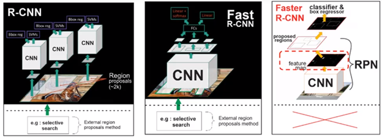
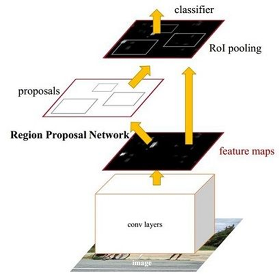
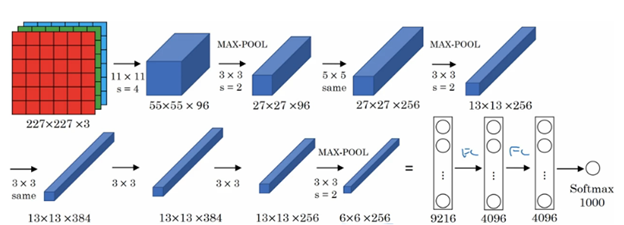
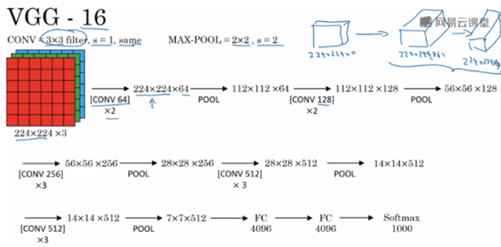
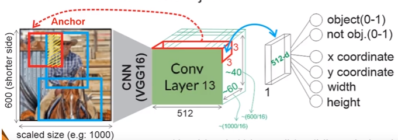
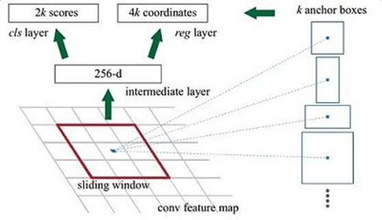
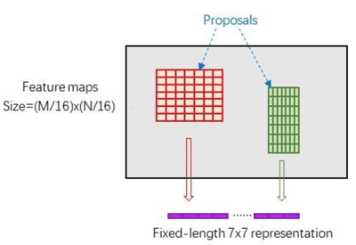
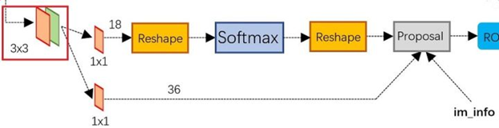

Faster R-CNN
============

-   [依赖知识](#FasterR-CNN-依赖知识)

-   [R-CNN、Fast R-cnn、FasterR-CNN比较](#FasterR-CNN-R-CNN、FastR-cnn、FasterR-CNN)

-   [总体步骤](#FasterR-CNN-总体步骤)

    -   [卷积层（conv layers）](#FasterR-CNN-卷积层（convlayers）)

    -   [区域建议网络（region proposal network)](#FasterR-CNN-区域建议网络（regionproposalnetwor)

    -   [感兴趣区域池化（ROI pooling）](#FasterR-CNN-感兴趣区域池化（ROIpooling）)

    -   [分类和回归（classification&regression）](#FasterR-CNN-分类和回归（classification&regres)

-   [关键点](#FasterR-CNN-关键点)

    -   [anchors](#FasterR-CNN-anchors)

    -   [rpn网络](#FasterR-CNN-rpn网络)

-   [论文中结论总结](#FasterR-CNN-论文中结论总结)

-   [疑问点](#FasterR-CNN-疑问点)

           Faster R-CNN论文地址：<https://arxiv.org/pdf/1506.01497.pdf>。Faster
R-CNN最大的问题是关键的RPN网络论文没有详细的描述;网上资料要么像论文一样，也忽略了详细说明；要么就是有不同的说法,无法甄别。不过论文给了开源的代码。估计需要结合代码才能把关键的RPN弄明白。本文参考：[一文读懂Faster R-CNN细节](https://zhuanlan.zhihu.com/p/31426458)，[Faster RCNN youtube](https://www.youtube.com/watch?v=v5bFVbQvFRk&index=1&list=PLkRkKTC6HZMzp28TxR_fJYZ-K8Yu3EQw0&pbjreload=10)

依赖知识
--------

    a） 已经熟悉R-CNN、Fast R-CNN

    b )  了解预训练、迁移学习

R-CNN、Fast R-cnn、Faster R-CNN比较
-----------------------------------

R-CNN：首先生成约2000个‘区域建议’，针对每个区域建议训练feature map，通过feature
map分别训练分类器和图片边框；

Fast R-CNN：首先生成约2000个‘区域建议’，针对整张图片训练feature
map，将所有‘区域建议’投射到feature map上形成proposal feature map，使用proposal
feature map一站式训练分类器和图片边框；

Faster R-CNN：针对整张图片训练feature map，使用feature
map通过区域建议网络生成约2K‘区域建议’，将所有‘区域建议’投射到feature
map上形成proposal feature map，使用proposal feature
map一站式训练分类器和图片边框。

总体步骤
--------

Faster R-CNN包括4个部分：卷积层（conv layers）、区域建议网络（region proposal
network)、感兴趣区域池化（ROI
pooling）、分类和回归（classification&regression），见下图。Faster
R-CNN中除了区域建议网络（region proposal network)，其他3部分都与Faster
R_CNN一样。

 

### 卷积层（conv layers）

该步骤旨在通过CNN网络训练出feature
map，该卷积层可以是任何CNN图片分类网络，论文中测试了AlexNet(下图图左）和VGG166(下图图右边）

输入图片大小统一为1000\*600，图片共20类。以训练/预训练VGG-16为例，需要将最后softmax1000个类别输出改为20。单张训练图片经过VGG-16的13个卷积层和5个池化层后，大小变为\~60\*\~40\*512，这同时也是我们需要的feature
map。

### **区域建议网络（region proposal network)**

区域建议网络旨在通过conv layer的feature
map在原图的基础上训练出‘区域建议’，也就是可能包含目标的region
proposal。区域建议网络实现步骤如下：

1、在60\*40\*512 feature
map的基础上做3\*3的same卷积（猜测有512个滤波器，卷积后apply
relu函数），对于60\*40中的每一个pixel，找到原始图片上对应的部分，并在该部分覆盖9个anchor，anchor的形状见下图图右。该步骤可产生\~2w（60\*40\*9）个anchors；

2、去除超出原始图片区域的anchors，剩余\~6000个anchors；

3、对于前景最高得分anchor，通过非极大抑制法删除与起、其IOU\>0.7的anchor，剩余\~2000个anchors；

4、区域建议网络训练

-   网络自变量：2000个anchor样本，512维feature

-   网络因变量：anchor中有无目标、anchor位置大小x、y、w、h

-   正样本：与Ground Truth 的IOU\>0.7; 负样本：与Ground Truth 的IOU\<0.3

-   batch_size = 256, 128正样本，128负样本，正样本少于128时用负样本补全

**RPN loss**

$L(p_i, t_i) = \underbrace{\frac 1 {N_{cls}} \sum_iL_{cls}(p_i, p^*_i)}_{object/no\ object\ classifier} + \underbrace{\lambda \frac 1 {N_{reg}} \sum_i p^*_iL_{reg}(t_i, t^*_i)}_{box\  regressor} $

对于anchor中有无目标的分类，分数输出采用的是softmax函数。损失函数标注如下：

-   $p^*_i$：真实分类标签，0或1

-   $p_i$: 预测分类标签，0或1

-   ${N_{cls}}$：batch size

对于region proposal位置大小x、y、w、h的回归，损失函数标注如下：

-   $t_i$：从region proposal 到预测ground truth变换的4个预测参数，i=x,y,w,h

-   $t^*_i$ ：从region proposal 到ground truth变换的4个真实参数，i=x,y,w,h

-   $N_{reg}$：建议区域个数，～2000

​       $t_x = (x - x_a)/w_a, \      t_y =(y - y_a)/h_a$,

​       $t_w = log(w/w_a),\  t_h = log(h/h_a)$

​       $t_x^* = (x^* - x_a)/w_a, \      t_y^* =(y^* - y_a)/h_a$,

​       $t_w^* = log(w^*/w_a),\  t_h = log(h^*/h_a)$

### 感兴趣区域池化（ROI pooling）

RoI Pooling层将RPN输出的proposal boxes映射到feature
map中，并resize到7x7大小（借鉴  Spatial Pyramid Pooling
空间金字塔池化思想），feed到后续网络。

### **分类和回归（classification&regression）**

-   分类：利用已经获得的proposal feature maps，通过full
    connect层与softmax计算每个proposal具体属于那个类别（如人，车，电视等），输出cls_prob概率向量；

-   回归：再次利用bounding box
    regression获得每个proposal的位置偏移量，获得更加精确的目标检测框。

关键点
------

### anchors

 anchors是非常关键的点，在工程中对于每个卷积网络中最后一层特征图中的每个点(锚点)都产生9个anchors(固定如下)。其中每行的4个值[x1,y1,x2,y2]代表矩形左上和右下角点坐标。9个矩形共有3种形状，长宽比为大约为：[width:height](http://widthheight)
= [1:1, 1:2,
2:1]三种，如图6。实际上通过anchors就引入了检测中常用到的多尺度方法。

 最终的anchors其实是最后一层特征图中的锚点映射到原始图像中的点作为中心点；如下的9个区域坐标代表形状的矩形区域。

[[ -84. -40. 99. 55.]

[-176. -88. 191. 103.]

[-360. -184. 375. 199.]

[ -56. -56. 71. 71.]

[-120. -120. 135. 135.]

[-248. -248. 263. 263.]

[ -36. -80. 51. 95.]

[ -80. -168. 95. 183.]

[-168. -344. 183. 359.]]

### rpn网络

        

   左图是论文中的原图，较为抽象，右图是根据工程代码画的图。

解释一下上面这数字。

1.  在原文中使用的是ZF model中，其Conv
    Layers中最后的conv5层num_output=256，对应生成256张特征图，所以相当于feature
    map每个点都是256-dimensions

2.  在conv5之后，做了rpn_conv/3x3卷积且num_output=256，相当于每个点又融合了周围3x3的空间信息，同时256-d不变

3.  假设在conv5 feature
    map中每个点上有k个anchor（默认k=9），而每个anhcor要分foreground和background，所以每个点由256d
    feature转化为cls=2k
    scores(对每个类都预测前景和背景，不是直接预测哪个类)；而每个anchor都有[x, y,
    w, h]对应4个偏移量，所以reg=4k coordinates。

 可以看到RPN网络实际分为2条线，上面一条通过softmax分类anchors获得foreground和background（检测目标是foreground），下面一条用于计算对于anchors的bounding
box
regression偏移量，以获得精确的proposal。而最后的Proposal层则负责综合foreground
anchors和bounding box
regression偏移量获取proposals，同时剔除太小和超出边界的proposals。其实整个网络到了Proposal
Layer这里，就完成了相当于目标定位的功能。

论文中结论总结
--------------

1.  proposal生成方法按准确度排序：RPN+VGG \> RPN+AlexNet \> Selective search；

2.  proposal生成方法按生成时间排序：Selective search \>
    RPN+VGG \> RPN+AlexNet ；

3.  基于proposal的有无物体得分，对propoal进行非极大值抑制不会降低准确率；

4.  RPN的Regression layer是准确生成proposal的关键；

5.  RPN和faster R-cnn detector共享参数的MAP优于不共享参数的MAP；

6.  使用RPN方法，训练时每张图选取top300个proposal即可保障准确率；

7.  anchors的设置使用3个scale和3个ratios时MAP最优；

8.  RPN loss中回归的权重λ取值大小对MAP影响不大

疑问点
------

1：rpn预测分类，为什么预测前景和背景评分？由于使用二分类预测，只需要预测前景概率评分即可，背景概率评分=1-前景概率评分。

可能原因：在论文中，背景与前景预测分类用的是softmax，不是逻辑回归，故前景和背景评分都是softmax函数的计算输出的，不是通过背景概率评分=1-前景概率评分算出来的

## 关于我们

我司正招聘文本挖掘、计算机视觉等相关人员，欢迎加入我们；也欢迎与我们在线沟通任何关于数据挖掘理论和应用的问题；

在长沙的朋友也可以线下交流, 坐标: 长沙市高新区麓谷新长海中心 B1栋8A楼09室

公司网址：http://www.embracesource.com/

Email: mick.yi@embracesource.com 或 csuyzt@163.com

