Faster R-CNN: Towards Real-Time Object Detection with Region Proposal Networks
============

[TOC]

## 摘要

​        最先进的目标检测网络依靠region proposal算法来假设目标的位置。SPPnet[1]和Fast R-CNN[2]等进展已经**减少**了这些**检测网络的运行时间**，暴露**region proposal计算**成为一个**瓶颈**。在这项工作中，我们引入了一个region proposal网络(RPN)，该网络与**检测网络** **共享整个图像的卷积特征**，从而使近乎零成本的region proposals成为可能。RPN是一个**全卷积网络**，可以**同时**在每个位置预测**目标边界**和**目标分数**。RPN通过**端到端**的训练，可以生成高质量的region proposals，由Fast R-CNN用于检测。我们将RPN和Fast R-CNN通过共享卷积特征进一步合并为一个单一的网络——使用最近流行的神经网络术语**“注意力”机制**，RPN组件告诉统一的网络**看哪里**。对于非常深的VGG-16模型[3]，我们的检测系统在GPU上的帧率为5fps(包括所有步骤)，同时在PASCAL VOC 2007，2012和MS COCO数据集上实现了state-of-the-art的目标检测精度，每个图像只有300个proposal。在ILSVRC和COCO 2015竞赛中，Faster R-CNN和RPN在多个比赛中获得第一名的记录。代码可公开获得。

 Faster R-CNN论文地址：<https://arxiv.org/pdf/1506.01497.pdf>。

## 依赖知识

    a) 已经熟悉R-CNN、Fast R-CNN

    b )  了解预训练、迁移学习

​    c )   感受野的计算

## 知识点

### 超像素

​        在图像中由一系列位置相邻且颜色、亮度、纹理等特征相似的像素点组成的小区域，这些小区域大多保留了进一步进行图像分割的有效信息，且一般不会破坏图像中物体的边界信息。

## 1. 介绍

​        目标检测的最新进展由**region proposal方法**(例如[4])和**基于区域的卷积神经网络**(R-CNN)[5]成功驱动。尽管在[5]中最初开发的基于区域的CNN计算成本很高，但是由于跨proposal共享卷积，所以其成本已经大大降低了[1]，[2]。*忽略花费在region proposal上的时间*，最新典型代表:Fast R-CNN[2]利用非常深的网络[3]实现了接近实时的速率。现在，**proposals**是state-of-the-art检测系统**预测时**的**计算瓶颈**。

​        region proposal方法通常依赖廉价的特征和经济的推理方案。selective search[4]是最流行的方法之一，它贪婪地合并基于**工程的低级特征** **超像素**。然而，与高效的检测网络[2]相比，selective search速度慢了一个数量级，在CPU实现中每张图像的耗时为**2**秒。EdgeBoxes[6]目前提供了在proposal**质量**和**速度**之间的**最佳权衡**，每张图像0.2秒。尽管如此，region proposal步骤仍然像检测网络那样**消耗同样多的运行时间**。

​       有人可能会注意到，基于区域的快速**CNN利用了GPU**，而在研究中使用的region proposal方法在**CPU**上实现，使得运行时间比较不公平。加速region proposal计算的一个显而易见的方法是将其**在GPU上重新实现**。这可能是一个有效的工程解决方案，但重新实现忽略了下游检测网络，因此**错过了共享计算**的重要机会。

​        在本文中，我们展示了算法的改变——用深度卷积神经网络计算region proposal——导致了一个优雅而有效的解决方案，在给定检测网络计算的情况下**region proposal计算成本接近零**。为此，我们引入了新的*region proposal网络*(RPN)，它与state-of-the-art目标检测网络**共享卷积层**[1]，[2]。测试时，通过共享卷积，计算region proposal的**边际成本很小**(例如，每张图像10ms)。

​        我们的观察是，基于区域的检测器所使用的卷积feature maps，如Fast R-CNN，也可以用于生成region proposal。在这些卷积特征之上，我们通过**添加一些额外的卷积层来构建RPN**，这些卷积层同时在规则网格上的每个位置上**回归区域边界**和**目标评分**。因此RPN是一种**全卷积网络**(FCN)[7]，可以针对**生成检测proposals**的任务进行**端到端的训练**。

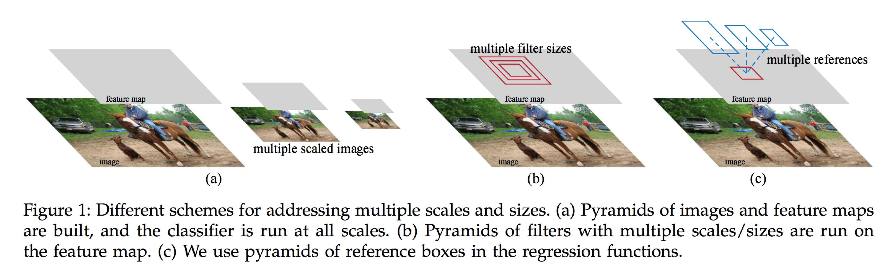

​        RPN旨在有效预测具有广泛尺寸和长宽比的region proposal。与使用**图像金字塔**(图1，a)或**滤波器金字塔**(图1，b)的流行方法[8]，[9]，[1]相比，我们引入新的“**anchor**”边框作为多种尺寸和长宽比的参考。我们的方案可以被认为是回归参照金字塔(图1，c)，它避免了枚举**多种尺寸或长宽比**的图像或滤波器。这个模型在使用单尺寸图像进行训练和测试时表现良好，从而有利于运行速度。

​        为了统一RPN与Fast R-CNN 2]目标检测网络，我们提出了一种训练方案，交替进行**精调region proposal**任务，然后保持region proposal的固定，**精调目标检测**。该方案快速收敛，并产生两个任务之间**共享卷积特征**的**统一网络**。

​        我们在PASCAL VOC检测基准数据集上[11]综合评估了我们的方法，其中使用RPN的Fast R-CNN的检测精度优于使用Selective Search的Fast R-CNN这个强基准。同时，我们的方法在测试时几乎免除了selective search的所有计算负担——**region proposal的实际运行时间**仅为**10毫秒**。使用昂贵的非常深的模型[3]，我们的检测方法在GPU上仍然具有5fps的帧率(包括所有步骤)，因此在**速度和精度上**是实用的目标检测系统。我们还报告了在MS COCO数据集上[12]的结果，并研究了使用COCO数据 改进PASCAL VOC。代码可公开获得<https://github.com/shaoqingren/faster_rcnn>(MATLAB)和<https://github.com/rbgirshick/py-faster-rcnn>(Python)。

​        这个手稿的基础版本是以前发表的[10]。从那时起，RPN和Faster R-CNN的框架已经被**采用并推广到其他方法**，如3D目标检测[13]，part-based检测[14]，实例分割[15]和image captioning[16]。我们快速和有效的目标检测系统也已经内置到商业系统中了,如Pinterest[17]，并报告了用户参与度的改进。

​       在ILSVRC和COCO 2015竞赛中，Faster R-CNN和RPN是ImageNet检测，ImageNet定位，COCO检测和COCO分割中几个第一名参赛作品[18]的基础。**RPN完全从数据中学习region proposal**，因此很容易从**更深、更具表达性**的特征(例如[18]中采用的101层残差网络)中获益。Faster R-CNN和RPN也被这些比赛中的其他几个主要参赛者所使用。这些结果表明，我们的方法不仅是一个**实用合算**的解决方案，而且是一个**提高目标检测精度**的**有效方法**。

## 2. 相关工作

### Object Proposals

​        有大量关于object proposal的文献。综合调查和比较object proposal方法可以在[19]，[20]，[21]中找到。广泛使用的object proposal方法包括基于**分组超像素**(例如，selective search[4]，CPMC[22]，MCG[23])和那些基于**滑动窗口**的方法(例如窗口中的目标[24]，EdgeBoxes[6])。object proposal方法做为**独立于检测器**(例如，selective search[4]目标检测器，R-CNN[5]和Fast R-CNN[2])的外部模块使用。

### 目标检测深度网络

​        R-CNN方法[5]端到端的训练CNN，将region proposal分类为目标类别或背景。**R-CNN**主要作为分类器，并**不能预测目标边界**(除了通过边框回归进行改进)。其精度取决于region proposal模块的性能(参见[20]中的比较)。一些论文提出了**使用深度网络**来**预测目标边框**的方法[25]，[9]，[26]，[27]。在OverFeat方法[9]中，训练一个全连接层来**预测**定位任务的**边框坐标**，来推断单个目标。然后将**全连接层变成卷积层**，用于**检测多个类别**的目标。MultiBox方法[26]，[27]从网络中生成region proposal，网络最后的全连接层同时预测**多个类别无关的边框**，并泛化了OverFeat“单边框”的方式。这些**类别无关的边框**当作R-CNN的region proposal[5]。与我们的全卷积方案相比，MultiBox proposal网络适用于单张图像裁剪或大图像的多个裁剪(例如224×224)。**MultiBox**在region proposal和检测网络之间**不共享特征**。稍后在我们的方法上下文中会讨论OverFeat和MultiBox。与我们的工作同时进行的，DeepMask方法[28]是为学习**分割proposal**而开发的。

​       **共享卷积计算**[9]，[1]，[29]，[7]，[2]已经越来越受到人们的关注，因为它可以有效而准确地进行视觉识别。OverFeat论文[9]计算**图像金字塔**的卷积特征用于分类，定位和检测。共享卷积feature maps的自适应大小池化(SPP)[1]被开发用于有效的**基于区域的目标检测**[1]，[30]和语义分割[29]。Fast R-CNN[2]能够在共享卷积特征上进行**端到端检测器训练**，并显示出**令人信服的精度和速度**。

## 3. FASTER R-CNN

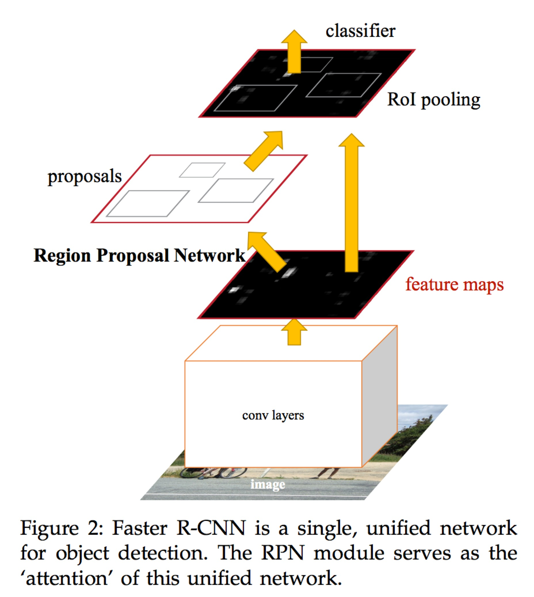

​        我们的目标检测系统，称为Faster R-CNN，由两个模块组成。第一个模块是**proposalregion**的深度全卷积网络，第二个模块是使用**proposal的region**的**Fast R-CNN检测器**[2]。整个系统是一个单个的，统一的目标检测网络(图2)。使用最近流行的神经网络术语“注意力”[31]机制，RPN模块告诉Fast R-CNN模块**看哪里**。在第3.1节中，我们介绍了region proposal网络的设计和特性。在第3.2节中，我们开发了**训练**带特征共享的**两个模块的算法**。

### 3.1 region proposal网络

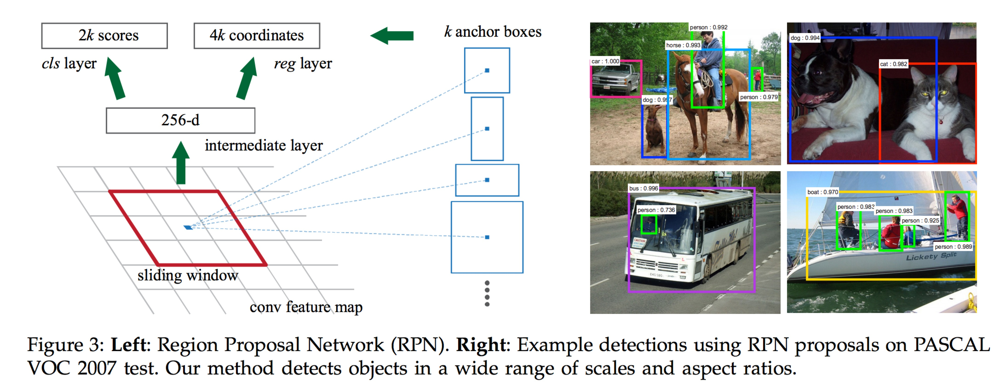

​        region proposal网络(RPN)以任意大小的图像作为输入，输出一组矩形的object proposals，每个proposal都有一个目标得分。我们用**全卷积网络**[7]对这个过程进行**建模**，这将在本节进行描述。因为我们的最终目标是与Fast R-CNN目标检测网络[2]**共享计算**，所以我们假设**两个网络共享一组共同的卷积层**。在我们的实验中，我们研究了具有**5个共享卷积层**的Zeiler和Fergus模型[32]和具有**13个共享卷积层**的Simonyan和Zisserman模型[3]。

​        为了生成region proposal，我们在最后的共享卷积层输出的卷积feature map上**滑动一个小网络**。这个小网络将输入卷积feature map的**n×n空间窗口**作为输入。每个滑动窗口**映射到一个低维特征**(ZF为256维，VGG为512维，后面是ReLU[33])。这个特征被输入到两个兄弟全连接层——一个**边框回归层**(reg)和一个**边框分类层**(cls)。在本文中，我们使用n=3，注意输入图像上的实际**感受野是很大**的(ZF和VGG分别为171和228个像素)。图Figure 3(左)描述了这个小型网络的一个位置。请注意，因为小网络以滑动窗口方式运行，所有**空间位置共享全连接层**(其实就是卷积层)。这种架构通过**一个n×n卷积层**，后面是**两个1×1卷积层**(分别用于reg和cls)自然地实现。

#### 3.1.1 Anchors

​        在每个滑动窗口位置，我们同时预测多个region proposal，其中每个位置可能proposals的最大数目表示为k。因此，*reg*层具有4k个输出，**编码k个边框的坐标**，*cls*层输出**2k个分数**，估计每个proposal是**目标或不是目标的概率**。k个proposals**根据** 我们称之为**anchors**的k个边框 **参数化**。anchor位于所讨论的滑动窗口的中心，并与一个尺寸和长宽比相关(图Figure 3左)。默认情况下，我们使用3个尺寸和3个长宽比，在每个滑动位置产生k=9个anchor。对于大小为W×H(通常约为2400)的卷积feature map，总共有WHk个anchors。

##### 平移不变的Anchors

​        我们的方法的一个重要特性是它是***平移不变***的，无论是在anchor还是根据anchor计算region proposal的函数。如果在图像中平移目标，**proposal应该平移**，并且同样的函数应该**能够在任一位置预测proposal**。我们的方法保证了**平移不变特性**。作为比较，MultiBox方法[27]使用k-means生成800个anchors，这不是平移不变的。所以如果平移目标，MultiBox不保证会生成相同的proposal。

​      **平移不变性**也**减小了模型的大小**。MultiBox有(4+1)×800维的全连接输出层，而我们的方法在k=9个anchor的情况下有(4+2)×9维的卷积输出层。因此，对于VGG-16，我们的输出层具有$2.8×10^4$个参数(对于VGG-16为512×(4+2)×9)，比MultiBox输出层的$6.1×10^6$个参数**少了两个数量级**(对于MultiBox [27]中的GoogleNet[34]为1536×(4+1)×800)。如果考虑到特征投影层，我们的proposal层仍然比MultiBox少一个数量级。我们期望我们的方法在如PASCAL VOC等小数据集上有**更小的过拟合风险**。

##### 多尺寸Anchors作为回归参考

​        我们的anchor设计提出了一个新的方案来解决多尺寸(和长宽比)。如图Figure 1所示，多尺寸预测有两种流行的方法。第一种方法是基于**图像/特征金字塔**，例如DPM[8]和基于CNN的方法[9]，[1]，[2]中。图像在多个尺寸上进行缩放，并且针对每个尺寸(图Figure 1(a))计算feature map(HOG[8]或深卷积特征[9]，[1]，[2])。这种方法通常是**有用**的，但是**非常耗时**。第二种方法是在feature map上使用**多尺寸**(和/或长宽比)的**滑动窗口**。例如，在DPM[8]中，使用不同的滤波器大小(例如5×7和7×5)分别对不同长宽比的模型进行训练。如果用这种方法来解决多尺寸问题，可以把它看作是一个“**滤波器金字塔**”(图1(b))。第二种方法通常与第一种方法联合采用[8]。

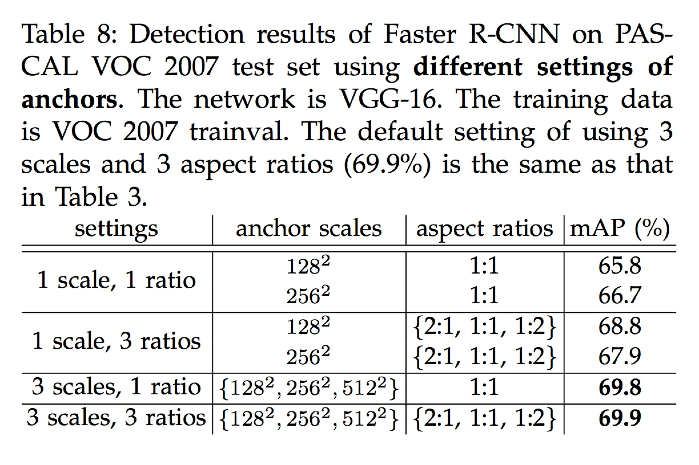

​        作为比较，我们的基于anchor的方法建立在**anchors金字塔**上，这**更划算**。我们的方法**分类和回归** 多尺寸和长宽比的**anchors边框**。它只依赖**单一尺寸的图像和feature map**，并使用**单一尺寸的滤波器**(feature map上的滑动窗口)。我们通过实验来展示这个方案解决**多尺寸和大小**的效果(表Table 8)。

​       由于这种基于anchors的多尺寸设计，我们可以简单地使用在**单尺寸图像**上计算的卷积特征，Fast R-CNN检测器也是这样做的[2]。多尺寸anchors设计是共享特征的关键组件，**不需要额外的成本来处理尺寸**。

#### 3.1.2 损失函数

​        为了训练RPN，我们为每个anchor分配一个二值类别标签(是目标或不是目标)。我们给两种anchors分配一个正标签：(i)与ground-truth边框有最高交并比(IoU)的anchor，或者(ii)与ground-truth的IoU超过0.7 的anchor。注意，**单个ground-truth边框**可以为**多个anchors分配正标签**。通常第二个条件足以确定正样本；但我们仍然采用第一个条件，因为在一些极少数情况下，第二个条件可能找不到正样本。对于，如果一个anchor**与所有的ground-truth边框的IoU比率低于0.3**，我们给这个**非正的anchor分配一个负标签**。既不正面也不负面的anchor**不会贡献到训练目标函数**。

​       根据这些定义，我们按照Fast R-CNN[2]中的多任务损失最小化一个目标函数。我们对图像的损失函数定义为：
$$
L(\{p_i\},\{t_i\})=\frac 1 {N_{cls}}\sum_i L_{cls}(p_i,p^∗_i)+λ \frac 1 {N_{reg}}\sum_ip^∗_i L_{reg}(t_i,t^∗_i) \ \tag 1
$$
​        这里，i是一个mini-batch数据中anchor的索引，$p_i$是anchor i作为**预测为目标的概率**。如果anchor为正，ground-truth标签$p^*_i$为1，如果anchor为负，则为0。$t_i$是表示边框**4个参数化坐标**预测的向量，而$t^*_i$是与正anchor相关的ground-truth边界框的向量。**分类损失**$L_{cls}$是**两个类别上**(目标或不是目标)的**对数损失**。对于回归损失，我们使用$L_{reg}(t_i,t^*_i)=R(t_i−t^*_i)$，其中R是在[2]中定义的**鲁棒损失函数**(smooth L1)。$p^*_iL_{reg}$项表示回归损失仅对于**正anchors激活**，否则无效($p^*_i=0$)。cls和reg层的输出分别由{$p_i$}和{$t_i$}组成。

​        这两个项用$N_{cls}$和$N_{reg}$进行归一化，并由一个平衡参数λ加权。在我们目前的实现中(如在发布的代码中)，公式(1)中的cls项通过mini-batch数据的大小(即$N_{cls}=256$)进行归一化，reg项根据anchor位置的数量(即，$N_{reg}∼2400$)进行归一化。默认情况下，我们设置λ=10，因此*cls*和*reg*项的权重大致相等。我们通过实验显示，结果对宽范围的**λ值不敏感**(表Table 9)。我们还注意到，上面的**归一化不是必需的**，可以简化。

​       对于边框回归，我们采用[5]中4个坐标的参数化：

$$
t_x=(x−x_a)/w_a, \ \ \ t_y=(y−y_a)/h_a, \\ 
t_w=log(w/w_a),\ \ \ t_h=log(h/h_a), \\ 
t^*_x=(x∗−x_a)/w_a,\ \ \ t^*_y=(y∗−y_a)/h_a, \\
t^∗_w=log(w^∗/w_a),\ \ \ t^∗_h=log(h^∗/h_a), \tag 2
$$

​        其中，x，y，w和h表示边框的**中心坐标**及其**宽和高**。变量$x$，$x_a$和$x^*$分别表示预测边框，anchor边框和ground-truth边框(同样地对于y,w,h)。这可以被认为是**从anchor到邻近的ground-truth边框的回归**。

​        然而，我们的方法通过与之前的基于RoI(感兴趣区域)方法[1]，[2]**不同的方式来实现边框回归**。在[1]，[2]中，对任意大小的RoI池化的特征执行边框回归，并且回归权重由**区域所有的尺寸共享**。在我们的公式中，用于回归的特征**在feature map上** **具有相同的空间大小**(3×3)。为了对**不同的尺寸大小**负责，**学习一组k个边框回归器**。每个回归器负责一个尺寸和一个长宽比，而**k个回归器不共享权重**。因此，由于anchor的设计，即使**特征具有固定的尺寸/比例**，仍然**可以预测各种尺寸的边框**。

#### 3.1.3 训练RPN

​         RPN可以通过反向传播和随机梯度下降(SGD)[35]进行端对端训练。我们遵循[2]的“以图像为中心”的采样策略来训练这个网络。每个**mini-batch数据**都从包含许多正正样本和负样本anchors的**单张图像**中产生。**优化所有anchors**的**损失函数**进行是可能的，但是这样会**偏向于负样本**，因为**它们是占主导地位的**。取而代之的是，我们在图像中随机采样**256个anchors**，计算一个mini-batch数据的损失函数，其中采样的**正负anchors的比率**接近**1:1**。如果图像中的正样本少于128个，我们使用负样本填充mini-batch。

​       我们通过均值为0,标准差为0.01高斯分布随机初始化所有**新层的权重**。所有其他层(即共享卷积层)通过预训练的ImageNet分类模型[36]来初始化，如同标准实践[5]。我们**精调ZF网络的所有层**，以及**VGG网络的conv3_1及其之上的层**以节省内存[2]。在PASCAL VOC数据集上，我们使用0.001的学习率，迭代60k个mini-batches;使用0.0001下一个20k mini-batches。我们使用**0.9的动量**和**0.0005的权重衰减**[37]。我们的实现使用Caffe[38]。

### 3.2 RPN和Fast R-CNN共享特征

​        到目前为止，我们已经描述了如何训练用于region proposal生成的网络，没有考虑使用这些proposals的**基于区域的目标检测CNN**。对于检测网络，我们采用Fast R-CNN[2]。接下来我们介绍一些算法，学习由RPN和Fast R-CNN组成的具有共享卷积层的统一网络(图2)。

​        独立的训练RPN和Fast R-CNN将以不同的方式修改卷积层。因此，我们需要开发一种允许在两个网络之间共享卷积层的技术，而**不是学习两个独立的网络**。我们讨论3种方法来训练具有共享特征的网络：

(i)**交替训练**。在这个解决方案中，我们首先训练RPN，并使用这些proposal来训练Fast R-CNN。由Fast R-CNN精调的网络然后被用于初始化RPN，并且重复这个过程。这是本文所有实验中使用的解决方案。

(ii) **近似联合训练**。在这个解决方案中，RPN和Fast R-CNN网络在训练期间合并成一个网络，如图Figure 2所示。在每次SGD迭代中，**前向传递生成的region proposals**，在训练Fast R-CNN检测器将这看作是固定的、预计算的proposals。反向传播像往常一样进行，对于共享层，**组合来自RPN损失和Fast R-CNN损失的反向传播信号**。这个解决方案很容易实现。但是这个解决方案忽略了**关于proposal边框的坐标**(也是网络响应)**的导数**，因此是近似的。在我们的实验中，发现这个方案产生了**相当的结果**，与交替训练相比，**训练时间减少了大约25−50%**。这个解决方法包含在我们发布的Python代码中。

(iii) **非近似的联合训练**。如上所述，由RPN预测的边框也是输入的函数。Fast R-CNN中的RoI池化层[2]接受**卷积特征**以及**预测的边框**作为输入，所以理论上有效的反向传播求解器也**应该包括关于边框坐标的梯度**。在上述**近似联合训练**中，这些**梯度被忽略**。在一个非近似的联合训练解决方案中，我们需要一个**关于边框坐标可微**的**RoI池化层**。这是一个重要的问题，可以通过[15]中提出的“RoI变形”层给出解决方案，这超出了本文的范围。

#### 4-Step交替训练

​        在本文中，我们采用实用的四步训练算法，通过交替优化学习共享特征。在第一步中，我们按照3.1.3节的描述训练RPN。该网络使用ImageNet的预训练模型进行初始化，并针对region proposal任务进行了端到端的精调。在第二步中，我们使用由第一步RPN生成的proposal，由Fast R-CNN训练单独的检测网络。该检测网络也由ImageNet的预训练模型进行初始化。**此时两个网络不共享卷积层**。在第三步中，我们使用**检测器网络来初始化RPN训练**，但是我们**固定共享的卷积层**，并且只对**RPN特有的层进行精调**。现在这两个网络共享卷积层。最后，保持**共享卷积层的固定**，我们**对Fast R-CNN的独有层进行精调**。因此，两个网络共享相同的卷积层并形成统一的网络。类似的交替训练**可以运行更多的迭代**，但是我们只观察到**微不足道的提升**。

### 3.3 实现细节

​       我们在**单尺寸图像**上训练和测试**region proposal**和**目标检测网络**[1]，[2]。我们重新缩放图像，使得它们的短边是s=600像素[2]。多尺寸特征提取(使用图像金字塔)可能会提高精度，但不会表现出速度与精度的良好折衷[2]。在重新缩放的图像上，最后卷积层上的ZF和VGG网络的**总步长为16个像素**，典型的PASCAL图像调整之前(〜500×375)，因此实际总步长为**约为10个像素**，即使如此大的步长也能提供良好的效果，尽管步长更小，精度可能会进一步提高。

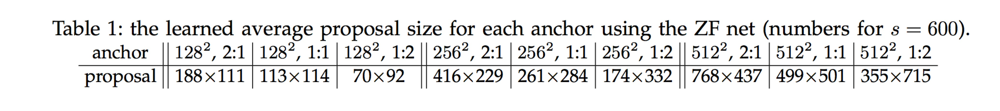

​        对于anchors，我们使用了3种尺寸，边框面积分别为$128^2$，$256^2$和$512^2$个像素，以及1:1，1:2和2:1 3种长宽比。这些超参数**不是针对特定数据集仔细选择的**，我们将在下一节中提供有关其作用的消融实验。如上所述，我们的解决方案**不需要图像金字塔**或**滤波器金字塔**来**预测多个尺寸的区域**，节省了大量的运行时间。图Figure 3(右)显示了我们的方法在广泛的尺寸和长宽比方面的能力。表Tabile 1显示了使用ZF网络的每个anchor学习到的平均proposal大小。我们注意到，我们的算法允许**预测出比潜在感受野更大的目标**。这样的预测不是不可能的——如果**只有目标的中间部分是可见的**，那么仍然可以粗略地推断出目标的范围。

​       跨越图像边界的anchors 边框需要小心处理。在**训练过程中**，我们**忽略了所有的超出图像边界anchors**，所以不会贡献损失。对于一个典型的1000×600的图像，总共会有大约20000(≈60×40×9)个anchor。跨界anchor忽略后，每张图像**约有6000个anchors用于训练**。如果训练时**不忽略越界异常得anchors**，则会在目标函数中引入**大的，难以纠正的误差项**，且训练不会收敛。但在测试过程中，我们仍然将全卷积RPN应用于整张图像。这可能会产生跨边界的proposal边框，我们**裁剪到图像边界**。

​        一些RPN proposal互相之间高度重叠。为了减少冗余，我们使用*cls*分数对region proposal采取非极大值抑制(NMS)。我们将NMS的IoU阈值固定为**0.7**，这就给每张图像留下了**大约2000个region proposal**。正如我们将要展示的那样，**NMS不会损害最终的检测准确性**，但会**大大减少proposal的数量**。在NMS之后，我们使用前N个region proposal来进行检测。接下来，我们使用**2000个RPN proposal对Fast R-CNN进行训练**，但在测试时，**评估不同数量的proposals**。(注:测试时的proposals数量是300)

## 4. 实验

### 4.1 PASCAL VOC上的实验

​        我们在PASCAL VOC 2007检测基准数据集[11]上全面评估了我们的方法。这个数据集包含20个目标类别上大约**5000张训练评估**图像**和5000张测试**图像。我们还提供了一些在PASCAL VOC 2012基准数据集上的**模型测试结果**。对于ImageNet预训练网络，我们使用具有5个卷积层和3个全连接层的ZF网络[32]的“fast”版本以及具有13个卷积层和3个全连接层的公开的VGG-16模型[3]。我们**主要评估检测的平均精度均值**(mAP)，因为这是**检测目标的实际指标**(而不是关注object proposal代理度量)。

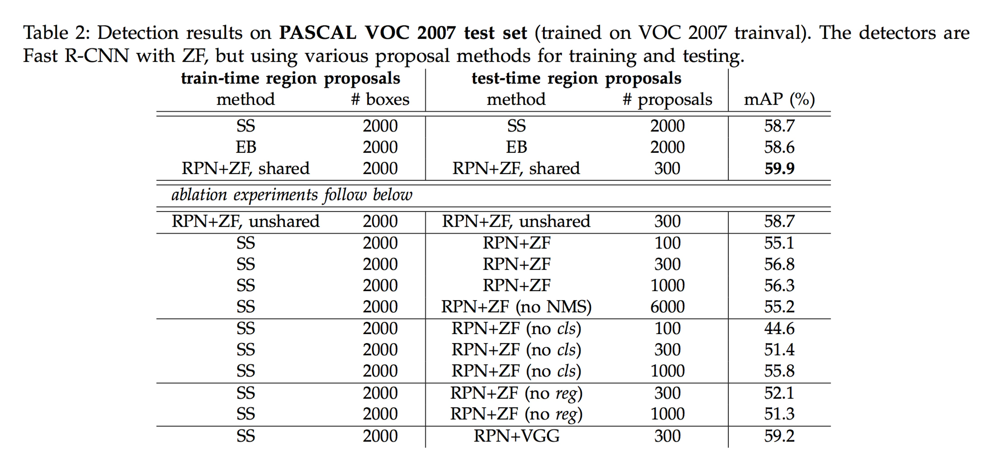

​       表Table 2(顶部)显示了使用各种region proposal方法进行训练和测试的Fast R-CNN结果。这些结果检测网络使用ZF网络。对于Selective Search(SS)[4]，我们通过“fast”模式生成约2000个proposal。对于EdgeBoxes(EB)[6]，我们通过调整默认EB设置IoU为0.7 生成proposals。SS在Fast R-CNN框架下的mAP为58.7%，EB的mAP为58.6%。RPN与Fast R-CNN取得了有竞争力的结果，使用300个proposal，mAP为59.9%。由于共享卷积计算，**使用RPN**比使用SS或EB**产生了一个更快的检测系统**；**较少的proposals**也减少了**分区域**(region-wise)的全连接层成本(表Table 5)。

#### RPN上的消融实验

​       为了研究RPN作为proposal方法的性能，我们进行了几项消融研究。首先，我们显示了RPN和Fast R-CNN检测网络共享卷积层的效果。为此，我们在四步训练过程的第二步之后停止训练。使用单独的网络将结果略微减少到58.7%(RPN+ZF，非共享，表Table 2)。我们观察到，这是因为在第三步中，当使用**检测器精调的特征来精调RPN时**，**proposal质量得到了改善**。

​       接下来，我们分析RPN对训练Fast R-CNN检测网络的影响。为此，我们通过使用2000个SS proposal和ZF网络来训练Fast R-CNN模型。我们固定这个检测器，并通过**改变测试时**使用的**region proposals  **来评估检测的mAP。在这些**消融实验中**，**RPN不与检测器共享特征**。

​       在测试阶段用300个RPN proposal替换SS proposal得到了56.8%的mAP。mAP的损失是因为训练/测试proposal不一致。**这个结果作为以下比较的基准**。

​       有些令人惊讶的是，RPN在测试时使用排名最高的100个proposal仍然会导致有竞争力的结果(55.1%)，表明排名靠前的RPN proposals是精准的。另一个极端，使用排名靠前的6000个RPN proposals(无NMS)具有相当的mAP(55.2%)，**这表明NMS不会损害检测mAP并可能减少误报**。

​       接下来，我们通过在测试时**分别关闭**RPN的***cls***和***reg***输出来调查RPN的作用。当*cls*层在测试时被移除(**因此不使用NMS/排名**)，我们从未评分的区域中**随机采样N个proposals**。当N=1000(55.8%)时，mAP几乎没有变化，但是当N=100时，会大大降低到44.6%。这表明***cls* 评分对排名最高的proposal的准确性负责**。

​       另一方面，当在测试阶段移除*reg*层(所以proposals变成anchor边框)时，mAP将下降到52.1%。这表明**高质量的proposals主要是由于对边框做了回归**。anchor边框虽然具有多个尺寸和长宽比，但**不足以进行准确的检测**。

​        我们还单独评估了更强大的网络对RPN proposal质量的影响。我们使用VGG-16来训练RPN，仍然使用上述的SS+ZF检测器。mAP从56.8%(使用RPN+ZF)提高到59.2%(使用RPN+VGG)。这是一个很有前景的结果，因为这表明RPN+VGG的proposal质量要好于RPN+ZF。由于**RPN+ZF的proposal与SS相当**(当一致用于训练和测试时，都是58.7%)，所以我们可以预期**RPN+VGG比SS更好**。以下实验验证了这个假设。

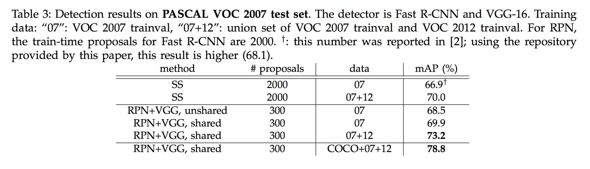

#### VGG-16的性能

​        表Table 3显示了VGG-16的**proposal和检测**结果。使用RPN+VGG，非共享特征的结果是68.5%，略高于SS的基准。如上所示，这是因为RPN+VGG生成的proposal比SS更精确。与预先定义的SS不同，RPN是主动训练的并**可以从更好的网络中受益**。对于特征共享的变种，结果是69.9%——**比SS强基准更好**，但几**乎是零成本的proposal**。我们在PASCAL VOC 2007和2012的训练评估数据集上进一步训练RPN和检测网络。该mAP是73.2%。图Figure 5显示了PASCAL VOC 2007测试集的一些结果。在PASCAL VOC 2012测试集(表Table 4)中，我们的方法在VOC 2007的`trainval+test`和VOC 2012的`trainval`的联合数据集上训练的模型取得了70.4%的mAP。表Table 6和表Table 7显示了详细的数字。

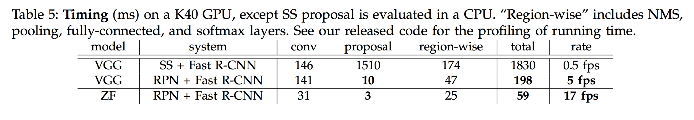

​        在表Table 5中我们总结了**整个目标检测系统的运行时间**。根据图像内容不同SS需要1-2秒(平均大约1.5s)，而使用VGG-16的Fast R-CNN在2000个SS proposal上需要320ms(如果在全连接层上使用SVD[2]，则需要223ms)。我们的VGG-16系统**在proposal和检测上总共需要198ms**。在共享卷积特征的情况下，**单独的RPN只需要10ms**计算附加层。我们的**区域计算也较低**，这要归功于**较少的proposals**(每张图像300个)。使用ZF网络的系统，帧率为17fps。

#### 对超参数的敏感度

​       在表Table 8中，我们研究anchors的设置。默认情况下，我们使用3个尺寸和3个长宽比(表69.9%的mAP)。如果在每个位置只使用一个anchor，那么mAP的下降幅度将是3−4%。如果使用3个尺寸(1个长宽比)或3个长宽比(1个尺寸)，则mAP更高，表明使用多种尺寸的anchors作为回归参考是有效的解决方案。在这个数据集上，仅使用**1个长宽比、3个尺寸(69.8%)**与使用**3个长宽比、3个尺寸一样好**，这表明尺寸和长宽比**不是检测准确度的解决维度**。但我们仍然在设计中**采用这两个维度**来保持我们的系统**灵活性**。

​        在表Table 9中，我们比较了公式(1)中λ的不同值。默认情况下，我们使用λ=10，这使方程(1)中的两个项在归一化之后大致相等地加权。表9显示，当λ在大约两个数量级(1到100)的范围内时，我们的结果只是稍微受到影响(∼1%∼1%)。这表明结果对宽范围内的**λ不敏感**。

#### IoU召回率分析

​       接下来，我们使用ground-truth边框来计算不同IoU比率的proposals召回率。值得注意的是，**Recall-to-IoU度量**与最终的检测精度的**相关性弱**[19,20,21]。使用这个指标来**诊断proposal**方法比**评估proposal**方法**更合适**。

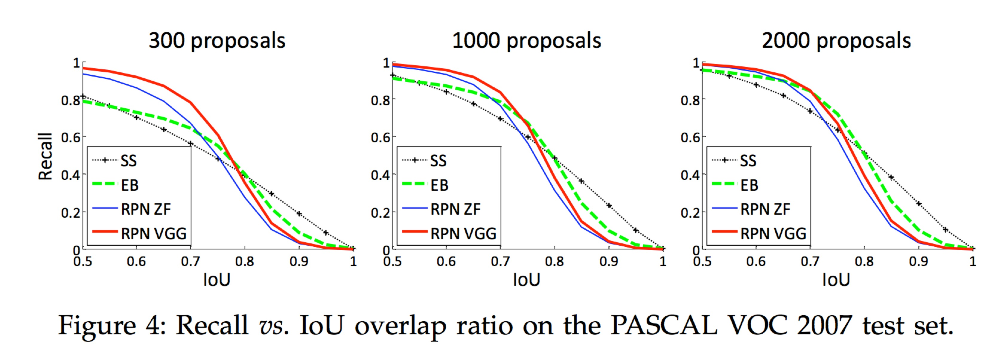

​        在图Figure 4中，我们显示了使用300，1000和2000个proposal的结果。我们与SS和EB进行比较，N个proposal是根据这些方法产生的置信度排名前N的proposal。从图中可以看出，当proposal数量从2000个减少到300个时，RPN方法表现优雅。这就解释了为什么**RPN在使用300个proposal时具有良好的最终检测mAP**。正如我们之前分析过的，这个属性主要归因于RPN的*cls*项。当proposals较少时，**SS和EB的召回率下降的比RPN更快**。

#### 一阶段检测 vs 两阶段Proposal+检测

​        OverFeat论文[9]提出了一种在卷积feature map的滑动窗口上使用回归器和分类器的检测方法。OverFeat是一个一阶段，类别相关的检测流程，而我们的是两阶段级联，包括类别无关的proposal和类别相关的检测。在OverFeat中，**分区域**的特征来自**一个尺寸金字塔**上**单长宽比**的滑动窗口。这些特征用于同时确定目标的**位置和类别**。在RPN中，这些特征来自正方形(3×3)滑动窗口，并且预测**不同尺寸和长宽比anchors** **关联的proposals**。虽然这两种方法都使用滑动窗口，但region proposals任务只是Faster R-CNN的第一阶段——下游的Fast R-CNN检测器会致力于对proposals进行改善。在我们级联的第二阶段，来自proposals边框的分区域的特征自适应地池化[1]，[2]，更好的覆盖区域的特征。我们相信**这些功能会带来更准确的检测结果**。

​        为了比较一阶段和两阶段系统，我们通过一阶段Fast R-CNN来模拟OverFeat系统(从而也规避了实现细节的其他差异)。在这个系统中，“proposals”是3个尺寸(128，256，512)和3个长宽比(1:1，1:2，2:1)的密集滑动窗口。训练Fast R-CNN从这些滑动窗口中预测**类别相关的评分**和**回归边框位置**。由于OverFeat系统采用图像金字塔，我们也使用从**5种尺寸图像**中提取的卷积特征进行评估。我们使用[1]，[2]中5种尺寸。

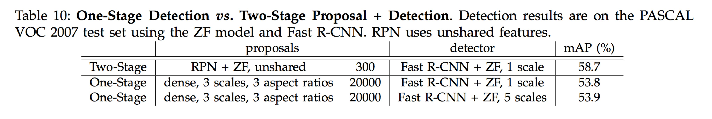

​       表Table 10比较了两阶段系统和一阶段系统的两个变种。使用ZF模型，一阶段系统具有53.9%的mAP。这比两阶段系统(58.7%)低4.8%。这个实验验证了级联region proposals和目标检测的有效性。在文献[2]，[39]中报道了类似的观察结果，在这两篇论文中，**用滑动窗取代SS region proposals会导致约6%的退化**。我们也注意到，**一阶段系统更慢**，因为它产生了**更多的proposals**。

### 4.2 在MS COCO数据集上的实验

​        我们在Microsoft COCO目标检测数据集[12]上提供了更多的结果。这个数据集包含**80个目标类别**。我们用**训练集上的8万**张图像，**验证集上的4万**张图像以及**测试开发集上的2万**张图像进行实验。我们评估了IoU∈[0.5:0.05:0.95]的平均mAP(**COCO的标准度量**，简称为mAP@[.5,.95])和mAP@0.5(**PASCAL VOC的度量**)。

​       我们的系统对这个数据集做了一些小的改动。我们在8 GPU实现上训练我们的模型，**mini-batch的实际数量**RPN为8(每个GPU 1个)、Fast R-CNN为16(每个GPU 2个)。RPN步骤和Fast R-CNN步骤都以0.003的学习率进行24万次迭代训练，然后以0.0003的学习率进行8万次迭代。我们修改了学习率(**从0.003开始而不是0.001**)，因为**mini-batch大小发生了变化**。对于anchor，我们使用3个长宽比和4个尺寸(增加$64^2$)，这主要是**受**处理这个数据集上的**小目标激发**。此外，在我们的Fast R-CNN步骤中，负样本定义为与ground-truth边框的最大IOU在[0，0.5)区间内的样本，而不是[1]，[2]中使用的[0.1,0.5)之间。我们注意到，在SPPnet系统[1]中，在[0.1，0.5)中的负样本用于网络精调，[0,0.5)中的负样本仍然在带困难负样本挖掘的SVM步骤中被访问。但是Fast R-CNN系统[2]放弃了SVM步骤，所以**[0,0.1]中的负样本都不会被访问**。包括这些**[0,0.1)的样本**，在Fast R-CNN和Faster R-CNN系统在COCO数据集上**改进了mAP@0.5**(但对PASCAL VOC的影响可以忽略不计)。

​        其余的实现细节与PASCAL VOC相同。特别的是，我们继续使用300个proposal和单一尺寸(s=600)测试。COCO数据集上的测试时间仍然是大约200ms处理一张图像。

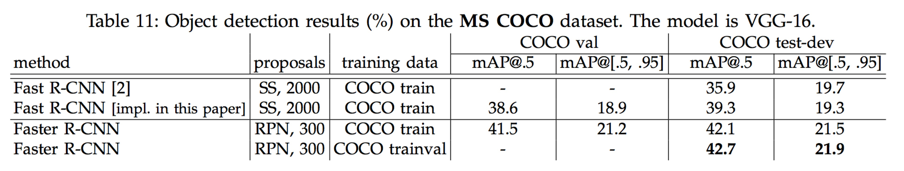

​        在表11中，我们首先报告了使用本文实现的Fast R-CNN系统[2]的结果。我们的Fast R-CNN基准在`test-dev`数据集上有39.3%的mAP@0.5，比[2]中报告的更高。我们推测造成这种差距的原因主要是由于**负样本的定义**以及**mini-batch大小的变化**。我们也注意到**mAP@[.5，.95]仅仅相当**。

​        接下来我们评估我们的Faster R-CNN系统。使用**COCO训练集**训练，在COCO测试开发集上Faster R-CNN有42.1%的mAP@0.5和21.5%的mAP@[0.5，0.95]。在相同协议下与Fast R-CNN相比，mAP@0.5要高2.8%，mAP@[.5, .95]要高2.2%(表Table 11)。这表明，**在更高的IoU阈值上**，**RPN对提高定位精度表现出色**。使用**COCO训练验证集**训练，在COCO测试开发集上Faster R-CNN有42.7%的mAP@0.5和21.9%的mAP@[.5, .95]。图Figure 6显示了MS COCO测试开发数据集中的一些结果。

#### 在ILSVRC和COCO 2015比赛中的Faster R-CNN

​       我们已经证明，由于RPN通过神经网络完全学习了region proposal，Faster R-CNN可以**从更好的特征中受益更多**。即使将充分增加深度到100层以上[18]，这种观察仍然是有效的。仅用101层残差网络(**ResNet-101**)**替换VGG-16**，Faster R-CNN系统就将mAP从**41.5/21.5**(VGG-16)增加到**48.4%/27.2%**(ResNet-101)。与其它改进正交于Faster R-CNN，He et al.[18]在COCO测试开发数据集上获得了**单模型55.7%/34.9%**的结果和一个**强化的59.0%/37.4%**的结果，在COCO 2015目标检测竞赛中获得了第一名。同样的系统[18]也在ILSVRC 2015目标检测竞赛中获得了第一名，**超过第二名8.5%的绝对值**。RPN也是ILSVRC2015定位和COCO2015分割竞赛第一名获奖记录的基石，详情请分别参见[18]和[15]。

### 4.3 从MS COCO到PASCAL VOC

​        **大规模数据对改善深度神经网络至关重要**。接下来，我们研究MS COCO数据集如何帮助改进在PASCAL VOC上的检测性能。

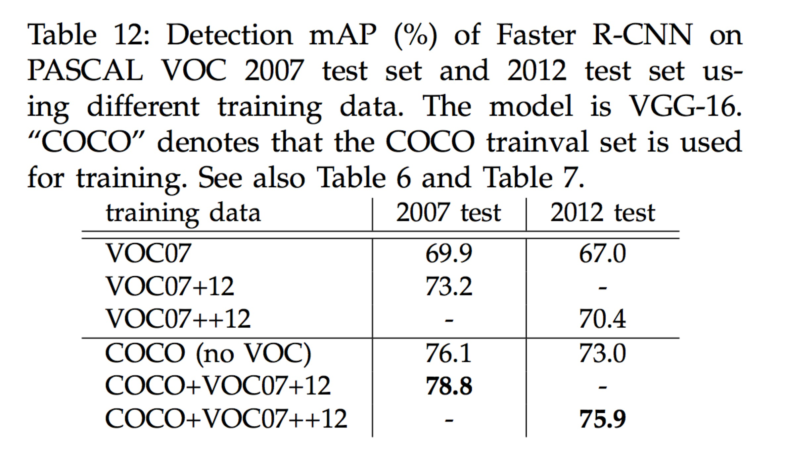

​        作为一个简单的基准，我们直接在**PASCAL VOC数据集上评估COCO检测模型**，*而无需在任何PASCAL VOC数据上进行精调*。这种评估是可能的，因为COCO类别是PASCAL VOC上类别的超集。在这个实验中**忽略COCO专有的类别**，softmax层仅在20个类别和背景上执行。这种设置下PASCAL VOC 2007测试集上的mAP为76.1%(表Table 12)。即使没有利用PASCAL VOC的数据，这个结果也好于在VOC07+12(73.2%)上训练的模型的结果。

​       然后我们在VOC数据集上对COCO检测模型进行**精调**。在这个实验中，COCO模型代替了ImageNet的预训练模型(用于初始化网络权重)，Faster R-CNN系统按3.2节所述进行精调。这样做在PASCAL VOC 2007测试集上可以达到78.8%的mAP。额外的来自**COCO集合的数据增加了5.6%的mAP**。表Table 6显示，在PASCAL VOC 2007上，使用COCO+VOC训练的模型在**每个类别上都最好的AP值**。在PASCAL VOC 2012测试集(表Table 12和表Table 7)中也观察到类似的改进。我们注意到获得这些强大结果的**测试速度仍然是每张图像200ms左右**。

## 5. 总结

​       我们已经提出了**RPN来高效，准确的生成region proposal**。通过与下游检测网络共享卷积特征，region proposal步骤几乎是**零成本**的。我们的方法使统一的，基于深度学习的目标检测系统能够以接近实时的帧率运行。学习到的**RPN也提高了region proposal的质量**，从而提高了整体的目标检测精度。

## 参考文献

[1] K. He, X. Zhang, S. Ren, and J. Sun, “Spatial pyramid pooling in deep convolutional networks for visual recognition,” in European Conference on Computer Vision (ECCV), 2014.
[2] R. Girshick, “Fast R-CNN,” in IEEE International Conference on Computer Vision (ICCV), 2015.
[3] K. Simonyan and A. Zisserman, “Very deep convolutionalnetworks for large-scale image recognition,” in International Conference on Learning Representations (ICLR), 2015.
[4] J. R. Uijlings, K. E. van de Sande, T. Gevers, and A. W. Smeulders,“Selective search for object recognition,” International Journal of Computer Vision (IJCV), 2013.
[5] R. Girshick, J. Donahue, T. Darrell, and J. Malik, “Rich feature hierarchies for accurate object detection and semantic segmentation,” in IEEE Conference on Computer Vision and Pattern Recognition (CVPR), 2014.
[6] C. L. Zitnick and P. Dollar, “Edge boxes: Locating object ´proposals from edges,” in European Conference on Computer Vision (ECCV), 2014.

[7] J. Long, E. Shelhamer, and T. Darrell, “Fully convolutional networks for semantic segmentation,” in IEEE Conference on Computer Vision and Pattern Recognition (CVPR), 2015.
[8] P. F. Felzenszwalb, R. B. Girshick, D. McAllester, and D. Ramanan,“Object detection with discriminatively trained partbased models,” IEEE Transactions on Pattern Analysis and Machine Intelligence (TPAMI), 2010.
[9] P. Sermanet, D. Eigen, X. Zhang, M. Mathieu, R. Fergus, and Y. LeCun, “Overfeat: Integrated recognition, localization and detection using convolutional networks,” in International Conference on Learning Representations (ICLR), 2014.
[10] S. Ren, K. He, R. Girshick, and J. Sun, “Faster R-CNN: Towards real-time object detection with region proposal networks,” in Neural Information Processing Systems (NIPS), 2015.

[11] M. Everingham, L. Van Gool, C. K. I. Williams, J. Winn, and A. Zisserman, “The PASCAL Visual Object Classes Challenge 2007 (VOC2007) Results,” 2007.
[12] T.-Y. Lin, M. Maire, S. Belongie, J. Hays, P. Perona, D. Ramanan,P. Dollar, and C. L. Zitnick, “Microsoft COCO: Common Objects in Context,” in European Conference on Computer Vision (ECCV), 2014.
[13] S. Song and J. Xiao, “Deep sliding shapes for amodal 3d object detection in rgb-d images,” arXiv:1511.02300, 2015.
[14] J. Zhu, X. Chen, and A. L. Yuille, “DeePM: A deep part-based model for object detection and semantic part localization,” arXiv:1511.07131, 2015.
[15] J. Dai, K. He, and J. Sun, “Instance-aware semantic segmentation via multi-task network cascades,” arXiv:1512.04412, 2015.
[16] J. Johnson, A. Karpathy, and L. Fei-Fei, “Densecap: Fully convolutional localization networks for dense captioning,” arXiv:1511.07571, 2015.
[17] D. Kislyuk, Y. Liu, D. Liu, E. Tzeng, and Y. Jing, “Human curation and convnets: Powering item-to-item recommendations on pinterest,” arXiv:1511.04003, 2015.
[18] K. He, X. Zhang, S. Ren, and J. Sun, “Deep residual learning for image recognition,” arXiv:1512.03385, 2015.
[19] J. Hosang, R. Benenson, and B. Schiele, “How good are detection proposals, really?” in British Machine Vision Conference (BMVC), 2014.
[20] J. Hosang, R. Benenson, P. Dollar, and B. Schiele, “What makes ´ for effective detection proposals?” IEEE Transactions on Pattern Analysis and Machine Intelligence (TPAMI), 2015.
[21] N. Chavali, H. Agrawal, A. Mahendru, and D. Batra,“Object-Proposal Evaluation Protocol is ’Gameable’,” arXiv:1505.05836, 2015.
[22] J. Carreira and C. Sminchisescu, “CPMC: Automatic object segmentation using constrained parametric min-cuts,” IEEE Transactions on Pattern Analysis and Machine Intelligence (TPAMI), 2012.
[23] P. Arbelaez, J. Pont-Tuset, J. T. Barron, F. Marques, and J. Malik, ´“Multiscale combinatorial grouping,” in IEEE Conference on Computer Vision and Pattern Recognition (CVPR), 2014.
[24] B. Alexe, T. Deselaers, and V. Ferrari, “Measuring the objectness of image windows,” IEEE Transactions on Pattern Analysis and Machine Intelligence (TPAMI), 2012.
[25] C. Szegedy, A. Toshev, and D. Erhan, “Deep neural networks for object detection,” in Neural Information Processing Systems (NIPS), 2013.
[26] D. Erhan, C. Szegedy, A. Toshev, and D. Anguelov, “Scalable object detection using deep neural networks,” in IEEE Conference on Computer Vision and Pattern Recognition (CVPR), 2014.
[27] C. Szegedy, S. Reed, D. Erhan, and D. Anguelov, “Scalable, high-quality object detection,” arXiv:1412.1441 (v1), 2015.
[28] P. O. Pinheiro, R. Collobert, and P. Dollar, “Learning to segment object candidates,” in Neural Information Processing Systems (NIPS), 2015.
[29] J. Dai, K. He, and J. Sun, “Convolutional feature masking for joint object and stuff segmentation,” in IEEE Conference on Computer Vision and Pattern Recognition (CVPR), 2015.
[30] S. Ren, K. He, R. Girshick, X. Zhang, and J. Sun, “Object detection networks on convolutional feature maps,” arXiv:1504.06066, 2015.
[31] J. K. Chorowski, D. Bahdanau, D. Serdyuk, K. Cho, and Y. Bengio, “Attention-based models for speech recognition,” in Neural Information Processing Systems (NIPS), 2015.
[32] M. D. Zeiler and R. Fergus, “Visualizing and understanding convolutional neural networks,” in European Conference on Computer Vision (ECCV), 2014.
[33] V. Nair and G. E. Hinton, “Rectified linear units improve restricted boltzmann machines,” in International Conference on Machine Learning (ICML), 2010.
[34] C. Szegedy, W. Liu, Y. Jia, P. Sermanet, S. Reed, D. Anguelov, D. Erhan, and A. Rabinovich, “Going deeper with convolutions,” in IEEE Conference on Computer Vision and Pattern Recognition (CVPR), 2015.
[35] Y. LeCun, B. Boser, J. S. Denker, D. Henderson, R. E. Howard, W. Hubbard, and L. D. Jackel, “Backpropagation applied to handwritten zip code recognition,” Neural computation, 1989.

[36] O. Russakovsky, J. Deng, H. Su, J. Krause, S. Satheesh, S. Ma,Z. Huang, A. Karpathy, A. Khosla, M. Bernstein, A. C. Berg,and L. Fei-Fei, “ImageNet Large Scale Visual Recognition Challenge,” in International Journal of Computer Vision (IJCV), 2015.
[37] A. Krizhevsky, I. Sutskever, and G. Hinton, “Imagenet classification with deep convolutional neural networks,” in Neural Information Processing Systems (NIPS), 2012.
[38] Y. Jia, E. Shelhamer, J. Donahue, S. Karayev, J. Long, R. Girshick, S. Guadarrama, and T. Darrell, “Caffe: Convolutional architecture for fast feature embedding,” arXiv:1408.5093, 2014.
[39] K. Lenc and A. Vedaldi, “R-CNN minus R,” in British Machine Vision Conference (BMVC), 2015

R-CNN、Fast R-cnn、Faster R-CNN比较
-----------------------------------

R-CNN：首先生成约2000个‘region proposals’，针对每个region proposal生成feature map，通过feature
map分别训练分类器和图像边框；

Fast R-CNN：首先生成约2000个‘region proposals’，针对整张图像训练feature
map，将所有‘region proposals’投射到feature map上形成proposal feature map，使用proposal
feature map一站式训练分类器和图像边框；

Faster R-CNN：针对整张图像生成feature map，使用feature map通过region proposal网络生成约2K‘region proposals’，将所有‘region proposals’投射到feature map上形成proposal feature map，使用proposal feature
map一站式训练分类器和图像边框。

### **区域建议网络(region proposal network)**

区域建议网络旨在通过conv layer的feature map在原图的基础上训练出‘region proposal’，也就是可能包含目标的region proposal。区域建议网络实现步骤如下：

1、在60\*40\*512 feature map的基础上做3\*3的same卷积(猜测有512个滤波器，卷积后apply
relu函数)，对于60\*40中的每一个pixel，找到原始图像上对应的部分，并在该部分覆盖9个anchor，anchor的形状见下图图右。该步骤可产生\~2w(60\*40\*9)个anchors；

2、去除超出原始图像区域的anchors，剩余\~6000个anchors；

3、对于前景最高得分anchor，通过非极大抑制法删除与起、其IOU\>0.7的anchor，剩余\~2000个anchors；

4、区域建议网络训练

-   网络自变量：2000个anchor样本，512维feature

-   网络因变量：anchor中有无目标、anchor位置大小x、y、w、h

-   正样本：与Ground Truth 的IOU\>0.7; 负样本：与Ground Truth 的IOU\<0.3

-   batch_size = 256, 128正样本，128负样本，正样本少于128时用负样本补全

**RPN loss**

$L(p_i, t_i) = \underbrace{\frac 1 {N_{cls}} \sum_iL_{cls}(p_i, p^*_i)}_{object/no\ object\ classifier} + \underbrace{\lambda \frac 1 {N_{reg}} \sum_i p^*_iL_{reg}(t_i, t^*_i)}_{box\  regressor} $

对于anchor中有无目标的分类，分数输出采用的是softmax函数。损失函数标注如下：

-   $p^*_i$：grouth-truth分类标签，0或1

-   $p_i$: 预测分类标签，0或1

-   ${N_{cls}}$：batch size

对于region proposal位置大小x、y、w、h的回归，损失函数标注如下：

-   $t_i$：从region proposal 到预测ground truth变换的4个预测参数，i=x,y,w,h

-   $t^*_i$ ：从region proposal 到ground truth变换的4个grouth-truth参数，i=x,y,w,h

-   $N_{reg}$：建议区域个数，～2000

​       $t_x = (x - x_a)/w_a, \      t_y =(y - y_a)/h_a$,

​       $t_w = log(w/w_a),\  t_h = log(h/h_a)$

​       $t_x^* = (x^* - x_a)/w_a, \      t_y^* =(y^* - y_a)/h_a$,

​       $t_w^* = log(w^*/w_a),\  t_h = log(h^*/h_a)$

关键点
------

### anchors

​        anchors是非常关键的点，在工程中对于每个卷积网络中最后一层特征图中的每个点(anchor)都产生9个anchors(固定如下)。其中每行的4个值[x1,y1,x2,y2]代表矩形左上和右下角点坐标。9个矩形共有3种形状，长宽比为大约为：[width:height](http://widthheight)= [1:1, 1:2,2:1]三种，如图6。实际上通过anchors就引入了检测中常用到的多尺寸方法。

        最终的anchors其实是最后一层特征图中的anchor映射到原始图像中的点作为中心点；如下的9个区域坐标代表形状的矩形区域。

[[ -84. -40. 99. 55.]

[-176. -88. 191. 103.]

[-360. -184. 375. 199.]

[ -56. -56. 71. 71.]

[-120. -120. 135. 135.]

[-248. -248. 263. 263.]

[ -36. -80. 51. 95.]

[ -80. -168. 95. 183.]

[-168. -344. 183. 359.]]

论文中结论总结
--------------

1.  proposal生成方法按准确度排序：RPN+VGG \> RPN+AlexNet \> Selective search；
2.  proposal生成方法按生成时间排序：Selective search \>
    RPN+VGG \> RPN+AlexNet ；
3.  基于proposal的有无物体得分，对propoal进行非极大值抑制不会降低准确率；
4.  RPN的Regression layer是准确生成proposal的关键；
5.  RPN和faster R-cnn detector共享参数的mAP优于不共享参数的mAP；
6.  使用RPN方法，预测时每张图选取top300个proposal即可保障准确率；
7.  anchors的设置使用3个scale和3个ratios时MAP最优；
8.  RPN loss中回归的权重λ取值大小对mAP影响不大

## 疑问点

1. 3.3节中提到“Even such a large stride provides good results, though accuracy may be further improved with a smaller stride” ，小步长效果为什么更好？

## 关于我们

我司正招聘文本挖掘、计算机视觉等相关人员，欢迎加入我们；也欢迎与我们在线沟通任何关于数据挖掘理论和应用的问题；

在长沙的朋友也可以线下交流, 坐标: 长沙市高新区麓谷新长海中心 B1栋8A楼09室

公司网址：http://www.embracesource.com/

Email: mick.yi@embracesource.com 或 csuyzt@163.com

