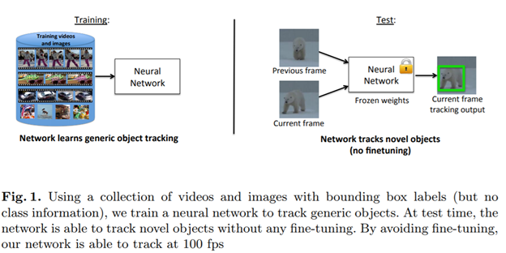
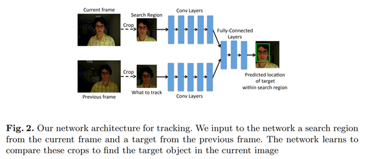
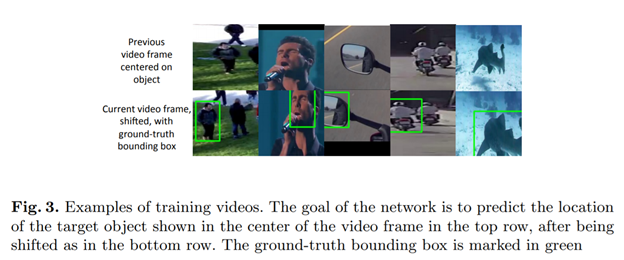
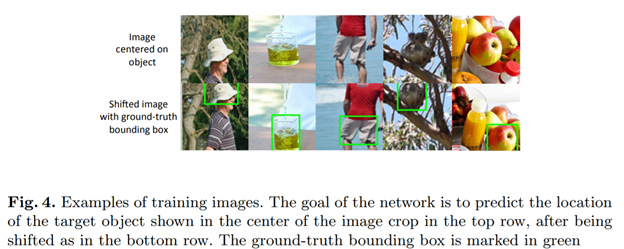
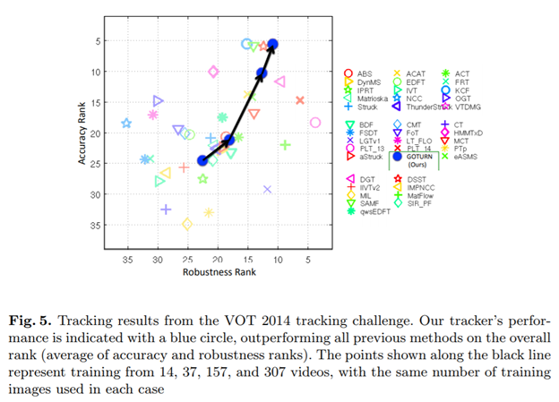
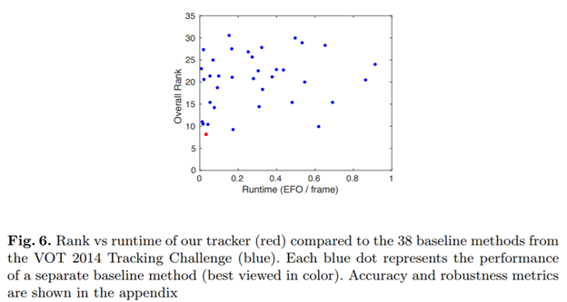
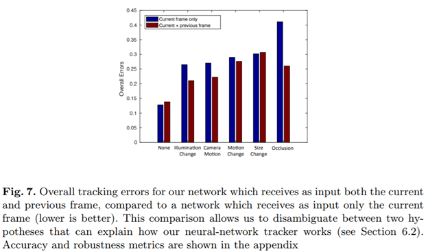
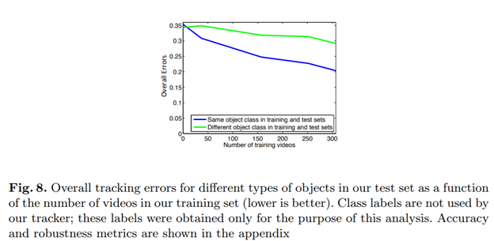
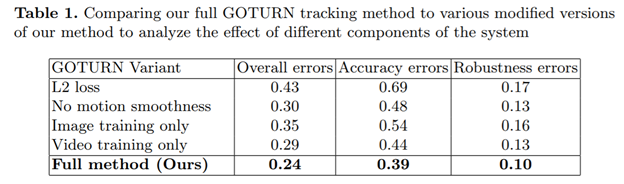
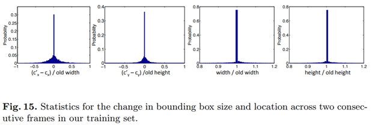

GOTURN-Learning to Track at 100 FPS with Deep Regression Networks
=================================================================

 

-   [简介](#GOTURN-LearningtoTrackat100FPSwithDeepR)

-   [相关工作](#GOTURN-LearningtoTrackat100FPSwithDeepR)

    -   [在线训练跟踪器](#GOTURN-LearningtoTrackat100FPSwithDeepR)

    -   [基于模型的跟踪器](#GOTURN-LearningtoTrackat100FPSwithDeepR)

    -   [其它神经网络跟踪框架](#GOTURN-LearningtoTrackat100FPSwithDeepR)

-   [方法](#GOTURN-LearningtoTrackat100FPSwithDeepR)

    -   [方法概览](#GOTURN-LearningtoTrackat100FPSwithDeepR)

    -   [输入/输出格式](#GOTURN-LearningtoTrackat100FPSwithDeepR)

    -   [网络架构](#GOTURN-LearningtoTrackat100FPSwithDeepR)

    -   [跟踪](#GOTURN-LearningtoTrackat100FPSwithDeepR)

-   [训练](#GOTURN-LearningtoTrackat100FPSwithDeepR)

    -   [视频和图像训练](#GOTURN-LearningtoTrackat100FPSwithDeepR)

    -   [学习运动的平衡性](#GOTURN-LearningtoTrackat100FPSwithDeepR)

    -   [训练过程](#GOTURN-LearningtoTrackat100FPSwithDeepR)

-   [实验装置](#GOTURN-LearningtoTrackat100FPSwithDeepR)

    -   [训练集](#GOTURN-LearningtoTrackat100FPSwithDeepR)

    -   [测试集](#GOTURN-LearningtoTrackat100FPSwithDeepR)

-   [结果](#GOTURN-LearningtoTrackat100FPSwithDeepR)

    -   [综合性能](#GOTURN-LearningtoTrackat100FPSwithDeepR)

    -   [如何工作](#GOTURN-LearningtoTrackat100FPSwithDeepR)

    -   [共性vs特性](#GOTURN-LearningtoTrackat100FPSwithDeepR)

    -   [消除分析](#GOTURN-LearningtoTrackat100FPSwithDeepR)

-   [ 总结](#GOTURN-LearningtoTrackat100FPSwithDeepR)

-   [附录](#GOTURN-LearningtoTrackat100FPSwithDeepR)

 机器学习技术通常用于计算机视觉，因为它们能够**利用大量训练数据**来**提高性能**。不幸的是，大多数通用对象跟踪器仍然是从头开始**在线训练**的，并不能从可用于离线训练的大量视频中受益。我们提出了一种**离线训练**神经网络的方法，测试时以**100
fps**的速度**跟踪新对象。**我们的跟踪器比以前使用神经网络进行跟踪的方法要快得多，这些方法通常运行速度非常慢，而且对于**实时应用**而言并**不实用**。我们的跟踪器使用简单的前馈网络，不需要在线训练。跟踪器学习对象**运动**和**外观**之间的**通用关系**，并可用于跟踪未出现在训练集中的新对象。使用**标准的跟踪基准**测试我们的网络，以展示我们的跟踪器state-of-the-art性能；此外，随着我们为离线训练集添加更多视频，性能也会提高。据我们所知，我们的跟踪器是**第一个**以100
fps跟踪的**通用对象神经网络跟踪器**。

 

项目主页：<http://davheld.github.io/GOTURN/GOTURN.html>

工程地址：<https://github.com/davheld/GOTURN>

论文地址：<https://arxiv.org/pdf/1604.01802.pdf>

简介
----

**单目标跟踪**的任务是在视频的第一帧标记跟踪对象，在随后的帧中跟踪定位目标对象；不管目标的移动情况、视觉的改变、光照改变或其他变化。单目标跟踪是很多其它系统的重要组成部分；对**行人跟踪**，机器人需要在行人移动过程中跟踪行人；对**自动驾驶**，机器人需要跟踪动态的障碍来估计它们移动到了哪里，并预测未来会往哪里移动。

通用的对象跟踪(不特定某些类别的对象)一般是**完全在线训练**的(如：在预测的时候);没有离线训练。这类跟踪器未能利用大量可用视频来提升性能。离线训练视频可以教会跟踪器来处理变形，视角改变，光照改变及其它复杂的挑战。

在很多其它的计算机视觉领域，如图像分类，目标检测，语义分割或行为识别中；机器学习允许视觉算法从离线数据训练来学习。在这些案例中，随着迭代图像训练集算法性能提升。这些模型受益于神经网络从大量数据中**学习复杂函数**的能力。

本文将展示，通过观看移动的物体的离线视频，可以学习实时跟踪通用对象。为达到此目标，我们介绍GOTURN，使用**回归网络**的通用目标跟踪。我们使用**完全离线**的方式训练神经网络。测试时，**固定**住网络的权重参数，实时跟踪目标对象；此时并**没有 在线**的**精调过程**(如图Figure
1)。离线训练过程跟踪器学习如果快速、鲁棒、精准的跟踪一个新的对象。

之前有一些使用神经网络来做目标跟踪的；因速度太慢而无实用价值。相比较，我们的跟踪器可以以100
fps速度跟踪对象；目前为止**最快**的神经网络跟踪器。我们的实时速度源于两个因素；第一，大部分之前的神经网络跟踪器都是**在线训练**的，训练神经网络是一个很慢的过程，导致检测很慢；与之相对，我们的跟踪器通过**离线训练**学习**外观**和**运动**之间的**通用关系**，没有在线训练过程。第二，大部分分类器使用**基于分类**的方法，通过分类来找到目标对象；与之相对，我们的跟踪器使用一个**基于回归**的方法，仅仅需要**一次前向传播**过程即可直接对目标对象的定位回归。**离线训练**和**一次回归**的组合导致了速度的极大提升，达到可以实时跟踪目标的速度。

        GOTURN 是**第一个**达到**100
fps**的**通用对象神经网络跟踪器**。我们使用标准的跟踪基准来阐述我们的跟踪器优于state-of-the-art跟踪器。使用标注的视频和图片来训练，并**不需要**一个**类级别**的标签或目标对象的**类别信息**。GOTURN建立了一个新的跟踪框架，其中**外观**和**运动**之间的**关系**是以通用方式**离线学习**的。

相关工作
--------

### 在线训练跟踪器

 通用对象跟踪器典型的是从视频的第一帧开始现在训练。典型的跟踪器从目标对象附件采样patches，这些patches被当作前景;同样采样远离目标对象的patches，这些patches当作背景。这些前景/背景patches用于训练前景/背景分类，分离器在下一帧对patches做打分，来评估目标对象的新定位。不幸的是，这些跟踪器都是在线训练的，未能利用可用的大量视频数据离线训练来提升性能。

一些研究者尝试将**神经网络**用于传统的**在线训练框架**，取得了state-of-the-art
的结果。但不幸的是，神经网络训练**很慢**，在线训练导致**预测**时**速度很慢**。这类跟踪器从0.8
fps到15
fps,最好的神经网络跟踪器在单GPU上1fps。因此，这些跟踪器在大部分实际应用中无法使用。我们的跟踪器以一个通用的方式离线训练，没有在线训练，**跟踪速度**达到**100
fps**。

### 基于模型的跟踪器

 **单类跟踪器**是**基于模型**的跟踪器，用于跟踪特定类别的对象。如，仅仅对行人感兴趣，可以训练一个行人检测器；测试时这些检测器可以使用临时信息链接到一块。这些跟踪器由于只能跟踪特定类别的对象非常受限。我们的跟踪器以一个**通用**的模式**离线训练**，在检测时可以应用到**新对象**的跟踪。

### 其它神经网络跟踪框架

相关的研究领域是**patch匹配**，最近用于跟踪系统，运行速度4fps。在这种方法中，很多候选patches通过神经网络，匹配得分最高的patch作为跟踪输出；相比较，我们的网络**仅仅**通过**两张图片**，然后直接对目标对象的定位回归。通过**避免**对**大量候选patch**打分，我们可以以100fps跟踪对象。

之前有很多通过不同方式将神经网络应用的跟踪系统中；包括**视觉注意力模型**；但是这些方法在**困难跟踪数据集**的表现无法与state-of-the-art跟踪器媲美。

 

方法
----

### 方法概览

 将视频的帧送入神经网络，神经网络在每一帧成功输出跟踪对象的定位。使用视频序列和图像完全的离线训练跟踪器；离线训练过程使得跟踪器学习了**外观**和**运动**之间的**通用关系**，在预测时可以跟踪**新对象**，而不需要在线训练。

### 输入/输出格式

-   **跟踪啥**

视频中有很多对象，神经网络**接收**视频中需要跟踪的**目标对象信息**。为此，我们输入一张目标对象的图片到神经网络中；**裁剪**和**伸缩前一帧**使目标对象位于中心(如图Figure
2）。这种输入使得我们的网络可以跟踪以前没有遇到过的新对象；网络可以**跟踪**裁剪后的**任意对象**。在裁剪后的图片边上做pad，将目标对象周围的一些环境信息也输入网络中。具体地，假设在t-1帧，跟踪器先前预测目标对象位于中心点为$c = (c_x, c_y)$

，长宽为h,w的边框中；在t时刻，我们对t-1帧裁剪获得**中心**位于$c_x, c_y$

，**长宽**为$k_1h,k_1w$的crop；这个crop告诉神经网络跟踪**哪个对象**，$k_1$决定网络从前一帧接收目标对象**环境信息**的**多少**。

 

-   **看哪里**

 为了在当前帧跟踪目标对象，跟踪器需要目标对象之前的位置。对象在空间中倾斜平衡的移动；对象先前的位置给网络提供了一个很好的推测，到哪里去找对象。我们基于对象先前位置在当前帧选择一个搜索区域；使用搜索区域裁剪当前帧，裁剪后的crop作为网络输入(如图Figure
2)。网络的目标就是在搜索区域中对目标对象的定位回归。

       具体的，假设当前帧t的搜索区域中心点为$c^‘ =(c^‘_x, c^‘_y)$

，$c^‘ $是目标对象定位均值；令$c^‘=c$

，等价于一个恒定位置运动模型，虽然可以使用更复杂的运动模型。当前帧的crop长宽为$k_2h,k_2w$

；h、w是前一帧预测的边框长和宽，$k_2$

定义了目标对象的搜索范围大小，实际中使用$k_1=k_2=2$。

 在目标对象没有遮挡和快速移动的情况下，目标定位会在这个搜索区域内。对于快速移动的对象，搜索区域可以更大，同时网络复杂的也会增加。或者，对于长期遮挡或大的移动，跟踪器可以与其它方法组合，如在线训练的对象检测器，或视觉注意力模型；这些工作留到以后完成。

 

-   **网络输出**

网络**输出**当前帧**目标对象**相对搜索区域的**坐标**，输出的是边框**左上角**和**右下角**的坐标。

### 网络架构

        对单目标跟踪，我们定义一个**图像比较**跟踪架构，如图Figure
2( “two-frame”架构在其它任务中也有使用)。在本模型中，目标对象和搜索区域分别进入**一系列**的**卷积层**；卷积层的输出是捕获了图像高层级表示的**特征集**。

卷积层的输出进入全连接层；全连接层的目标是**比较目标对象**的特征和**当前帧**的特征，来找出目标对象移动到哪里了。在这些帧中，对象肯恶搞经历了转换、旋转、光照改变、遮挡或变形；因此全连接层通过大量样例学习的是一个对于各种变化情况鲁棒的，复杂的特征比较；输出的是**跟踪对象**的**相对运动**。

具体地，卷积层来源CaffeNet的首个**5层卷积**；将这些卷积层的输出**串联**成一个**向量**。这个向量作为**3层全连接层**的输入，每层4096个节点；最后，将全连接层的最后一层输出连接到一个4个节点的全连接层，4个节点代表边框的输出。We
scale the output by a factor of 10, chosen using our validation set (as with all
of our
hyperparameters).网络超参使用Caffenet的默认值，全连接层之间使用dropout和ReLU非线性激活，基于Caffe实现。

### 跟踪

预测时，使用**第一帧**的**GT**初始化跟踪器，对单目标跟踪而言这是一个标准的实践过程。接下来的每一帧t,使用从**t-1帧裁剪**的**crop**和**当前帧t**输入网络中来预测对象在当前帧t的位置。在视频余下帧中继续裁剪并将一对帧输入网络；这样网络在整个视频序列中将跟踪目标对象的移动情况。

 

训练
----

 

我们组合视频和静态的图像训练网络；训练过程下面会说明。两种情况下都是用预测边框和GT之间的L1损失值。

### 视频和图像训练

 训练集中包含视频集，在每个视频的部分帧中对象的位置已经标注。对训练集中每一个连续的一对帧，送入网络中，并预测从第一帧到第二帧对象如何移动（如图Figure
3）。我们同样使用运动模型对训练样本增广。

 

 训练过程同样利用了**静态的图像**，这些图像**标注**了**对象的位置**。这些图像的数据集使得网络能够**跟踪**更加**多样化**的对象，**防止**对视频中的对象**过拟合**。根据我们的**运动模型**（学习运动的平衡性）随机裁剪图片来训练跟踪器。在crops之间，目标对象发生了外观转变和尺寸变化，如图Figure
4；我们将这些crops**当作**视频的**不同帧**来对待。虽然在这些crops中的运动变化类型没有视频中的多，这些图片对于训练网络来跟踪**大量不同对象**仍然是**有用的**。

 

### 学习运动的平衡性

 真实世界里对象在空间中的移动倾向平滑。对于一个目标位置不确定的模糊图像，跟踪器应该预测目标位置在目标之前出现的位置附近；这对于含有多个几乎一样的对象的视频来说非常重要，如：有多个同类的水果。因此对神经网络而言，一切都是平等的，小的运动比大的运动更常见。

       为更加具体的说明运动的平衡性，我们对当前帧边框的中心$(c^‘_x, c^‘_y)$

和前一帧边框中心建模如下：

$$
c^‘_x=c_x + w*\Delta x \ \ \ \ (1) \\
c^‘_y=c_y + w*\Delta y \ \ \ \ (2) \\
$$

       h和w是前一帧边框的高度和宽；∆x
和∆y项是随机变量，代表**边框位置**相对它尺寸的**变化**；在我们的训练集中发现，∆x
和
∆y服从**均值为0**的**拉普拉斯分布**。与较大的运动相比，这种分布对较小的运动具有更高的可能性。

       类似的，对尺寸改变建模：

$$
w^‘ = w * \gamma_w \ \ \ \ \ \ (3) \\
h^‘ = h * \gamma_h \ \ \ \ \ \ (4) \\
$$
$w^‘$和$h^‘代表边框在当前帧的宽和高,w和h代表边框在前一帧的宽和高。γw 和γh

是捕获**边框尺寸改变**的随机变量。γw
和γh服从均值为1的**拉普拉斯分布**；这种分布有很大概率保持边框尺寸在当前帧与前一帧的尺寸一样。

        为了使网络更青睐小运动，我们使用拉普拉斯分布对训练集随机裁剪(如图Figures
3和4);因为使用拉普拉斯分布采样，**小运动采样大于大运动**；因此网络学习后，也更加倾向于小运动，一切都是平等的。**相比**分类任务中标准的**均匀裁剪过程**，**拉普拉斯裁剪**过程对跟踪器的性能有**提升**。

       拉普拉斯分布的尺度参数设置为$b_x=1/5$

（对于边框中心改变)和$b_s=1/15$

（对于边框尺寸改变)；同样约束裁剪后的crop在每个维度至少包含目标对象的一半。另外γw,
γh ∈ (0.6, 1.4)，防止过度拉伸或收缩边框使网络难以学习。

### 训练过程

 每个训练样本交替的来自视频或者图像，当使用视频训练样本时，随机的选择一个视频，随机的选择视频中一对连续帧。然后对视频裁剪，在当前帧做k3个随机裁剪，这样数据集就增广了k3个样本。下一次，随机的采样一张图片，重复上述过程，随机采集过程人工创建了“运动”。每一次视频或图像被采样，新的随机裁剪就使用一次；在训练过程中创造了附加的多样性。实验中，取k3
= 10，批大小为50.

卷积层在ImageNet上预训练；由于训练集大小有限，没有精调这些卷积层，防止过拟合。训练网络学习率1e-5，其它的超参数使用CaffeNet的默认值。

实验装置
--------

### 训练集

使用视频和静态图片训练网络。视频数据集来源于ALOV300++，包含314个视频。使用7个作为测试，剩余307个作为训练(251个训练，56个验证）。视频中大概每5帧标注了跟踪的对象。视频通常较短，从几秒到几分钟。训练集总共包括13,082张图像，251个不同对象；平均52帧一个对象；验证集总共包括2795张图像，56个不同对象。在超参数选择完成后，使用整个训练集(训练+验证)重新训练模型。训练集和测试集没有交集。

训练过程同样利用了静态图片；图片来自ImageNet，包含478,807个边框标注的对象。在训练中随机裁剪这些图片(上一节描述的过程),在两个随机的crops中创造外观变化或尺寸改变。随机裁剪仅仅在标注对象没有充满整个图像情况下有作用；因此剔除边框在任意维度尺寸超过图像尺寸66%的图片；留下了134,821
张图像包括总共239,283个标注。这些图片使网络跟踪视频中未出现的对象，可以防止过拟合。

### 测试集

        测试集包括25个视频，来自VOT 2014跟踪挑战赛。VOT
2014跟踪挑战赛是一个标准的跟踪基准，可以比较不同的state-of-the-art跟踪器。跟踪器的评估使用两个标准跟踪度量：**精确性**(A)和**鲁棒性**(R),取值范围0到1。我们同时计算**精确性误差**(1-A),和**鲁棒性误差**(1-R),以及**综合误差**1
− (A + R)/2。

视频的每一帧都标注了一些列属性：遮挡，照明变化，运动变化，尺寸变化和相机运动。追踪器还针对每个属性分别对准确性和鲁棒性进行排名，然后对各个属性的排名进行平均，以获得每个追踪器的最终平均准确度和鲁棒性排名。

结果
----

### 综合性能

       如图Figure
5所示，我们的跟踪器有很好的鲁棒性同时接近最高的精确性；更进一步，我们的综合排名优于所有之前的跟踪器。因此表明离线训练对跟踪器性能提升的意义。此外，这个结果仅仅训练了307个视频，如图Figure
5所示随着训练集的增大，跟踪器的性能随之提升。定性结果，可以在项目主页<http://davheld.github.io/>查到，包括失败的案例；当前跟踪器可以因为遮挡或者过拟合而跟踪识别。

       在一块英伟达GeForce GTX Titan X GPU上，使用cuDNN加速，跟踪器每帧耗时6.05
ms(165fps)；在一块GTX 680 GPU上每帧耗时9.98 ms(100fps)；如果只有一个cpu,则为2.7
fps。因为所有训练都是离线的，预测时只有一个前向传播过程，因此跟踪器达到实时速度。

       在图Figure 6中，与VOT
2014跟踪挑战赛中其它38个跟踪器比较了速度和排名(使用综合排名)；跟踪器的耗时使用**EFO**(Equivalent
Filter Operations)单位,**标准化**跟踪器测试使用的**不同硬件类型**。图Figure
6展示，我们的跟踪器是**最快**的，同时**综合性能**是**最优**的。更详细的精确性和鲁棒性分析见附录。

 在线训练神经网络跟踪器速度在0.8fps到15fps；性能最好的跟踪器在单GPU速度1fps。大部分跟踪器评估**有限样本**，并选择得分最高的作为跟踪输出，由于有采样过程，精确度**受限**于**采样大小**；但是**采样数增加**会**增加计算量**；另一方面，我们跟踪器直接使用**边框定位回归**；因此GOTURN可以以100fps跟踪对象。

### 如何工作

        我们的神经网络跟踪器如何工作？有人可能会提出两个假设：

   1) 网络比较前一帧和当前帧来找出目标对象在当前帧的位置 

   2) 网络作为本地通用的“对象检测器”，只是定位最近的“对象”

       我们通过实验比较两种假设在图Figure
2的网络中的性能表现；分别训练这两个网络。如果网络没有接收前一帧作为输入，则只能作为一个本地通用的对象检测器(假设2)。

        图Figure 7
表明**假设1成立**，接收前一帧作为输入的跟踪性能更好。另一方面，当**尺寸改变**或者**没有变化**的情况下，使用前一帧**效果更差**或者**接近**。

 

### 共性vs特性

 跟踪器对于不在训练集中的新对象泛函能力如何？为了分析，将测试集分为训练集中至少25个视频包含跟踪对象和少于25个视频包含跟踪对象。图Figure
8表明我们的跟踪器对于训练集没有出现(或很少出现)的对象跟踪效果也很好。
性能会随着训练集的增加而提升，虽然增加的训练视频跟测试视频不相关。我们的跟踪器能够学习对象**外观变化**和**运动**的**通用关系**，因而**能够**跟踪**新对象**

     另外，我们的跟踪器也可以专门用于跟踪特定对象。图Figure
8显示，对于训练集中至少25个视频包含跟踪对象的测试对象，随着**训练集**的**增加**，**性能大幅提升**。这使用户可以将跟踪器专用于**特定应用**；如：**自动驾驶**中，可以加入**更多**的**人**，**自行车**，**车**到训练集中；跟踪器对于这些对象的跟踪效果就**更好**。同时，图Figure
8还表明我们的跟踪器可以跟踪未出现在我们的训练集中的**新对象**，这在跟踪**非受控环境中**的对象时非常重要。

### 消除分析

         表Table 1显示哪些组件对性能的贡献最大。

         a) 运动平衡性非常重要

         b) L1 loss比L2 loss效果好

         c) 仅使用视频或者图像效果不如组合视频和图像训练好。

 总结
-----

我们的跟踪器是离线训练的一个通用对象跟踪器，并且越多的训练视频，性能越好。预测时，没有在线精调，速度达到100fps。我们的跟踪器**离线的学习**了对象**外观**和**运动**之间的通用关系，能够**实时的**跟踪**新对象**。

附录
----

         通过统计训练集中连续两帧的边框位置和尺寸，说明符合拉普拉斯分布。

 

## 关于我们

我司正招聘文本挖掘、计算机视觉等相关人员，欢迎加入我们；也欢迎与我们在线沟通任何关于数据挖掘理论和应用的问题；

在长沙的朋友也可以线下交流, 坐标: 长沙市高新区麓谷新长海中心 B1栋8A楼09室

公司网址：http://www.embracesource.com/

Email: mick.yi@embracesource.com 或 csuyzt@163.com

