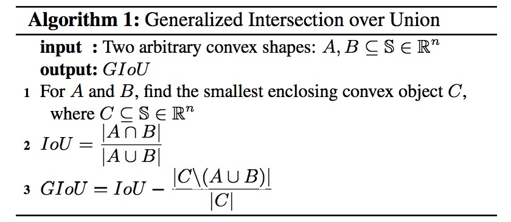
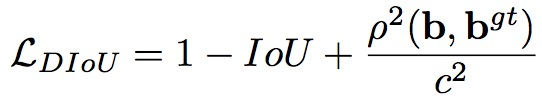
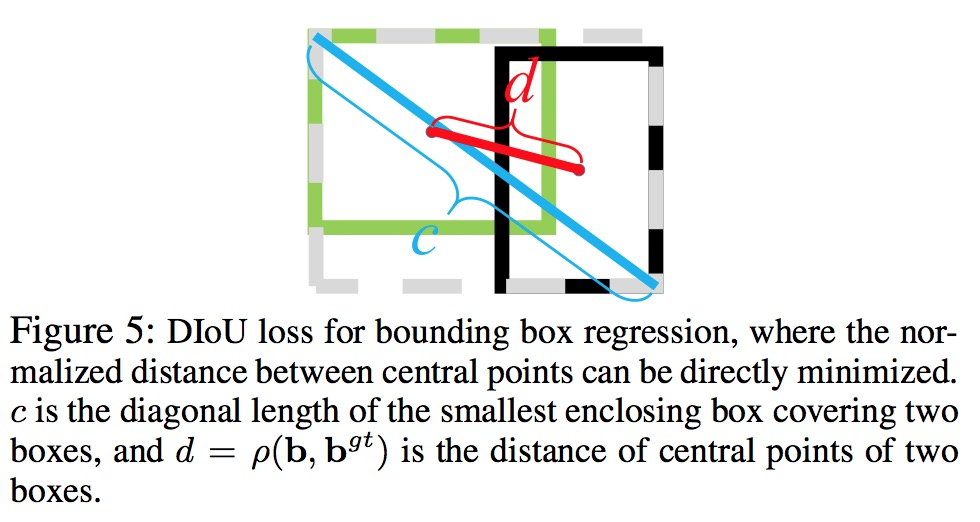

[TOC]

## IoU

优点：尺度不变性、非负性、三角不等性

缺点：目标不重叠时都为0，不能反映距离；不能体现非重叠部分

## GIoU

Generalized Intersection over Union: A Metric and A Loss for Bounding Box Regression

论文地址：https://arxiv.org/pdf/1902.09630.pdf

公式如下：

优点：IoU的优点、考虑到了非重叠部分

缺点：不稳定、收敛慢

## DIoU

**Distance-IoU Loss: Faster and Better Learning for Bounding Box Regression**

论文地址：https://arxiv.org/pdf/1911.08287.pdf

方法：在IoU上增加中心点距离惩罚项

公式如下：

**IoU vs GIoU vs DIoU**

优点：GIoU的优点、稳定收敛快

缺点：没有考虑长宽比

## CIoU

与DIoU出自同一篇论文,CIoU考虑预测边框与GT边框长宽比的一致性

