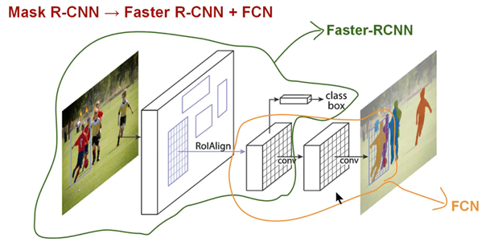
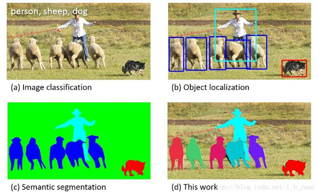
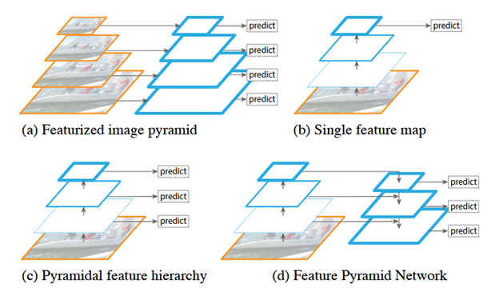
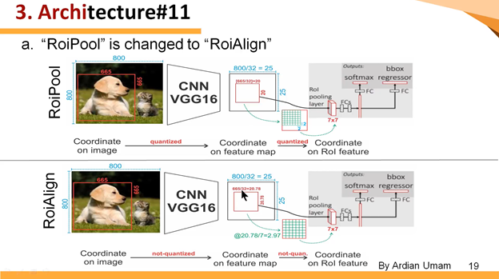
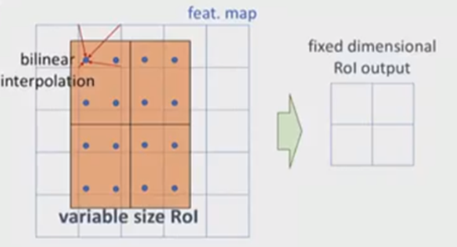

Mask R-CNN
==========

-   [依赖知识](#MaskR-CNN-依赖知识)

-   [知识点](#MaskR-CNN-知识点)

    -   [Instance Segmentation-实例分割](#MaskR-CNN-InstanceSegmentation-实例分割)

    -   [Feature Pyramid Networks-特征金字塔网络](#MaskR-CNN-FeaturePyramidNetworks-特征金字塔网)

        -   [自上而下的路径和横向连接](#MaskR-CNN-自上而下的路径和横向连接)

    -   [ResNeXt](#MaskR-CNN-ResNeXt)

    -   [ROI Align](#MaskR-CNN-ROIAlign)

-   [关键点](#MaskR-CNN-关键点)

    -   [强化的基础网络](#MaskR-CNN-强化的基础网络)

    -   [ROI Align](#MaskR-CNN-ROIAlign.1)

    -   [解耦合](#MaskR-CNN-解耦合)

-   [疑问点](#MaskR-CNN-疑问点)

         Mask R-CNN是在 Faster R-CNN
上的扩展——在其已有的用于边界框识别分支上添加了一个并行的用于预测目标掩码的分支。Mask
R-CNN的训练很简单，只是在R-CNN的基础增加了少量的计算量，预测速度大约为5fps。另外，Mask
R-CNN能够更好地适用于其他任务，例如：估计同一图片中人物的姿态，本文在COCO挑战中的3种任务（包括实例分割、边界框目标探测、任务关键点检测）种都获得了最好的成绩。在没有适用其他技巧的情况下，Mask
R­-CNN的表现超过了现有的单个模型，包括COCO
2016挑战赛的获胜模型。本报道将会简要从提出背景、关键概念、Mask
R­-CNN简介以及相关实验结果四个发面进行介绍。

          Mask R-CNN就是Faster R-CNN 加上一个用于像素语义分割的FCN。

论文地址：<https://arxiv.org/pdf/1703.06870.pdf>

参考：[Mask-RCNN技术解析](http://blog.csdn.net/linolzhang/article/details/71774168) 
和 [深度学习之实例分割-Mask
RCNN](http://blog.csdn.net/whz1861/article/details/78783597)

依赖知识
--------

    a） 已经熟悉R-CNN、Fast R-CNN、Faster R-CNN

    b)  熟悉[FCN全卷积网络](/confluence/pages/viewpage.action?pageId=10485762) 

知识点
------

### Instance Segmentation-实例分割

 instance segmentation（也称为Simultaneous Detection and Segmentation）. 
它要解决的问题是检测（Object Detection）和语义分割（Semantic
Segmentation）综合的一个问题。比起检测，需要得到物体更精确的边界信息；比起语义分割，需要区分不同的物体个体。上图图清楚说明了image
classification, object detection, semantic segmentation, instance
segmentation之间的关系。

### Feature Pyramid Networks-特征金字塔网络

      Feature Pyramid
Newworks: FPN, 这篇论文主要使用**特征金字塔网络**来融合多层特征，改进了CNN特征提取。论文在Fast/Faster
R-CNN上进行了实验，在COCO数据集上刷到了第一的位置，意味着其在小目标检测上取得了很大的进步。论文的思想较为简单。

 作者利用了固有的多尺度和锥形层次结构的卷积网络来构造具有边际额外成本的金字塔网络，开发具有侧向连接（Skip
Connector）的自顶向下的架构，用于在所有尺度上构建高级语义特征图，依靠一种通过自上而下的路径和横向连接将低分辨率但语义强的特征与高分辨率语义弱的特征结合在一起，这样就可以获得高分辨率，强语义的特征，有利于小目标的检测。这种结构是在CNN网络中完成的，和前文提到的基于图片的金字塔结构不同，而且完全可以替代它。

-   （a）：使用一个图像金字塔来构建一个特征金字塔。每个不同的图像尺寸上都需要单独计算特征，很慢

-   （b）：最近的检测系统已经选择使用单一尺寸的特征用于更快的检测。

-   （c）：重用卷积网络计算的金字塔特征等级，像Featurized Image Pyramid

-   （d）：本文提出的方法，Feature Pyramid
    Network（FPN），和（b），（c）一样快，但是更精确

#### 自上而下的路径和横向连接

自上而下的路径是如何去结合低层高分辨率的特征呢？方法就是，**把更抽象，语义更强的高层特征图进行取样，然后把该特征横向连接（lateral
connections）至前一层特征**，因此高层特征得到加强。值得注意的是，横向连接的两层特征在空间尺寸上要相同，这样做主要是为了利用低层的定位细节信息。

把高层特征做2倍上采样（最近邻上采样法），然后将其和对应的前一层特征结合（前一层要经过1\*1的卷积核才能用，目的是改变channels，应该是要和后一层的channels相同），结合的方式就是像素间的加法。重复迭代该过程，直至生成最精细的特征图。迭代开始阶段，作者在C5层后面加了一个1\*1的卷积核来产生最粗略的特征图，最后，作者用3\*3的卷积核去处理已经融合的特征图（为了消除上采样的混叠效应），以生成最后需要的特征图。{C2，C3，C4，C5}层对应融合特征层为{P2，P3，P4，P5}，对应的层空间尺寸是相通的。

论文地址：<https://arxiv.org/pdf/1612.03144.pdf>

参考：[Feature Pyramid Networks for Object
Detection](https://www.cnblogs.com/fangpengchengbupter/p/7681683.html) 
和 [Feature Pyramid Networks for Object Detection
论文笔记](http://blog.csdn.net/jesse_mx/article/details/54588085)

 

### ResNeXt

 参见：[经典卷积神经网络\#%E7%BB%8F%E5%85%B8%E5%8D%B7%E7%A7%AF%E7%A5%9E%E7%BB%8F%E7%BD%91%E7%BB%9C-ResNeXt](/confluence/pages/viewpage.action?pageId=10485834#id-经典卷积神经网络-%E7%BB%8F%E5%85%B8%E5%8D%B7%E7%A7%AF%E7%A5%9E%E7%BB%8F%E7%BD%91%E7%BB%9C-ResNeXt)

### ROI Align

       ROI Pooling这一操作存在两次量化的过程。

-   将候选框边界量化为整数点坐标值。

-   将量化后的边界区域平均分割成 k x k 个单元(bin),对每一个单元的边界进行量化。

 经过上述两次量化，此时的候选框已经和最开始回归出来的位置有一定的偏差，这个偏差会影响检测或者分割的准确度。

      如
**下图** 所示，这是一个Faster-RCNN检测框架。输入一张800\*800的图片，图片上有一个665\*665的包围框(框着一只狗)。图片经过主干网络提取特征后，特征图缩放步长（stride）为32。因此，图像和包围框的边长都是输入时的1/32。800正好可以被32整除变为25。但665除以32以后得到20.78，带有小数，于是ROI
Pooling **直接将它量化成20**。接下来需要把框内的特征池化7\*7的大小，因此将上述包围框平均分割成7\*7个矩形区域。显然，每个矩形区域的边长为2.86，又含有小数。于是ROI
Pooling **再次把它量化到2**。经过这两次量化，候选区域已经出现了较明显的偏差（如图中绿色部分所示）。更重要的是，该层特征图上0.1个像素的偏差，缩放到原图就是3.2个像素。**那么0.8的偏差，在原图上就是接近30个像素点的差别**，这一差别不容小觑。

         ROI
Align的思路很简单：取消量化操作，使用[双线性内插](https://baike.baidu.com/item/%E5%8F%8C%E7%BA%BF%E6%80%A7%E6%8F%92%E5%80%BC/11055945?fr=aladdin)的方法获得坐标为浮点数的像素点上的图像数值,从而将整个特征聚集过程转化为一个连续的操作。值得注意的是，在具体的算法操作上，ROI
Align并不是简单地补充出候选区域边界上的坐标点，然后将这些坐标点进行池化，而是重新设计了一套比较优雅的流程，如
**下图** 所示：

-   遍历每一个候选区域，保持浮点数边界不做量化。

-   将候选区域分割成k x k个单元，每个单元的边界也不做量化。

-   在每个单元中计算固定四个坐标位置，用双线性内插的方法计算出这四个位置的值，然后进行最大池化操作。

参考：[详解 ROI Align
的基本原理和实现细节](http://blog.leanote.com/post/afanti.deng@gmail.com/b5f4f526490b) 

关键点
------

### 强化的基础网络

     使用 ResNeXt-101+FPN 用作特征提取网络，达到 state-of-the-art 的效果。

### ROI Align

因为RoIPool操作，太过于粗暴，导致特征层与原始图像上的对应关系误差太大【这是Fast/Faster
R-CNN的主要问题】，所以提出了RoIAlign操作，可以保留空间位置的精度【preserves
exact spatial locations】。

次修改作用非常大，能够提高大概10%～50%的分割精度。

### 解耦合

     将分割任务和分类任务解耦合:
对每个分类独立的作一个二分类(前景,背景)的mask预测。

疑问点
------

1: 论文中：”Specifically, we predict an m × m mask from each RoI using an FCN
[30].",对每个ROI使用FCN预测一个m × m mask。

 mask作为像素点分类，预测每个像素的类别，应该对应的是ROI的大小，而不是固定的m ×
m？

 

## 关于我们

我司正招聘文本挖掘、计算机视觉等相关人员，欢迎加入我们；也欢迎与我们在线沟通任何关于数据挖掘理论和应用的问题；

在长沙的朋友也可以线下交流, 坐标: 长沙市高新区麓谷新长海中心 B1栋8A楼09室

公司网址：http://www.embracesource.com/

Email: mick.yi@embracesource.com 或 csuyzt@163.com

