R-CNN: Rich feature hierarchies for accurate object detection and semantic segmentation Tech report (v5)
=====

[TOC]

  

​        在标准的PASCAL VOC度量的**目标检测**性能在最近几年进入**停滞**状态。性能最好的方法是复杂的集成系统，通常组合**多个低级图像特征**和**高级环境信息**。本文提出一个简单的、可伸缩的检测算法，相对之前在VOC 2012数据集上最好的性能，mAP值**提升**了**超过30%**，达到**53.3%**的mAP值。我们的方法包含关键的两点洞悉: (1)可以将高容量的CNN应用到自底向上的region proposals中来定位和分隔对象；(2) 当标注训练数据缺乏时，可以**监督预训练**辅助任务，然后再做**domain-specific精调**，可以获得显著的性能提升。因为组合了region proposals和CNNs,我们的方法称作**R-CNN**：带CNN特性的Regions。我们同样将R-CNN与OverFeat比较，OverFeat是最近提出的基于类型CNN架构的滑动窗口检测器。在200类的ILSVRC2013检测数据集上，**R-CNN**性能**大幅度超过OverFeat**。整个系统的源码可在http://www.cs.berkeley.edu/~rbg/rcnn获得。

​       

        R-CNN论文地址：<https://arxiv.org/pdf/1311.2524.pdf> 

 

依赖知识
--------

    a） 熟悉CNN，以及常用的CNN分类网络AlexNet,VGG等

    b )  了解预训练、迁移学习

    c） 了解目标检测的基本概念，知道IoU、Ground Truth

知识点
------

### selective search

        一种从图片中提取bounding box(边界框)的方法. 主要思想是

a) 使用Efficient Graph-Based Image Segmentation获取原始图片分割区域

b) 根据各分割区域的颜色、小大、纹理、吻合等方面相似度合并分割区域。

详见：[selective search算法](http://blog.csdn.net/lianhuijuan/article/details/64443008?locationNum=1&fps=1)，论文地址：<http://www.huppelen.nl/publications/selectiveSearchDraft.pdf>

### NMS

 non maximum suppression: 中文名**非极大值抑制**. 非极大值抑制算法（Non-maximum suppression, NMS）的本质是搜索**局部极大值**，抑制非极大值元素。

详见：<http://blog.csdn.net/u014365862/article/details/52653834> 或<http://blog.csdn.net/shuzfan/article/details/52711706>

### hard negative mining method

​        首先是negative，即负样本，其次是hard，说明是**困难样本**，也就是说在对负样本分类时候，**loss比较大**（label与prediction相差较大）的那些样本，也可以说是容易将负样本看成正样本的那些样本。

        比如:要在一张厨房的图像里判别一只**蜘蛛**。由于厨房的图像里objects(**负样本**)可能有许**多**，蜘蛛（**正样本**）样本却很**少**。这时候hard mining的意义就是**选出**一些**对训练网络有帮助**的**负样本**部分，而不是所有负样本，来训练网络。比如说，training过程中，被当前模型**误判成蜘蛛最厉害**的那些**负样本**可以被挑出来，参与loss运算以及back propagation。

详见：<https://www.zhihu.com/question/46292829> ；论文地址：<https://cs.brown.edu/~pff/papers/lsvm-pami.pdf>

## 1. 介绍

​         特征非常重要。最近几十年在许多的视觉识别任务上基本上是基于**SIFT**[29]和**HOG**[7]。但是如果看看在标准视觉识别任务：PASCAL VOC目标检测[15]上的性能, 通常公认在2010-2012年间**进展很慢**；通过构建**集成系统**和采用**成功方法的变种**获得很小的提升。

​        SIFT和HOG是块方向直方统计，在V1中可以粗略的与复杂单元关联的代表; 是首要视觉路径的第一个表面区域。但同时我们也知道**识别**发生在**一系列下游阶段**，这暗示对于**视觉识别**肯能**层次的**、**多阶段****的**计算特征会更加有益。

​        Fukushima’s的“新认知机”[19],一个受生物学启发的、层次的和平移不变的模式识别模型，是这样一个过程的早期尝试。但是新认知机缺乏监督预训练算法。构建在Rumelhart et al. [33]和LeCun et al. [26] 上，表明**反向传播**的**随机梯度下降**法对于训练卷积神经网络(CNNs)有效，CNNs是**新认知机**上**扩展的一类模型**。

​         CNNs在1990年代(e.g., [27])大量使用,但是随着**支持向量机**的崛起变得不流行了。2012年，Krizhevsky et al. [25]通过在ImageNet大规模视觉识别挑战赛(ILSVRC) [9, 10]上大幅提升**图像分类**精度，重燃了人们对CNNs的兴趣。

​        ImageNet结果的意义在ILSVRC 2012研讨会上引起激烈的讨论。争论的关键问题如下：在ImageNet 上CNN分类的结果**多大程度上**能够**泛化**到PASCAL VOC挑战赛的**目标检测**结果上。

​        我们通过桥接图像分类和目标检测的差异来回答此问题。本文是第一个表明，与基于简单的HOG-like特征的系统比较，CNN在PASCAL VOC上**目标检测**性能有**显著提升**。为达到此结果，我们关注两个问题：使用深度网络**定位对象** 和 使用**少量标注**的检测数据训练**大容量的模型**。

​        不同于图像分类，目标检测需要**定位**图像中的**目标**(通常多个). 一种是方法是将定位当做**回归问题**。但是Szegedy et al. [38]和我们做的研究表明这种策略实践中，**效果不好**(VOC 2007数据集上的mAP值为30.5%，与之相比较，我们的方法mAP到达58.5)。一种替代方案是构建滑动窗口检测器。过去20年,CNN经常这样使用，特别是在受限的目标类型上，如**人脸检测**[32,40]和**行人检测**[35]. 为了保持高的空间分辨率，典型的这些CNNs**仅仅**包含**两个卷积**和**池化层**。我们也考虑了滑动窗口的方法，但是我们的网络神经元数量很大，有5个卷积层，有很大的感受野(195 × 195像素)和步长 (32×32 像素) ，导致使用**滑动窗口**模式来**精确定位**成为一个开放的**技术难题**。

​        我们使用在**对象检测**[39]和**语义分割**[5]都取得成功的“recognition using regions”范式[21]来解决定位问题。预测时，我们的方法为输入图像生成约2000个**类别不相关**的region proposals,使用CNN从每个proposal提取固定长度的**特征向量**，然后使用**类别相关**的线性**SVMs分类**. 对于每个region proposal，不管形状如何，我们使用简单的**仿射变形**来计算出一个**固定尺寸**的CNN输入。图Figure 1 是我们方法的概览，并且高亮了我们的效果。我们的系统组合的region proposals和CNNs，我们称之为**R-CNN**: 带CNN特征的Regions.

​        在本文是论文的一个更新版本，我们正面比较了R-CNN和最近提出的OverFeat[34]检测系统在ILSVRC2013 200类检测数据集上的性能。OverFeat使用了一个滑动窗口CNN做检测，目前为止在ILSVRC2013上检测性能最好。结果显示，**R-CNN完胜OverFeat**，mAP达到31.4%，而OverFeat只有24.3%。

​        检测中面对的第二个挑战是标注数据太少，现在可获得的数据远远不够用来训练一个大型卷积神经网络。传统方法多是采用**无监督预训练**，再进行**有监督精调**（如[35]）。本文的第二个核心贡献是在**辅助数据集** (ILSVRC)上进行**有监督预训练**，再在小数据集(PASCAL)上针对特定问题进行**精调**，是在训练数据稀少的情况下一个非常有效的训练大型卷积神经网络的方法。我们的实验中，针对检测的**精调**将mAP**提高了8**个百分点。精调后，我们的系统在VOC 2010上mAP达到了54%的mAP，远远超过基于HOG的deformable part model(DPM)[17, 20]在**高度优化后**的33%。我们也向读者推荐Donahue et al. [12]同时期的工作，他表明Krizhevsky’s **CNN**可以当做(没有精调)一个黑盒的**特征提取器**，没有精调的情况下就可以在多个识别任务上包括**场景分类**、**细粒度的子分类**和**领域适应**方面都表现出色。

​        我们的系统也非常高效，仅有一个合理**小型矩阵向量乘积运算**和**贪婪非极大抑制**的计算是**类别相关**的。这个计算特性源自于**跨类别共享**的特征，维度比之前使用的区域特征(cf. [39])低了两个数量级。

​        理解我们方法的失败案例，对于进一步提高它很有帮助，所以我们借助Hoiem et al. [23]检测分析工具做实验结果的报告。作为本次分析的直接结果，我们发现一个简单的**边框回归**的方法会**明显地减少定位错误****，而**定位错误**也是**最主要**的**错误**情况。

​      介绍技术细节之前，我们注意，由于R-CNN是在**区域**上进行操作，因而可以很自然地扩展到**语义分割**任务上。经过很小的改动，我们就在PASCAL VOC语义分割任务上达到了很有竞争力的结果，在VOC2011测试集上平均语义分割精度达到了47.9%。

## 2. R-CNN目标检测

​         我们的目标检测系统包含三个模块。第一个，产生类别无关的**region proposals**。这些proposals定义了一个候选检测区域的集合；第二个是一个大型卷积神经网络，用于从每个region抽取特定大小的**特征向量**；第三个是一个类别相关的线性**SVM**。本节，将展示每个模块的设计，并介绍他们的测试阶段的用法，以及参数是如何学习的细节，最后给出在PASCAL VOC 2010-12和ILSVRC2013上的检测结果。

### 2.1 模块设计

#### Region proposals

​       近来有很多研究都提出了生成类别无关region proposals的方法。包括objectness[1]，selective search[39]，category-independent object proposals[14]，constrained parametric min-cuts (CPMC)[5]，multi-scale combinatorial grouping[3]，以及Cires¸an et al. [6]，使用CNN在规律空间块裁剪上来检测有丝分裂细胞，也算是一种特殊的region proposa方法。由于**R-CNN**对**特定region proposal算法**是**不关心**的，所以我们采用selective
search以便和先前的工作[39, 41]进行**可控的比较**。

#### 特征提取

​       我们使用Krizhevsky et al. [25]所描述的CNN的一个Caffe[24]实现版本对每个region proposal抽取一个**4096维的特征向量**。通过前向传播一个**减去均值**后277×277大小的RGB图像到五个卷积层和两个全连接层来计算特征。读者可以参考[24, 25]获得网络架构的更多细节。

​        为了计算region proposal的特征，首先需要将输入的图像数据转变成CNN可以接受的方式(我们架构中的CNN只能接受**固定227 × 227**尺寸)。任意形状的region变换有很多办法，我们使用了最简单的一种。无论region proposal是什么尺寸或长宽比，我们都把环绕该区域的**紧贴边框内**的**所有像素**变形到需要的尺寸。变形之前，先**放大边框**以便在新的变形后的尺寸上，保证变形后图像**上下文的p个像素**都围绕在一个通用匹配流程(我们使用p=16)。图Figure 2展示了一些变形后的region样例。变形的候选方法在附录A中有讨论。

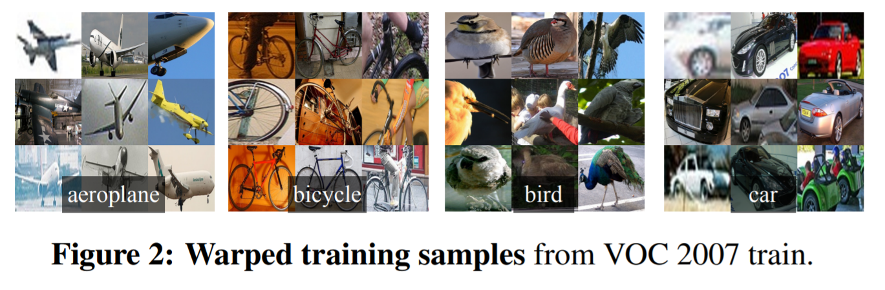

### 2.2 测试阶段检测

​        在测试阶段，在测试图像上使用selective search**抽取约2000个region proposals**(所有实验都采用selective search’s “fast mode” )。然后**变形每一个region proposal**，再通过**CNN**前向传播**计算**出**特征**。然后，对于每个类别，我们使用已训练好的类别相关的**SVM**给特征向量**打分**。然后给出一张图像中所有的scored regions，然后使用贪婪非极大抑制算法(**每个类别**是**独立进行**的)，如果一个region和那些选中有较高评分的region的IoU值大于阈值，则会**剔除**。

#### Run-time analysis. 

​        两个特性让检测变得很高效。首先，所有的**CNN参数**都是**跨类别共享**的。其次，通过CNN计算的特征向量相比其他通用方法（比如spatial pyramids 使用的bag-of-visual-word encodings）**维度**是**很低**的。UVA检测系统[39]的特征比我们的要多两个数量级(360k vs 4k)。

​        这种共享的结果就是计算region proposals和特征的耗时可以分摊到所有类别的头上(GPU：每张图13s，CPU：每张图53s)。唯一类别相关的计算是特征和SVM权重的乘积运算和NMS。实践中，所有的**点积**都可以批量化成一个单独的**矩阵和矩阵**的**乘积运算**。特征矩阵的典型大小是2000×4096，SVM权重的矩阵是4096xN，其中N是类别的数量。

​       分析表明**R-CNN可以扩展**到**上千个类别**，而不需要借助于**近似技术**（如hashing）。即使有**10万个类别**,矩阵乘法在多核CPU上只需要**10秒**而已。但这种高效不仅仅是因为使用了region proposals和共享特征。UVA系统,由于高维特征，需要**134GB的内存**来存**10万个线性预测器**，而**我们只要1.5GB**，比我们高了两个数量级。

​        更有趣的是R-CCN和最近Dean et al.使用DPMs和hashing [8]在可扩展检测工作的对比。当引入**10k个类别**时， 运行时每张图**耗时5 mins**，在VOC2007上的**mAP值约16%**。我们的方法10k个检测器,可以在单CPU上1分钟**跑**完；由于没有做近似，**mAP值**维持在**59%**(3.2节)。

### 2.3 训练

#### 监督预训练.

​        我们在大型辅助训练集ILSVRC2012**分类数据集**(没有标注边框)上预训练了CNN。预训练采用了Caffe的CNN库[24]。简单地说，我们的CNN十分接近Krizhevsky et al. [25]的网络的性能，在ILSVRC2012分类验证集在top-1错误率上比他们高2.2%。差异主要来自于**训练过程的简化**。

#### 领域精调. 

​       为了让我们的CNN适应新的任务(即检测任务)和新的领域(变形后的proposal窗口)。我们只使用warped region proposals对CNN参数进行SGD训练。我们**替掉**了ImageNet专用的1000路**分类层**，换成了一个随机初始化的(N+1)路分类层，其中N是类别数，1代表背景，而**卷积部分都没有改变**。对于VOC，N=20，对于ILSVRC2013，N=200。我们将所有与ground-truth边框的**IoU重叠>= 0.5**的region proposals作为**正例**，**其它作为负例**。SGD开始的学习率为0.001(是初始化**预训练**时的**十分之一**)，这使得精调得以有效进行而不会破坏初始化的成果。每轮SGD迭代，我们统一使用**32个正例**窗口(跨所有类别)和**96个背景**窗口，即每个mini-batch的大小是128。另外我们**倾向于**采样**正例**窗口，因为和背景相比他们很**稀少**。

#### 目标类别分类器. 

​        思考一下检测汽车的二分类器。很显然，一个图像区域紧紧包裹着一辆汽车应该就是正样本。类似的，应该看不到任何汽车的背景区域，就是负样本。**较为不确定**的是怎样标注哪些只和汽车**部分重叠**的区域。我们使用**IoU重叠阈值**来解决这个问题，**低于**这个**阈值**的就是**负例**。这个阈值我们选择了**0.3**，在验证集上网格搜索{0, 0.1, … 0.5}集合选中的。我们发现认真选择这个**阈值很重要**。如果设置为0.5，如[39]，可以降低mAP 5个点，设置为0，就会降低4个点。**正样本仅仅就是**每个类的**ground-truth边框**。

​        一旦特征提取出来，就应用标签数据，然后为每个类别优化一个线性SVM。由于训练数据太大，难以装进内存，我们选择了标准的**困难负样本挖掘**方法[17, 37]。 困难负样本挖掘**收敛很快**，实践中只要所有图像经过一轮 ，mAP就可以基本停止提升了。

​        附录B中，我们讨论了，**正例和负例**在精调和SVM训练两个阶段**定义不同**。我们也会讨论训练检测SVM的权衡问题，而不只是简单地使用来自精调后的CNN的最终softmax层的输出。

### 2.4 PASCAL VOC 2010-12上结果

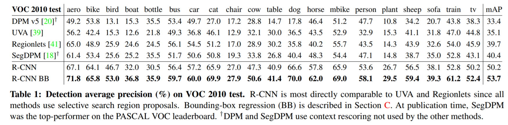

​        

​        跟随PASCAL VOC最佳实践[15],我们在VOC 2007数据集上(3.2节)验证了所有的设计决策和超参。在VOC 2012训练集上精调CNN，并且在VOC 2012训练验证集上优化检测的SVM分类器，得到了在VOC 2010-12数据集上的最终结果。我们对两种主要算法(**带边框回归**和**不带边框回归**)都只提交一次测试结果到评估服务器上.

​        表Table 1展示了在VOC 2010上的完整结果。将我们的**方法与4个基准比较**，包括SegDPM [18],组合了DPM检测器和一个语义分割系统[4]的输出,并且使用了额外的内部检测器环境和图像分离器重新打分。最恰当的比较是与来自Uijlings et al. [39]的**UVA** 系统，因为我们的系统使用了**同样的region proposal**。为了分类regions，它们的方法构建了一个4层空间金字塔，并用密集采样SIFT、扩展的OpponentSIFT和RGBSIFT描述符填充，每个向量用4000字的码本量化。使用一个直方图和核SVM的交集做分类。与它们的多特征、非线性核SVM方法相比，我们在mAP上获得较大的提升，从35.1%到53.7，同时也更快(见2.2节)。我们的方法在VOC 2011/12测试集上达到类似的性能：53.3%的mAP值。

### 2.5 ILSVRC2013 上检测结果

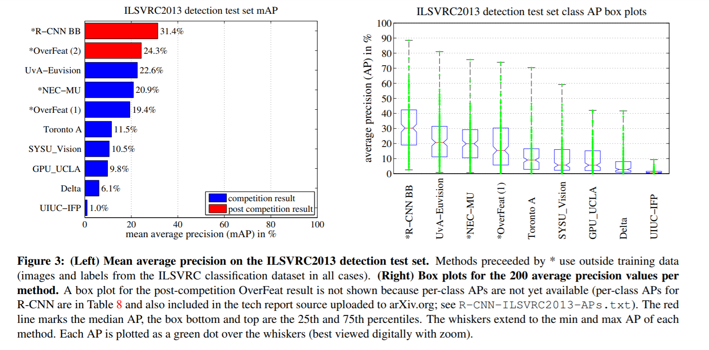

We ran R-CNN on the 200-class ILSVRC2013 detection
dataset using the same system hyperparameters that we used
for PASCAL VOC. We followed the same protocol of submitting
test results to the ILSVRC2013 evaluation server
only twice, once with and once without bounding-box regression.

​       在**200类**的ILSVRC2013检测数据集上使用了与PASCAL VOC相同的超参。同样仅仅提交两次测试结果到ILSVRC2013评估服务器，一次带边框回归，一次不带。

​         图Figure 3 比较了R-CNN和ILSVRC 2013竞赛的入围者,以及与竞争者OverFeat[34]的结果。**R-CNN**的**mAP**值达到**31.4%**，显著的领导第二好的**OverFeat**的**24.3%**。为了对各类别AP分布有个了解，展示了箱线图，每个类别的AP信息在本文末尾的表Table 8中有说明。

​        大多数竞争提交 (OverFeat, NEC-MU, UvAEuvision,Toronto A, 和UIUC-IFP)使用卷积神经网络，这表明CNN如何应用于目标检测具有**显著的细微差别**，从而**导致不同**的**结果**。

​        第4节给出了ILSVRC2013检测数据集的概述，并提供了我们在数据上执行R-CNN做出的选择详情。

## 3. 可视化、消除学习和出错的模式

### 3.1 可视化学习到的特征

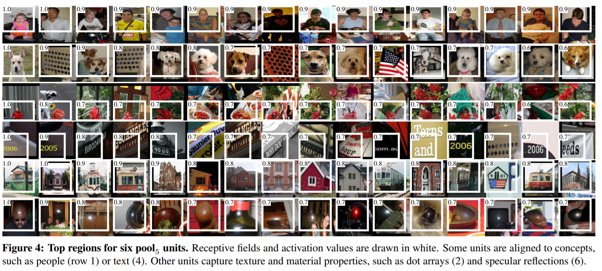

​        第一层特征过滤器可以直接可视化，并非常容易理解[25]，它们主要捕获**方向性边缘**和**对比色**。难以理解的是后面的层。Zeiler和Fergus在[42]中提出了一种视觉优雅的**去卷积**方法。我们则使用了一种简单的非参数化方法，**直接展示网络学到的东西**。

​        这个想法是单一输出网络中**一个特定神经元**(特征)，然后把它当做一个正确类别的物体检测器来使用。方法是这样的，先计算所有抽取出来的region proposals（大约1000万），计算每个region 所导致的对应**神经元**的**激活值**，然后按激活值对这些区域进行排序，然后进行非极大抑制，最后展示分值最高的若干个region。这个方法让被选中的**神经元**在遇到他想激活的输入时“自己说话”。我们避免平均化是为了看到不同的视觉模式和深入观察神经元计算出来的不变性。

​        我们可视化pool5的神经元，pool5最大池化网络的第5个和最后一个卷积层的输出。pool5的特征图是6 × 6 × 256 = 9216维。忽略边界影响，每个pool5神经元拥有**195×195**的**感受野**，**输入是227×227**。pool5中间的神经元，几乎有一个全局视角，而边缘的神经元有较小的带裁切的支持。图Figure 4的每一行显示有**最高激活**的pool5**神经元**，这个实例来自于VOC 2007上我们精调的CNN。这里只展示了256个功能单元中的6个（附录D包含更多）。这些选中的神经元作为作为"**网络学到什么**"的样例代表。第二行，**神经元**看到**狗和斑点**的时候就会**激活**，第三行对应**红斑点**。还有**人脸检测器**和一些**抽象的模式**，比如**文字**和**带窗户的三角结构**。这个网络似乎学到了一些类别调优相关的特征，这些**特征**都是**形状、纹理、颜色和材质特性**的**分布式表示**。而后续的fc6层则对这些丰富的特征建立大量的组合来表达各种不同的事物。

### 3.2 消除学习

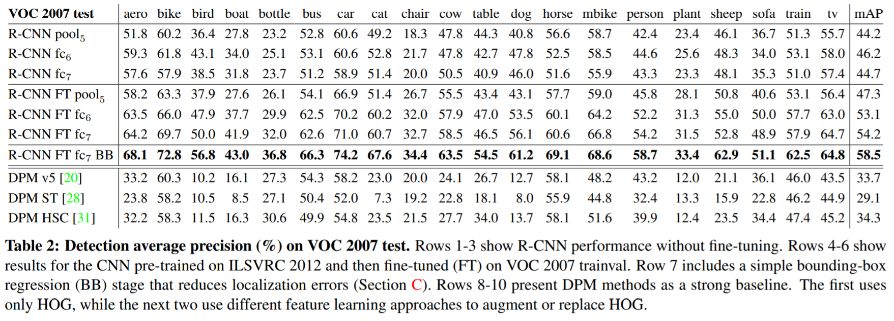

#### 未精调下各层性能

​          为了理解**哪一层**对于**检测的性能**十分**重要**，我们分析了CNN最后三层的每一层在VOC2007上面的结果。Pool5在3.1节中做过简单的描述。最后两层下面来总结一下。

​        fc6层是一个与pool5连接的全连接层。为了计算特征，pool5的feature map(reshape成一个9216维度的向量)和一个4096×9216权重矩阵相乘，并加上一个偏置向量。中间的向量是逐个组件做半波整流(就是ReLU)(x <– max(0, x))。

​        fc7是网络的最后一层。跟fc6之间通过一个4096×4096的权重矩阵相乘，也加上偏置向量，并使用ReLU。

​        我们先来看看**没有精调**的CNN在PASCAL上的表现，没有精调是指所有的CNN参数**仅仅**在**ILSVRC2012上预训练**。分析每一层(见Table 2 ，1-3行)的性能显示，来自**fc7**的特征泛化能力**不如fc6**的特征。这意味29%的CNN参数，也就是1680万的参数可以移除掉，而且**没有降低mAP**。更令人惊奇的是即使**同时移除fc6和fc7**，**也能有非常好的结果**; 而**pool5**的特征的计算，只使用**CNN参数量的6%**。可见**CNN的主要表达力来自于卷积层**，而不是更大更密集的全连接层。这一发现表明，通过仅使用CNN的卷积层来计算任意大小图像的HOG意义上的密集特征图的潜在效用。这种表示使得使用滑动窗口的检测器实验(包括DPM)，可以直接在pool5层特征上进行。

#### 有精调下各层性能

​       我们来看看**精调后**在VOC2007上的结果表现。**提升非常明显**(见Table 2， 4-6行)，mAP提升了8个百分点，达到了54.2%。**精调**对于**fc6和fc7**的**提升明显优于pool5**，这说明**pool5**从ImageNet**学习的特征是通用的**，在**它之上的层**大部分提升主要来自**学习特定领域**的非线性分类器。

#### 与最近的特征学习方法比较.

​        关于PASCAL VOC检测的特征学习方法相对较少。我们看看最近两种基于deformable part models的方法，作为参考，我们还包括标准的基于HOG的DPM的结果[20]。

​        第一种DPM特征学习方法，DPM ST [28]，用“sketch token”概率的直方图增强HOG特征。直观地说，sketch token是穿过图像patch中心的等高线的紧密分布。每个像素的Sketch token概率通过一个随机森林计算;随机森林将35×35像素的patch分类为sketch tokens中的一个或者分类为背景。

​        第二种方法,DPM HSC [31],使用稀疏码直方图(HSC)替代HOG。为了计算HSC，使用100 7×7像素(灰度)原子的学习字典在每个像素处求解稀疏码激活. 所产生的激活以三种方式(全波和两种半波)进行整流，空间池化，$l_2$标准化，然后进行幂变换($x←sign(x)|x|^\alpha$)

​         **R-CNN**的**所有变种**都**优于**这3种DPM基线(见Table 2 ,8-10行),包括使用特征学习的那两种。与仅仅使用HOG特征的最新版本的DPM比较，我们的mAP值提升超过20个点：54.2% vs. 33.7%-相对提升61%。组合HOG和sketch tokens对于只使用HOG mAP降低了 2.5个点，HSC相对HOG mAP值提升了4个点；这两种方法的mAP分别为29.1% 和 34.3%。

### 3.3 网络架构

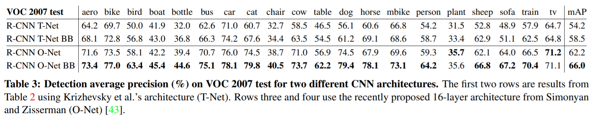

​         本文中的大部分结果所采用的架构都来自于Krizhevsky et al. [25] (**AlexNet**)。然而，我们也发现**架构**的选择**对于R-CNN的检测性能**会有**很大的影响**。表Table 3中我们展示了VOC2007测试时采用了16层的深度网络，由Simonyan和Zisserman[43] (即**VGG**)刚刚提出来。这个网络在ILSVRC 2014分类挑战上是最佳表现。这个网络采用了完全同构的13层3×3卷积核，中间穿插了5个最大池化层，顶部有三个全连接层。我们称这个网络为**O-Net**表示OxfordNet，将我们的基准网络称为**T-Net**表示TorontoNet。

​        为了使用O-Net，我们从Caffe模型库中下载了VGG ILSVRC 16 层模型的**预训练的权重**。然后使用和T-Net上**一样的操作过程进行精调**。唯一的不同是使用了**更小的mini batches**(24个样本)，主要是为了**适应GPU的内存**。表Table 3中的结果显示使用**O-Net的R-CNN表现优越**，将mAP从58.5%提升到了66.0%。然后它有个明显的缺陷就是**计算耗时**。O-Net的前向传播耗时大概是T-Net的**7倍**。

### 3.4 检测错误情况分析

We applied the excellent detection analysis tool from Hoiem et al. [23] in order to reveal our method’s error modes, understand how fine-tuning changes them, and to see how our error types compare with DPM. A full summary of the analysis tool is beyond the scope of this paper and we encourage readers to consult [23] to understand some finer details (such as “normalized AP”). Since the analysis is best absorbed in the context of the associated plots, we present the discussion within the captions of Figure 5 and Figure 6.

​        我们使用来自Hoiem et al. [23]的检测分析工具，为的是揭示我们方法的**错误模式**，明白精调怎么改变错误模式，并与DPM的错误类型比较。分析工具的完整概述超出本文的范畴，建议读者咨询[23]一些更详细的细节(如“normalized AP”)。因为最好的分析已经在吸收到相关的图中了，我

们将在图Figure 5和Figure 6中加上讨论说明。

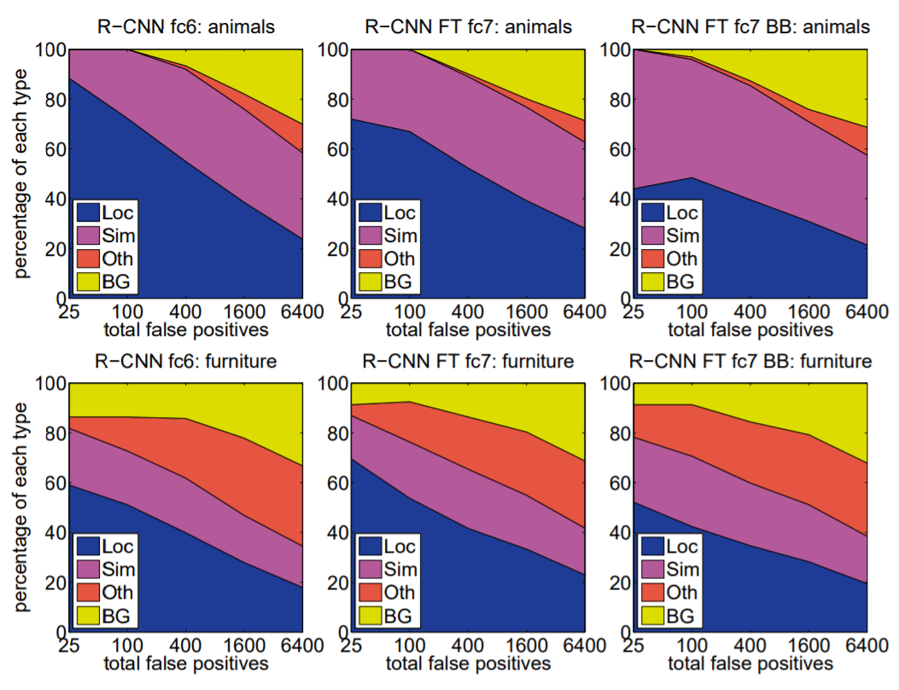

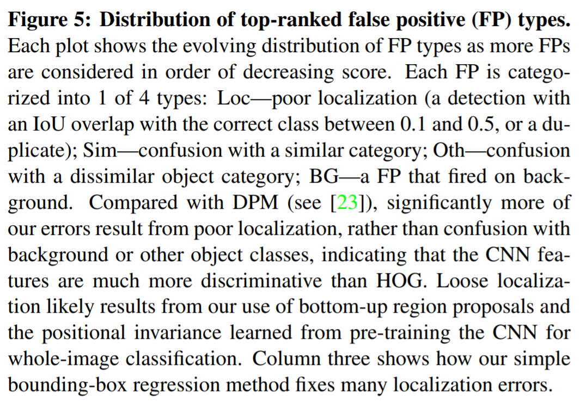

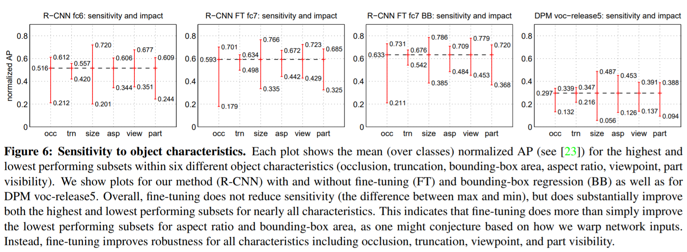

### 3.5 边框回归

​         **基于错误分析**，我们实施了一个简单的方法，减少定位错误。受到DPM[17]中使用的边框回归训练启发，我们训练了一个**线性回归模型**在给定一个selective search region proposal的pool5特征时去预测一个新的检测窗口。详细的细节参考附录C。表Table 1、Table 2和图5的结果说明这个简单的方法，**修复了大量的定位错误**的检测情况，提升了3-4个百分点。

### 3.6 定性结果

​       ILSVRC2013上定性检测结果见图Figure 8 和Figure 9. 每个图都是val2数据集上随机选择的样本，并且检测器预测值大于0.5。这些**样本没有挑选**，就是**检测器实际的表现**。

​       Figure 10 and Figure 11有呈现了更多的定性结果，不过是**经过挑选**的；我们选择哪些包含**有趣的、令人惊讶的、搞笑的结果**。同样检测器预测值大于0.5。

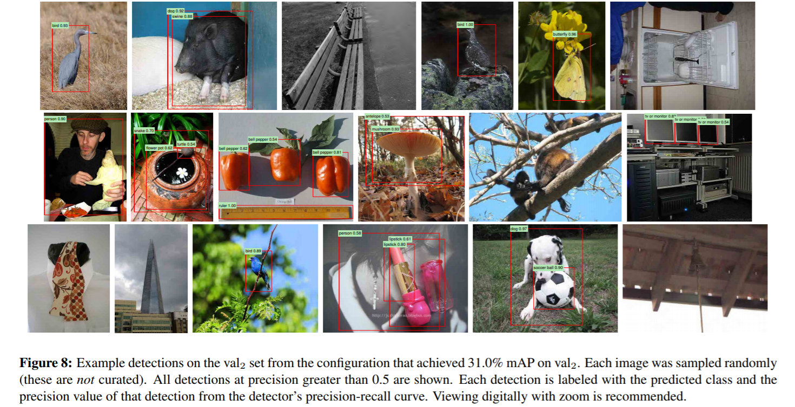

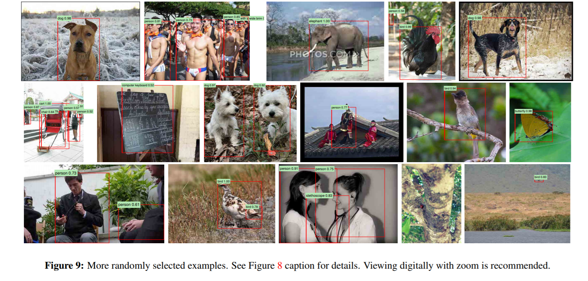

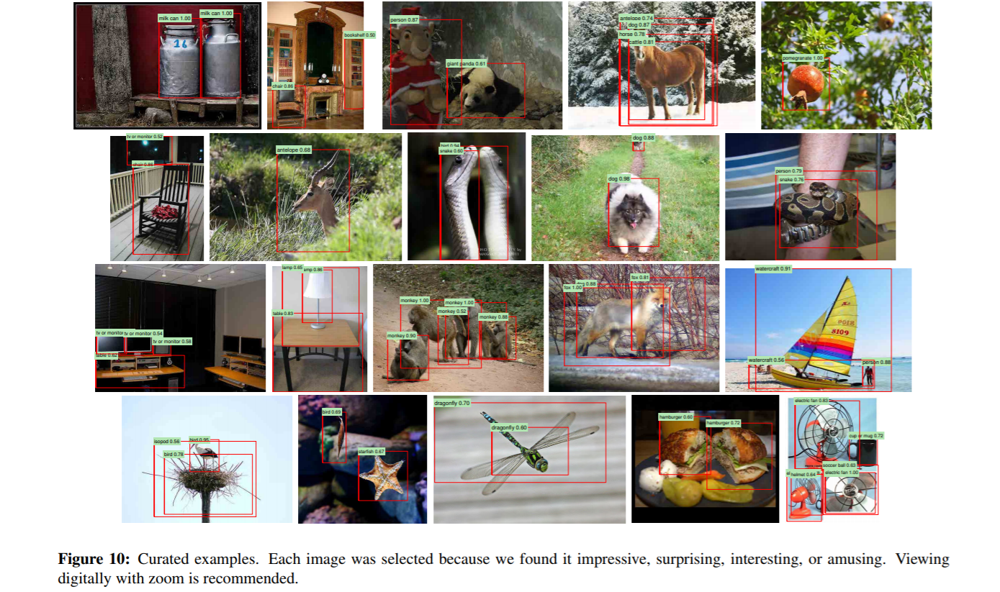

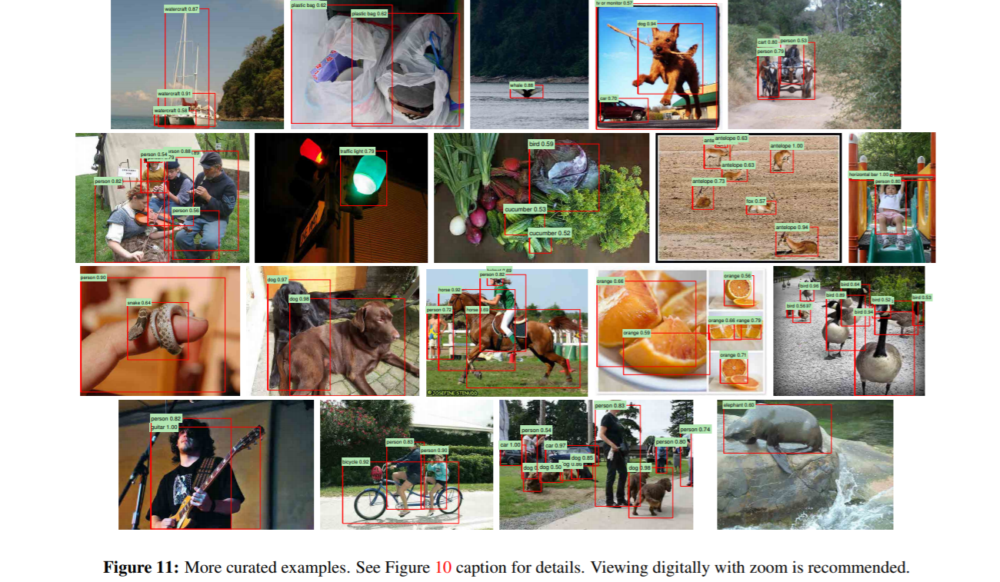

## 4. ILSVRC 2013检测数据集

​        第二节呈现了ILSVRC 2013检测数据集上的结果。这个数据集**不如PASCAL VOC同质**，**如何使用需要更多的选择**。这些决策非同寻常，本节来讨论它。

### 4.1 数据集概览

​        ILSVRC2013检测数据集分割为三个集合：训练-train(395,918)，验证-val(20,121)和测试-test (40,152)，每个集合的图像数量在括号中。**验证集**和**测试集**服从**相同**的图像**分布**。这些图像与PASCAL VOC图像场景相似，复杂度类似(目标数量、杂乱程度、姿态变化等)。**验证和测试集完完整整的标注**了，也就是说每张图片中来自**200类**的所有示例都用边框标注了。相比之下，**训练集**服从ILSVRC2013**分类图像分布**。这些图像具有更多变化的复杂性，并且倾向于单个对象位于图像中央。不同于验证和测试集，**训练集**(由于数量大)**没有完整标注**，对任意图像200类中的实例**可能标注也可能没有标注**。除了这些数据集，**每个类别**有一个额外的**负样本图像集**。负样本图像人工检查确定不包含相关类的实例。**负样本集**在**本工作中没有使用**。更多关于 ILSVRC 如何收集和标注参见[11, 36]。

​         由于数据集的性质，训练R-CNN时需要一些选择。**训练集**-train的图像**不能用作困难负样本挖掘**，因为标注不彻底。那么负样本从哪里来了？同样训练集图像的统计方式与验证集和测试集不同。是否应该使用训练集图像，如果是，多大程度使用？我们**没有彻底的评估**大量的选择，根据以往的经验，我们提出了**看似最明显的路径**。

​        我们的常规策略是**重度依赖验证集**，并使用一些**训练集**作为**正样本的辅助来源**。**训练**和**验证**都使用**验证集**，将它大致等分为“val1” 和 “val2”。由于有一些类在在验证集val中含有很少的样本(最少的只有31个，半数不超过110)，一个近似的**类平衡分割**非常重要。为此，产生大量候选分割(splits)，并选择用**最小**的**最大类别不均衡**的那个分割。每个候选分割通过使用此类的数量作为特征聚类验证集产生。这里使用的那个分割的**最大相对类不均衡**大概是11%，相对类不均衡的**中位数**是4%。用于生产它们的val1/val2分裂和代码将被公开，**以便**其他研究人员可以比较他们在本报告中使用的**验证集分割方法**。

### 4.2 Region proposals

​        使用与PASCAL数据集上检测相同的region proposal方法，Selective search [39]在val1, val2, 和test (没有在训练集上)的每张图像上使用“快速模式”执行。需要做一个小的调整，由于selective search没有尺寸不变性，所以产生的**regions数据**取决于**图像的分辨率**。ILSVRC图像尺寸范围从**非常小到几百万像素**，所以在执行selective search之前将每张图像的**宽度resize到固定的500 像素**。在验证集上，每张图**平均产生2403**个 region proposals，**覆盖了91.6%的ground-truth边框**(IoU阈值取0.5)，**显著低于**在**PASCAL上的覆盖率**(接近98%)，说明在region proposal阶段的提升空间很大。

### 4.3 训练数据

​        对于训练数据，我们形成了一个**图像**和**边框**的集合，包括来自val1的所有selective search和ground-truth边框，以及来自train的**每个类别最多N个ground-truth边框**(如果一个类别ground-truth边框少于N，取所有的)，我们称这个这个图像和边框的数据集为**val1+trainN**。在消融研究中，我们展示了N ∈ {0, 500, 1000} 在val2上的mAP值(节4.5)。R-CNN中训练需要3个过程 (1) CNN精调,(2)SVM检测器训练,(3)边框回归训练。在val1+trainN上的CNN精调执行50k个SGD迭代，与PASCAL上完全一致。精调使用Caffe，在单个VIDIA Tesla K20 上耗时13小时。对于SVM训练，所有来自val1+trainN的ground-truth边框都作为各自类别的正样本。**随机的选择**来自val1上**5000张图的子集**来执行**困难负样本挖掘**。初始的实验表明困难负样本挖掘来自**val1全部**，**对比5000张图像的子集**(大概是一半的val1)，**mAP值下降了仅仅0.5个百分点**，但是SVM训练时间减半。**负样本没有来自train**，因为它不是完整标注的，额外验证的**负样本图像也没有使用**。**边框回归在在val1上训练**。

### 4.4 验证和评估

​        在提交结果到评估服务器之前，我们在val2上使用之前提到的训练数据 验证了 **数据使用的选项**以及**精调和边框回归的影响**。所有系统超参(如 SVM的C超参，region变形的padding，NMS阈值，边框回归超参)都固定住，并且**超参值与PASCAL上一样**。毫无疑问，一些超参选项对于ILSVRC来说**略微次优**，但是我们的目标是**没有额外数据**情况下在ILSVRC 上产生一个**初步的 R-CNN结果**。在val2上确定最好的选项后，我们提交恰好两个结果文件到 ILSVRC2013 评估服务器；第一个没有边框回归，第二个有边框回归。对于这些提交，我们将**SVM和边框回归**的训**练集分别扩大**为**val+train1k**和**val**。我们使用在**val1+train1k**上精调的CNN，防止重新精调和特征计算。

### 4.5 消融研究

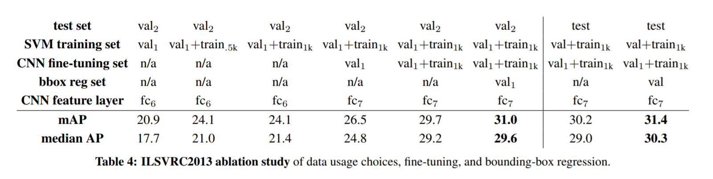

​        表Table 4显示了**不同的训练数据**、**精调**、**边框回归**的影响。首先可以看到使用**val2**和**test**作为**测试集mAP值非常接近**，这给我们信心，val2是测试集性能的很好的指向标。R-CNN达到的第一个结果20.9%，使用的是在ILSVRC2012分类数据集上预训练(没有精调)，并使用val1这种小体量数据做SVM训练(半数类别在val1中的样本量在15~55之间)。**扩展训练集到val1+trainN** 性能提升到24.1%，**在N = 500 和 N = 1000之间没有区别**。仅仅使用val1的样本精调CNN，mAP有适当的提升，到了26.5%；但这有**可能是过拟合的结果**，因为**训练正样本太少**。扩展精调数据集到val1+train1k，将每类正样本增加到1000个，显著提升mAP值到29.7%。边框回归将mAP提升到31.%，**相对于PASCAL边框回归提升较小**。

### 4.6 与OverFeat的关系

​         R-CNN和OverFeat存在一个有趣的关系：**OverFeat**可以粗略的当做**R-CNN的一个特例**。如果将selective search region proposals替换为一个**多尺度金字塔的常规方形区域**，并将**类别相关的边框回归**改为**单个边框回归**，则这两个系统非常相似(在训练方式上消除了一些潜在的显著差异：CNN检测微调，使用SVM等)。OverFeat速度明显优于R-CNN毫无意义：**大概快9倍**，每张图2秒，数据来自[34]。速度的提升是由于OverFeat’s的滑动窗口(即., region proposals)**没有**在**图像级别变形**，因此重叠窗口部分**计算容易共享**。共享是通过以卷积方式在任意大小的输入上运行整个网络来实现的。提升R-CNN速度有很多种可能方式，这部分留给未来工作。

## 5. 语义分割

Region classification is a standard technique for semantic segmentation, allowing us to easily apply R-CNN to the PASCAL VOC segmentation challenge. To facilitate a direct comparison with the current leading semantic segmentation system (called O2P for “second-order pooling”) [4], we work within their open source framework. O2P uses CPMC to generate 150 region proposals per image and then predicts the quality of each region, for each class, using support vector regression (SVR). The high performance of their approach is due to the quality of the CPMC regions and the powerful second-order pooling of multiple feature types (enriched variants of SIFT and LBP). We also note that Farabet et al. [16] recently demonstrated good results on several dense scene labeling datasets (not including PASCAL) using a CNN as a multi-scale per-pixel classifier. We follow [2, 4] and extend the PASCAL segmentation training set to include the extra annotations made available by Hariharan et al. [22]. Design decisions and hyperparameters were cross-validated on the VOC 2011 validation set. Final test results were evaluated only once.

​        区域分类是语义分割的标准技术，这使得我们很容易将R-CNN应用到PASCAL VOC分割任务的挑战。为直接和当前主流的语义分割系统(称为O2P，second-order pooling)[4]做对比，我们在它们开源的框架内工作。O2P使用CPMC针对每张图片产生150个region proposals，并预测每个区域的质量，对于每个类别，进行支持向量回归(SVR)。他们的方法很高效，主要得益于CPMC region的质量和强大的多特征类型的二阶池化(SIFT和LBP的增强变种)。我们也注意到Farabet et al. [16] 将CNN用作多尺度逐像素分类器，在几个密集场景标注数据集(不包括PASCAL)上取得了不错的成绩。我们学习[2,4]，将Hariharan et al. [22]额外标注信息扩充到PASCAL分割训练集中。设计选择和超参数都在VOC 2011验证集上进行交叉验证。最后的测试结果只评估了一次。

### 分割的CNN特征

We evaluate three strategies for computing features on CPMC regions, all of which begin by warping the rectangular window around the region to 227 × 227. The first strategy (full) ignores the region’s shape and computes CNN features directly on the warped window, exactly as we did for detection. However, these features ignore the non-rectangular shape of the region. Two regions might have very similar bounding boxes while having very little overlap. Therefore, the second strategy (fg) computes CNN features only on a region’s foreground mask. We replace the background with the mean input so that background regions are zero after mean subtraction. The third strategy (full+fg) simply concatenates the full and fg features; our experiments validate their complementarity

​        为了计算CPMC区域上的特征，我们执行了三个策略，每个策略都先将矩形窗口变形到227×227大小。第一个策略(full)完全忽略区域的形状，直接在变形后的窗口上计算CNN特征，就和我们检测时做的一样。但是，这些特征忽略了区域的非矩形形状。两个区域也许有相似的边框却几乎没有重叠。因此，第二个策略(fg，foreground)只计算前景掩码(foreground mask)的CNN特征，我们将所有的背景像素替换成输入的均值，这样减除平均值后他们就会变成0。第三个策略(full+fg)，简单的并联全部(full)特征和前景(fg)特征；我们的实验验证了他们的互补性。

### VOC 2011结果

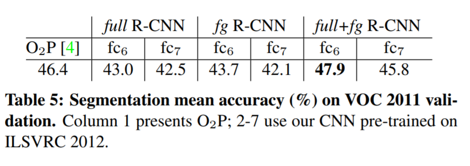

Table 5 shows a summary of our results on the VOC 2011 validation set compared with O2P. (See Appendix E for complete per-category results.) Within each feature computation strategy, layer fc6 always outperforms fc7 and the following discussion refers to the fc6 features. The fg strategy slightly outperforms full, indicating that the masked region shape provides a stronger signal, matching our intuition. However, full+fg achieves an average accuracy of 47.9%, our best result by a margin of 4.2% (also modestly outperforming O2P), indicating that the context provided by the full features is highly informative even
given the fg features. Notably, training the 20 SVRs on our full+fg features takes an hour on a single core, compared to 10+ hours for training on O2P features. In Table 6 we present results on the VOC 2011 test
set, comparing our best-performing method, fc6 (full+fg),against two strong baselines. Our method achieves the highest segmentation accuracy for 11 out of 21 categories, and the highest overall segmentation accuracy of 47.9%, averaged across categories (but likely ties with the O2P result under any reasonable margin of error). Still better performance could likely be achieved by fine-tuning.

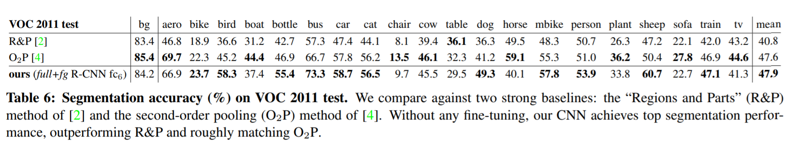

## 6. 总结

In recent years, object detection performance had stagnated. The best performing systems were complex ensembles combining multiple low-level image features with high-level context from object detectors and scene classifiers. This paper presents a simple and scalable object detection algorithm that gives a 30% relative improvement over the best previous results on PASCAL VOC 2012. We achieved this performance through two insights. The first is to apply high-capacity convolutional neural networks to bottom-up region proposals in order to localize and segment objects. The second is a paradigm for training large CNNs when labeled training data is scarce. We show that it is highly effective to pre-train the network— with supervision—for a auxiliary task with abundant data (image classification) and then to fine-tune the network for the target task where data is scarce (detection). We conjecture that the “supervised pre-training/domain-specific finetuning” paradigm will be highly effective for a variety of
data-scarce vision problems.We conclude by noting that it is significant that we achieved these results by using a combination of classical tools from computer vision and deep learning (bottom-up region proposals and convolutional neural networks). Rather than opposing lines of scientific inquiry, the two are natural and inevitable partners.

​        近年，目标检测的性能停滞不前。目标检测和场景分类器中性能最好的系统是复杂的集成系统，组合了多个低级图像特征和高级上下文环境。本文提出一个简单可扩展的目标检测算法，在PASCAL VOC 2012相对于之前最好的结果有30%的提升。我们通过两点洞察达到这个性能。第一，将高容量的卷积神经网络应用到自底向上的region proposals来定位和分隔对象。第二，一个在训练数据不足的情况下训练大型CNN的范式。我们展示了监督预训练是非常高效的-一个有大量数据(图像分类)的辅助任务，然后在数据不足(检测)的目标任务上精调。我们推断"监督预训练/特定领域精调"模式将在各种各样的数据稀少的视觉问题中表现高效。我们注意到通过组合传统的计算机视觉的经典工具和深度学习(自底向上的region proposals和卷积神经网络)。而不是相反的科学研究，他们是天生的、不可避免的伙伴。

### 致谢

This research was supported in part by DARPA Mind’s Eye and MSEE programs, by NSF awards IIS-0905647, IIS-1134072, and IIS-1212798, MURI N000014-10-1-0933, and by support from Toyota.The GPUs used in this research were generously donated by the NVIDIA Corporation.

## 附录

### A Object proposal transformations

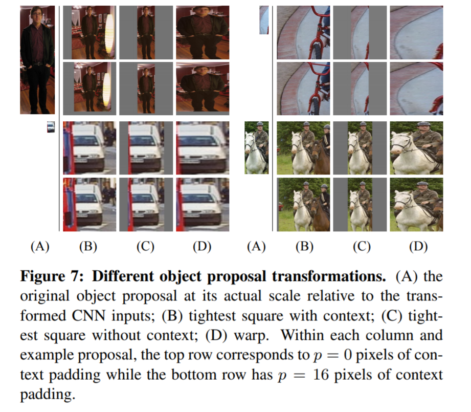

The convolutional neural network used in this work requires a fixed-size input of 227 × 227 pixels. For detection, we consider object proposals that are arbitrary image rectangles. We evaluated two approaches for transforming object proposals into valid CNN inputs. The first method (“tightest square with context”) encloses each object proposal inside the tightest square and then scales (isotropically) the image contained in that square to the CNN input size. Figure 7 column (B) shows this transformation. A variant on this method (“tightest square without context”) excludes the image content that surrounds the original object proposal. Figure 7 column (C) shows this transformation. The second method (“warp”) anisotropically scales each object proposal to the CNN input size. Figure 7 column (D) shows the warp transformation. For each of these transformations, we also consider including additional image context around the original object
proposal. The amount of context padding (p) is defined as a border size around the original object proposal in the transformed input coordinate frame. Figure 7 shows p = 0 pixels in the top row of each example and p = 16 pixels in the bottom row. In all methods, if the source rectangle extends beyond the image, the missing data is replaced with the image mean (which is then subtracted before inputing the image into the CNN). A pilot set of experiments showed that warping with context padding (p = 16 pixels) outperformed
the alternatives by a large margin (3-5 mAP points).Obviously more alternatives are possible, including using replication instead of mean padding. Exhaustive evaluation of these alternatives is left as future work.

​         CNN需要固定的227 × 227像素的输入，目标检测中目标proposals是任意的图像矩形。我们评估了两种将目标proposals转为CNN有效输入的方法。

​         第一种方法(“tightest square with context”) ，将每个目标proposal包围到最紧的方形中，然后缩放(各向同性)到CNN输入的尺寸。图Figure 7 B列展示了这种转换。这种方法的一个变种是排除包围在原始目标proposal外层的环境信息。图Figure 7 C列展示了这种转换。

​         第二种方法("warp")，各向异性的缩放每个目标proposal为CNN输入尺寸。图Figure 7 C列展示了这种变形。

​         对于每一种转换，我们考虑包含包围原始目标proposal的图像环境信息。上下文填充(p)的数量定义为在转换后的输入坐标框架内的原始目标proposal周围的边框大小。所有方法中，如果原始矩形扩展超出了图像边界，缺失数据用图像均值替代(然后在输入到CNN是被减掉了)。一组实验展示带环境填充(p=16像素)的变形大幅胜过其它方法(mAP 3~5个点)。很明显有其它可能替代方法，包括替换而不是均值填充，完整的评估这些替代方法留到未来的工作中。

### B 正样本 vs 负样本 和 softmax

Two design choices warrant further discussion. The first is: Why are positive and negative examples defined differently for fine-tuning the CNN versus training the object detection SVMs? To review the definitions briefly, for finetuning we map each object proposal to the ground-truth instance with which it has maximum IoU overlap (if any) and label it as a positive for the matched ground-truth class if the IoU is at least 0.5. All other proposals are labeled “background” (i.e., negative examples for all classes). For training
SVMs, in contrast, we take only the ground-truth boxes as positive examples for their respective classes and label proposals with less than 0.3 IoU overlap with all instances of a class as a negative for that class. Proposals that fall into the grey zone (more than 0.3 IoU overlap, but are not ground truth) are ignored.

​        两个设计选择值得进一步讨论；第一：为什么正负样本的定义在CNN精调和训练SVM目标检测时不一样？简单的回顾下，对于精调每个目标proposal 与ground-truth实例比较，对于IoU最大的那个ground-truth，如果IoU值大于0.5，就将目标proposal作为那个ground-truth类别的正样本；其它的所有proposals都标注为背景(即，对所有类别都是负样本)。对于训练SVM,相反，仅仅将ground-truth作为对应类别的正样本，与这类所有ground-truth实例IoU值都小于0.3的proposals 作为这个类的负样本；灰色地带的proposal(IoU大于0.3,但又不是ground truth)的忽略。

Historically speaking, we arrived at these definitions because we started by training SVMs on features computed by the ImageNet pre-trained CNN, and so fine-tuning was not a consideration at that point in time. In that setup, we found that our particular label definition for training SVMs was optimal within the set of options we evaluated (which included the setting we now use for fine-tuning). When we started using fine-tuning, we initially used the same positive and negative example definition as we were using for SVM
training. However, we found that results were much worse than those obtained using our current definition of positives and negatives. 

​        历史上来说，我们使用这个定义是因为刚开始训练SVMs使用的ImageNet上预训练的CNN，所以那时候没有考虑精调。在该设置中，我们发现我们用于训练SVM的特定标签定义在我们评估的选项集内是最优的(就是现在用于精调的设置)。当开始使用精调，开始使用SVM训练相同的设置；但是结果比现在定义的正样本和负样本差很多。

Our hypothesis is that this difference in how positives and negatives are defined is not fundamentally important and arises from the fact that fine-tuning data is limited. Our current scheme introduces many “jittered” examples (those proposals with overlap between 0.5 and 1, but not ground truth), which expands the number of positive examplesby approximately 30x. We conjecture that this large set is needed when fine-tuning the entire network to avoid overfitting. However, we also note that using these jittered examples is likely suboptimal because the network is not being fine-tuned for precise localization.

​        我们的假设是，这种正负样本如何定义的差异并不重要，并且由于精调数据是有限的。我们当前的方案引入了很多"抖动"样本(这些proposals的IoU在0.5~1之间)，这将正样本扩大了将近30倍。我们推测这种大数据集是需要的，可以防止整个网络过拟合。但是这些抖动的样本可能不是最理想的，因为网络并未对精准定位进行精调。

This leads to the second issue: Why, after fine-tuning, train SVMs at all? It would be cleaner to simply apply the last layer of the fine-tuned network, which is a 21-way softmax regression classifier, as the object detector. We tried this and found that performance on VOC 2007 dropped from 54.2% to 50.9% mAP. This performance drop likely arises from a combination of several factors including that the definition of positive examples used in fine-tuning does not emphasize precise localization and the softmax classi-
fier was trained on randomly sampled negative examples rather than on the subset of “hard negatives” used for SVM training.

​         这就引出第二个问题：为什么精调后还要训练SVM？可以之间使用精调后的最后一层21类softmax回归分类器作为目标检测器。我们尝试过，结果VOC 2007上的mAP从54.2% 降到 50.9%。性能下降可能由一系列因素综合作用，包括精调中定义的正样本没有突出精确定位，以及softmax分类器在随机负样本上训练而不是“困难负样本”的子集。

This result shows that it’s possible to obtain close to the same level of performance without training SVMs after fine-tuning. We conjecture that with some additional tweaks to fine-tuning the remaining performance gap may be closed. If true, this would simplify and speed up R-CNN training with no loss in detection performance.

​        这个结果表明不训练SVMs也可以接近相同级别的性能。我们推测在精调上做一些额外的调整，性能差距会接近。如果果真如此，这将简化和加速R-CNN训练，而不损失检测性能。

### C 边框回归

We use a simple bounding-box regression stage to improve localization performance. After scoring each selective search proposal with a class-specific detection SVM, we predict a new bounding box for the detection using a class-specific bounding-box regressor. This is similar in spirit to the bounding-box regression used in deformable part models [17]. The primary difference between the two approaches is that here we regress from features computed by the CNN, rather than from geometric features computed
on the inferred DPM part locations.

​         我们使用一个简单的边框回归阶段来提升定位性能。在使用一个类别相关的检测SVM给每个selective search proposal评分后，使用个类别相关的边框回归器来预测一个新的边框。在思想上类似于deformable part models [17]中使用的边框回归。这两种方法之间的主要区别在于，这里我们回归使用的是从CNN计算的特征，而不是从推断的DPM部分位置计算的几何特征。

​        训练算法的输入是N个训练对$\{(P^i, G^i\}_{i=1,...,N}$,这里$P^i=(P^i_x,P^i_y,P^i_w,P^i_h)$ 代表proposal的中心点坐标和边框的宽度和高度(单位像素)。因此在非必需情况下我们省略上标$i$ 。每个ground-true边框使用相同方式表示：$G=(G_x,G_y,G_w,G_h)$ 。我们的目标是学习一个函数将proposal边框P映射到groud-true边框G。

We parameterize the transformation in terms of four
functions dx(P), dy(P), dw(P), and dh(P). The first
two specify a scale-invariant translation of the center of
P’s bounding box, while the second two specify log-space
translations of the width and height of P’s bounding box.
After learning these functions, we can transform an input
proposal P into a predicted ground-truth box Gˆ by applying
the transformation

​        我们使用4个函数$d_x(P),d_y(P),d_w(P),d_h(P)$ 来表示变换参数。前两个代表P边框中心比例不变的平移，后两个是是P边框宽度和高度对数空间的转换。学习这些函数后，我们可以使用如下公式，将一个输入的proposal P转换为预测的ground-true $\hat G$ 

​        

​         每个函数$d_*(P)$ (\*是$x,y,h,w$ 中的一个)是边框P的pool5层特征(记做$\phi_5(P)$ )的线性函数。因此$d_*(P) = w^T_*\phi_5(P)$, $w_*$ 是模型需要学习的参数向量。我们优化最小二乘目标函数(岭回归)：
$$
w_* = arg\min_{\hat w_*} \sum_i^N(t^i_* - \hat w^T_* \phi_5(P^i))^2 + \lambda||\hat w||^2. \tag 5
$$
​         对于训练对(P,G)回归的目标$t_*$定义如下：

 $t_x = (G_x - P_x)/P_w$  (6)

 $t_y = (G_y - P_y)/P_h$  (7)

 $t_w = log(G_w/P_w) $    (8)

$t_h = log(G_h/P_h)$   (9)

​        作为标准的最小二程问题，可以在封闭形式下高效求解。

We found two subtle issues while implementing bounding-box regression. The first is that regularization
is important: we set λ = 1000 based on a validation set. The second issue is that care must be taken when selecting which training pairs (P, G) to use. Intuitively, if P is far from all ground-truth boxes, then the task of transforming P to a ground-truth box G does not make sense. Using examples like P would lead to a hopeless learning problem. Therefore, we only learn from a proposal P if it is nearby at least one ground-truth box. We implement “nearness” by assigning P to the ground-truth box G with which it has maximum IoU overlap (in case it overlaps more than one) if and only if the overlap is greater than a threshold (which we set to 0.6 using a validation set). All unassigned proposals are discarded. We do this once for each object class in order to learn a set of class-specific bounding-box regressors.

​        我们在实现边界框回归时发现了两个微妙的问题. 第一个是正则化非常重要：我们在验证集上设置λ = 1000。第二个问题是训练对(P,G)的选择要非常谨慎。直观上来说，如果P和所有的ground-truth边框都非常远，那么将P转换为一个ground-truth边框G没有意义，使用这样的P会导致无法学习的问题。因此我们仅仅学习那些至少在一个ground-truth边框附近的P。我们通过将P赋给与其具有最大IoU重叠（如果它重叠多于一个）的ground-truth边框G来实现“nearness”，当且仅当重叠大于阈值(在验证集上设置为0.6)；其它没有指定的proposals 都丢弃。为了学习一个类别相关的边框回归器，我们对每个目标类别都做一次这种操作。

At test time, we score each proposal and predict its new detection window only once. In principle, we could iterate this procedure (i.e., re-score the newly predicted bounding box, and then predict a new bounding box from it, and so on). However, we found that iterating does not improve results.

​        预测时，我们对每个边框仅仅做一次评分和预测新的检测窗口。原则上，我们可以迭代这个过程(即，重新评分新预测的边界框，然后从新的边框再预测新的边界框，如此反复)。但是，我们发现迭代不会改进结果。

​       

### D 补充的特征可视化

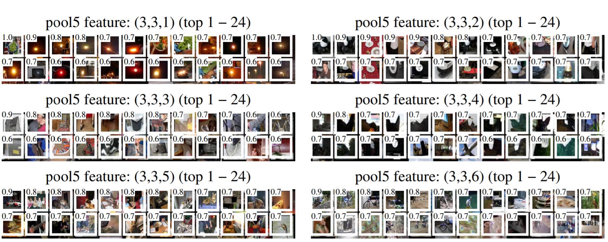

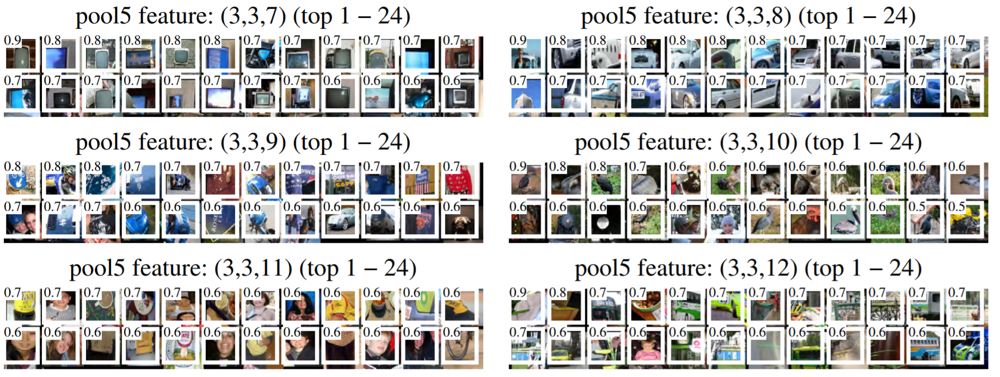

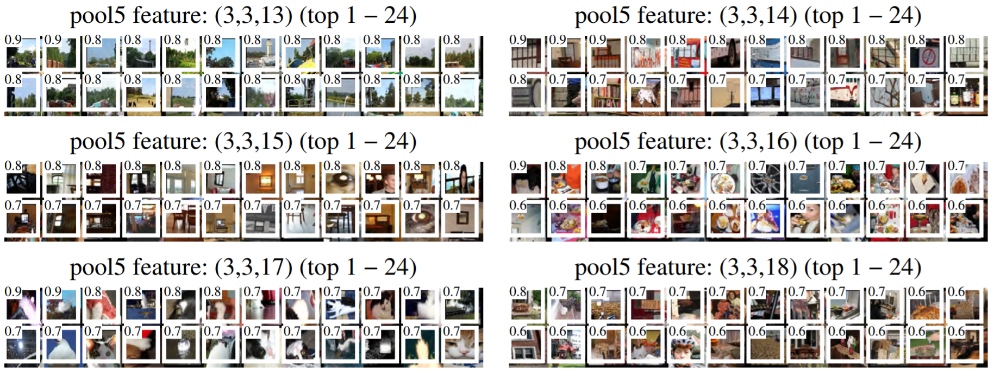

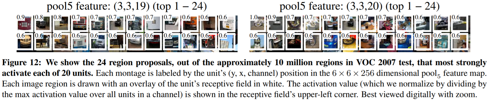

Figure 12 shows additional visualizations for 20 pool5 units. For each unit, we show the 24 region proposals that maximally activate that unit out of the full set of approximately 10 million regions in all of VOC 2007 test. We label each unit by its (y, x, channel) position in the 6 × 6 × 256 dimensional pool5 feature map. Within each channel, the CNN computes exactly the same function of the input region, with the (y, x) position changing only the receptive field.

​         图Figure 12可视化的pool5的20个神经元。对每个神经元，我们展示了在接近1千万regions的VOC 2007集中，最大激活该神经元的24个regions。用(y, x, channel)标记每个神经元在 6 × 6 × 256维pool5 特征图中的位置。每个通道内，CNN对输入region的计算使用的是相同的函数， (y, x) 改变的是感受野。

### E. Per-category segmentation results

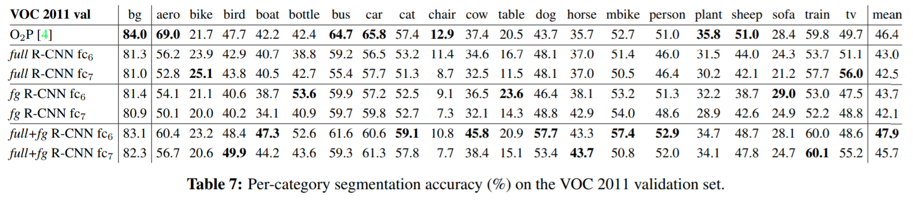

In Table 7 we show the per-category segmentation accuracy on VOC 2011 val for each of our six segmentation methods in addition to the O2P method [4]. These results show which methods are strongest across each of the 20 PASCAL classes, plus the background class

​       表Table7,除了O2P方法[4]外，我们显示针对6种分割方法中的每一种了VOC 2011 val数据集上每类的分割准确性。这些结果显示了20个PASCAL中的每个类别以及背景类中最强的方法。

### F Analysis of cross-dataset redundancy

One concern when training on an auxiliary dataset is that there might be redundancy between it and the test set. Even though the tasks of object detection and whole-image classification are substantially different, making such cross-set redundancy much less worrisome, we still conducted a thorough investigation that quantifies the extent to which PASCAL test images are contained within the ILSVRC 2012
training and validation sets. Our findings may be useful to researchers who are interested in using ILSVRC 2012 as training data for the PASCAL image classification task. 

​        有人关注当在辅助数据集上训练时，可能会与测试集数据有冗余。即使目标检测任务和整张图像分析本质不同，基本不用担心数据集之间的冗余问题；我们仍然进行一个彻底的调查来量化PASCAL 测试图像有多少包含在ILSVRC 2012训练和验证集中。我们的调查结果对于想使用ILSVRC 2012作为训练数据来做PASCAL图像分类任务的研究者非常有用。

We performed two checks for duplicate (and nearduplicate) images. The first test is based on exact matches of flickr image IDs, which are included in the VOC 2007 test annotations (these IDs are intentionally kept secret for subsequent PASCAL test sets). All PASCAL images, and about half of ILSVRC, were collected from flickr.com. This check turned up 31 matches out of 4952 (0.63%). 

​        我们对重复(或者近似重复)图像执行两种核对。第一种检测基于flickr图像ID匹配，这个ID包含在VOC 2007测试集的标注中(),所有的PASCAL 图像以及约一半的ILSVRC图像来自flickr.com。这个检测最终在4952 中匹配到31(0.63%).

The second check uses GIST [30] descriptor matching, which was shown in [13] to have excellent performance at near-duplicate image detection in large (> 1 million) image collections. Following [13], we computed GIST descriptors on warped 32 × 32 pixel versions of all ILSVRC 2012 trainval and PASCAL 2007 test images. 

​        第二种检测使用GIST [30]descriptor匹配，在[13]展示了在在大体量(超过100w)图像集中高效检测近似重复图像的能力。效仿[13],我们在 ILSVRC 2012 trainval和PASCAL 2007 test上对变形后的32 × 32像素计算GIST descriptors。

​        

Euclidean distance nearest-neighbor matching of GIST descriptors revealed 38 near-duplicate images (including all 31 found by flickr ID matching). The matches tend to vary slightly in JPEG compression level and resolution, and to a lesser extent cropping. These findings show that the overlap is small, less than 1%. For VOC 2012, because flickr IDs are not available, we used the GIST matching method only. Based on GIST matches, 1.5% of VOC 2012 test images are in ILSVRC 2012 trainval. The slightly higher rate for VOC 2012 is likely due to the fact that the two datasets were collected closer together in time than VOC 2007 and ILSVRC 2012 were.

​         欧式距离最邻近匹配GIST descriptors 发现38个接近重复图像(包含了flickr ID匹配的那31个)。这些匹配在JPEG压缩级别和分辨率方面往往略有不同，并且在较小程度上裁剪。这些发现表明重叠非常少，小于1%。对于VOC 2012由于 flickr ID不可得，我们仅仅使用GIST 匹配。基于GIST 匹配，1.5%的VOC 2012 测试集图像包含在ILSVRC 2012 trainval中。VOC 2012稍稍高一点的比例可能是由于两个数据集收集的时间相对于VOC 2007和ILSVRC 2012更接近。

### G 文档更新日志

This document tracks the progress of R-CNN. To help readers understand how it has changed over time, here’s a brief changelog describing the revisions.

v1 Initial version.

v2 CVPR 2014 camera-ready revision. Includes substantial improvements in detection performance brought about by (1) starting fine-tuning from a higher learning rate (0.001 instead of 0.0001), (2) using context padding when preparing CNN inputs, and (3) bounding-box regression to fix localization errors.

v3 Results on the ILSVRC2013 detection dataset and comparison with OverFeat were integrated into several sections
(primarily Section 2 and Section 4).

v4 The softmax vs. SVM results in Appendix B contained an error, which has been fixed. We thank Sergio Guadarrama for helping to identify this issue. 

v5 Added results using the new 16-layer network architecture from Simonyan and Zisserman [43] to Section 3.3 and Table 3.

​        本文档跟踪R-CNN的进展情况，帮助读者了解它随着时间的推移如何变化，以下是描述修订的简要更新日志。

**v1** 初始版本

**v2** CVPR 2014相机就绪版本,包括检查性能的重大提升，通过

​     (1) 精调的初始学习率更大(0.001而不是0.0001)

​     (2) 对CNN的输入使用背景填充

​     (3) 边框回归解决定位错误

**v3**  ILSVRC2013检测数据集上的结果以及与OverFeat的比较，包含在很多章节中(主要是第2节和第4节)

**v4**  修正附录B中softmax vs. SVM结果包含的错误。感谢Sergio Guadarrama指出这个问题

**v5**  在3.3节和表Table 3中增加了来自Simonyan and Zisserman [43]的16-层网络结构的结果。

## 参考文献

[1] B. Alexe, T. Deselaers, and V. Ferrari. Measuring the objectness of image windows. TPAMI, 2012.
[2] P. Arbelaez, B. Hariharan, C. Gu, S. Gupta, L. Bourdev, and J. Malik. Semantic segmentation using regions and parts. InCVPR, 2012. 10, 11
[3] P. Arbelaez, J. Pont-Tuset, J. Barron, F. Marques, and J. Ma-lik. Multiscale combinatorial grouping. In CVPR, 2014. 3
[4] J. Carreira, R. Caseiro, J. Batista, and C. Sminchisescu. Semantic segmentation with second-order pooling. In ECCV, 2012.
[5] J. Carreira and C. Sminchisescu. CPMC: Automatic object segmentation using constrained parametric min-cuts.
[6] D. Cires¸an, A. Giusti, L. Gambardella, and J. Schmidhuber. Mitosis detection in breast cancer histology images with deep neural networks. In MICCAI, 2013.
[7] N. Dalal and B. Triggs. Histograms of oriented gradients for human detection. In CVPR, 2005.
[8] T. Dean, M. A. Ruzon, M. Segal, J. Shlens, S. Vijayanarasimhan, and J. Yagnik. Fast, accurate detection of 100,000 object classes on a single machine. In CVPR, 2013.
[9] J. Deng, A. Berg, S. Satheesh, H. Su, A. Khosla, and L. FeiFei. ImageNet Large Scale Visual Recognition Competition 2012 (ILSVRC2012). http://www.image-net.org/challenges/LSVRC/2012/.
[10] J. Deng, W. Dong, R. Socher, L.-J. Li, K. Li, and L. FeiFei. ImageNet: A large-scale hierarchical image database. In CVPR, 2009.
[11] J. Deng, O. Russakovsky, J. Krause, M. Bernstein, A. C. Berg, and L. Fei-Fei. Scalable multi-label annotation. In CHI, 2014.
[12] J. Donahue, Y. Jia, O. Vinyals, J. Hoffman, N. Zhang, E. Tzeng, and T. Darrell. DeCAF: A Deep Convolutional Activation Feature for Generic Visual Recognition. In ICML, 2014.
[13] M. Douze, H. Jegou, H. Sandhawalia, L. Amsaleg, and C. Schmid. Evaluation of gist descriptors for web-scale image search. In Proc. of the ACM International Conference on Image and Video Retrieval, 2009.
[14] I. Endres and D. Hoiem. Category independent object proposals. In ECCV, 2010. 3
[15] M. Everingham, L. Van Gool, C. K. I. Williams, J. Winn, and A. Zisserman. The PASCAL Visual Object Classes (VOC) Challenge. IJCV, 2010.
[16] C. Farabet, C. Couprie, L. Najman, and Y. LeCun. Learning hierarchical features for scene labeling. TPAMI, 2013.
[17] P. Felzenszwalb, R. Girshick, D. McAllester, and D. Ramanan. Object detection with discriminatively trained part based models. TPAMI, 2010.
[18] S. Fidler, R. Mottaghi, A. Yuille, and R. Urtasun. Bottom-up segmentation for top-down detection. In CVPR, 2013.
[19] K. Fukushima. Neocognitron: A self-organizing neural network model for a mechanism of pattern recognition unaffected by shift in position. Biological cybernetics, 36(4):193–202, 1980.
[20] R. Girshick, P. Felzenszwalb, and D. McAllester. Discriminatively trained deformable part models, release 5. http://www.cs.berkeley.edu/˜rbg/latent-v5/.
[21] C. Gu, J. J. Lim, P. Arbelaez, and J. Malik. Recognition using regions. In CVPR, 2009.
[22] B. Hariharan, P. Arbelaez, L. Bourdev, S. Maji, and J. Malik. Semantic contours from inverse detectors. In ICCV, 2011.
[23] D. Hoiem, Y. Chodpathumwan, and Q. Dai. Diagnosing error in object detectors. In ECCV. 2012.
[24] Y. Jia. Caffe: An open source convolutional architecture for fast feature embedding. http://caffe.berkeleyvision.org/, 2013.
[25] A. Krizhevsky, I. Sutskever, and G. Hinton. ImageNet classification with deep convolutional neural networks. In NIPS, 2012.
[26] Y. LeCun, B. Boser, J. Denker, D. Henderson, R. Howard, W. Hubbard, and L. Jackel. Backpropagation applied to handwritten zip code recognition. Neural Comp., 1989.
[27] Y. LeCun, L. Bottou, Y. Bengio, and P. Haffner. Gradientbased learning applied to document recognition. Proc. of the IEEE, 1998.
[28] J. J. Lim, C. L. Zitnick, and P. Dollar. Sketch tokens: A learned mid-level representation for contour and object detection. In CVPR, 2013.
[29] D. Lowe. Distinctive image features from scale-invariant keypoints. IJCV, 2004.
[30] A. Oliva and A. Torralba. Modeling the shape of the scene: A holistic representation of the spatial envelope. IJCV, 2001.
[31] X. Ren and D. Ramanan. Histograms of sparse codes for object detection. In CVPR, 2013.
[32] H. A. Rowley, S. Baluja, and T. Kanade. Neural networkbased face detection. TPAMI, 1998.
[33] D. E. Rumelhart, G. E. Hinton, and R. J. Williams. Learning internal representations by error propagation. Parallel Distributed Processing, 1:318–362, 1986.
[34] P. Sermanet, D. Eigen, X. Zhang, M. Mathieu, R. Fergus, and Y. LeCun. OverFeat: Integrated Recognition, Localization and Detection using Convolutional Networks. In ICLR, 2014.
[35] P. Sermanet, K. Kavukcuoglu, S. Chintala, and Y. LeCun. Pedestrian detection with unsupervised multi-stage feature learning. In CVPR, 2013.
[36] H. Su, J. Deng, and L. Fei-Fei. Crowdsourcing annotations for visual object detection. In AAAI Technical Report, 4th Human Computation Workshop, 2012.
[37] K. Sung and T. Poggio. Example-based learning for viewbased human face detection. Technical Report A.I. Memo No. 1521, Massachussets Institute of Technology, 1994.
[38] C. Szegedy, A. Toshev, and D. Erhan. Deep neural networks for object detection. In NIPS, 2013.
[39] J. Uijlings, K. van de Sande, T. Gevers, and A. Smeulders. Selective search for object recognition. IJCV, 2013.
[40] R. Vaillant, C. Monrocq, and Y. LeCun. Original approach for the localisation of objects in images. IEE Proc on Vision, Image, and Signal Processing, 1994.
[41] X. Wang, M. Yang, S. Zhu, and Y. Lin. Regionlets for generic object detection. In ICCV, 2013.
[42] M. Zeiler, G. Taylor, and R. Fergus. Adaptive deconvolutional networks for mid and high level feature learning. In CVPR, 2011.
[43] K. Simonyan and A. Zisserman. Very Deep Convolutional Networks for Large-Scale Image Recognition. arXiv preprint, arXiv:1409.1556, 2014.

总结
--------

 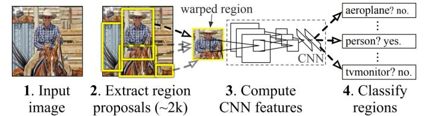

### Region proposals生成

       使用selective search为每个图片生成2k个Region proposals(建议区域/候选框)。

### 训练过程

#### a) 监督预训练

      已经在分类数据集上训练好的CNN。

#### b) 精调CNN

输入：

-        将Region
    proposals变形为CNN输入的大小（227\*227）；在变形前，将原始候选框周围增加p(p=16)个像素padding；如果padding超过了原始图片使用Region
    proposals的均值替换。这样生成了Warped region。

-        将warped region 减去自身均值后就是输入了（输入大小227\*227）。

模型说明：

-        cnn结构不变，只修改最后分类个数为N+1;N为对象类别数。

-        使用SGD训练，学习率为0.001（预训练模型学习率的1/10）

-        每个mini-batch 128个样本，其中正样本32个(涵盖所有类，N类)，负样本96个.

-        正样本为Region proposals与Ground Truth的IoU大于0.5的；其它都为负样本

#### c) 对象分类

      对每个类别训练一个SVM分类器。

输入：Region通过CNN提取的特征向量

输出：属于某个类别的评分

正样本：仅仅是Ground Truth代表的Region.

负样本：IoU值小于阈值0.3的Region. 其它Region的忽略

      由于训练样本太大使用hard negative mining method。

#### d) 边框回归

模型：

        算法生成的Region proposals
Box和实际的Ground-Truth肯定存在出入，我们希望这些box能尽可能接近Ground
Truth。对每个 假设Region proposals(P代表)经过如下线性变换到 Ground Truth( $\hat{G}​$代表)；其中x，y代表坐标，w,h代表宽度和高度。

​     $\hat G_x = P_wd_x(P) + P_x$    

​     $\hat G_y = P_hd_y(P) + P_y$  

​     $\hat G_w = P_wexp(d_w(P))$ 

​     $\hat G_h = P_hexp(d_h(P)))$

  

注：$d_*(P) = w^T_*\phi_5(P)$

     （**\* **是x,y,w,h任意一个，

是需要学习的模型参数；$\phi_5(P)$ 是Region proposals第5个池化层的特征）。

 $t_x = (G_x - P_x)/P_w$  (6)

 $t_y = (G_y - P_y)/P_h$  (7)

 $t_w = log(G_w/P_w) $    (8)

$t_h = log(G_h/P_h)$   (9)

 

对于训练的样本对(P, G)；优化的目标就是让$w^T_*\phi_5(P)$ 去拟合$t_*$；使用岭回归模型，优化目标如下：

$w_* = \underset{\hat w_*}{argmin} \sum_i^N(t_*^i - \hat w^T_*\phi_5(P^i))^2 + \lambda||\hat w_*||^2 $

按类别做Bounding-box 回归，所有一共有N\*4个回归函数。

 

训练样本：

 样本是成对出现的（P,G），对每个G，找IoU最大的那个P；并且IoU值大于阈值0.6；则(P,G)构成样本，其它不满足的丢弃。

 

 

### 测试过程

a) 为每个图片生成2k个Region proposals

b) 通过padding后变形为固定大小(227\*227)的Warped region

c) 每个Warped region的**mean-subtracted**值作为CNN的输入，获取CNN的特征值

d) 对CNN的特征值使用SVM预测分类评分。

e) 在每个类别上对2k个Region proposals的评分做non-maximum
suppression-非极大值抑制；排除超过IoU阈值的Region proposals

f) 对评分后保留的Region proposals做边框回归预测最终的边框值。

注意：训练的时候分类预测和边框回归是并行的；测试阶段是串行的，先做分类预测，然后使用对应类别的回归函数做边框回归。

关键点
------

1：精调CNN网络和SVM预测分类模型训练时使用的正负样本为什么不一致？

CNN精调：正样本为Region proposals与Ground Truth的IoU大于0.5的；其它都为负样本。

SVM分类：正样本仅仅是Ground Truth代表的Region；负样本为IoU值小于阈值0.3的Region.
其它Region的忽略。

 作者测试了精调CNN也使用SVM分类时的正负样本，发现结果比使用现在的样本差很多。据此推测正负样本怎么定义不是关键的地方，主要是精调的数据时受限的。当前方式将正样本扩招了30倍，在IoU
值0.5\~1之间有很多抖动的例子。据此推断在精调阶段需要大样本集来避免过拟合。但是，这些抖动的样例不是最优选择，因为对于精确定位没有精调。

     这也是为什么，在CNN精调后，为什么还有训练SVM?
为什么不直接使用CNN最后的N+1分类做目标检测。作者测试了发现在VOC
2007数据集上mAP从54.2%下降到50.9%；这是多个因素组合引起的，包括精调阶段没有突出精确定位，以及训练softmax分类器使用的使用随机负样本，而不是像SVM那样使用困难负样本。

     作者猜测，不一定非要在精调后使用SVM分类；使用一些其它的调整也能有同样的效果 

## 关于我们

我司正招聘文本挖掘、计算机视觉等相关人员，欢迎加入我们；也欢迎与我们在线沟通任何关于数据挖掘理论和应用的问题；

在长沙的朋友也可以线下交流, 坐标: 长沙市高新区麓谷新长海中心 B1栋8A楼09室

公司网址：http://www.embracesource.com/

Email: mick.yi@embracesource.com 或 csuyzt@163.com

