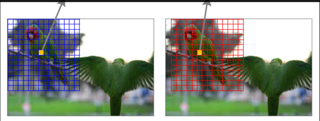
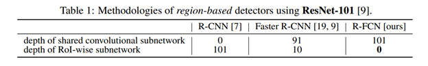
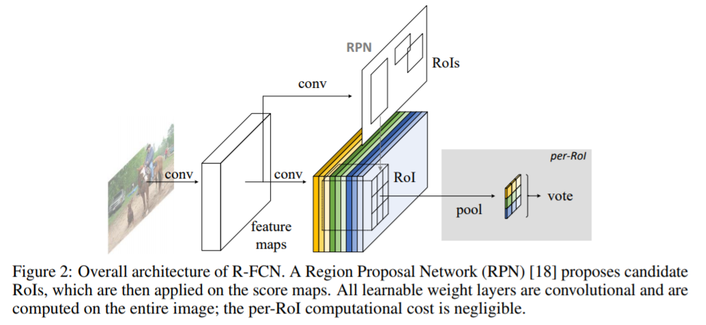
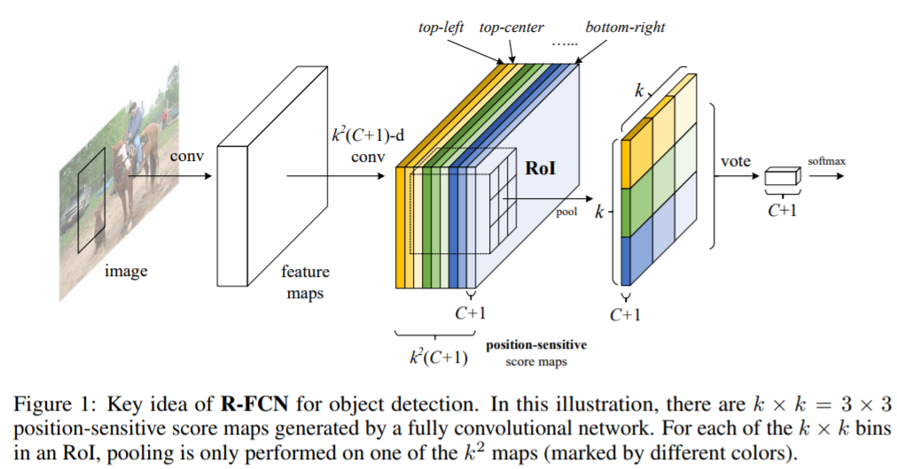
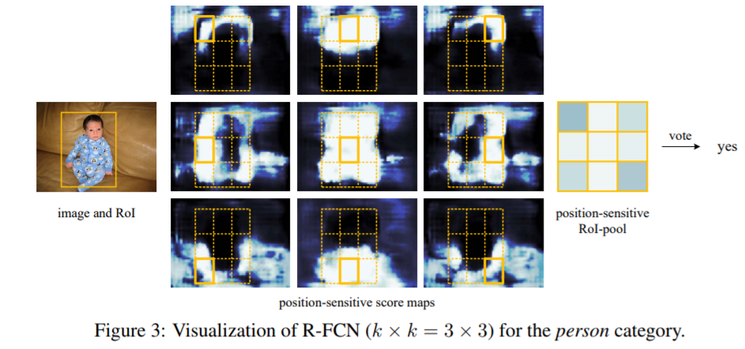
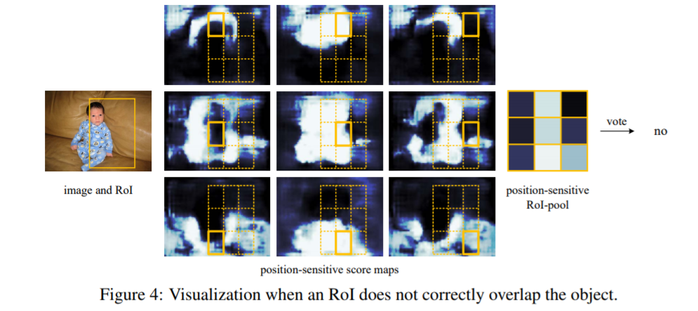
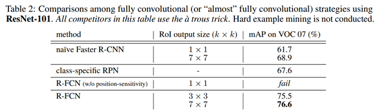
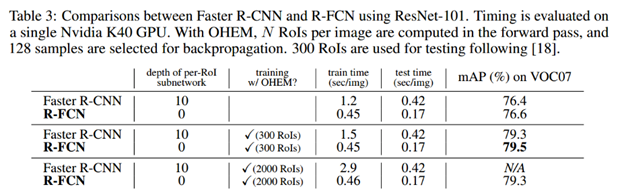
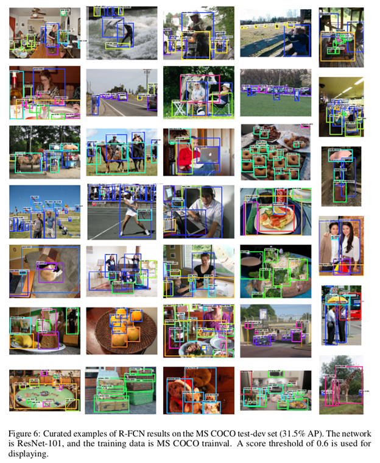

R-FCN
=====

[TOC]

概述
----

    R-FCN是 Region-based 的目标检测方法之一。主要是在 ResNet 版的 Faster R-CNN
框架基础上做的改造，针对RPN生成的ROI其后续计算无法共享，导致速度仍然不够快的问题，借鉴和结合了全卷积网络FCN的思想，引入
position-sensitive score map 与 position-sensitive Roi
pooling，使得所有可学习的层都是可卷积和可共享的，从而加快了目标检测的速度。

    论文地址：<https://arxiv.org/abs/1605.06409>；

​    测试用例工程地址：<https://github.com/YuwenXiong/py-R-FCN>

知识依赖
--------

### 知识准备

  1）Faster R-CNN、FCN、预训练、迁移学习相关

  2）平移不变性、平移变换性、InstanceFCN、OHEM算法

a）平移不变性：图片分类任务性质，就是说图片中某个对象通过平移位置发生改变不影响网络的特征提取与分类判别结果；

b）平移敏感性：目标检测任务性质，网络对检测目标的相对位置变化情况会做出相应的响应（理解：检测目标平移了，那么最后预测的框也会变化）；

（如：框框移动一小步，相同pixel的激活值发生改变，即相同像素在不同Instance中有不同的响应）

c） InstanceFCN：实例某一部分相对于目标实例整体的相对位置的敏感性衡量，对比原始FCN的每一个输出像素是一个是否为目标类目的分类器，InstanceFCN每个输出像素则是判断相对于目标实例相对位置的分类器。详情见[InstanceFCN论文](https://arxiv.org/abs/1603.08678)和[Instance-sensitiveFully Convolutional Network 论文笔记](http://coolwyj.com/instance-sensitive-fully-convolutional-network/)

      d） OHEM算法：SGD在目标检测领域的改良，用于 Region-based
的目标检测训练过程的效率提升，具体假设每个图像在前向训练时产生N个区域建议proposals，计算所有proposals的损失loss。按损失排序所有的Rois，选择loss损失最高的B个Rois作为hard
example组成batch进行反向传播更新。

    为缓解Region-based目标检测任务中，平移不变性与敏感性之间的矛盾，Faster
R-CNN考虑插入ROI pooling 到卷积层的同时，也引入了region-wise
layers（不共享计算的ROI-wise
subnetwork（下采样层和fc层）），所以Faster-RCNN算是个半卷积网络。而下面介绍的R-FCN是改良的全卷积网络，几乎一张图像上所有的计算都是共享的。 

R-FCN简介
---------

### 全局结构

   基于ResNet-101,我们去掉了每个卷积层的global average pooling和最终的fc
layer，只利用卷积层来计算feature
maps，最后一个卷积块是2048-d，作者附加了一个随机初始化的1024d的1×1的卷积层来降低维度，之后进入RPN和后续的目标检测过程。

  本论文的R-FCN方法参考R-CNN，也是使用two-stage的目标检测策略，即

  a）region proposal

  b）region classification

   我们首先通过region proposal
Network（RPN）来抽取候选区域RoIs，它自身是一个全卷积结构。接下来，我们在RPN和R-FCN中共享这些特性，对于每一个给定一个RoI，R-FCN架构对RoI进行投票分类与回归定位。具体在分类上R-FCN中最后的卷积层为单个RoI每个类别（C+1类）产生k\^2个position-sensitive
score maps对RoI做k\^2个区域划分，卷积层后position-sensitive RoI pooling
layer则在此基础上聚合k\^2个score
maps上的输出并产生单个RoI的得分vector（C+1维），后接 softmax
输出单个RoI的分类结果。

### [Position-sensitive score maps & Position-sensitive RoI pooling](http://jacobkong.github.io/posts/3678248031/#Position-sensitive-score-maps-amp-Position-sensitive-RoI-pooling)

对于每个RoI，我们需要编码位置信息。通过网格把每个RoI分成k×k（下图为3×3共9个）个bins，对于w×h的RoI区域，每一个bin的大小为≈w/k×h/k，对于第i行第j列的bin（0≤i
, j≤k-1），作者定义了一个位置敏感的池化操作来计算score map，其score
map的计算公式为：

​     $r_c(i,j|\Theta) = \sum_{(x,y)\in bin(i,j)} z_{i,j,c}(x + x_0, y + y_0|\Theta)/n. $

-  其中$r_c(i,j)$ 表示从第c类中得到的第(i,j)个bin的池化相应
-  $z_{i,j,k}$ 是 $k^2(C+1)$ 个sorce maps中的一个
-  $(x_0, y_0)$ 表示一个RoI的左上角
-  n表示这个bin中的像素的数量
-  $\theta$ 表示网络中所有需要学习的权重参数

   也就是说，R-FCN中最后的卷积层（共k\^2(C+1)个卷积层对应score
maps的数量）为单个RoI每个类别（C+1类）产生k\^2个position-sensitive score
maps，每个map中像素点的取值为点到某一
Region的距离（如到物体左上角or中心的距离），如上图实现对单个RoI做9个区域划分之后，每个网格bin以像素点为单位做平均池化，然后再对这9个bins的score
maps进行average
voting，最后得到单个RoI的一个C+1维的score向量，通过计算每一个目录项的softmax响应，输出概率值向量并求loss。

### [Position-sensitive](http://jacobkong.github.io/posts/3678248031/#Position-sensitive-score-maps-amp-Position-sensitive-RoI-pooling)**的理解**

   特定的 feature map 对应目标的特定位置，或者说不同的 feature map
掌管一个物体不同的部分，上图单个RoI的九宫格中每一格都来自不同的 feature map，
每个bin就是判断是否在persen这个目标实例某个相对位置的分类器，颜色越浅代表置信度越高，说明越能够被激活也越敏感（如第一个图的RoI9个位置都比较敏感，第二个图只有部分位置敏感）。
其它score maps也类似，分别对相对于目标实例的不同位置表现出敏感特性。

### 回归定位简述

   使用和物体检测分类相似的方法，对需要学习的参数t =(tx,y,w,h)
，在卷积之后每个RoI产生 4×k\^2个 position-sensitive score maps，然后通过average
voting将其聚合成4维向量，之后以和 Faster R-CNN 相同的方法进行bbox的微调更新。

R-FCN训练
---------

整个结构是端对端（end-to-end）的学习，所有可学习的层在整幅图片中都是可卷积和可共享的，主要学习用于物体检测的空间信息编码，即学习专门的position-sensitive
score maps。

  1）对于输入图像，其尺寸调整到600×600像素，预训练模型卷积后得到多个feature
maps，采用 RPN 方法得到最高score的300个ROIs；（这里的score？）

   2）采用IoU阈值0.3的Non-maximum suppression (NMS)方法来去除重合度较高的ROIs.
将剩余的ROIs根据最高的分类scores来进行分类；

  3）如果ROI的box与最近的ground
truth(GT)物体的IoU大于0.5，则该ROI是positive的；否则，该ROI是negative.；

   4）从Resnet101的预训练模型进行初始化，其它的权重进行随机初始化；

   5）R-FCN和RPN联合交替训练，以实现特征共享

  损失函数定义：

​    $L(s,t_{x,y,w,h}) = L_{cls}(s_{c^*}) + \lambda[c^* > 0] L_{reg}(t, t^*))$

参数：

-      *c\** 表示 RoI 的 ground-truth label（c\*等于0表示背景类）

-      t\* 表示 RoI 的 ground-truth 边框

-      λ 被初始化设置为1

-      *Sc\**表示softmax每一类的概率输出

-      decay：0.0005

-      momentum：0.9

-      single-scale training。 

-      B=128

-      lr = 0.001 \~20k, 0.0001 \~ 10k（mini-batches）

-      采用OHEM方法交叉训练 RPN ＆ F-RCN

R-FCN效果
---------

   测试效果表明，RoI size 中 7×7 比 3×3
的效果要好，R-FCN的训练速度在300个RoIs左右是Faster
R-CNN的3倍之多，且随着测试用RoIs数量的增多差距会越明显，测试速度关系保持在2.5倍，且R-FCN的准确度略有提升。

   COCO数据集上的测试效果

R-FCN论文总结
-------------

   1）R-FCN借鉴了全卷积网络FCN的思想，通过将Faster
R-CNN中用于目标分类和边框回归的Fast
R-CNN部分换成共享的全卷积结构，使得所有可学习的层都是可卷积和可共享的，从而加快了目标检测的速度。

   2） 传统FCN通过反卷积至原分辨率做Segmentation每个图像只生成一个score
map，每个像素的值表示该像素是否属于目标的概率；而R-FCN用于Detection，生成k\^2个负责检测目标的不同相对位置的score
maps，每个像素的值表示该像素是否属于某一类的某个相对位置的概率，相当于对检测对象的位置信息进行了编码，将目标检测的transformation
variance性质与FCN结合。

   3）与Faster-RCNN的比较：

3.1）Faster-RCNN是半卷积网络，在卷积子网络中是计算共享的，在另一个子网络是各自计算独立的区域（在ResNet的检测方法中插入了ROI
pooling layer到卷积层，引入了大量的region-wise
layers）；而R-FCN是全卷积网络，几乎一张图像上所有的计算都是共享的。

   3.2）与基础的Faster-RCNN提取候选区域，再在feature
map上做基于整个Roi的特征映射不同，R-FCN这里把RPN产生的候选区域分割为k\^2个大小相同的bins，每个bin都有各自的位置编码，第一个位置取第一块特征对应的
featuremap 的，第二个位置取第二块，这样取完了再 assembling 起来，拼成一个新的
feature map。

R-FCN论文疑问点
---------------

   1）论文中提到R-FCN通过k\^2(C+1)个通道的卷积层来产生score map，score
map上每个像素点的取值依据为？那么在训练的过程中具体是如何通过卷积获取的？

**解答**：每个像素的值表示该像素是否属于某类目标的某个相对位置的概率；见总结3.2

   2）论文在Training时说每个RoI区域的计算是可忽略的，从而使得样例挖掘（example
mining）近乎是cost-free？（可能需要仔细了解OHEM算法）

   3）每类k\^2个网格bins，k的size大小设置对检测速度和效果的具体影响？

**解答：**论文和很多资料没有明确说明，只是简单比较了一下3×3和7×7的结果，但根据instanceFCN提出的local
coherence（局部连贯性）思想，bin如果分的特别小，不利于利用local
coherence的性质，导致需要更多的参数，有较大的过拟合风险，所以 RoI size
的大小应该有一个经验性的最佳取值。

 

 
