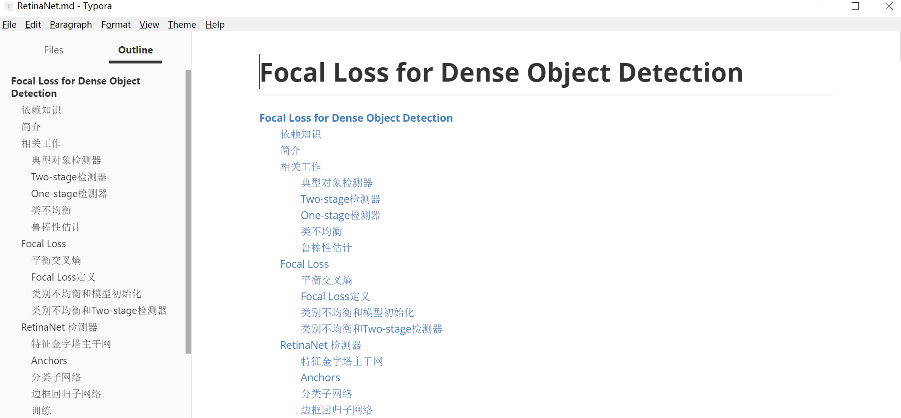
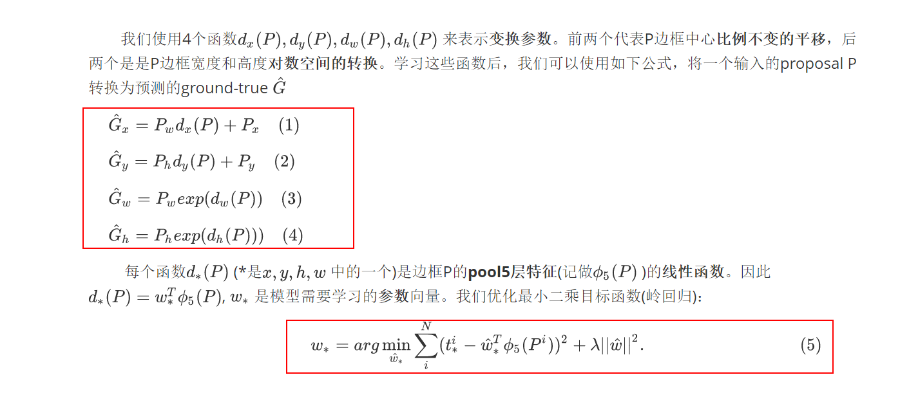

# cv-papers
计算机视觉相关论文整理、翻译、记录、分享;

包括图像分类、目标检测、视觉跟踪/目标跟踪、人脸识别/人脸验证、OCR/场景文本检测、识别等领域。

欢迎加星, 欢迎提问，欢迎指正错误, 同时也期待能够共同参与;长沙的朋友欢迎线下交流

持续更新中... ...

## 基础网络

[ResNeXt](ResNeXt.md)

[DenseNet](NenseNet.md)

## 目标检测

### R-CNN 系列

<a href='R-CNN.md'>R-CNN</a>

<a href='Fast R-CNN.md'>Fast R-CNN</a>

<a href='Faster R-CNN.md'>Faster R-CNN</a>

<a href='FPN.md'>FPN</a>

<a href='Mask R-CNN.md'>Mask R-CNN</a>

<a href='R-FCN.md'>R-FCN</a>

R-FCN-3000

<a href='Cascade R-CNN.md'>Cascade R-CNN</a>

### YOLO

<a href='YOLO.md'>yolo v1 </a>

<a href='YOLO 9000.md'>yolo 9000</a>

yolo v3

### SSD

<a href='SSD.md'>SSD</a>

DSSD

### 其它

<a href='AttractioNet.md'>AttractioNet</a>

G-CNN

<a href='RetinaNet.md'>RetinaNet</a>

## 语义分割

FCIS

YOLACT

## 人脸识别

<a href='FaceNet.md'>FaceNet</a>

## 视觉跟踪

Online Object Tracking: A Benchmark

<a href='FCNT.md'>FCNT</a>

<a href='GOTURN.md'>GOTURN</a>

C-COT

SiameseFC

## ocr/场景文本检测

<a href='CRNN.md'>CRNN</a>

<a href='CTPN.md'>CTPN</a>

## 医学影像相关

<a href='DeepLung.md'>DeepLung</a>

## 依赖知识点

<a href='Hammersley-Clifford定理证明.md'>Hammersley-Clifford定理证明</a>

附：<a href='计算机视觉经典论文地址汇总.md'>计算机视觉经典论文地址汇总</a>

## 阅读说明

​        由于github对markdown 目录结构以及数据公式支持不好,请git clone 本仓库到本地，然后使用markdown阅读器(如：Typora等)进行阅读及编辑，效果如下：

a) 目录效果

b) 公式效果

## 关于我们

我司正招聘文本挖掘、计算机视觉、	嵌入式算法等相关人员，欢迎加入我们；也欢迎与我们在线沟通任何关于数据挖掘、计算机视觉及深度学习相关理论及技术；或探讨智能制造、AI在工业中的应用等相关话题。

在长沙的朋友也可以线下交流, 坐标: 中电软件园10栋4楼

公司网址：http://www.zvalley.com/

Email: mick.yi@zoomlion.com

微信:

