# Aggregated Residual Transformations for Deep Neural Networks

[TOC]

.

​        我们为图像分类提出一个**简单**、**高度模块化**的网络结构。网络通过**重复一个block**来构建，这个block**聚合了一组有相同拓扑的转换**。我们的简单设计产生了一个**同构的**、**多分支的** 架构，它只需要设置几个超参数。这个策略揭示了一个**新的维度**，我们称之为"**基数-cardinality**"(这组转换的大小)，除了深度和宽度之外的一个关键因子。在ImageNet-1K数据集上，我们的实验表明，在**控制复制度**的受限情况下，**增加基数**可以**提升分类精度**。而且当**提升模型容量**时(即增加模型复杂度)，**提升基数比更深或更宽更加有效**。我们的模型叫ResNeXt，是参加ILSVRC 2016分类任务的基础，我们获得了第二名。我们进一步在ImageNet-5K 数据集和COCO检测数据集上研究ResNeXt,同样展示了比对应的ResNet更好的结果。代码和模型公布在https://github.com/facebookresearch/ResNeXt

论文地址： https://arxiv.org/pdf/1611.05431.pdf

## 1.引言

​         视觉识别的研究正经历从"**特征工程"**到"**网络工程**"的转换[25, 24, 44, 34, 36, 38, 14]。与传统的手工设计特征相比(如：SIFT [29] 和 HOG [5]), 通过神经网络从大规模数据[33]中**学习特征**,在训练时需要最少的人工参与，并**可以迁移**到各种各样的识别任务上[7,10,28]. 不过，人的工作已经转移到为学习表示**设计更好的网络架构**。

​         随着超参数的增加(通道数、滤波器尺寸、步长等)**设计网络架构变得日渐困难**，特别是网络的层数很多时。VGG-nets [36]展示了一个简单有效构建非常深的网络的策略：堆叠相同形状的blocks. ResNets[14]继承了这种策略，堆叠的相同拓扑的模块。而且，我们认为，该规则的简单性可能会**降低**过度调整超参数以**适应特定数据集的风险**。VGGnets 和ResNets 的鲁棒性已经被各种视觉识别任务[7, 10, 9, 28, 31, 14]和非视觉任务包括语音[42,30]和语音[4,41,20]

​        不同于VGG-nets,Inception模型家族[38,17,39,37]证明了精心设计的拓扑能够以**较低**的**理论复杂度**达到令人信服的准确性。Inception模型随着时间改进[38,39], 但是一个共有的属性是**分割-转换-合并**策略。在一个Inception模块中，输入分割为几个低维嵌入(通过$1 \times 1 $卷积) ，使用特定的一组滤波转换($3 \times 3,5\times 5$等)，然后通过拼接合并。可以看出，该体系结构的解空间是单个大层(例如,5×5)操作在一个高维嵌入解空间的严格子空间。Inception 模块中的**分割-转换-合并**行为，被期望可以**接近大的、密集层的表示能力**，但又有一个**相对低的计算复杂度**。

​        尽管精度很好，Inception模块的实现伴随着一系列复杂的因素-滤波器的数量和尺寸对每个独立的转换都是**定做的**，模块是**分阶段定制**的。尽管精心的组合这些组件产生了优秀的神经网络配方，如何将Inception架构**适应到新的数据集/任务上通常不是明确的**，特别是有这么多因子和超参需要设计。

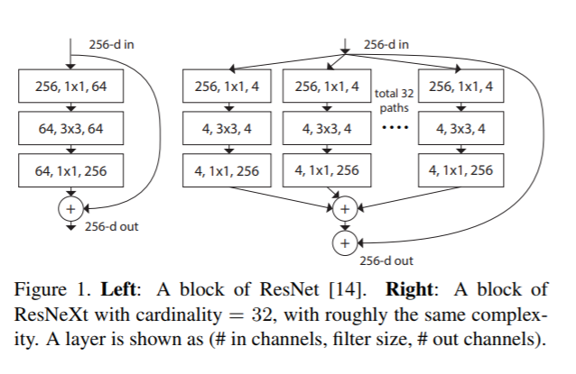

​        本文，我们提出一个简单的架构，它采用了VGG/ResNets的**重复层(layers)的策略**，同时使用一种**简单、可扩展**的方式来**利用分割-转换-合并**策略。我们的网络的一个模块执行一组转换，每个转换在一个低维嵌入上执行，输出通过求和合并。我们追求这种概念(分割-转换-合并)的简单实现-聚合在一起的转换**有相同的拓扑**(如图Figure 1右)。这种设计思路允许**将转换数量扩展到任意大**，而**不需要特殊设计**。

​        有趣的是，在这种简单情况下，我们说明我们的模型有其它两种等价形式(图Figure 3)，图Figure 3 (b)的重构呈现了类似InceptionResNet 模块的合并多个路径；但是我们的模块与所有现存的Inception 模块不同，我们的路径共享相同的拓扑，路径的数量可以轻易的独立出来作为一个因子来研究。在一个更简洁的重构中，我们的模块可以被Krizhevsky et al.’s的分组卷积[24] (Fig. 3(c))改造, 而分组卷积是被当做一个工程折中方案设计出来的。

​        我们实验显示，**聚合转换优于原本的ResNet模块**，即使在保持计算复杂度和模型大小的受限条件下-如：图Figure 1(右) 被设计为保持与图Figure 1(左)的FLOPs复杂度和参数量大小。我们强调一下，通过**增加容量**(变得更深或更宽)来**提升**模型**精度相对简单**，**提升精度同时保持(或减少)复杂度**在文献中**很少**有。

​        我们的方法表明，**基数**(一组转换的数量)是除了宽度和高度之外**具体的、可度量的维度**，并且是**核心重要**的。实验证明**增加基数**是比变得更深或更宽**更加有效**的提升精度的方法，特别是当深度和宽度开始使现有模型的收益递减时。

​          我们的神经网络，称作**ResNeXt**(提出了下一个维度)，在ImageNet分类数据集上**优于**ResNet-101/152 [14], ResNet200 [15], Inception-v3 [39], 和Inception-ResNet-v2 [37]。特别是一个**101-层的ResNeXt**能够达到比**ResNet-200[15]更好的精度**，但只有其**50%的复杂度**。而且，ResNeXt展示了相对所有Inception模型来说**更简单的设计**。ResNeXt 是我们在ILSVRC 2016分类任务中提交物的基础，获得了第二名。本文进一步在更大的ImageNet-5K数据集和COCO对象检测数据集[27]上评估ResNeXt，显示了比它对应的ResNet一致的、更好的精度。我们认为ResNeXt同样能够**很好的泛化**到其它视觉(和非视觉的)识别任务上。

## 2. 相关工作

### 多分支卷积网络

​         Inception模块[**38,17,39,37**]是成功的**多分支架构**，它的每个分支是精心定制的。ResNets[14]可以看做是一个**二分支网络**，其中一个分支是恒等映射。**深度神经决策森林**[22]是具有学习分裂功能的**树状多分支网络**。

### 分组卷积

​        分组卷积的使用可以追溯到AlexNet论文[24], 如果没有更早。Krizhevsky et al. [24]给出的动机是将**模型分布到两个GPU**上。Caffe [19], Torch [3], 和其它库都支持分组卷积，主要为了兼容AlexNet。据我们所知，**很少**有证据表明**利用分组卷积来提高精度**。分组卷积的一个**特例**是**分通道卷积**，这种情况下**分组数就是通道数**。**分通道卷积**是**可分卷积**[35]的一部分。

### 压缩卷积网络

​        分解(在空间[6,18]或通道[6,21,16]级别)是广泛采用的用于**检测深度卷积网络冗余**和**加速/压缩**它的技术。 Ioannou et al. [16] 提出"根"-模式网络来减少计算，根中的分支通过分组卷积实现。[6, 18, 21, 16]中的方法展示了**精度**和**较低复杂度和较小模型大小**的优雅折中。**不同于压缩**，我们的方法是在实验中显示**更强的表达能力**的一种架构。

### 集成

​        **取**一组独立训练网络的**均值**是一种提升精度[24]的有效解决方案, 在识别**竞赛中被广泛采用**。Veit et al. [40]将**单个ResNets解释为浅层网络的一个集成**，ResNet的结果来自于**加法行为**[15]。我们的方法使用附加的聚合一组转换。但是我们认为将我们的方法当做集成是**不确切的**，因为聚合在一起的成员是**联合训练**的，**不是独立训练的**。

## 3. 方法

### 3.1 模板

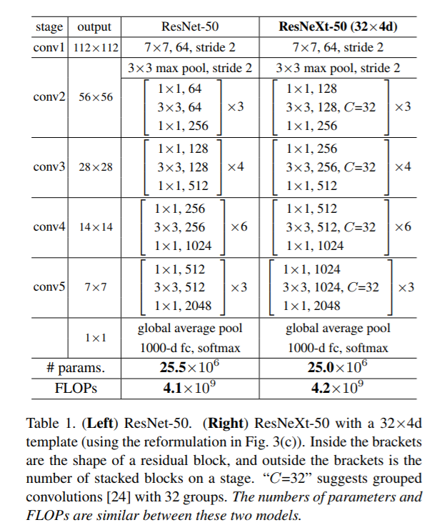

​         我们遵循VGG/ResNets，采用**高度模块化设计**。我们的网络包含一堆残差block，这些block有**相同的拓扑**，受VGG/ResNets启发，这些block满足两个简单规则：(i) 如果产生**空间大小相同的特征图**，这些block**共享相同的超参**(宽度和滤波器尺寸)，(ii) 当空间特征图**以因子2下采样时**，block的**宽度乘上因子2**。第二条规则确保了**计算复杂度**，对于**所有block**而言FLOPs(在multiply-add中的浮点运算)**大致相同**。

​        有了这两个规则，我们只需要设计**一个模板模块**，网络中的所有模块都可以被相应地确定。因此，这两条规则**大大缩小了设计空间**，使得我们**关注几个关键因素**。根据这两条规则构建的网络见表Table(1)

### 3.2. 回顾简单神经元

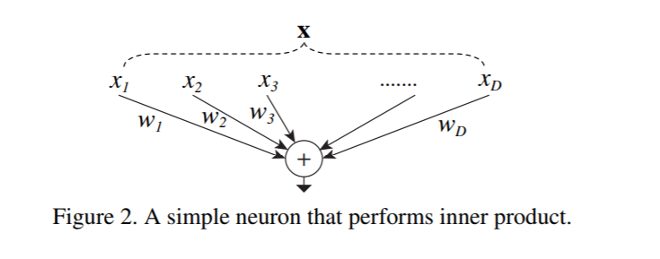

​          人工神经网络最简单的神经元执行內积(加权求和),  是全连接层和卷积层执行基本转换。內积可以看做聚合转换的一种形式：
$$
\sum_{i=1}^D w_ix_i \tag 1
$$

​       其中 $x = [x_1, x_2, ..., x_D]$ is a D-channel input vector to the neuron and wi is a filter’s weight for the i-th chan-nel. This operation (usually including some output nonlinearity) is referred to as a “neuron”. See Fig. 2.

​       其中 $x = [x_1, x_2, ..., x_D]$ 是神经元的D通道输入向量，$w_i$ 是滤波器第i个通道的权重。这个操作(通常包括一些非线性输出)被称为“神经元”。

​      上面的操作可以**作为分割、转换和聚合**的组合**重新构建**。(1)分割：向量$x$ 切片为一个低维嵌入，上面这个就是一个单维子空间$x_i$ ; (ii)转换：低维表示被转换，上面这个，它被简单缩放:$w_ix_i$ ; (iii)聚合：所有嵌入的转换通过$\sum_{i=1}^D$ 聚合。

### 3.3. 聚合转换

​         分析了简单的神经元，我们考虑将基础的转换($w_ix_i$)替换为**更通用的函数**,**函数本身可以是一个网络**。与增加深度的“Network-in-Network” [26] 相比，我们展示了我们的“Network-in-Neuron”沿着**一个新的维度**扩展。

Formally, we present aggregated transformations as:

形式上，我们提出的聚合转换为：

$$
\cal F(x)= \sum_{i=0}^C T_i(x), \tag 2
$$

​        $\cal T_i(x)$ 可以是任意函数，类似一个简单神经元，$\cal T_i$ 投影x到一个嵌套(通常是低维的)，然后转换它。

​         在等式(2)中C是需要聚合的一组转换大小，我们称**C为基数**[2]。C在等式(2)中的位置与D在等式(1)中类似，但是C不需要等于D，可以是任意数值。维度**宽度与简单转换(内积)的数量有关**，我们认为维度**基数控制更复杂转换的数量**。我们通过实验证明，**基数是一个基本的维度**，比宽度和深度(这两个维度)更有效。

​          本文中，我们考虑一个简单的方式设计转换函数：**所有的$\cal T_i$ 有相同的拓扑**，这扩展了重复相同形状的层的VGG-style策略, 这有助于隔离一些因素并扩展转换数量到任意大。如图Figure 1(右)描绘的，我们将单个转换$\cal T_i$设置为bottleneck形状的架构[14]。这种情况下，$\cal T_i$ 中第一个$1 \times 1$ 的层产生低维嵌入。

​        等式(2)中的聚合转换充当残差函数[14] (图Figure 1右)：
$$
\cal y=x+\sum_{i=1}^C T(x_i) \tag3
$$
​         y是输出。

**与Inception-ResNet的关系.** 

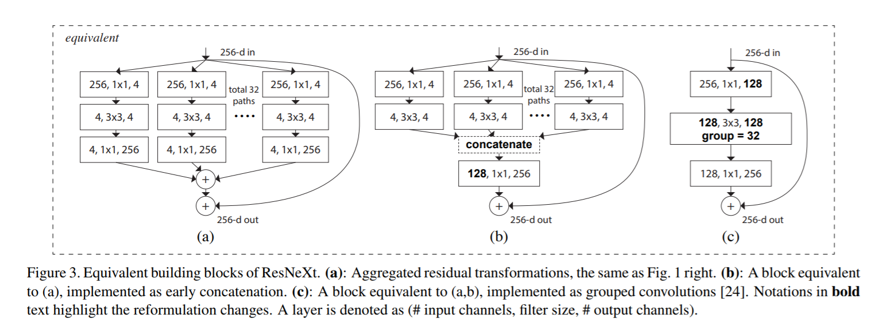

​        一些张量操作表明，图Figure 1(右)中的模块(如图Figure 3(a)所示)与图Figure 3(b)等价。图Figure 3(b)与inception-resnet[37] block类似，因为它涉及到残差函数的分支和连接。但是不同于所有Inception或Inception-ResNet模块，我们在**多个路径之间共享相同的拓扑**。我们的模块需要最少的额外工作来设计每个路径。

**与分组卷积的关系.** 

​          使用分组卷积[24]的符号，上面的模块变得更加简洁；图Figure 3(c)显示了这种重构。所有的**低维嵌入**(第一个1×1层)可以**用一个更宽的层**(例如,在图Figure 3 (c)中1×1,128维)**替换**。分割基本上是由分组卷积层在将输入通道划分为组时完成的。图Figure 3(c)中分组的卷积层执行**32组输入和输出通道为4维的卷积**。分组的卷积层将它们连接到一起作为层的输出。图Figure 3(c)中的block与图Figure 1(左)中的bottlenetck块相似，除了图3(c)是**一个更宽的、稀疏的连接模块**。

​         我们注意到重构产生非凡的拓扑只有block的深度≥3；如果块的深度为2(如[14]中基本block), 重构就变成一个普通的宽的、密集模块了；见图Figure 4中的描绘。

**讨论.** 

​       我们注意到，尽管我们提出了**显示连接**(图Figure 3(b))或**分组卷积**(图Figrue 3(c))的重构方式，但这种重构对公式(3)一般形式不总是合适的，如果变换$\cal T_i$是任意形式的并且是异构的。在本文中，我们选择使用同构形式，因为它们更简单，并且可扩展。在这种简化的情况下，以图Figure 3(c)中分组卷积的形式有助于简化实现。

### 3.4. 模型容量

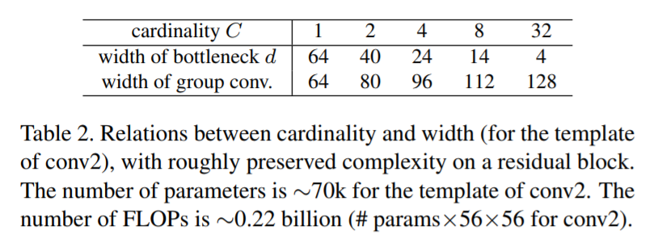

​        下一节的实验会展示，我们的模型在保持模型复杂度和参数量时提升了精度。这不仅在实践中很有趣，而且更重要的是，**复杂度**和**参数量** **代表**了**模型的固有容量**，因此常常被作为深网络的**基本特性**来研究[8].

​         当我们在保持复杂度的同时评估不同的基数C时，我们希望最小化对其它超参数的修改。我们选择**调整bottleneck的宽度**(例如图Figure 1(右)中的4维)，因为它可以从块的输入和输出隔离出来。这种策略不会改变其他超参数(block的深度或输入/输出宽度)，因此有助于我们**聚焦基数的影响**。

​        在图1(左),原ResNet bottleneck block[14] 有$256*64 + 3 * 3 * 64 * 64  + 64 * 256≈70 k$参数和成比例FLOPs(在同一特征图大小)。在**bottleneck宽度为d**的情况下，我们图Figure 1(右)的模板有:
$$
C*(256*d + 3*3*d*d + d*256) \tag 4
$$
参数和成比例FLOPs。当C = 32和d = 4 ,等式(4)约有70k。表Table 2显示了基数C和bottleneck宽度d之间的关系。

​        因为我们采用了3.1小节中的两条规则，所以上面的近似等式在ResNet bottle block和我们的ResNeXt的所有阶段(除了下采样层,特征图的尺寸有变化)是有效的。

## 4. 实现细节

​        我们的实现遵循[14]和开源的fb.resnet.torch [11]代码。在ImageNet数据集上，输入图像是224×224，随机地从调整尺寸后的图像裁剪得到，这些调整大小的图片来自使用由[11]实现的[38]中的用**缩放和长宽比**做**数据增广**。shotcuts是恒等连接，除了那些增加的维度是投影([14]中的类型B)。如[11]中建议，conv3、4和5的下采样是通过每个stage中**第一block的步长为2的$3 \times 3$ 卷积层**完成的；使用SGD, 256的mini-batch在8个GPUs上(每个GPU32个样本)；权重衰减为0.0001，动量大小为0.9。初始学习率为0.1，按照[11]中的计划做**3次除以10**;采用[13]中的权重初始化策略。在所有的消融比较中，我们在**单个$224 \times 224 $ 的裁剪图像**上进行错误**评估**，这个图像从短边为256的图像中心裁剪而来。

​         我们的模型以**图Figure 3(c)的形式实现**, 在图Figure 3(c)中卷积之后，我们执行批标准化(BN)[17]，在每个BN后执行ReLU，除了block的输出部分，遵循[14]:ReLU在添加到shortcut之后才执行。

​          我们注意到，**当BN和ReLU合适的放置**，图Figure 3中的**三种形式**是**严格等价**的。我们训练了所有的三种形式，获得了**相同的结果**。我们选择图Figure . 3(c)实现,因为它**更加简洁**，并且**比其它两种形式更快**。

## 5. 实验

### 5.1. ImageNet-1K上实验

​          我们在1000类ImageNet分类任务[33]上进行消融实验，遵循[14],构建了50层和101层的残差网络，简单的将ResNet-50/101中所有的block替换为我们的block。

**标记.** 

​          因为我们采用了3.1节中的两条规则，通过模板就足以说明一个架构了(因为所有的block都是一个逻辑)。例如，表Table 1显示了由基数= 32和bottleneck宽度= 4d的模板构建的ResNeXt-50(图Figure 3),这个网络简化地记做**ResNeXt-50 (32×4d)**。我们注意到模板的**输入/输出宽度固定为256-d**(图Figure 3), 且每次对feature map进行**下采样时**，所有**宽度都翻倍**(见表Table 1)。

**基数 vs. 宽度.** 

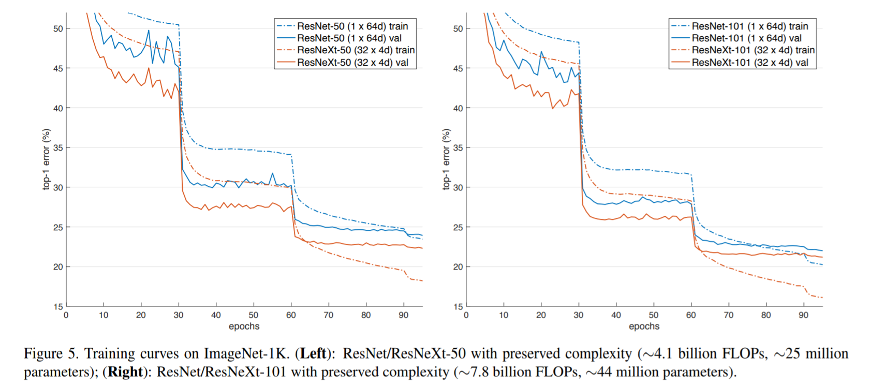

​         如表Table 2所示，我们首先在的**保持复杂度**的情况下，评估**基数**C和bottleneck**宽度**之间的**权衡**，表Table 3 展示了结果，图Figure 5展示了error vs. epochs的曲线。与ResNet-50对比(表Table 3顶部和图Figure 5左侧),**32×4d ResNeXt-50**验证误差为**22.2%**,比ResNet基线的23.9%**低1.7%**。**保持复杂度**，随着**基数C从1增加到32，错误率不断降低**。此外,32×4 d ResNeXt也比ResNet同行低得多的训练误差,说明性能提升**不是来自正则化**,而是来源于**更强的表达能力**。

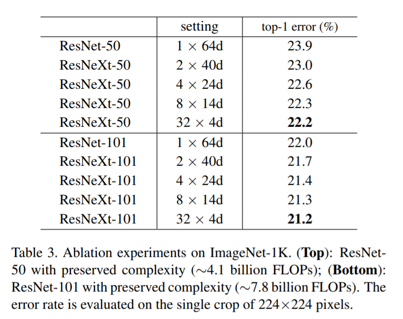

​         在resnet - 101(图Figure5 右边,表Table 3底部)下也观察到类似的趋势,其中32×4d ResNeXt101优于resnet- 101 0.8%。虽然这种**验证误差**的**提升比50层的情况要小**，但是**训练误差**的**提升任然是很大的**(resnet-101 20%,32×4d resnext-101 16%,图Figure 5右边)。事实上，**更多的训练数据**将**扩大验证误差的差距**，如我们在下一小节中的ImageNet-5K集中所展示的那样。

​       表3还表明，**保持复杂度**，**当bottleneck宽度很小时**，以减少宽度为代价的**增加基数**开始显示**精度饱和**(不再提升)。我们认为，在这种权衡中继续减少宽度是不值得的，因此，我们在下面**采用一个不小于4d的bottleneck宽度**。

**增加基数 vs. 更深/更宽.** 

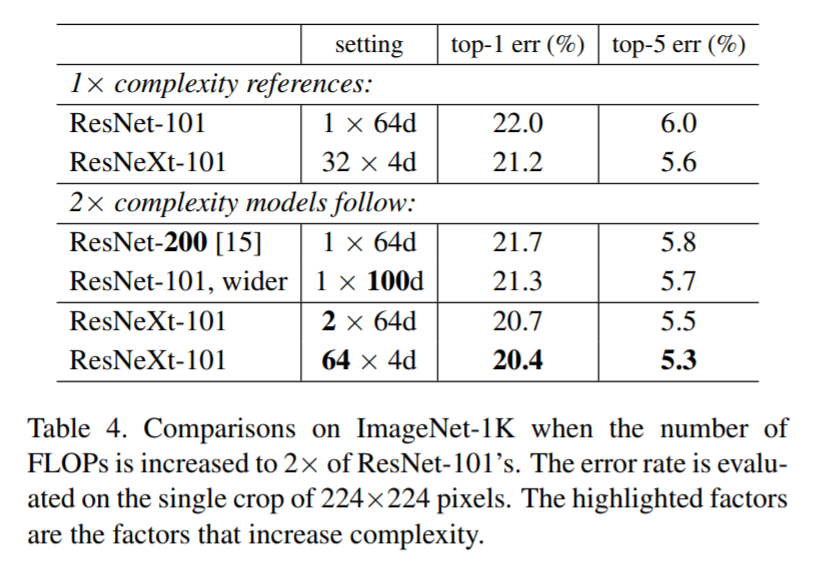

​        接下来，我们研究通过**增加基数**C或**增加深度或宽度**来**增加复杂度**。下面的比较也可以被视为关于**2倍FLOPS resnet-101的基线**; 我们比较有∼150亿FLOPs的如下几个变种。(i)**深度加到200层**,我们采用了在[11]中实现的ResNet-200[15]。(ii)通过**增加bottleneck宽度**来变宽。(iii)通过将C加倍来**增加基数**。

​          表Table 4表明相对ResNet-101基线误差(22.%)，**复杂度加倍误差会一致减少**;但是**更深**(ResNet200,提升0.3%)或**更宽**(更宽的ResNet-101,提升0.7%)时，**提升很小**。

​         相反，**增加基数C比更深或更宽结果要好得多**，2×64d ResNeXt-101将top-1误差减少1.3%到达20.7%; The 64×4d ResNeXt-101误差减小到20.4%。

​         同样注意到**32×4d ResNet-101 (21.2%)比更深的ResNet-200 和更宽的ResNet101表现更好**，虽然只有它们**50%的复杂度**。这再次表明，**基数是比深度和宽度** **更有效的维度**。

**残差连接**

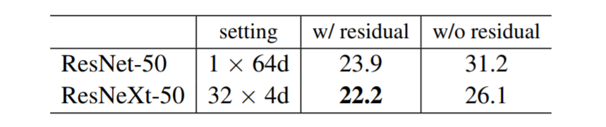

​         上表说明残差(shortcut)连接的影响:从ResNeXt-50删除shortcut将错误增加3.9个点，至26.1%。删除ResNet-50的shotcut要糟糕得多(31.2%)。这些比较表明，**残差连接有助于优化**，而**聚合转换是更强的表示**，因为它们的性能始**终优于有或没有残差连接的对应的副本**。

**性能**

​          为了简单起见，我们使用Torch的内置分组卷积实现，没有特别的优化。我们注意到这个实现是暴力的(brute-force)，**不支持并行**。在8块 NVIDIA M40 GPU上训练表Table 3所示的32×4d ResNeXt-101 每个mini-batch耗时**0.95秒**，对比ResNet-101 baseline耗时**0.70s**，**FLOPs相当**；我们认为这是合理的开销。我们认为经过**精心设计的较低级别的实现**(例如 CUDA)**能够减少这种开销**。我们还认为cpu上的推断时间会减少开销。训练2倍复杂度模型(64×4 d resnext - 101)需要1.7秒/mini-batch和一共10天在8块GPU上。

**与state-of-the-art结果比较**

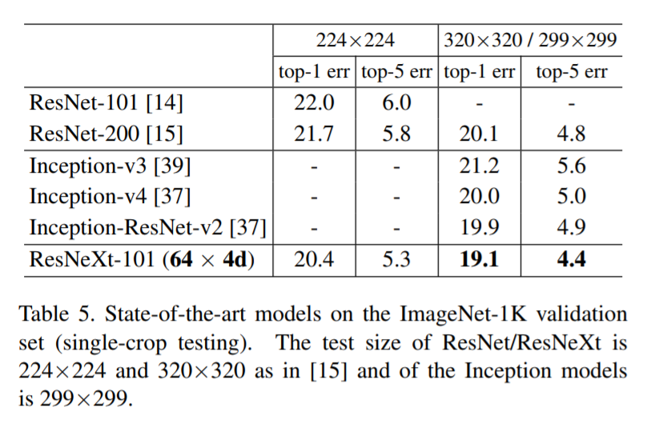

​          表Table 5显示了在ImageNet验证集上进行**单裁剪测试**的更多结果。除了测试一个224×224裁剪,我们也遵循[15]评估320×320裁剪。我们的结果**优于**ResNet、Inception-v3/v4和Inception-ResNet-v2，到达单裁剪top-5的错误率4.4%。此外，我们的架构设计**比所有的Inception模型都要简单得多**，并且需要**手工设置**的**超参数要少得多**。

​         ResNeXt是我们参加ILSVRC 2016分类任务的基础，我们获得了第二名。  我们注意到，**许多模型**(包括我们的)在**使用多尺度**和/或**多裁剪测试后开始饱和**。使用[14]中的多尺度密集测试，我们得到了一个单模型的top-1/top-5错误率为17.7%/3.7%，与采用多尺度、多裁剪测试的inception-resnet-v2的单模型结果为17.8%/3.7%。在测试集中，我们的集成模型top-5得错误率为3.03%，与获胜者的2.99%和Inception-v4/InceptionResNet-v2的3.08%[37]相当。

### 5.2. ImageNet-5K实验

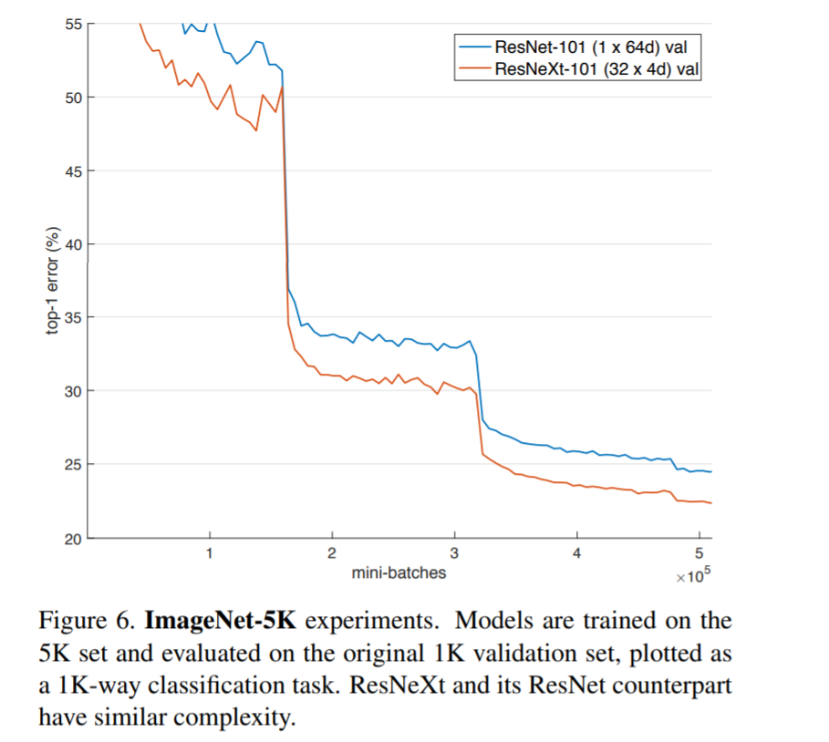

​          ImageNet-1K上的**性能似乎饱和**了，但我们认为，这**不是因为模型的能力**，而是因为**数据集的复杂度**。接下来，我们在一个较大的ImageNet子集上评估模型，这个子集有5000个类别。

​        我们的**5K数据集**是完整的**ImageNet-22K集**[33]的**一个子集**，这5000个类别**包括原始的ImageNet1K中的类别**和在完整的ImageNet数据集中具有**最多图像数量**的额外**4000个类别**。5k数据集有680万图片,大约5倍于1k数据集。没有官方可用的train/val分割，所以我们选择在原始的ImageNet-1K验证集上评估。在这个1k类val集上，预测时，模型**可以被当做** **一个5k类分类任务**(所有预测为其他4K类的标签都自动认为错误);或**一个1K类分类任务**(softmax只应用于1K类)来评估

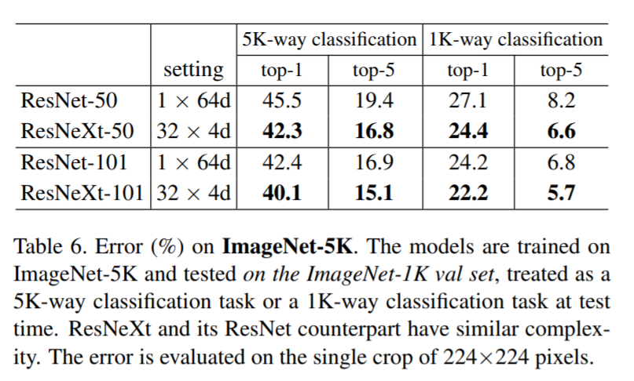

​          实现细节与节4一样，5K训练模型从头开始训练，跟1K 训练模型一样的mini-batch数(这样epochs就只有1/5)。表Table 6和图Figure 6展示了在保持复杂度情况下的比较。**ResNeXt-50**比ResNet-50**减少**5K类 top-1**错误3.2%**，ResNetXt-101比ResNet-101减少5K类 top-1误差**2.3%**，在1k类误差上也观察到类似的差距，这些表明**ResNeXt具有更强的表示能力**。

​         此外，在验证集上评估相同的1K类分类任务，我们发现在**5K集上训练的模型**(在表Table 6中有1K类error 22.2%/5.7%)**与在1K集**(表Table 3中为21.2%/5.6%)上训练**相比**，**表现出竞争力**。此结果并没有增加训练时间(由于相同的mini-batch数量)，也**没有微调**。我们认为这是一个有希望的结果，因为**5K类的分类训练任务**是一个**更具挑战性**的任务。

### 5.3. CIFAR实验

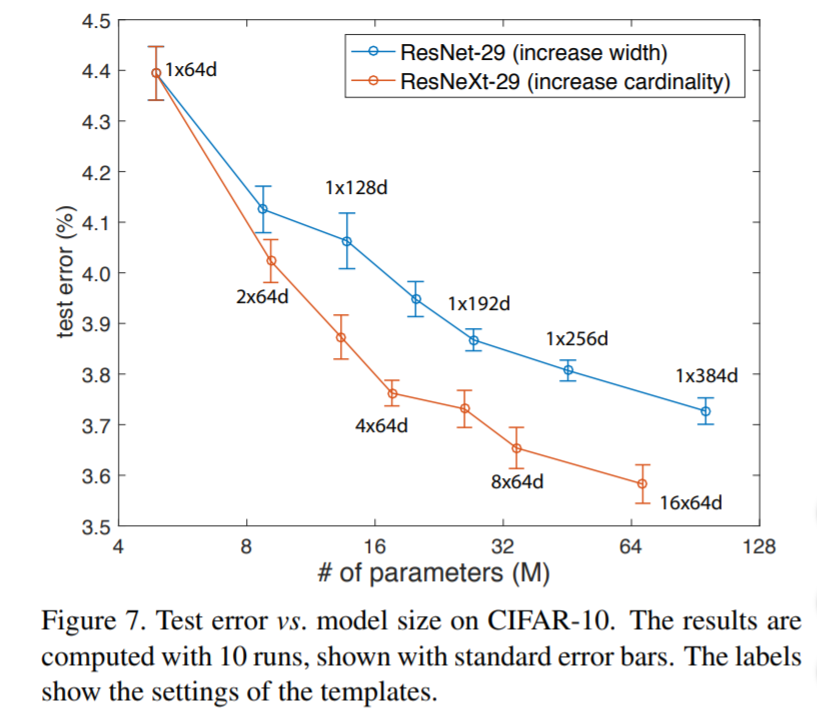

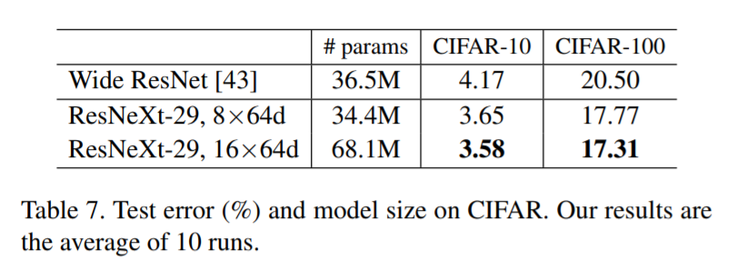

​        我们在CIFAR-10和100数据集[23]上进行了更多的实验，我们使用[14]中的架构，使用bottleneck模板$\left[1 \times1, 64 \\ 3 \times3,64 \\ 1 \times 1, 256  \right]$ 替换了基础残差block；我们的网络从一个$3 \times 3$ 的卷积层开始，接着是3阶段，每个阶段有3个残差block。我们采用与[14]相同的平移和翻转做数据增广，实现的细节在附录中。

​         我们比较了两种基于以上基线的增加复杂度情况:(i) **增加基数**,固定宽度，(ii) **增加bottleneck的宽度**，固定基数=1。在这种改变下，我们训练和评估一系列的网络。图Figure 7显示了测试错误率与模型大小的比较; 我们发现**增加基数比增加宽度更有效**，这与我们在ImageNet-1K上观察到的一致。表Table 7显示与有最好的发布记录的宽ResNet[43]比较的结果和模型大小；我们的模型大小相似(34.4M)，结果比宽ResNet更好。我们较大的模型在cifar 10上达到3.58%的测试错误率(10次运行平均结果)，在cifar 100上达到17.31%。据我们所知，这些是文献中最好的结果(具有类似的数据增强)，包括未发表的技术报告在内。

### 5.4. COCO目标检测实验

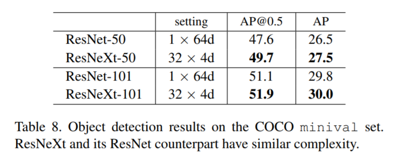

​         接下来，我们在COCO目标检测数据集[27]上**评估模型的泛化能力**。遵循[1], 我们在80k训练集和35k val子集上训练模型，然后在5k val子集(称为minival)上进行评估。我们评估COCO类平均精度 (AP)和AP@IoU=0.5 [27]。我们采用基本的Faster R-CNN[32]，并遵循[14]将ResNet/ResNeXt插入其中。模型在ImageNet-1K上进行预训练，并在检测集上进行微调，实现细节在附录中。

​        表8显示了比较结果，在50-层基线上，ResNeXt在**不增加复杂度**的情况下，**将AP@0.5和AP分别提高2.1%和1.0%。**ResNeXt**在101层基线上**显示了**较小的提升**。我们推测**更多的训练数据**会有**更大的差距**，正如在ImageNet-5K集上观察到的。值得注意的是，最近**ResNeXt应用到Mask R-CNN[12]中**，在**实例分割**和**目标检测**任务得到了**最好结果**。

## A. 实现细节: CIFAR

​      我们在50k训练集中训练模型，在10k测试集中评估。遵循[14],输入图像为32×32，从大小为40×40的**零填充图像或其翻转**中**随机裁剪**而来，没有使用其他的数据增广。第一层是$3 \times 3$ 的卷积层，有64个滤波器；还有**3个阶段**，**每个阶段有3个残差block**，每个阶段[14]输出特征图的大小分别为32,16,8；网络以一个**全局平均池化**和**全连接层**结束。如节3.1一样，阶段改变(下采样)时宽度加倍。模型在8个gpu上进行训练，每个mini-batch大小为128，重量衰减为0.0005，动量为0.9。我们从0.1的学习率开始，对模型进行300轮的训练，在150轮和225轮减少学习率，其它的实现细节如[11]。

## B. 实现细节: 目标检测

​        我们采用Faster R-CNN系统[32],为了简单起见，在RPN和Fast R-CNN之间**没有共享特征**。在RPN步骤中，我们在8个GPU上进行训练，每个GPU每个mini-batch处理2张图像，每个图像有256个锚点(anchors)。在RPN训练步骤中，我们以0.02学习率训练120k个mini-batch,然后以0.002的学习率训练接下来60k个mini-batch。在Fast R-CNN训练步骤中，我们以0.005学习率训练120k个mini-batch,然后以0.0005的学习率训练接下来60k个mini-batch,我们使用0.0001的权重衰减和0.9的动量大小。其它实现细节如https://github.com/rbgirshick/py-faster-rcnn.

## 参考

[1] S. Bell, C. L. Zitnick, K. Bala, and R. Girshick. Insideoutside net: Detecting objects in context with skip
pooling and recurrent neural networks. In CVPR, 2016.
[2] G. Cantor. Uber unendliche, lineare punktmannich-faltigkeiten, arbeiten zur mengenlehre aus den jahren 1872-1884. 1884.
[3] R. Collobert, S. Bengio, and J. Mariethoz. Torch: a modular machine learning software library. Technical
report, Idiap, 2002.
[4] A. Conneau, H. Schwenk, L. Barrault, and Y. Lecun. Very deep convolutional networks for natural language processing. arXiv:1606.01781, 2016.
[5] N. Dalal and B. Triggs. Histograms of oriented gradients for human detection. In CVPR, 2005.
[6] E. Denton, W. Zaremba, J. Bruna, Y. LeCun, and R. Fergus. Exploiting linear structure within convolutional networks for efficient evaluation. In NIPS, 2014.

[7] J. Donahue, Y. Jia, O. Vinyals, J. Hoffman, N. Zhang, E. Tzeng, and T. Darrell. Decaf: A deep convolutional
activation feature for generic visual recognition. In ICML, 2014.
[8] D. Eigen, J. Rolfe, R. Fergus, and Y. LeCun. Understanding deep architectures using a recursive convolutional network. arXiv:1312.1847, 2013.
[9] R. Girshick. Fast R-CNN. In ICCV, 2015.
[10] R. Girshick, J. Donahue, T. Darrell, and J. Malik. Rich feature hierarchies for accurate object detection and semantic segmentation. In CVPR, 2014.
[11] S. Gross and M. Wilber. Training and investigating Residual Nets. https://github.com/facebook/fb.resnet.torch, 2016.
[12] K. He, G. Gkioxari, P. Dollar, and R. Girshick. Mask R-CNN. arXiv:1703.06870, 2017.
[13] K. He, X. Zhang, S. Ren, and J. Sun. Delving deep into rectifiers: Surpassing human-level performance on imagenet classification. In ICCV, 2015.
[14] K. He, X. Zhang, S. Ren, and J. Sun. Deep residual learning for image recognition. In CVPR, 2016.
[15] K. He, X. Zhang, S. Ren, and J. Sun. Identity mappings in deep residual networks. In ECCV, 2016.
[16] Y. Ioannou, D. Robertson, R. Cipolla, and A. Criminisi. Deep roots: Improving cnn efficiency with hierarchical filter groups. arXiv:1605.06489, 2016.
[17] S. Ioffe and C. Szegedy. Batch normalization: Accelerating deep network training by reducing internal
covariate shift. In ICML, 2015.
[18] M. Jaderberg, A. Vedaldi, and A. Zisserman. Speeding up convolutional neural networks with low rank
expansions. In BMVC, 2014.
[19] Y. Jia, E. Shelhamer, J. Donahue, S. Karayev, J. Long, R. Girshick, S. Guadarrama, and T. Darrell. Caffe:Convolutional architecture for fast feature embedding. arXiv:1408.5093, 2014.
[20] N. Kalchbrenner, L. Espeholt, K. Simonyan, A. v. d. Oord, A. Graves, and K. Kavukcuoglu. Neural machine translation in linear time. arXiv:1610.10099, 2016.
[21] Y.-D. Kim, E. Park, S. Yoo, T. Choi, L. Yang, and D. Shin. Compression of deep convolutional neural networks for fast and low power mobile applications. In ICLR, 2016.
[22] P. Kontschieder, M. Fiterau, A. Criminisi, and S. R. Bulo. Deep convolutional neural decision forests. In ICCV, 2015.
[23] A. Krizhevsky. Learning multiple layers of features from tiny images. Tech Report, 2009.

[24] A. Krizhevsky, I. Sutskever, and G. Hinton. Imagenet classification with deep convolutional neural networks. In NIPS, 2012.
[25] Y. LeCun, B. Boser, J. S. Denker, D. Henderson, R. E. Howard, W. Hubbard, and L. D. Jackel. Backpropagation applied to handwritten zip code recognition. Neural computation, 1989.
[26] M. Lin, Q. Chen, and S. Yan. Network in network. In ICLR, 2014.
[27] T.-Y. Lin, M. Maire, S. Belongie, J. Hays, P. Perona, D. Ramanan, P. Dollar, and C. L. Zitnick. Microsoft COCO: Common objects in context. In ECCV. 2014.
[28] J. Long, E. Shelhamer, and T. Darrell. Fully convolutional networks for semantic segmentation. In CVPR, 2015.
[29] D. G. Lowe. Distinctive image features from scaleinvariant keypoints. IJCV, 2004.
[30] A. Oord, S. Dieleman, H. Zen, K. Simonyan, O. Vinyals, A. Graves, N. Kalchbrenner, A. Senior, and K. Kavukcuoglu. Wavenet: A generative model for raw audio. arXiv:1609.03499, 2016.
[31] P. O. Pinheiro, R. Collobert, and P. Dollar. Learning to segment object candidates. In NIPS, 2015.
[32] S. Ren, K. He, R. Girshick, and J. Sun. Faster RCNN: Towards real-time object detection with region proposal networks. In NIPS, 2015.
[33] O. Russakovsky, J. Deng, H. Su, J. Krause, S. Satheesh, S. Ma, Z. Huang, A. Karpathy, A. Khosla, M. Bernstein, A. C. Berg, and L. Fei-Fei. ImageNet Large Scale Visual Recognition Challenge. IJCV, 2015.
[34] P. Sermanet, D. Eigen, X. Zhang, M. Mathieu, R. Fergus, and Y. LeCun. Overfeat: Integrated recognition, localization and detection using convolutional networks. In ICLR, 2014.
[35] L. Sifre and S. Mallat. Rigid-motion scattering for texture classification. arXiv:1403.1687, 2014.
[36] K. Simonyan and A. Zisserman. Very deep convolutional networks for large-scale image recognition. In ICLR, 2015.
[37] C. Szegedy, S. Ioffe, and V. Vanhoucke. Inceptionv4, inception-resnet and the impact of residual connections on learning. In ICLR Workshop, 2016.
[38] C. Szegedy, W. Liu, Y. Jia, P. Sermanet, S. Reed, D. Anguelov, D. Erhan, V. Vanhoucke, and A. Rabinovich. Going deeper with convolutions. In CVPR, 2015.
[39] C. Szegedy, V. Vanhoucke, S. Ioffe, J. Shlens, and Z. Wojna. Rethinking the inception architecture for computer vision. In CVPR, 2016.

[40] A. Veit, M. Wilber, and S. Belongie. Residual networks behave like ensembles of relatively shallow network. In NIPS, 2016.
[41] Y. Wu, M. Schuster, Z. Chen, Q. V. Le, M. Norouzi, W. Macherey, M. Krikun, Y. Cao, Q. Gao, K. Macherey, et al. Google’s neural machine translation system: Bridging the gap between human and machine translation. arXiv:1609.08144, 2016.
[42] W. Xiong, J. Droppo, X. Huang, F. Seide, M. Seltzer, A. Stolcke, D. Yu, and G. Zweig. The Microsoft 2016 Conversational Speech Recognition System. arXiv:1609.03528, 2016.
[43] S. Zagoruyko and N. Komodakis. Wide residual networks. In BMVC, 2016.
[44] M. D. Zeiler and R. Fergus. Visualizing and understanding convolutional neural networks. In ECCV, 2014.

