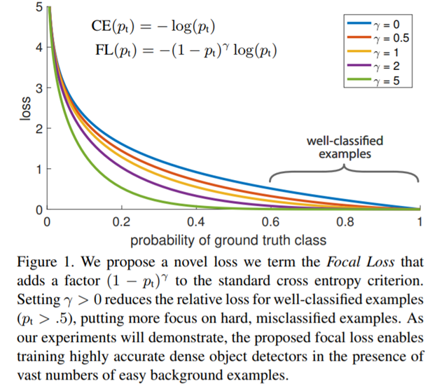
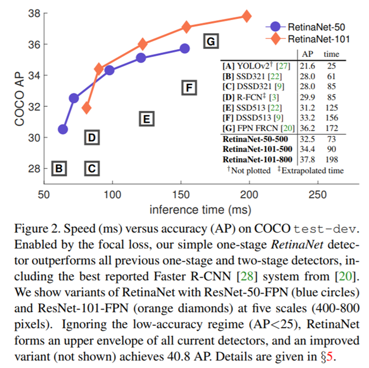
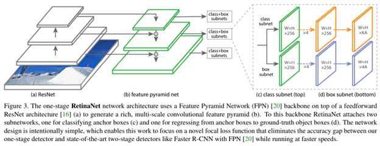
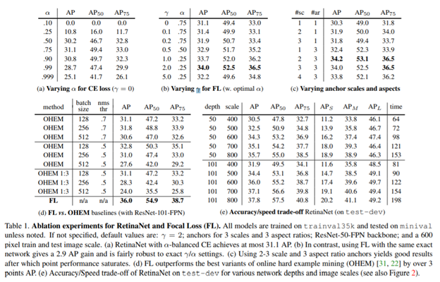
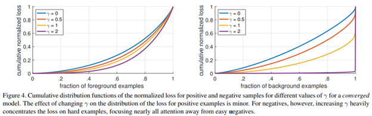
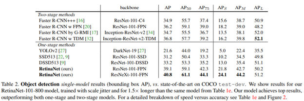

Focal Loss for Dense Object Detection
=====================================

-   [依赖知识](#FocalLossforDenseObjectDetection-依赖知识)

-   [简介](#FocalLossforDenseObjectDetection-简介)

-   [相关工作](#FocalLossforDenseObjectDetection-相关工作)

    -   [典型对象检测器](#FocalLossforDenseObjectDetection-典型对象检测)

    -   [Two-stage检测器](#FocalLossforDenseObjectDetection-Two-st)

    -   [One-stage检测器](#FocalLossforDenseObjectDetection-One-st)

    -   [类不均衡](#FocalLossforDenseObjectDetection-类不均衡)

    -   [鲁棒性估计](#FocalLossforDenseObjectDetection-鲁棒性估计)

-   [Focal Loss](#FocalLossforDenseObjectDetection-FocalL)

    -   [平衡交叉熵](#FocalLossforDenseObjectDetection-平衡交叉熵)

    -   [Focal Loss定义](#FocalLossforDenseObjectDetection-FocalL)

    -   [类别不均衡和模型初始化](#FocalLossforDenseObjectDetection-类别不均衡和)

    -   [类别不均衡和Two-stage检测器](#FocalLossforDenseObjectDetection-类别不均衡和)

-   [RetinaNet 检测器](#FocalLossforDenseObjectDetection-Retina)

    -   [特征金字塔主干网](#FocalLossforDenseObjectDetection-特征金字塔主)

    -   [Anchors](#FocalLossforDenseObjectDetection-Anchor)

    -   [分类子网络](#FocalLossforDenseObjectDetection-分类子网络)

    -   [边框回归子网络](#FocalLossforDenseObjectDetection-边框回归子网)

    -   [训练](#FocalLossforDenseObjectDetection-训练)

        -   [Focal Loss ](#FocalLossforDenseObjectDetection-FocalL)

        -   [初始化](#FocalLossforDenseObjectDetection-初始化)

        -   [优化过程](#FocalLossforDenseObjectDetection-优化过程)

    -   [预测](#FocalLossforDenseObjectDetection-预测)

-   [实验](#FocalLossforDenseObjectDetection-实验)

    -   [平衡交叉熵](#FocalLossforDenseObjectDetection-平衡交叉熵.)

    -   [Focal Loss](#FocalLossforDenseObjectDetection-FocalL)

    -   [Focal Loss分析](#FocalLossforDenseObjectDetection-FocalL)

    -   [在线困难样本挖掘(OHEM)](#FocalLossforDenseObjectDetection-在线困难样本)

    -   [Hinge Loss](#FocalLossforDenseObjectDetection-HingeL)

    -   [Anchor密度](#FocalLossforDenseObjectDetection-Anchor)

    -   [速度VS准确率](#FocalLossforDenseObjectDetection-速度VS准确)

-   [总结](#FocalLossforDenseObjectDetection-总结)

       我们知道object detection的算法主要可以分为两大类：two-stage
detector和one-stage detector。前者是指类似Faster RCNN，RFCN这样需要region
proposal的检测算法，这类算法可以达到很高的准确率，但是速度较慢。虽然可以通过减少proposal的数量或降低输入图像的分辨率等方式达到提速，但是速度并没有质的提升。后者是指类似YOLO，SSD这样不需要region
proposal，直接回归的检测算法，这类算法速度很快，但是准确率不如前者。研究发现**正负样本极不均衡**是主要原因。

       因此针对类别不均衡问题，作者提出一种新的损失函数：focal
foss，这个损失函数是在**标准交叉熵损失**基础上修改得到的。这个函数可以通过减少**易分类样本**的权重，使得模型在训练时更专注于稀疏的**难分类的样本；**防止大量易分类负样本在训练中压垮检测器。为了证明focal
loss的有效性，作者设计了一个dense detector：RetinaNet，并且在训练时采用focal
loss训练。实验证明RetinaNet不仅可以达到one-stage
detector的**速度**，也能超过现有two-stage detector的**准确率**。

论文地址：<https://arxiv.org/pdf/1708.02002.pdf> 

依赖知识
--------

a) 熟悉典型目标检测技术R-CNN系列，SSD，YOLO V1/V2等

b) 熟悉困难样本挖掘技术OHEM

 

简介
----

 目前最先进的目标检测是基于two-stage和提议框驱动机制。最广为人知的R-CNN框架，first
stage是生成**稀疏的候选对象**位置；second
stage使用卷积神经网络对候选对象位置分类。two-stage框架一直在COCO数据集上由最高的准确率。

 一个自然的想法one-stage检测器是否能达到类似的准确率。one-stage检测器通常在位置、尺寸、长宽比上有规律的**密集采样**。one-stage检测器如YOLO,SSD，也有比较令人期待的结果，相对于最先进的two-stage方法，其检测精度在10-40％之间，检测速度更快。

       本文更进一步：使用one-stage检测器，第一次在COCO
AP上媲美了更复杂的two-stage技术(如：FPN，Mask-RCNN)。并证明了**类别不均衡**是阻碍one-stage检测器达到two-stage检测器最好的精确率的主要障碍；并提出一个新的损失函数消除这个障碍。

 R-CNN系列检测器通过**two-stage级联**和**启发式采样**解决这个问题。在候选框产生阶段(如：Selective
Search, EdgeBoxes,
DeepMask，RPN)将候选的对象迅速的减少到1\~2k个，过滤的大部分背景样本。在第二个阶段分类中，启发式采样(如：正负样本比1：3)或者OHEM；来保持正负样本的平衡。

作为比较，one-stage检测器需要在图片上有规律的采样来产生一个**大得多**的候选对象集。实际上通常约\~100k个，密集的空间位置、尺寸和长宽比。类似的启发式采用也会使用，但是没有效果，训练过程还是被易分类的背景样本主导了。这种无效在对象检测中是一个典型问题，可以通过**booststrapping**或者**困难样本挖掘**来解决。

 本文提出一个新的损失函数，在解决**类别不均衡**问题上比之前的方法**更有效**。损失函数是动态缩放的交叉熵损失，其中缩放因子随着对正确类别的置信度增加而衰减到零(如图Figure
1)。直观地说，这个缩放因子可以**自动降低**训练过程中**简单样本的贡献**，并快速将模型**集中**在**困难样本上**。实验发现，Focal
Loss在one-stage检测器上的精确度胜过之前的state-of-art的**启发式采样**和**困难样本挖掘**。最后，focal
loss的具体公式形式不是关键的，其它的示例可以达到类似的结果。

         我们设计了一个名叫RetinaNet的one-stage对象检测器来说明focal
loss的有效性，RetinaNet命名来源于在输入图像上的密集采样。它基于ResNet-101-
FPN主干网，以 5fps 的运行速度下，在 COCO test-dev 上取得了 39.1 AP
的成绩，Figure 2 所示，超过目前公开的单一模型在 one-stage 和 two-stage
检测器上取得的最好成绩。

 

相关工作
--------

### 典型对象检测器

在密集图像网格上使用滑动窗口的模型，由很长远和丰富的历史。最早成功的是使用卷积神经网络做手写体识别和使用boosted对象检测器做人脸识别；导致后来广泛使用此类模型。**HOG**
和积分通道特征(**integral channel features**)在行人检测上是有效的方法。**DPM**s
将密集类检测器扩展到更一般的对象类别，并在PASCAL
[7]上取得了最佳结果多年。虽然滑窗方法是经典计算机视觉领域的领先检测模型，但随着深度学习的复兴，接下来描述的two-statge测器迅速主导了目标检测领域。

### Two-stage检测器

      two-stage方法主导了对象检测。Selective Search作为先驱，在first
stage生成一个稀疏的候选框集合，这个集合**包含所有的对象**，同时**过滤了大部分的背景**；second
stage分离器对候选框做分类。R-CNN将second
stage改为**卷积神经网络大幅提升**了**精确度**，开启了对象检测的新纪元。之后几年R-CNN有很多提升：包括**速度**和**使用神经网络学习来产生候选框**.Faster
RCNN的Region Proposal Networks
(RPN)将second-stage简化为一个卷积神经网络。很多扩展的框架提出来了，如：特征金字塔、OHEM、Beyond
Skip Connections: Top-Down Modulation for Object Detection、ResNet、Mask
R-CNN等。

### One-stage检测器

       OverFeat是第一个基于DNN的one-stage对象检测器。还有最近的SSD/DSSD、YOLO
V1/YOLO 9000。这些方法在速度上有优势，但是精确度上比two-stage要差。SSD
的AP值要低10\~20%，YOLO更加关注速度(见图Figure
2)。最近研究表明two-stage可以通过**减小**图片的**分辨率**和**减少候选框数量**来**提升速度**；但是one-stage即使增加计算量也无法提升精度。作为比较，我们的目标是弄明白one-stage检测器是否可以在**精确性**上**匹配或超**过two-stage检测器，同时还能有**更快的速度**。

       RetinaNet
的设计与之前的稠密类检测器有很多类似的地方，尤其是在RPN和SSD集FPN中使用的anchors的概念。需要强调我们的简单检测器能有最优的效果是基于**新奇的损失函数**，而不是**网络结构的创新.**

### 类不均衡

       经典的one-stage对象检测方法，如boosted detectors(Rapid object detection
using a boosted cascade of simple
features、积分通道特征)和DPM，以及最近的SSD都在训练的时候面临**大的类别不均衡**。这些检测器一般在每张图片产生**1w\~10w**个候选框，但**仅仅少量**候选框有对象。这种不均衡导致两个问题：(1)
大量易分类的负样本对学习**没有贡献有价值的信息**；（2)
连带的，易分类负样本**压垮训练**，导致**模型退化**。通常的解决方法是使用**困难样本挖掘**来采样困难样本，或者更复杂的采样/加权模式(Loss
maxpooling for semantic image segmentation)。作为比较，我们的提出的focal
loss非常自然的解决了one-stage检测器遇到的**类别不均衡**问题，使得可以高效的训练**所有的样本**，而**不需要采样**，也**没有出现**易分类负样本**压垮损失函数和计算梯度**。

### 鲁棒性估计

 设计一个鲁棒的损失函数来减少outliers-**异常样本**(有很大的误差值，即困难样本)对损失函数的贡献权重非常受关注(如Huber
loss)。相比之下，我们的focal
loss是通过**减少易分类样本**(inliers)**权重**来解决**类别不均衡**问题，这样**易分类样本**对于损失函数的**贡献总量很小**即使样本量非常大。也就是说，focal
loss是相反的作用的一个鲁棒损失函数：关注**少量困难样本。**

Focal Loss
----------

       a) 对于二分类标准的交叉熵损失函数如下

​     $ CE(p, y) = \begin{cases} -log(p) \ \ \ if\ y=1 \\ -log(1-p) \ \ \ otherwise. \end{cases}    \ \ \ \ \ \ (1)$

​    $ y \in \{ \pm1\} $

代表正负样本(即前景/背景)

   $ p \in [0, 1]$

是模型预测y = 1 概率值

       b) 如果定义如下的$p_t$

​     $p_t = \begin{cases} p \ \ \ \ \ if \ y=1  \\1-p \ \ \ otherwise, \end{cases} \ \ \ (2)$

        则公式可以简写为：

​     $CE(p, y) = CE(p_t) = -log(p_t)$

        c)
需要提一点：如图Figure 1最上面的曲线，**易分类**的样本会导致损失函数**增大很多**。通过对**大量易分类损失值求和**，发现它们**远远大于稀有样本**(rare
class)的值。

### 平衡交叉熵

     一般解决类不平衡的方法是增加一个权重因子α ∈ [0,
1]，对于类别1为α，对于类别-1为1-α；实际使用中α可以设置为逆类别频次或者作为交叉熵的一个超参数。为了书写方便，使用$p_t$

类似的方式定义$\alpha_t$

​       $CE(p_t) = -\alpha_t log(p_t)$

     这种损失是交叉熵的一个简单的扩展，可以认为这是我们提出的focal
loss的实验性基线。

### Focal Loss定义

 实验证明，大的类别不均衡在密集型检测器训练中会压垮交叉熵损失函数。易分类负样本占了损失函数大部分，支配了梯度。α平衡**正负样本**的重要性，但是没有区分**难易样本**。我们提出改进损失函数降低易分类样本权重，聚焦于**困难负样本**的训练。

     正式的提出了增加一个**调节因子** $(1-p_t)^\gamma$

到交叉熵中，γ ≥ 0是可调节的**聚焦参数**；focal loss定义如下：

​     $FL(p_t) = -(1 - p_t)^\gamma log(p_t). \ \ \ \ \ (4)$

     在图Figure 1中展示了γ ∈ [0, 5]不同值时focal loss曲线。注意focal
loss的两个属性。(1) 当样本误分类且$p_t$

很小时，调节因子解决1，损失函数没有影响。当$p_t$

接近1，调节因子趋于0，损失函数的权重对易分类样本降低。(2)
**聚焦参数**γ平滑的调节易分类样本权重降低的比率。当γ = 0，FL等价于CE;
**调节因子**的影响随着γ增大而增加(实验中γ = 2效果最好)。

     直观的，调节因子降低易分类样本的权重，并扩展的样本低损失值的区间。例如：γ =
2，易分类样本$p_t$=0.9，比CE的损失函数值小100倍；如果

$p_t$≈0.968，则小1000倍。也增加了纠正错分类样本的重要性。

 实际上，我们使用一个α-平衡变量。因为这种形式可以轻微的提升精确性。最终，在损失函数层组合sigmoid操作计算p,获取更好的数值稳定性。

​        $FL(p_t) = -\alpha_t(1 - p_t)^\gamma log(p_t). \ \ \ \ \ (5)$ 

     实验结果表明focal loss的**具体形式**不是关键，其它示例的形式也**同样有效**

 

### 类别不均衡和模型初始化

      二分类模型默认对y = −1 或
1有相同的概率。在**类别不均衡**的情况下如此初始化会导致**训练**的初始阶段时候**不稳定**。我们通过**稀有类别**的估算p值,并提出一个概念：**先验prior。**我们用π来表示先验，并将其设置为使得模型对于**稀有类别**样例的p值估计很小(如：0.01)。这只是模型初始化的改变，不是损失函数本身。我们发现这个改变在**类别不均衡**时对于模型训练的**稳定性**有**提升**，不管是使用交叉熵还是focal
loss损失函数。

### 类别不均衡和Two-stage检测器

     Two-stage检测器一般使用交叉熵损失函数，并没有α-平衡参数或者我们提出的focal
loss。它们通过通过两个机制来解决类别不均衡：(1) two-stage级联，(2)**倾斜**的微批**采样**。第一个级联阶段时对象提议框机制，将几乎无限的对象定位迅速减少到1\~2k。重要的是**不是随机减少**，保留的都是跟真实对象位置相关很高的，大量的**易分类负样**排除了。第二阶段使用倾斜采样，例如正负样本1:3。这个比例就像通过采样隐式的实现α-平衡参数。我们提出的focal
loss通过损失函数的方式在**one-stage**中实现了这些机制。

RetinaNet 检测器
----------------

 RetinaNet是由一个**主干网**和两个**任务子网络**组成的简单同一网络。主干网使用卷积神经网络负责从整个图片提取特征，是一个**现成的**网络。第一个子网络使用卷积分类，第二个子网络使用卷积来边框回归。两个子网络是我们为one-stage密集型检测而提出的简单设计(如图Figure
3)。虽然这些组件的细节有许多可能的选择，但大多数**设计参数**对实验中所示的**具体值**并不特别敏感。

 

 

### 特征金字塔主干网

      使用特征金字塔(FPN)作为RetinaNet的主干网。FPN
给标准的卷积神经网络增加一个**自顶向下**的路径和**侧向连接**，来从图片的单一分辨率构建一个丰富的、多尺度的特征金字塔。金字塔的每一层以不同尺寸检测对象。FPN
改善了全卷积网络的多尺寸预测。

我们在ResNet结构上构建FPN，在P3\~P7层上构建金字塔，l代表金字塔层级，金字塔每层都有256个通道。金字塔的具体实现与原本的FPN有小的差异。这些都不是关键的，需要强调的是使用FPN作为主干网的原因是，实验发现只使用ResNet层，最终AP值较低。

### Anchors

 使用类似RPN中具有平移不变性的anchor boxes。从P3到P7层的anchors的面积从32\*32依次增加到512\*512。每一层的anchors有三种长宽比{1:2,
1:1, 2:1}.为了更加密集的覆盖在每层的三种长宽比增加如果尺寸$\{2^0, 2^{1/3}, 2^{2/3}\}$

；这样每层有9个anchors，通过不同层覆盖了输入图像 32\~813 像素区间。

每个anchor关联一个K维独热向量，K是对象的类别数；和一个4维向量做边框回归。当IOU大于0.5时，anchors和GT关联；IOU在[0,
0.4)作为背景；每个anchor最多关联一个GT；在K维向量中，关联的类别值为1，其它都为0。IOU在[0.4,
0.5)之间的anchorsd丢弃。边框回归就是计算anchor到关联的GT之间的偏移。

### 分类子网络

 分类子网络预测每个anchor上K个类别的概率。子网络是附加在FPN的每一层的一个小的FCN；参数共享。网络设计非常简单(见图Figure
3 (c)）：对于给定的金字塔层级输出的C个通道的Feature
Map，子网络使用4个3×3的卷积层，每层的通道数任然是C，接着是一个ReLU激活层；然后跟一个通道数位KA(K是类别数，A是anchor数)的3×3的卷积层；最后使用sigmoid激活函数。

 与RPN相比，我们的分类子网络更深，并且只使用了3×3卷积；没有和边框回归子网络共享参数。高层的设计比具体的超参数值要重要。

### 边框回归子网络

 与分类子网络并行的，在FPN的每一层附加一个小的FCN用于边框回归。边框回归子网络和分类子网络设计是一样的(见图Figure
3
(d)），唯一不同最后一层通道数是4A个。边框回归的方法与RCNN的边框回归一样。不同于大多数设计，我们使用类别无关的边框归回，参数更少，同样有效。分类子网络和边框回归子网络**共享结构**，**参数独立**。

 

### 训练

#### Focal Loss 

       分类子网络使用focal loss损失函数。实验发现γ = 2效果最好，鲁棒区间是γ ∈
[0.5,
5]。需要强调的是，训练RetinaNet,最终每张图片在损失函数上应用的\~100k个anchors。通常启发式采样(RPN)或者困难样本挖掘(OHEM,SSD)在每个minibatch都只选择很少的anchors(如：256)。一张图片上FL损失函数值是所有\~100k
anchors的总和，根据关联GT的anchors个数标准化，而不是anchors的总数；因为大部分anchors是易分类负样本,在FL下损失值非常小。

关联稀有类别的权重参数α，也有一个稳定的区间，但是与γ值互相影响；通常α随着γ的增大而轻微减少（γ
= 2, α = 0.25效果最好）。

 

#### 初始化

        a) 实验中使用了ResNet-50-FPN和ResNet-101-FPN主干网。

        b) 基础的ResNet-50和ResNet-101在ImageNet1k数据集上预训练。

        c) FPN增加的层与原FPN论文中一样。

        d) 所有新增的卷积层(除了子网络的最后一层)初始化权重为 σ =
0.01的高斯分布，偏置为0

        e) 分类子网络最后一层偏置为− log((1 −
π)/π)；π为前景的置信度估算值，实验中使用π = 0.01。

#### 优化过程

        a) 在8GPU的机器上使用SGD, 每个minibatch 16张图片。

        b) 一共训练90k个迭代；初始学习率0.01；在60k和80k个迭代是学习率减小10倍

        c) 数据增广只使用了水平翻转

        e) 权值衰减0.0001；冲量大小0.9

        f) 边框回归使用L1损失函数 

        g) Table 1e中的模型训练时间在10\~35小时之间(见）

 

### 预测

         RetinaNet是一个FCN有ResNet-FPN主干网和两个子网络组成（见图Figure
3）。预测过程就是简单的前向传播。为了提升速度，通过置信度阈值0.05，仅仅对每个FPN层最多top
1k的anchor做边框回归；然后使用阈值0.5做NMS产生最终结果。

 

实验
----

### 平衡交叉熵

     Table 1a表明
α-平衡交叉熵在α=0.75时可以提升AP值0.9(注意不带平衡参数时α=0.5）。

### Focal Loss

     a) Table 1b表明了focal loss的影响。当γ = 2 时FL可以提升AP值2.9个点。

     b）最佳的α值区间是[0.25,0.75]

     c)  较小的α值与较大的γ搭配

### Focal Loss分析

        为了弄明白FL为什么更好，我们分析FL的经验分布。在大量随机图片中采用约$10^7$个负样本和$10^5$

 个正样本；随后计算FL值，并归一化。对归一化的FL值排序并分别画出正负样本的**累积分布函数**图。

       a)
20%的**困难正样本**贡献了约一半的损失值；当γ增加时，20%的贡献度更加明显；但是影响不是很大。

       b) γ对于**负样本**的影响完全不同；γ =
0时CDF与正样本类似；当γ增加时，迅速的聚焦于**困难负样本**，当γ=2时，大量的易分类负样本仅仅贡献了少量损失。

 

### 在线困难样本挖掘(OHEM)

OHEM中所有样本经过计算损失值，然后使用NMS过滤，最后在minibatch时选择损失值最大的那些样本。OHEM关注**误分类样本**，不同于FL,OHEM**完全忽略**的**易分类样本**。如Table
1d所示，最好的OHEM与FL有3.2点AP差距。

### Hinge Loss

     先前使用中尝试对$p_t$使用Hinge Loss；对$p_t$值大于某个阈值的样本，损失函数置为零。但是训练过程**不稳定**，并且也**达不到**有价值的效果。

### Anchor密度

 one-stage检测器的anchor密度到底多少才能覆盖任意图像边框。Two-stage检测器通过Region
Pooling(ROI Pooling)可以对边框的任何位置、尺寸、长宽比归类（原文：Two-stage
detectors can classify boxes at any position, scale, and aspect ratio using a
region pooling operation）。相比之下，one-stage
检测器使用一个固定的采样网格，一个常用的方法是在每个空间位置使用**多个anchors**来覆盖不同的尺寸和长宽比边框。

我们在FPN每一层的每个空间位置使用不同个数的尺寸和长宽比anchors。在ResNet-50从使用1个方形anchor到12个anchors(尺寸为$2^{k/4}$ ,

 k ≤ 3,长宽比为 [0.5, 1, 2]，见Table
1c）。令人惊讶的是只使用1个anchor情况下AP就有30.3；当使用3中尺寸和3中长宽比时可以到达34.0。

 最终，我们发现再增加6\~9个anchors也没有更多的提升。虽然two-stage检测器可以识别图片中任意的边框；性能的饱和度w.r.t.
密度意味着较高潜在密度的two-stage系统的可能不具有优势。

 

### 速度VS准确率

a) 更大的主干网有更好的准确率，但速度更慢；输入图像的尺寸也是如此;见Table 1e。

b) 图Figure 2 展示RetinaNet和其它方法在速度/精度的比较；RetinaNet
使用FL超过所有的方法，打破低精度的限制。ResNet-101-FPN在600像素尺寸时的精确度超过ResNet101-FPN
Faster R-CNN，同时检测时间为122ms，Faster R-CNN为172ms。

c) 追求速度需要特殊的网络设计如Yolo 9000。

 

总结
----

**类别不均衡**是导致one-stage检测器超越two-stage检测器的主要障碍。我们提出 focal
loss在交叉熵损失函数中使用一个调节项来聚焦于**困难负样本**。方法简单有效。通过一个one-stage的FCN检测器在速度和精度同时达到stage-of-the-art。

 

 

## 关于我们

我司正招聘文本挖掘、计算机视觉等相关人员，欢迎加入我们；也欢迎与我们在线沟通任何关于数据挖掘理论和应用的问题；

在长沙的朋友也可以线下交流, 坐标: 长沙市高新区麓谷新长海中心 B1栋8A楼09室

公司网址：http://www.embracesource.com/

Email: mick.yi@embracesource.com 或 csuyzt@163.com

